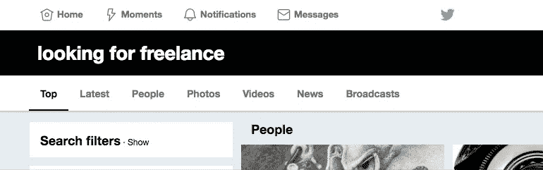

# 如何在 Twitter 上找到你的下一个远程自由网络开发项目(分步指南)

> 原文：<https://medium.com/hackernoon/how-to-find-your-next-remote-freelance-client-on-twitter-fa1d2c52f77e>

当谈到寻找好的远程项目时，UpWork、Freelancer、Fiverr 和其他类似的中间人市场并不是唯一的参与者。事实是，好的远程自由职业者项目在互联网上随处可见，比如 Slack Groups、LinkedIn、[Twitter、](https://hackernoon.com/tagged/twitter)、脸书团体、社区网站如 Hacker News、multiple job boards、Reddit 和论坛。

**在这篇文章中，我将向你展示我在 Twitter 上寻找和获得远程自由职业项目的技巧和诀窍。**

**Twitter 上每天都有几十条推文在寻找从事某个项目的自由职业者。Twitter 是寻找自由职业项目的金矿。你只需要知道搜索什么以及如何接触客户。**

# 1)搜索正确的关键字以避免干扰。

Twitter 是一个免费的平台，人和机器人都可以使用，所以会有很多噪音。但是，如果你使用正确的关键字，你可以避免它的大部分。

首先进入 [Twitter 搜索](https://twitter.com/search-home)，搜索`Looking for freelance`。

A good search term that avoids bots

这个关键字有效，因为它有"*寻找"*"在其中，这是非常会话式的。你不会看到很多机器人在他们的推文中使用这个，所以你通常会看到寻找自由职业者的人发布推文，而不是机器人从 UpWork 转贴工作。

如果第一个没有任何内容，您可以尝试一下该搜索词的一些变体:

*   `Looking for JavaScript`
*   `Need Web Design`
*   `Looking for React`
*   `Need Freelance`
*   `Looking for remote`

# 2)尊重客户的时间。在发微博之前做好调查。

**客户可能会在 Twitter 上发帖的最大原因之一是因为他们马上需要某人。**推文通常没有太多的上下文，所以尽可能做些调查。客户真的很感激你伸出手，你已经知道一点他们和他们的项目。

点击他们的个人资料，查看是否有他们链接的网站。这里的目标是为你申请的原因找到更多的背景信息，并且寻找一个电子邮件地址。

# 3)找到客户的电子邮件地址(如果有的话),然后发送一封电子邮件。

当你可以点击客户的网站并找到电子邮件地址时，通过 Twitter 寻找客户和登陆项目的效果最好。这是因为电子邮件求职信看起来更专业，它允许你用超过 140 个字符来展示你的工作。

[点击此处](http://remoteleads.io/blog/proposals-that-win-remote-freelance-clients/)了解更多关于如何撰写电子邮件求职信从而赢得远程自由职业客户的信息。

An article up on the RemoteLeads Blog

# 4)如果电子邮件不可用，请发送 DM。让你的 DMs 也开着。

如果客户的电子邮件不容易找到，直接邮件是第二好的选择。保持 DM 短于电子邮件，但要用和电子邮件求职信一样的专业风格来写，而不是普通推文的对话风格。

此外，**确保你的目的地管理系统保持开放，因为许多客户也会通过那里联系你。**

# 5)留下一个有价值的回复，给客户一个回复的方式。

如果你能发送电子邮件或 DM，那是最好的。不管是哪种方式，我发现给原始推文留一个简短的回复总是最好的。

## 以下是不回应的方法

这些随意的回答向客户表明你根本没有做任何调查。你只是回复希望客户会为你做这项工作。对客户进行调查是你的工作，而不是相反。

如果你不能发送电子邮件或 DM，那么留下一个简短的回复，解释为什么你是一个合适的人选。

## 如何回复

在推特上问 1-2 个关于客户需求和项目的问题非常有效。

如果你保持简洁明了，在推特上添加你的作品集也可以。

# 6)确保你的简历清楚地描述了你的职业。

你在 Twitter 上看到很多类似`Dad first, Coffee Drinker, and Music Enthusiast`的 bios。这些都很好，但是客户并不介意你喝咖啡，除非你喝咖啡是为了专注于他们的项目。

当你在寻找一个自由职业项目的时候，试着暂时把你的传记换成客户能在 3 秒钟内读懂你的作品。

下面是我用过的对我来说非常有效的一句话:

> 远程前端 Web 开发人员。与团队的其他成员积极协作，实现满足项目特定需求的**久经考验的 ui**。

**你必须转换语境，从把 Twitter 仅仅视为一个与人随意联系的地方，到把它视为一个与潜在客户联系的专业平台。**

# 7)在你的简历中贴上你的作品集的链接。

当客户点击你的 Twitter 个人资料时，他们可以看到的第一个链接是简历链接。确保该链接是指向你的作品集、GitHub、CodePen 或其他他们可以看到你作品的地方的链接。

# 8)确保你的推文链接到你的最佳案例研究。

当客户第一次访问你的个人资料时，他们看到的下一件事就是你的微博。

**这是展示你想让客户具体了解你的作品的最佳场所。**我会放一个案例研究、你写的一篇博文、你写的一个特定 GitHub 库的链接或者你做的一个 CodePen 项目。

用一两句话描述你的成就，并附上项目链接。当链接有适当的元标签时，网站的描述和图片就会显示出来，看起来很专业。

# 这是一个数字游戏

你不会得到你联系的每一个客户。很多人甚至不会回应你。这是过程的一部分。**归根结底，这是你持续接触多少人的问题。**

Twitter 是一个开放的平台，所以你也会有很多人回复你回复的同一条线索，但如果你遵循上面列出的提示，你就能从 95%回复你的人中脱颖而出。

# 避免所有的搜索，让项目直接发送到您的电子邮件与远程线索

通过订阅远程销售线索，您可以避免花费大量时间搜索销售线索。**我们找到最好的潜在客户，审查他们，并通过电子邮件发送给你**。这是确保你有稳定的潜在商机的好方法。这里可以订阅[。](https://remoteleads.io/remote-freelance-front-end)

# Twitter 可以成为寻找远程自由职业项目的金矿。

所需要做的就是寻找他们，然后以正确的方式接触客户。

当你搜索项目时，把 Twitter 看做 LinkedIn 真的很有帮助。所有专业展示自己的建议不会因为是 Twitter 就被抛弃。拥有一份好的简历，简历中的投资组合链接，一条好的微博，以及发送好的电子邮件对帮助你获得更多项目大有帮助。

感谢你的阅读，祝你下一个项目好运！