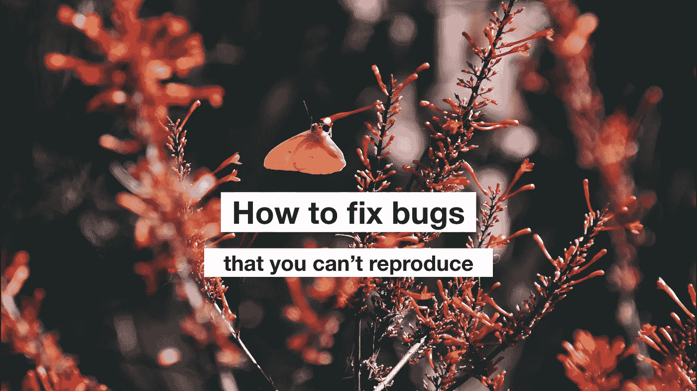

# 如何修复无法重现的 bug

> 原文：<https://medium.com/hackernoon/how-to-fix-bugs-that-you-cant-reproduce-1478c2eafb20>

《20000 英尺的噩梦》是《暮光之城》有史以来最具标志性的剧集之一。它讲述了鲍勃·威尔逊的故事，他是一个患有神经疾病的推销员。鲍勃透过飞机的窗户向外看。看到一个小精灵在翅膀上飞来飞去，他有点吃惊。

鲍勃越来越疯狂地试图向其他乘客展示这个小精灵。没用的。当其他人透过窗户看的时候，这个小妖精就消失了。更糟糕的是，它迂回地开始拆除飞机引擎，把每个人都置于致命的危险之中。

有时候，作为一名软件工程师，感觉就像驾驶一架有数百个机翼的飞机。每个用户都不断地告诉你他们可以通过他们的窗口看到的不同的小精灵。但是当你寻找自己的时候，你看不到任何不寻常的东西。

我们需要修复我们的 bug，即使它们只发生在特定环境下的特定人身上。即使我们不知道这些情况是什么。我们对自己创建的系统承担全部责任。

修复这些不可重现的错误是困难的，但通常是可以实现的。这是你的生存指南，让你远离翅膀上的小妖精。

# 1.总是组织你的调查

作为一名工程师，明智地利用工作时间至关重要。许多工程团队应用深入的方法来管理他们所做的新特性开发工作。当一个给定的项目花费的时间比预期的长时，团队领导通常会立即知道。我们不期望工程师在一次冲刺中完成所有的工作。

但是这些相同的团队经常不能应用这些相同的原则来处理 bug。许多工程师来工作时没有明确的期望。他们想知道，“我应该修复我最重要的 bug，还是致力于我最重要的用户故事？”结果是，工程师们经常不能及时地满足修复错误的期望。很多时候，这些期望一开始就不切实际。

工程师们最终会对这个已经在他们的收件箱里呆了一个月甚至六个月的 bug 感到内疚。

## 写下你的假设

当一个 bug 无法重现的时候，你就不能指望知道要多久才能修复。但是你*可以*估计一个特定的调查会持续多长时间。

例如，您可能假设浏览器兼容性是您的错误的原因。在 Firefox 中打开您的应用程序来检查这一点应该只需要几分钟。

明确地写下你的假设，让你的过程变得清晰可见。这使得其他人很容易看出你实际上是在开发一个 bug。在 Asana，当我们调查时，我们使用子任务来跟踪错误的假设。

有时，假设不仅仅需要本地调试就能弄清楚。另一个强有力的技术是使用日志和断言来使你的假设更加清晰。

例如，您的 bug 可能是由意外为 null 的值引起的。在这种情况下，您可以在值被操作的地方添加日志记录，以便更加清晰。

以这种方式使用日志记录可能是有效的，但是这也是一个非常慢的迭代周期。为了抵消这一点，总是尝试一次为多个假设添加日志记录。

# 2.利用你的队友

我们认为工程是一种孤独的行为。部分原因是流行文化将工程师描绘成孤独者。我觉得这也是受人们早期对[工程](https://hackernoon.com/tagged/engineering)的经历影响。大多数人通过从事个人项目来学习编码。许多早期[学习](https://hackernoon.com/tagged/learning)的经历和工程师的成功都是关于单干的经历。

但是和几个团队成员一起做一个大项目是一个完全不同的世界。这是一个你无法独自驾驭的世界。要理解一个系统是如何不正常运行的，你最终需要理解在它上面工作的人的行为。

我们都想成为自己解决问题的英雄。但是当我们选择花费数小时去调查没有任何进展的复杂 bug 时，这种倾向就会适得其反。

## 逐渐增加能见度

当你花时间处理一个无法重现的 bug 时，想想如何在工作过程中逐步提高 bug 的可见性。

例如，你先看一样东西一个小时，过了一个小时，你就可以让你的技术负责人参与这项任务。然后，在你花了 4 个小时没有成功地解决这个 bug 之后，试着找 3 个可能知道发生了什么的工程师。

你在这里寻找的不是有人来接管这个 bug 的责任。如果 bug 被分配给你，保持明确的责任是至关重要的。相反，你希望人们记住可能与你的搜索相关的重要信息。

最明显的形式是“哦，我上周把它弄坏了。”另一种形式是“这让我想起了我去年解决的另一个问题…你有没有尝试检查广告拦截器是否导致了它？”

bug 可见性升级的最大挑战是你对自己不能修复 bug 的不安全感。如果你真的不确定，我建议你去问你的经理。他们可能会告诉你，找到任何能帮助你的人是你在 T4 的工作。

## 做一名历史学家

充分利用你的队友已经创建的书面环境。

您的团队产生的每一个代码变更可能已经有一个提交消息来描述它做了什么。如果最近出现了一个 bug，考虑扫描一下您的团队在过去几天中所做的所有代码更改。他们可能会给你指出你不知道的代码库中正在开发的领域。

还有其他的上下文来源。检查这些东西，以了解代码库中发生了什么。

*   提取请求注释
*   无聊的谈话
*   任务注释

当然，这里的危险在于这些信息来源是完全没有底线的。不要期望自己对正在发生的一切都很熟悉。如果花 15 分钟阅读最近的变化没有任何收获，那么再花一个小时也不会有任何帮助。

# 3.检查一下现实

虫子进入了虫子追踪器。一个 bug 追踪器计算 bug。我们希望没有 bug，对吗？

我不得不要求你放弃这个梦想。基本上没有没有漏洞的系统。不是所有的 bug 都重要到需要修复。

是的，这包括被标记为“重要”的错误

不要专注于修复每一个错误。与那些给你带来错误的人建立清晰的交流关系。这就是你如何找到技术问题的创造性解决方案，并了解用户真正需要什么。

## 对内部错误报告持保留态度

"在这家公司，我们吃自己的狗粮！"在可以使用自己开发的软件的地方工作是一件很棒的事情。狗粮对于质量保证、激励和用户共鸣有着不可思议的好处。它也是无意义的内部错误报告的无尽来源。

对内部报告半信半疑。内部报告通常是我们发现 bug 的第一种方式，当它们准确时，它们可以在用户体验到 bug 之前捕捉到它们。

我们天生就想帮助我们认识并直接交往的人。因此，内部报告，即使是一个人的报告，也常常让人觉得是最紧急、最重要的需要修复的错误。

但是请记住内部用户是多么奇怪。他们对这款应用的使用可能并不典型。他们可能使用的是与生产版本不同的软件版本。它们可能有一整套特性标志，导致它们遇到与用户遇到的完全不同的代码路径。

因此，当一个用户的内部错误报告发生时，它不能被复制，有时明智的做法是等待，看看是否有真正的用户点击它。当然，要随时准备好减少生产。

请记住，外部用户也很奇怪。我认为在深入调查之前，等待看看这些错误是否发生在至少三个真实用户身上是可以接受的。(当然，这在很大程度上取决于错误的严重程度)。

许多用户有奇怪的软件配置、入侵性的浏览器扩展和异常的网络条件。这些通常会产生无法重现的问题。通常这些问题是值得解决的。当然，我假设你有其他重要的事情要做。

## 你的工作就是让人们了解情况

对所有相关方来说，处理这些类型的 bug 都是令人讨厌和费力的。这包括客户支持代理和您的经理。不要犯在没有告诉任何人的情况下努力解决一个棘手问题的错误。

我们只喜欢传递好消息，比如:

*   "更新:我已经修复了这个 bug，现在已经上线了！"

但是请记住，这也是一个好消息:

*   “我还没有解决这个问题，但我承认它很重要，我花了一些时间来解决它。”

这种沟通模式对于业务方面的员工来说是一个必不可少的工具。他们需要与客户进行频繁而清晰的沟通。不要用沉默来阻挡他们。如果你花时间在一项任务上，不要在没有写下一些关于它的交流之前就离开。

通过这种方式建立沟通信任也很重要，这样你就可以公开地关闭或延迟 bug 报告。如果某件事被安排在某一天完成，而那个截止日期还没有到来，不要让它在沉默中过去。如果你主动对错误做出评论，解释你为什么要推迟截止日期，你会显得更值得信任。如果你推迟的决定是错误的，这也给你创造了一个接受反馈的机会。

# 建立你的 bug 管理心态

和不可复制的 bug 一起工作很糟糕。但也不一定。带着好奇心、合作精神和横向思维去解决这些问题。你可能会发现你其实很享受挑战。关于我们使用的系统，有太多的东西需要学习，同时也有太多的东西需要挑战和惊喜。专注于这一点，你将成为团队中最好的 bug 破坏者。

# 如果你关心帮助世界各地的团队解决这样的难题，你应该[和我一起在 Asana](https://asana.com/jobs/engineering?utm_source=medium&utm_medium=blog&utm_content=how-to-fix-bugs) 工作！

*特别感谢 Justin Churchill，Bella Kazwell，Steven Rybicki 和 Mark Yao 对本文的帮助。*