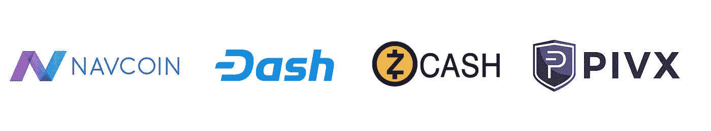
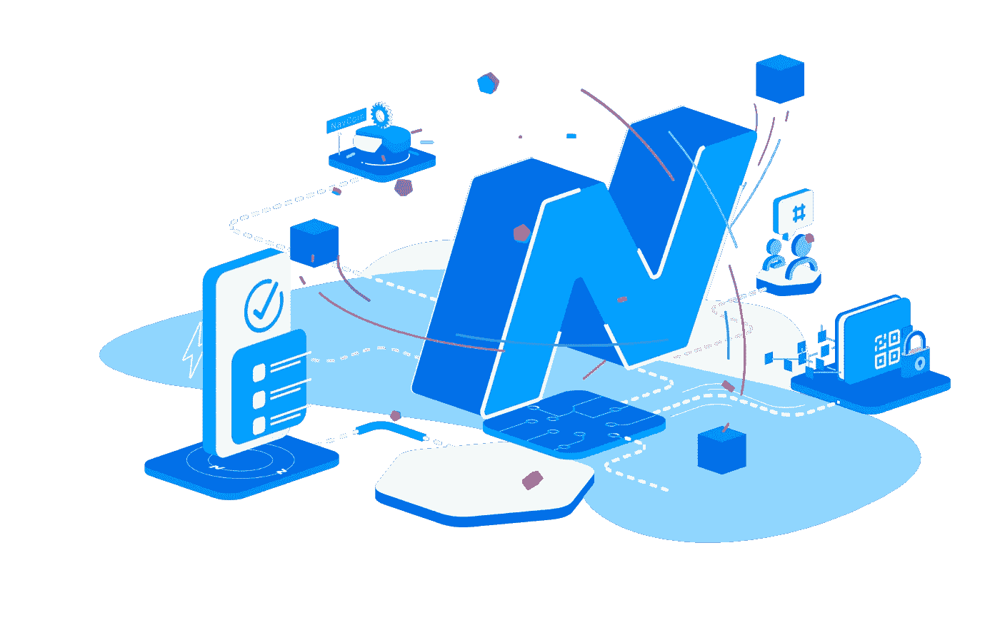

# 如何以正确的方式资助您的加密项目

> 原文：<https://medium.com/hackernoon/how-to-fund-your-crypto-project-the-right-way-e8c199aee485>

启动区块链项目是一项艰巨的工作。

你不仅要与成千上万的竞争者竞争，而且你所做的任何事情都需要聪明的人、时间和金钱。很多很多。

## 那么你如何筹集你需要的现金呢？

区块链项目有四个主要渠道来筹集开发和运营成本。有些项目只使用其中的一种方法，而其他项目则结合了几种方法。

所以我们要做的是运行每一种方法，看看每种方法的优缺点。

虽然它们都为项目带来资金，但每一个都可能对项目的未来产生深远的影响——例如它是否被归类为证券，或者它变得多么集中/分散。

# 首次硬币发行(ICO)

这是过去一年左右硬币筹集资金的主要方式。

本质上，一个项目将创建一个新的令牌/硬币，用户将发送比特币或以太坊来换取其中的一些令牌。项目然后使用这些加密资金支付给开发商/营销商等。

***进入秒***

ICO 一直是 T4 非常受欢迎的融资方式，但最近，ICO 开始失去一些吸引力。

为什么？基本上，美国证券交易委员会开始打击那些没有通过豪威测试的项目，将它们定义为证券。

Jay Clayton

美国证券交易委员会主席杰伊·克莱顿甚至明确表示，“我还没有见过不是证券的 ICO”。

尽管 SEC 现在已经开始对加密货币及其证券地位给出更明确的指导，但 ICO 的时代已经过去，这一点似乎已经很清楚了。

做 ICO 是一种容易被贴上证券标签的方式——主要是因为如果项目在平台推出之前进行销售，它们通常会被归类为证券(因为它依赖于“第三方”的努力来实现)。

***如果他们被贴上安全标签，为什么这是一个问题？***

如果加密货币交易所上市证券，它们可能会遇到麻烦，因为围绕这些证券的销售有具体的监管规定。因此，我们已经开始看到交易所放弃明显有保障的项目，这只会继续下去，因为其他项目需要证明它们不是一种保障。

## ***ICO 有什么好的？***

*   理论上，任何人都可以通过这种简单的方式参与区块链项目的启动。所有投资者需要做的就是发送 ETH 或 BTC，并期待收到 ICO 代币作为回报。

## ***有什么不好？***

*   由于去年大量资金流入 ICO，各国政府更加密切地关注 ICO 及其与证券法的关系。
*   交易所对上市的硬币越来越挑剔。如果 ICO 被标记为证券，它将不会被列出，这将极大地限制对新令牌的访问。

# 风险资本

Blockchain Capital — one of the top blockchain VC firms

作为对 SEC 介入的回应，[区块链的项目已经开始转向传统的技术项目融资方式](https://www.bloomberg.com/news/articles/2018-08-08/token-sales-turn-exclusive-as-private-investors-snatch-up-deals)——来自风险资本家的私人投资。

## ***风险投资方式有什么好处？***

*   该项目不太可能被贴上证券的标签，因为代币不提供给公众。

## ***还有坏的吗？***

*   这种方式更难获得资金，因为过程要严格得多——大多数人会说这是一件好事。
*   它依赖于与合格投资者的接触，这使得团队的位置和关系变得更加重要。

# 空投

空投是免费分发代币，通常被用作吸引大量人群的一种方式。它通常需要用户注册一个电子邮件地址，或者下载钱包——这将他们带入他们的生态系统。

因为有很多项目试图通过这种方式绕过 SEC，现在有一个完整的行业围绕这一点而建立(跟踪空投的网站等)。

## Airdrop 优点:

*   可以是一个很好的方式来获得你的硬币广泛分布，并希望创造一个围绕你的项目病毒嗡嗡声。

## 空投缺点:

*   除非他们将 KYC 作为空投机制的一部分，否则空投很容易被建立多个账户的人玩。
*   空投已经不是新鲜事了，新鲜感已经消失了。
*   围绕这一点有一个完整的行业——当空投发生时会发出警报和通知，这只会吸引特定类型的人。
*   空投似乎不能保护代币发行者免受 SEC 的起诉。

# 工作证明

根据工作证明(PoW)协议，当一个人贡献处理能力来验证网络上的交易时，他们会得到代币或硬币的奖励。

据说他们“开采”了这些硬币。这些矿工然后在交易所将硬币卖回市场，用户可以购买这些硬币。

## 工作证明是最好的对吗？

*   几乎任何有电脑的人都能获得硬币。运行全节点的矿工通过使网络不易受到 51%的攻击来增加网络的强度。

## 那么 PoW 的缺点是什么呢？

*   工作证明 ***是*** 分发硬币最有效的方式。

几年前，采矿要求相对较低，任何人都可以使用他们的计算机来帮助解决问题。

但是那些日子已经过去了。

由于价格的大幅上涨，以及采矿业的商业化，出现了专门开采 PoW 币的巨大矿能池。

虽然这有助于硬币获得背后的哈希功能，但它也导致了这些硬币的集中化，因为进入的障碍大大增加了——使得普通人很难在他们的个人电脑上挖掘。

现在竞争太贵了——你需要廉价获得能源和技术，这就是为什么像中国这样的国家在这里做得这么好。

# 社区基金

在我看来，社区基金是为项目提供资金的最有效且利用率最低的方法。

它在不同的项目中有不同的名字——创始人奖励、开发者基金、社区基金——但本质上都是一样的。

这些硬币留出一定比例的采矿/赌注奖励到一个资金池中，用于支付项目的开发。

一些硬币的例子就是 ZCash，PivX，Dash 和 NavCoin。

## 那么，为什么像好主意这样的社区基金？

平台需要不断的开发和创新。许多公司仍在构建基础设施层，他们还需要几年时间才能达到为主流采用做好准备的状态。

除非贡献者(开发人员、营销人员等)通过接受代币参与游戏，并获得足够的报酬长期从事这些项目，否则这种情况不会发生。

## 不同类型的基金

此前，这些社区基金有几种不同的模式，但它们都有一个类似的问题。

这些资金需要由充当“受托”托管的实体/集团持有(受托是因为他们是项目的核心成员)。

一些公司以“集中”的方式运作，就像一个正常的公司一样，用这些社区基金雇佣员工。

其他人持有这些资金，并拥有社区投票来选择这些资金的去向。但是最终，所有这些方法都需要“信任”,如果这些集中的实体/团体消失了，项目就会受到影响。

## 问题解决了？

NavCoin 最近创建了这种模式的新版本，消除了集中化的问题。

这是有史以来第一个完全分散的基金。除非通过网络投票，否则没有人能获得这些资金。

## 它是如何工作的？

NavCoin 社区基金有两个独立的投票期。第一轮投票是接受或拒绝提案，第二轮是发布付款。

这背后的想法是保护基金免受骗子的影响——骗子往往向世界承诺惊人的结果，但却没有用行动来支持它。

包括核心开发者在内的任何人都无法获得这笔资金。它们被烧录到一个无法访问的地址，只能通过投票过程解锁。

## 听起来不错，对吧？

*   没错。现在有了一种完全分散的、完全自主的方式来资助加密项目。
*   双重投票机制意味着经过深思熟虑、执行良好的项目最有可能获得资金。

## 有什么坏处？

*   这完全取决于社区。提交提案和网络投票都需要参与。

## 我可以在哪里了解更多信息？

查看 NavCoin 网站上的社区基金页面了解更多信息:[https://navcoin.org/community-fund/](https://navcoin.org/en/community-fund/)

***感谢阅读！关注*** [***我在 Twitter 上***](https://twitter.com/kierenhyland) ***。***