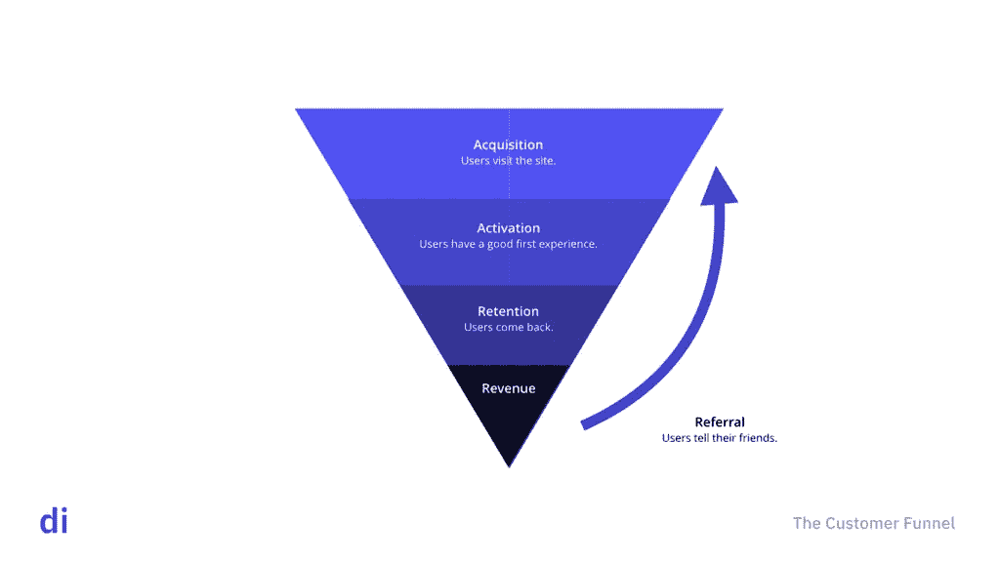
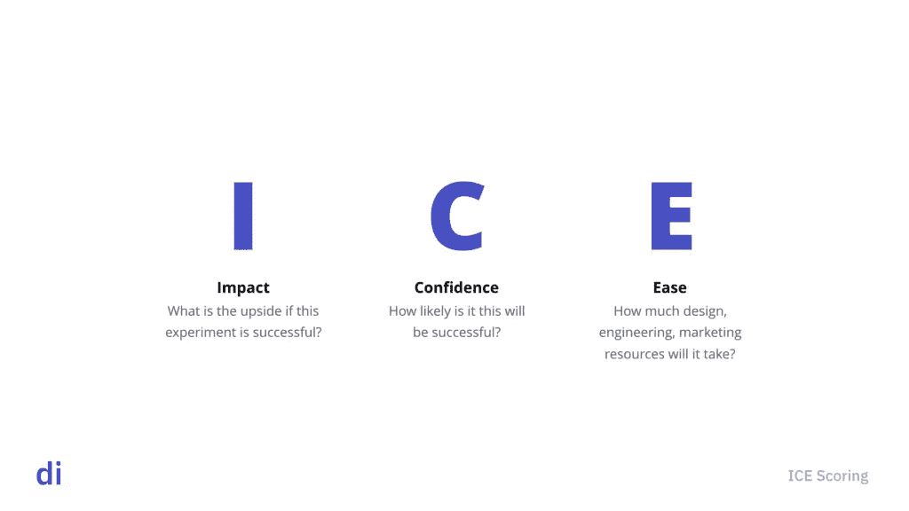
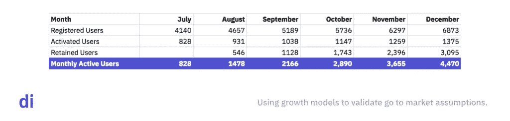

# 如何获得 160 万客户:迈克·罗马关于建立成长团队的速成班

> 原文：<https://medium.com/hackernoon/how-to-get-1-6-million-customers-mike-romes-crash-course-on-building-a-growth-team-8eac39a1f34b>

许多高增长创业公司的一个共同点是增长团队——一个多学科小组，其任务是改变底线产品指标。

与专注于获取的传统营销人员不同，他们的任务是对产品进行迭代，以提高保留率、推荐率和每用户平均收入。

Mike Rome

Mike Rome 领导着 Eat Street 的发展，在他的职业生涯中，他已经帮助许多初创公司获得了数百万用户。在这次讨论中，Mike 分享了他如何实现增长、他对实验进行优先排序的方法、优秀增长团队的组成等等。

Listen to the audio version.

# 增长的 5 个杠杆

DI:你谈到了增长和产品的交集。当你说“产品就是营销”，或者你可以从营销的角度影响的许多杠杆实际上存在于产品本身内部时，你指的是什么？

**迈克:**现在所有的数据都存在一个问题，那就是噪音会降低信号质量。你真正想做的是在暴风雪之上操作。你想找出真正让你走上可持续发展之路的指标。

我喜欢戴夫·麦克卢尔(Dave McClure)的[“海盗的创业标准”](https://www.slideshare.net/dmc500hats/startup-metrics-for-pirates-long-version)，它谈到了增长的 5 个杠杆:获取、激活、保留、收入和推荐。我们可以快速浏览一下定义。

## 收购:

收购本质上是营销。我们如何让人们看到我们建造的这个东西？我们如何让那些我们认为可能正在解决问题的人接受这个新的解决方案呢？

很多人都这么做。当他们考虑增长时，他们会考虑他们可能挖掘的获取客户的渠道。

当我在一个收购渠道中寻求成功时，有两件事总是很重要，那就是规模和单位经济。

规模意味着“无论目标是什么，我们都能找到足够数量的客户吗？”单位经济学是相对于它们所创造的价值而言，获取它们的成本。我们一般把它称为 LTV。

就像我说的，大多数团队都这样做。但许多公司过于依赖收购或营销来推动增长。

## 激活

激活意味着一旦我们让人们拥有这个东西，我们如何让他们做我们想要的。根据你要卖的东西的大小，如果卖得更容易，可能会买。如果是更贵的东西，可能是一个注册，甚至是看一个视频或类似的东西

## 保留

留存就是如何让他们继续回来做你想做的事情。可能是所有产品中最重要的，因为它最能代表一个好产品。

## 收入

收入是你如何让他们从事某种形式的货币化行为。除了把人们带到你的网站，让他们购买他们认为想要的东西，还有其他方法可以做到这一点。

## 介绍

最后一个是引荐。你如何让他们有如此好的体验，让他们成为你的营销人员？

真正重要的是:在这五个杠杆中，只有一个是营销。一旦人们接触到产品本身，所有这些事情都会发生。

人们没有花足够的时间去尝试研究、思考和试验这些产品杠杆，最终它们是一种更有利于投资回报的增长方式。如果你已经有人来做某件事，并且你能够利用你内部的资源来打造更好的产品，以提高订单价值，或者鼓励他们成为你的营销人员，你会得到更多的回报。

# 成长过程

DI:我想很多做营销的人会说“我支持推荐活动。我建造漏斗来激活。”他们可能认为这听起来和他们现在做的一样。你认为哪些流程或能力差异将增长与营销区分开来？

**迈克:**当然。我认为你想到了[将增长过程置于策略之前的想法。这是我见过的最大的区别之一。](https://digintent.com/the-key-to-growth-process/)

在我进入战术领域的早期，很多信息来自于谁在社交媒体上的内容营销中喊得最大声。你会读些东西，然后想，“哦，听起来很有趣，对吧？我们应该去试试。”

将策略置于过程之前的危险在于，除非你有办法不断开始和完成任务，否则很容易落后。每个听这个播客的人都会受到资源的限制。如果你没有一个过程来考虑优先顺序，并且对你正在做的事情有信心，你只会浪费太多时间。

我们的高级流程是围绕我们讨论过的五个字母开始头脑风暴——获取、激活、保留、推荐、收入。我们试图去追求无拘无束的想法，去想那些你甚至认为行不通的事情。

也许他们只是营销渠道不太直观。有时这些东西变得非常有趣，因为它们通常不太拥挤，不太饱和。一旦你做了头脑风暴，把所有的想法都记下来，我会把它和某种定量审计结合起来，评估潜在的影响。

如果你刚刚起步，没有任何内部数据可以参考，以告知你可能会首先采用哪些策略，这没关系。二手研究是有用的——有现成的东西，可能是这个领域未来的竞争对手，或者是关于你试图解决的问题甚至是现有解决方案的一般性见解。

# 寻找增长机会

DI:如果他们有数据，你会寻找什么来评估影响——比如瓶颈？你说的对他们已经拥有的东西进行审计是这个意思吗？他们应该寻找什么？

**迈克:**我认为尝试种植东西的一个肮脏的小秘密是，最好的东西往往只是修复坏掉的东西。

很多人听到这个术语“成长”或“成长团队”,这是一个性感的概念。但现实是，很多时候我们只是在产品中发现一些小问题，然后去掉一些东西，或者只是让一些东西按照我们认为的那样工作，跨所有平台或所有浏览器。

除了解决问题，我们还在寻找输入和输出不相等的地方。我们如何在高潜力、高影响力、高自信的任务上花费较少的努力？

我们用一种叫做**的东西来区分优先级。ICE 只是影响、信心和努力的缩写。**

因此，在头脑风暴和进行审计之后，你就有了所有这些你想要测试的东西，或者这些新产品的想法，因为它们与激活、保留等相关。

对于每一个想法，你应该从**影响**开始。问:“如果这个东西可以工作，会有什么影响？回报是什么？”

可以拼凑出一个又快又脏的[模型](https://digintent.com/growth-model)。它不一定要完美，只是通过练习，找出什么是重要的。

接下来是**信心**。如果你发现了一个想法，你会说，“哇。如果这行得通，影响是巨大的。”如果你对这种影响没有太多的确信，也没有太多的第一手或第二手数据来支持你所说的，这可能不是我会做的第一件事。信心和影响力一样重要。

最后一点，也是你创业时最重要的一点，是努力。实际测试这个新想法需要什么？我可以自己做吗？我的团队中有人能做到吗？我需要一个开发者吗？我需要一个设计师吗？我需要多个开发人员吗？

圣杯是低努力、高影响、高自信的想法。这就是你想要开始的地方。

我如此看重努力的原因是在早期，动力就是一切。如果你想一想增长的公式，它是你可以进行的实验数量乘以影响乘以成功率。

所以你有这三个输入，实际上只有一个是你能控制的，这就是你开始和完成的实验的数量。

实验的开始和结束之所以重要，是因为这是你学习的方式。你要做的大多数事情都不起作用。你不会意志消沉。你扪心自问“为什么没有成功？我们的假设被证明是错误的是什么，这又如何重新告知我们的优先事项？我们如何根据我们所学的东西来移动东西？”

你能开始和完成的测试越多，你学得越快，你学得越快，你的成功率就越高。这时飞轮开始旋转。

# 将成长融入您的组织

DI:你会对那些说“嘿，这听起来棒极了”的人说什么？我很乐意尝试为我的团队实现这样的东西，但我有来自不同心态的人？”你如何试图在一个组织内部实现这样的事情？

**迈克:**在进行这些对话时，不要认为自己知道所有的答案，这一点非常重要。从一个你的道路是唯一道路的地方开始是一个坏主意。

我坦率地推荐这条路，因为我已经看到它为我工作。但是我总是注意到我们的过程是一个活生生的过程。它坏了。我们一直在改变它，努力变得更好。

所以我会问问题。“为什么你认为最好的方法？”重要的是要试图说服人们，你只是在努力开发一种更好的机制来推动工作。

每个人都意识到他们可以做上千种不同的事情。所以我告诉人们，过程是一种想法。它让你对自己在做什么和不在做什么充满信心。从这个角度来看真的很有帮助。

另一件事是要意识到这只是等式的一部分。仍然需要品牌营销。在我今天的工作中，我一半时间花在营销和客户获取上，另一半时间花在产品上。但是我这边非常数据驱动。

我们公司获取客户的另一部分是以品牌为中心的。我了解到他们互补得非常好。如果你执行创意，无论是电视或广播或外出，他们真的可以提升直接反应和我的团队所做的。所以它们是共生的。

# “虚假”增长的风险

**DI:看起来如果你从产品方面开始，取得一些成功，展示流程的工作，然后要求在收购方面有一席之地，这可能会有所帮助。**

迈克:我认为这是个好主意。同样重要的是要强调他们有他们的工作，那就是让人们访问网站，而你有你的工作，那就是确保产品做你卖的东西。

我犯过的一个我知道很常见的大错误是，假装增长真的很容易。做到这一点的首要方法是[找到可以获得大量廉价客户的渠道](https://digintent.com/the-danger-of-cheap-acquisition/),而不要在意成功获得客户等式另一半的单位经济学。

同样重要的是从产品入手，并担心杠杆和保留，以确保你为营销做好准备。如果你没有造出足够多的人想要并且理想情况下愿意为之付费的东西，它就不会起作用。

你想让足够多的人使用该产品，看看这些激活保留指标是否有所改善；你只想知道你是否在稳固基金会。很多时候，基础并不稳固，当人们获得客户时，看到大量的应用下载或大量的观看甚至购买是令人陶醉的，但你知道，这些都是一次性购买。如果人们不再回来，那就是最大的错误。

**迪:你可以看到，很多初创公司都有投资者围绕持续的增长期设定预期，现在你必须不断投入越来越多的资金，以继续展示他们的预期，即使你的基础并不稳固。**

迈克:当然。你必须承认，即使你有真正伟大的投资者和支持者，你的动机也不会完全一致。

如果你看看大多数投资者或基金如何赚钱的单位经济学，这不是因为他们有很多很多的胜利。通常是一只大鲸鱼携带资金。

因此，他们有动机尽快找出谁会繁荣或萧条。他们想弄清楚他们是否应该把时间和精力花在一项业务上，或者甚至投入更多的资本。因此，花钱扩大规模的压力很大，即使这对企业来说不是最有意义的。

我很幸运，因为我们有非常棒的投资者，我们可以就什么是负责任的进行这种对话。但总是有压力要花得更快，你真的想确保你是以一种可持续的方式消费。

# 创新会计与传统会计

DI:我们在一个创新的环境中遇到了这个问题，在这个环境中，组织习惯于用衡量核心业务成功的方式来衡量成功。人们有一种强烈的倾向，想要展示立竿见影的效果，并让它看起来比准备好的要大。关于过早结垢问题。但是 [**需要时间迭代，找到产品-市场契合度**](https://digintent.com/3-ways-to-maximize-your-digital-innovation-efforts/) **。**

**Mike:**我给大型组织和创新团队成员的最好建议之一是，你必须得到高层的认可，这将是一条漫长而令人沮丧的道路，如果人们没有兴趣，这将非常艰难。

刚开始很刺激。但真正推动成功的，是能在悲伤的低谷中坚持下来的人和团队。归根结底是决心和承诺，因为我研究过或参与过的所有初创企业，总会有艰难困苦。你必须得到高层的认可。

有一天有人告诉我，他们最好的品质之一是他们能很好地接受坏消息。我认为这实际上是一个惊人的竞争优势。你必须对你正在解决的问题保持足够的兴奋来继续下去。如果它不能抓住你的注意力，或者你的组织的注意力，那就真的很难了。

# 如何执行流程

**DI:回到流程——具体是什么样的？你能想出关注与收购无关的事情并能为组织带来有意义的好处的例子吗？**

迈克:当然可以。所以在早期，在我们有好的语言之前，我们又一次受到资源的限制，就像大多数可能听这个的人一样。

我们访问数据库，查看用户在哪里被挂起。或者去咖啡店，用户和人们一起测试注册流程。与用户交谈并深入了解产品。你可以与客户服务人员交谈，找出人们在哪里变得沮丧。

很明显，您必须有良好的跟踪，以便在数据库中挖掘良好的输入。所有的步骤都计划好了。在我们的案例中，是医疗募捐者。所以激活是让人们开始筹款，并为筹款提前赚些钱。

我们在产品中有足够多的事件来查看所有这些步骤，只是看看哪里出了问题，这些总是没有足够的创新想法来改进流程的好例子。大多数情况下，事情并不像我们所沟通的那样，也不像我们所希望的那样。

# 如何更快地运行实验

**DI:谈论你正在进行的实验以及实验的速度和数量是你能够真正控制的一个指标。您是否同时运行一系列实验来移动一个指标？组织如何更快地行动并控制这一变量？**

**迈克:**这是一个价值百万的问题。我认为跟踪真的很难，很难知道你应该立刻做的最佳事情是什么。

我认为有时人们会因为试图开始和完成一个实验而犹豫不决，并且明确知道它意味着什么。

以收购为例。在大多数情况下，你只需要知道那里是否有什么东西，或者它是否很难通过。假设你得到了一些结果，你知道有规模，这可能就足够了。所以你不需要总是对某件事有绝对的把握——通常方向上的把握就足够了。

当资源有限时，这一点非常重要。即使对我来说——我为一家拥有数百名员工和数千万美元收入的初创公司工作——我仍然受到超级资源限制。我并不总是有同时运行 5 个产品实验的奢侈。

**DI:想到测试的人可能会想到亚马逊的《百色蓝》。但是，除非你有规模，否则用这种方式找到成功的方法要花很长时间，特别是因为大多数实验都失败了。**

迈克:是的。我认为早期这是个好建议。如果你只是改变这一件事，而且这还为时过早，你只有一小部分客户，你可能没有测试足够有雄心的东西。

不要担心这种不知道自己目标的想法；您希望获得两倍的客户，或者您希望将注册流量提高 50%。你不是在寻求 5%的相对改善，而是 50%的绝对改善。

如果你采取那种心态，你就有自由去改变更多的事情。你只需要满足于知道即使你过得更好，你可能也不确定为什么事情会这样，有时候这没关系。

**DI:我以前告诉过我们的团队——缺少因果关系，我会选择相关性。我不知道这是否是真正的原因，但它似乎是相关的，对我来说这就足够了。让我们部署和前进。**

这里还有一个团队成员培训部分，您将在漏斗中更高的位置运行测试，例如在您的注册页面上，如果测试成功，您看到 15%的提升，他们会认为这将下降到 15%的底线提升。

但通常不会这样。你所做的任何改变都会改变人们与你的产品互动的方式。他们的行为会有所不同。

迈克:是的，在 A/B 测试中，有些人比我聪明得多。[埃文·米勒](https://www.evanmiller.org/ab-testing/)写了一些真正深思熟虑的东西，关于当你测试不同的体验时应该注意什么。

我认为你必须接受这种不确定性，不知道你是否想足够快地前进。

不过，这是一种微妙的平衡。当在数据风暴之上操作时，你如何确保你使用数据来确信你下一步要做什么？

# 足够好的数据

**DI:对我们来说，客户通常会遇到相反的问题，他们没有任何跟踪机制，至少在活动层面没有。他们跟踪销售或注册，但不是所有的事件导致这一点。所以我们通常会有相反的问题。**

Mike: 我认为这里更重要的一点是，当开始做某事时，即使你没有数据，也没关系。去做数据。去和潜在客户谈谈。不要坐在会议室里和一群不会成为产品用户的高管们一起出主意。

我不认为“我们没有建立分析”或“我们没有用户”的整个想法会妨碍我们投入工作。去和别人聊聊天。即使是坏消息。当你想做某件事时，你能得到的最好的反馈是弄清楚它不工作。找出原因并改进。

DI:我正在和我们的创意总监谈论设计思维。我们经常做“我们会怎么做”的练习，类似于你所说的无拘无束的想法。

他说很多 UX 是关于模式识别的，并且依赖于你的输入。一个冷漠的人可以提出想法，这总比什么都没有好。但是比起你在研讨会前做一些研究，他们了解的要少。如果我知道我的客户说了什么，他们如何使用我的产品，你就有了更好的输入，会议也更有成效。

你提到了成为规定性的、看着别人做了什么然后只是复制它的潜在风险。与此同时，这些是我可以带来的输入，我可以说，“嘿，这个产品或完全不相关的行业通过做 x 解决了类似的问题。”这有意义吗？

迈克:我认为这是一个非常有力的观点。我再想一次，尤其是当你开始的时候，不要因为没有某些投入而犹豫不决。不要纠结于你需要数百条输入的想法。

有很多关于 UX 模式的阅读材料。从用户测试的角度来看，需要一小部分用户来找出什么东西可以满足 80%的产品需求。

不要认为你的投入不够好。去找任何输入。如果你很好奇，并且你带来的信息来源于实际的用户反馈，不仅仅是来自你的头脑，而是来自与潜在客户的交谈和倾听，这是很有用的。

保罗·格拉厄姆谈了很多关于用户如何有很多答案的问题。十有八九，我想不出比去听一些用户讲话并研究他们更好的时间利用方式，无论是使用产品还是通过产品对你的谈话做出反应。

# 建立成长团队

DI:我们来谈谈团队。我知道，根据组织所处的阶段，它看起来会有所不同，但为了实现增长，似乎你需要的不仅仅是一个有营销头脑的人。需要哪些技能？

**迈克:**好奇的人是件大事。你想找到那些乐于接受坏消息的人。他们有很强的毅力和决心——快速学习的整体理念就是回报，这就足够了。我认为所有这些都是非常好的事情。

就早期团队的构成而言，团队中应该有本质上是客户的人。如果你不是顾客，你很难做出什么东西，你必须猜测顾客想要什么。成为顾客，因为这样你可以走得更快。你可以只考虑如何为自己创造价值。

当涉及到实际的技能时，最好有一个开发人员来执行实验。你需要一些设计上的帮助。设计很重要。

我认为技术营销人员很重要——那些真正对直复营销感兴趣的人。他们很好，因为他们通常注重细节，所以他们可以兼做产品经理。

他们也同情开发者和设计师，尊重他们要求他们做的事情。对于一个开发人员来说，说几句话并创造五周的工作真的很容易。知道你在问什么以及为什么很难是很重要的。这对球队的士气有好处。

你还需要有一些分析背景的人。找一个寻求真理的人，他会让你保持诚实。

我认为，如果你只是找到那些热衷于建造闪亮的新东西的人，而不是建造实际上解决一个真实而深刻的问题的东西，那将是困难的。

# 获取开发人员资源

**DI:成长型团队的一个问题是如何接触到开发人员，因为很多团队都受到资源的限制。在你刚刚起步的时候，你是如何推荐提倡获取资源的？**

Mike: 谈到开发时间，你必须找到对这个机会感到兴奋的人。你需要找到一个对这项工作充满热情的开发人员。你不能低估对这个问题感到兴奋的重要性。从某种意义上来说会变得很难。如果你对这个问题不感兴趣，就很难坚持下去。

当你试图获得高层的认同时，解释这项工作能为企业创造的价值是一个好方法。让事实说话吧。它迫使你做好充分的研究和准备。不难证明，在 x 和 y 上工作会给企业带来财务收益。

弄清楚你想从谁那里获得买入费。有哪些让他们好看的东西？他们关心什么？很艰难，但政治很重要。尤其是如果你在一家更大的公司。

# 增长模型

**DI:去年我们用得比较多的一个工具是** [**超粒度增长模型**](https://digintent.com/growth-model) **。尝试可视化和量化所有这些杠杆，弄清楚激活过程中的六个步骤以及产品内部的三个不同的推荐循环。**

现在，不要说让我们花三个月的时间在这个特性上，因为它不是路线图上的下一个，而是展示一些东西将如何影响一个变量，并进行敏感性分析，这在这种情况下非常有帮助。

**Mike:** 详细的模型非常有用的原因是它能让你看清前方的路。在开始前获得一种意识和一定程度的谦逊会对你有所帮助。你要确保每个人对未来都有兴趣，并且仍然保持兴奋。

我看了一下。你不久前发给我的，我印象非常深刻。我的意思是，很多东西比我现在用的更聪明，所以脱帽致敬。

DI:每个人都从其他人那里得到它。那就是一切 [**布赖恩**](https://brianbalfour.com/) **。这对审查潜在投资也非常有帮助。创始人说，“我正在筹集 150 万美元，我们的计划是在接下来的 12 个月内吸引 50，000 名客户。”**

我问，“你打算怎么去？”

他们说，“嗯，有这么多钱，我们要做口碑营销，我们要做付费营销。”

当你向他们展示模型时，他们开始意识到达到 50，000 将需要比他们想象的更多的工作。当他们谈到做内容营销时，你必须找出你要写多少文章才能排名。所有这些网站的月搜索量是多少，你的预期点击率是多少，等等。他们开始意识到他们真的需要系好安全带，计划开始忙碌了。

迈克:我完全同意。

# 创造成长文化

**迪:你谈到了过程，也谈到了团队。我知道你也非常相信文化。一旦你把团队召集在一起，有什么建议来灌输一种成长文化，使这种东西坚持下去？**

**迈克:**找到合适的人是一个很好的捷径。有些东西是你教不了的。你必须找到那些有决心的人，那些不介意犯很多错误的人，那些有好奇心和寻求真理的人。

预先树立先例也有帮助。确保人们真正理解前方的道路会有多艰难，并被说服。我不是说消极地谈论它，因为我喜欢它。但是学习曲线就是很可笑。你苦干了六个月，遇到了一些困难。但是你浮上来呼吸空气，你已经建立了新的技能，这种快速的学习是不会停止的。有些人就是喜欢它。

在早期问一些棘手的问题，以确保人们这样做是出于正确的原因。让人们不只是在这里，因为这似乎是一个很酷的想法。它需要更多的东西——人们真的需要相信这个想法。

DI: 我知道你以在整个艰苦过程中保持人们的高度热情而闻名。你也以行为模范而闻名——不只是大声发号施令，而是亲自动手。那些是故意的选择吗？

迈克:我一直很欣赏那些仍在战斗的人。那对我来说很有分量。

另一件事是，最近我只是想多避开一点。我们已经做了一段时间了。这支队伍成为正式队伍已经好几年了。我觉得有时候你需要离开。

我思考过我所在的成长团队中所有最好的成长想法，但没有一个是我的想法，所以我一直在努力适应这个想法。

我一直关注的一点是，要确保有一种精英文化，在这种文化中，最好的想法会胜出，不管它来自谁。使用 ICE 评分，确保人们有工具和时间来执行，并且不碍事。

*原载于 2018 年 11 月 19 日*[*【digintent.com】*](https://digintent.com/how-to-build-a-growth-team/)*。*