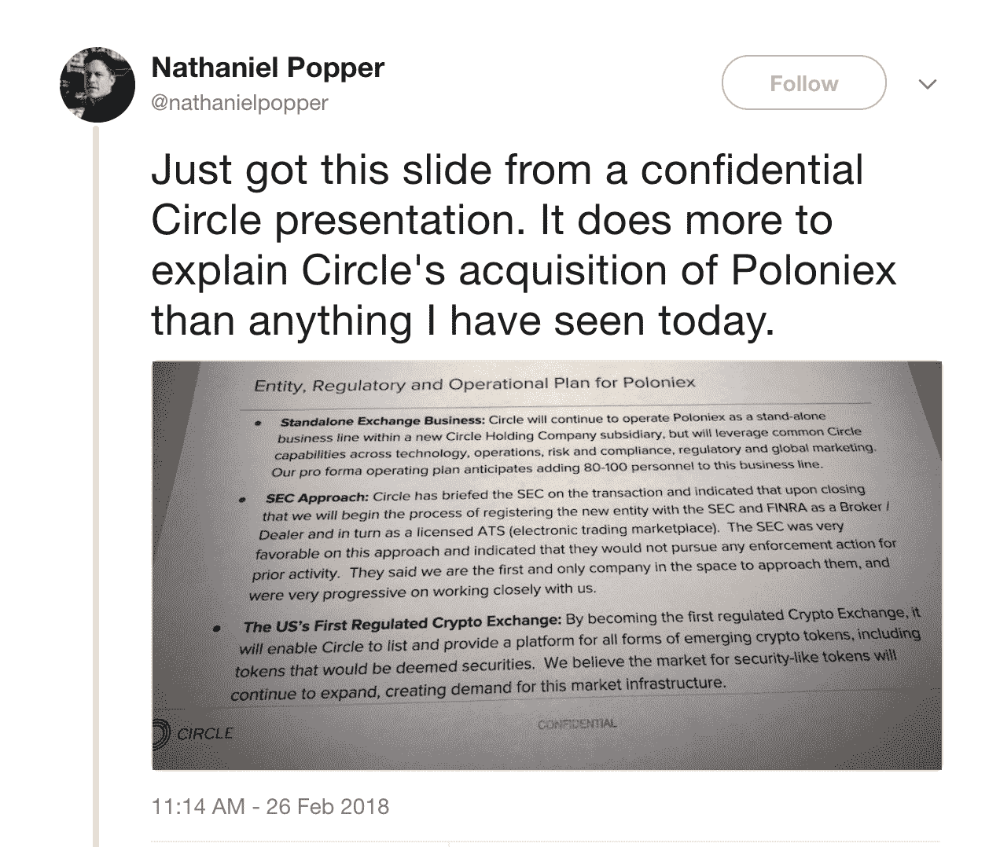

# 如何从证交会获得免费通行证

> 原文：<https://medium.com/hackernoon/how-to-get-a-free-pass-from-the-sec-991273460df6>

如果你相信独角兽，我有一个很棒的故事给你。上周，Circle 宣布他们以 4 亿美元收购了加密交易所 Poloniex。这笔交易成为了许多头条新闻，因为一方面，你有一家风投资助的公司，有一位超级明星首席执行官兼连续企业家杰里米·阿莱尔，另一方面，你有这个加密交易所在美国证券交易委员会监管的阴影下工作，在不是经纪交易商的情况下交易证券，并可能违反一长串法律。

那么 Circle 董事会是如何批准这笔交易的呢？毕竟，公司的董事会对股东负有信托责任，也要确保公司不会陷入监管困境。董事和高级职员(D&O)保险不足以保护这些当事人。

这是这个故事变得更好的地方。原来有传言说 Circle 收到了 SEC 的免费通行证。怎么会？Poloniex 的发行文件中有一节解释说，SEC 告诉他们，如果他们注册为经纪交易商，并申请替代交易系统(ATS)，SEC 将为他们过去的所有罪行出具一份健康证明。真的吗？

问题是:美国证券交易委员会是否提供免罪卡？有一种信仰体系，在这种体系中，如果你打电话给美国证券交易委员会，并与他们会面，无论你犯了什么样的违规或欺诈行为，一切都是美好和快乐的。如果你问我，我会说这是个不错的系统。

然而，我一点也不相信这一点。SEC 绝不会在对话或口头理解中交易其执法权。在 Poloniex 上交易的投资者受到美国证券交易委员会(SEC)的保护，SEC 有权对该公司进行未经注册的证券交易，以及未经适当尽职调查(如反洗钱、OFAC 检查和了解你的客户审查)的新进投资者。

如果证交会真的打算放过 Poloniex，那么他们会给该公司一封不采取行动的信。2018 年 1 月，欧盟金融工具市场指令(Markets in Financial Instruments Directive)改变了对经纪自营商和投资顾问的要求，去年秋天，美国证券交易委员会(SEC)向特定市场发出了[不采取行动的信函](https://www.sidley.com/en/insights/newsupdates/2017/10/sec-issues-no-action-letters-to-address-mifid)，以指导受影响的实体，并说明它们在过渡到新监管下运营时被允许采取的具体行动。随着 SEC 对自己的立场越来越直言不讳，有没有向加密领域的公司发出不采取行动的信函？一个都没有。

现在很明显，美国证券交易委员会并不懒散(如果这一点曾被怀疑的话)，他们已经释放了他们的狗，首先在 ICOs 和迄今为止一个倒闭的交易所(低垂的果实)。你认为现在他们已经决定停止了吗？不会吧。

本周故事变得更加精彩:美国证券交易委员会宣布[所有加密交易都是非法的](https://hackernoon.com/the-sec-kills-crypto-exchanges-3dc9e3e87651)，除非它们在美国证券交易委员会注册。波洛涅克斯注册了吗？你猜对了:没有。

这仅仅是执法行动的开始，任何违反证券法的人都要注意了。有时候没有补救的办法，祈祷就是需要的适量的安慰。

Circle 董事会肯定相信了一些与 SEC 的传闻讨论报告，并对技术、客户、收入和主要债务进行了关键的收购。正确的做法是在收购前获得 SEC 的不采取行动函，因为这是你能对银行采取的唯一保护措施。随着美国证券交易委员会本周的声明，Circle 肯定对他们收购 Poloniex 的决定感到后悔。