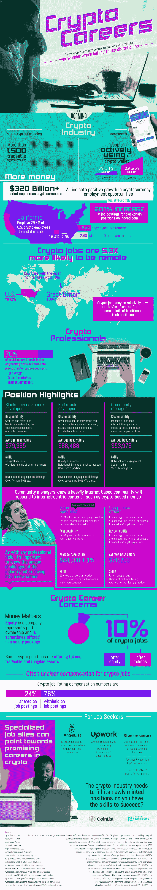

# 如何在加密领域找到工作

> 原文：<https://medium.com/hackernoon/how-to-get-a-job-in-crypto-cc7ecb8b3e70>

## 以及去哪里找

加密货币从何而来？如果你对加密货币不那么着迷，你可能永远不会再考虑它。可能有人在某个大银行大楼里把它打印出来，对吗？不对。加密货币是一种基于区块链技术的数字货币，它需要比印刷机操作员更多的编码专家。随着加密货币的爆炸式增长，加密货币工作也出现了热潮，可能有一个适合你。

爱沙尼亚的一家加密货币公司最近上了头条，因为它广告招聘一名“模因专家”——这份工作已经有人填补了。然而，在加密货币世界中，有各种各样的专业角色需要填补。加密货币初创公司需要文案、营销人员、业务开发专家、区块链工程师、软件工程师等等。更重要的是，大多数这类工作的基本年薪都超过 7 万美元，而且许多人还能远程工作。

去年，Indeed.com 的加密货币工作广告增长了 200%以上，尽管你更有可能在加密工作列表、Upwork 或 AngelList 上找到你的下一份加密工作。从这张信息图中了解更多关于[加密货币工作](https://coinlist.me/news/crypto-careers)这一新兴领域的信息！

