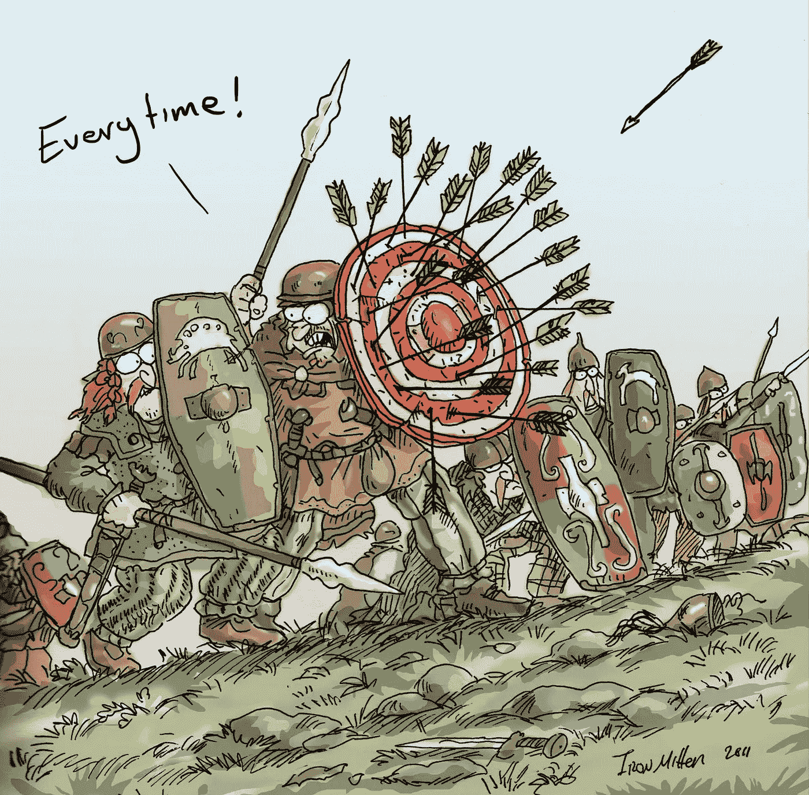

# 如何获得团队领导的工作

> 原文：<https://medium.com/hackernoon/how-to-get-a-team-lead-job-2c47d8fee618>

[iron-mitten.blogspot.co.uk](http://iron-mitten.blogspot.co.uk/)

最近，我从一个开发人员的角色转变为一个动手团队的领导者，并决定在记忆犹新的时候分享我的经验。

> “动手”仅仅意味着我仍然写代码⌨️

# 🎭角色

这是我更喜欢的角色和职责匹配方式:

🗡🗡 **技术主管** —负责为团队设定技术议程的人，没有直接下属，全职编码。[战术雇佣]

🗡🛡 **团队领导** —负责技术议程和团队长期成功的人，有直接下属，兼职编码。[战略性雇佣]

🛡🛡 **工程经理**——负责团队长期成功的人，管理直接下属，几乎不用编码。[战略性雇佣]

# 🎯战术与战略🗺

战术型雇员是一个能够完成工作的人，最好是在沉默中，只有在需要的时候才与他人交流。只要工作相关且稳定，我就开心。

战略性雇佣**推动他们自己的观点**和议程。在工作中，[与从事这项工作的人建立关系网](https://hackernoon.com/tagged/networks)，并告诉每个人自己喜欢的工作方式。周围的人被令人讨厌的议程强度激怒了。

> *任何公司都需要战术性和战略性的招聘。*

# 成为团队领导的理由

## 👍充足的理由

**🛡Ready 护着人**

您希望并准备好保护您的报告。

你的主要职责是充当一把屎伞，规则很简单:所有负面的沟通和过程变化都先找你，然后你过滤它们并采取相应的行动。

你不能简单地将狗屎直接级联到你的报告中。你的工作是**将狗屎转化为建设性的行动**、反馈和成长方向，这些看起来不会冒犯你的报告。

**🌱享受成长中的人**

你喜欢帮助人们研究和反思他们的工作。你必须确定你的下属的**个人议程**并**通过粉碎障碍来帮助他们实现它**。

**🤝对培养软技能感兴趣**

你意识到软技能对实现大目标有多重要，并希望在组织人们一起实现大目标方面做得更好。

## 👎糟糕的理由

**💰得到更多的钱**

一般来说，在同一家公司，团队领导的薪水比开发人员高，但是如果你需要更多的钱，10-20%的加薪不会改变你的生活。如果这是你唯一的动力，你将很难在这个职位上取得成功。

**🤓成为更好的程序员**

如果你的热情是解决困难的编程挑战，但你遇到了天花板，你的公司希望你成为团队领导，那就改变公司。如果你更喜欢电脑而不是人，那就坚持你的热情。

**⚔Seizing 有趣的工作**

由于你将是负责人，你可以组织工作，让所有有趣的代码都放在你的办公桌上。这种超能力不应该被滥用，唯一的借口是你俩都是**这份工作的最佳人选**和**在你的日程表中你有这个能力**。否则，把它交给你的报告。

## 👾丑陋的理由

**😈成为老板**

如果你得到一份工作，你就成了老板，但这不是一个永久的职位，记住这一点。你**只是借用了标题**。幸运的是，在我们这个行业，如果你是一个糟糕的老板，你的下属会很快抛弃你，即使他们很平庸，他们也有很多选择。

**🕷Controlling 的一切**

如果你作为一名开发人员缺乏控制力，那么不要认为**接管与团队的沟通**会对你有所帮助。**微观管理摊工作**，你必须**促进所有权和自主权**。

Our solar system flying through space

> 完美的团队领导就像太阳。它有巨大的引力把每个人都拉向同一个方向，经常给同行超越自己的动力。

# 先决条件

## 🎖Seniority

资历是开始团队领导道路的绝对障碍。要了解它是什么，你可以阅读 Krzysztof zaocki 对[资历的很好解释。](http://merowing.info/2017/01/seniority/)

你必须**相信你是一个“高级”**开发人员，并且应该有这方面的**外部证据**:流行的博客、开源项目、指导实践。不需要外部证据，但一个资深人士对相关社区没有贡献是相当奇怪的。

# 准备

有两个主要方面将在实际操作团队领导职位的面试中进行评估。

## 🐝硬技能

这些是你的工程技能，它们对完成工作很有用，但它们的主要价值在于指导、评估和获得你的报告的权威。

使用[技能矩阵](http://sijinjoseph.com/programmer-competency-matrix/)进行自我评估:

 [## 程序员能力矩阵

### 请注意，每个级别的知识都是累积的；处于 n 级意味着你也知道来自…

sijinjoseph.com](http://sijinjoseph.com/programmer-competency-matrix/) 

以及相关平台的路线图:

*   [网络开发者路线图](https://github.com/kamranahmedse/developer-roadmap):

 [## kamran ahmedse/开发人员-路线图

### 开发者路线图-2018 年成为网络开发者的路线图

github.com](https://github.com/kamranahmedse/developer-roadmap) 

*   [iOS 开发者路线图](https://github.com/BohdanOrlov/iOS-Developer-Roadmap):

 [## BohdanOrlov/iOS-开发人员-路线图

### iOS-开发者-路线图-2018 年成为 iOS 开发者的路线图。

github.com](https://github.com/BohdanOrlov/iOS-Developer-Roadmap) 

*   [2018 年学习 Android 开发](https://android.jlelse.eu/learning-android-development-in-2018-part-1-83a514f6a205):

 [## 2018 年学习 Android 开发—第 1 部分

### 在写一个字之前，我祝大家新年快乐！！！

android.jlelse.eu](https://android.jlelse.eu/learning-android-development-in-2018-part-1-83a514f6a205) 

## 🦋软技能

这些是你的组织和沟通技巧。他们需要**成功地胜任该角色，**因此将在面试中**评估以下方面**:

*   自我管理
*   战略
*   与人合作
*   资源[管理](https://hackernoon.com/tagged/management)
*   分析和决策

# 📚书

在你的面试之前，请阅读此*;)*

导师建议:

 [## 人件(软件学上新的概念)

### Peopleware 有 6，383 个评级和 351 条评论。本说:Peopleware 是世界上的一个经典…

www.goodreads.com](https://www.goodreads.com/book/show/67825.Peopleware)  [## 截止日期

### 截止日期有 1343 个评分和 116 个评论。塔拉什科普尤克说:обязательна、прочтениюдляначинающих…

www.goodreads.com](https://www.goodreads.com/book/show/123716.The_Deadline) 

我建议:

监督和引导“猫”的指南:

 [## 放牧猫

### 《牧猫》有 212 个评分和 12 个评论。《牧羊猫:领导程序员的程序员入门》是一本…

www.goodreads.com](https://www.goodreads.com/book/show/1247980.Herding_Cats) 

对领导力和管理问题的“食谱式”回答:

 [## 领导软件开发团队

### 领导一个软件开发团队有 43 个评级和 4 个评审。纳撒尼尔说:我得到这本书，因为我有…

www.goodreads.com](https://www.goodreads.com/book/show/1369623.Leading_a_Software_Development_Team) 

关于软件开发和人类管理的真实故事:

 [## 管理人类

### 《管理人类》有 2011 个评分和 177 条评论。基思说:我买这本书是因为我喜欢作者的博客…

www.goodreads.com](https://www.goodreads.com/book/show/1317946.Managing_Humans) 

不是关于冥想；)有助于自律以及对生活和人的健康态度:

 [## 马可·奥勒留的沉思

### 《马可·奥勒留的沉思》有 25 个评分和 1 个评论。Deedra 说:不是确切的书:可听的:沉思的…

www.goodreads.com](https://www.goodreads.com/book/show/35028429-meditations-of-marcus-aurelius) 

如果你碰巧懂俄语，这是必读书:

 [## 45 Татуировок менеджера

### 45уаууииовокменеджера有 438 个评分和 54 个评论。☘Misericordia☘说:问:我宁愿被 12 个人评判，而不是…

www.goodreads.com](https://www.goodreads.com/book/show/19007601-45) 

# 💕赢得人心

*又名面试流程*

## 🏟了解你的观众

回答直接的问题是不够的，你必须了解你在和谁说话，以及他们对试图扮演这个角色的人的个人期望。有三大类:

## 🔼直接下属

这些是开发人员和潜在的 QA。这些人正在**选择他们未来的老板**，所以你必须**推销你的硬技能**(我是你们中的一员)，让他们了解你的管理风格和议程(我是你的挡箭牌)。

## ◀️与▶️同行

这些是其他团队的领导，包括产品经理和 UI 设计师。这些人**正在选择他们将一起工作的团队的门面**。在这个阶段，你必须平等地销售你的软技能(我的团队将帮助你实现目标)和硬技能(如果需要，我可以评估团队和代码)。

## 🔽部门主管

你的老板正在寻找一个**非常具体的人**，你的任务是了解这个人是谁**如果你是那个人**。**逆向工程** **这个**通过询问**团队中当前的挑战和问题**，你能获得的信息越多，获得职位的机会就越大。

# 💌提供

如果你得到了一份工作，它包含了关于薪酬和福利的无聊信息，这不是我想谈论的。重要的一点是，与你面试的大多数编码职位不同，管理角色意味着在你加入之前，你会面临一定的**长期挑战和问题，这种知识很少包括在给开发人员的提议中，因为他们不需要做出战略决策。**

## 📈理解期望

你将会根据你在实现这些目标和解决这些问题上的进展得到评估，所以如果你对这些目标漠不关心，那么明智的做法是传递这个提议。例如:如果你的管理层是绩效狂，不在乎质量(或者相反)，那么加入这样的公司就是浪费时间。你必须渴望扮演一个角色。

# 🎬开拍！

从培养自己内心的领袖开始，标题就会跟进。

> 领导者的品质反映在他们为自己设定的标准上- 雷·克洛克

# 🌟感激

感谢我所有的好经理！同样的感激也去给那些**坏**的，因为那些混蛋教会了我**不**该做什么！

我要特别感谢我遇到的最谦逊、最乐于助人、最鼓舞人心的经理——拉斐尔·洛佩斯·迭斯。

感谢您的阅读👋