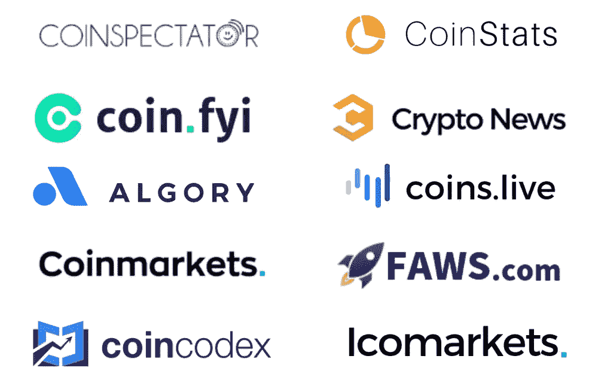

# 如何免费接触 300 万密码爱好者

> 原文：<https://medium.com/hackernoon/how-to-get-exposure-to-1-million-crypto-enthusiasts-for-free-f8e74c21e131>

先说这个:出版社贵。就加密货币行业而言，情况更是如此。

但是，让你的 ICO 或加密货币相关项目出现在一个真正产生流量的网站上需要多少成本？我快速搜索了行业内的一些主要新闻来源，得出了以下数字:

***coin telegraph:****【4550 美元*
***NewsBTC:****【1000 美元* ***bit coin . com:****【2499 美元*

即使是较小的限量发行的也有三位数的价格:

***隐币。新闻:****$ 600* ***隐石板:****$ 499* ***investinblockschain:***

*当然，有了这样的价格标签，你得到的覆盖面将是巨大的，将你的内容发送到读者心中的顶端，对吗？*

## *嗯，事情没那么简单*

*虽然被任何有声望的新闻机构报道都很好，但没有证据表明向 CoinTelegraph 付费值得接近 45000 美元。事实上，在大多数情况下，新闻媒体只是简单地复制粘贴你的新闻稿，没有任何宣传，几个小时后就被封存了。*

*也许你在想“但是等等，泰。我的新闻资料袋真的很棒，每个人都想知道我的项目！记者们会抓住机会第一个报道我们的！我们的项目将帮助社区，他们不可能向我们收费。”*

*当然，有一段时间我也有这种感觉。*

*早在我的第一个加密初创公司 [Crypico](https://crypico.com) 的早期，我们的预算很少。看着上面列出的大量价格标签，我选择了唯一一个半免费的选项，制作了一个新闻资料袋。*

*所以我做了一个很棒的新闻包，用电子邮件发给了每个人。说真的，我肯定在几周内发了一千封电子邮件。我把它们寄给大人物，又寄给无名小卒。*

## *它起作用了……*

*经过几周的电子邮件，Crypico 得到了 2 家无名新闻机构的报道。那时候，有人写我们，我们很激动。现在，我回过头来看这个过程是多么的低效和浪费时间。当然这是免费的，但作为联合创始人，我的时间应该花在更重要的任务上。*

*在我发出的一千封电子邮件中，我估计我收到了大约 200 封回复。他们每个人都给了我一些荒谬的出版价格。*

*一封特别的电子邮件引起了我的注意。在收到 400 美元的采访报价后，我告诉编辑我们的预算很少，只需要有机的、非赞助的报道。*

*他的回应？一个笑的表情符号。说真的。*

**

*我觉得是针对我个人的。不是因为没有人对报道 Crypico 感兴趣，而是因为我不明白我们是如何成为一个社区的。秘密新闻业是付费的，你越早意识到这一点越好。*

*我恳求你仔细看看顶级加密新闻机构提供的报道。你会看到同样的 20-30 个项目。为什么？这不是因为他们有最创新的技术。如果是这样的话，告诉我创怎么会有这么多的持续报道？因为那些公司有大量的公关预算。*

*尽管我很激动，但我喜欢认为我正确地利用了我的负能量。正如我母亲常说的，“生活不是等待暴风雨过去，而是学会在雨中跳舞。”*

*还有第三种选择。造一把伞。我选择三号门。*

# *我的雨伞看起来像什么？*

*从表面上看，我的名为 CoinScribble 的雨伞看起来像大多数加密货币新闻网站。这是引擎盖下的事情变得有趣。*

*任何人都可以在 CoinScribble 上发布新闻。它是免费的，而且是匿名的。更好的是，内容立即发布，创建反向链接，并自动分发到许多行业最大的新闻聚合器和谷歌新闻；就像其他顶级新闻机构一样运作。*

*虽然我的雨伞只有几个月的历史，但我们已经建立了相当大的销售网络。一些最著名的公司，比如下面这些，仅举几个例子:*

**

*我们的发行网络每月的观众总数达到 1，000，000 人，T2 观众总数达到 1，000，000 人。*

# *结果*

## *是时候让秘密新闻民主化了。*

*对于一个如此热衷于权力下放的社区来说，我们确实似乎把影响力交给了少数人。*

*社区应该有权决定他们想阅读的内容，这也是 CoinScribble 不限制提交内容的原因。相反，我们让社区来决定什么是有价值的内容。*

*我们可以感谢中本聪建立了去中心化的技术，但是如果我们想要一个更加真正去中心化的*社会*，那就要靠我们来抛弃某些行业现有的中心化模式，尤其是新闻业。*

*现在是把媒体的权力交给人民的时候了。我们可以一起打造一把保护伞，抵御秘密新闻业的风暴。*

**欲了解更多关于 CoinScribble* [*的信息，请访问网站*](https://coinscribble.com) *或* [*在 twitter 上关注我*](https://twitter.com/tydanielsmith)*