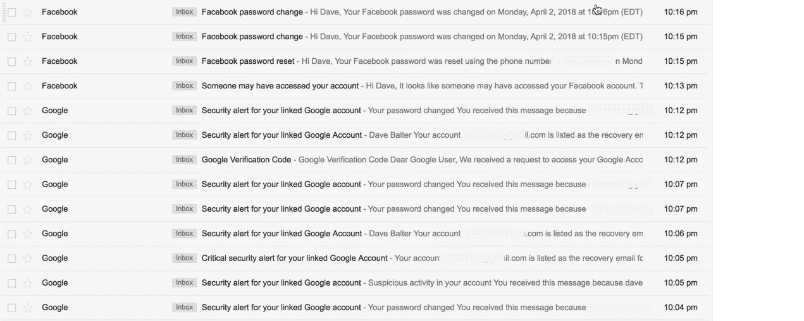
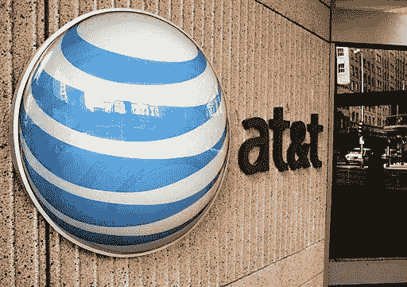

# 如何被黑客攻击和伤害:这是美国电话电报公司，傻瓜

> 原文：<https://medium.com/hackernoon/how-to-get-hacked-and-harmed-its-at-t-silly-e0f57024ddd4>

## 昨晚 10:04 分——接近就寝时间，欺诈热线关闭后*分钟——通知开始潮水般涌来。*

旧的电子邮件密码已更改。

这导致了[脸书](https://hackernoon.com/tagged/facebook)被攻陷。

导致我的手机号被咳出来。

然后。呃，那么…

我的手机离线了。

***那就是你挖不出来的洞。***

先说清楚:我用保护。

我已经在我的主要 gmail 账户、我的应用程序和我所有的加密产品上设置了双重认证——还有一个*不要在我的手机上移植*。

但是我漏掉了一个非常非常旧的 gmail 账户(就像大多数人一样，不幸的是，我有一个我忘记了的随机账户),尽管它只是一个垃圾邮件的黑洞，但这个漏洞已经暴露了。

这个问题很容易解决，我立即采取行动，实时更改密码 Gmail 和脸书都有非常简单的工具来通知安全漏洞，证明是你，并更新你的帐户。向他们俩致敬。

但是一旦你的手机被接管，你就有大麻烦了:

*   你将等待 30 分钟，等待美国电话电报公司典型的客户服务来回答。
*   他们会向你解释，是的，的确，几分钟前有人已经把你的 SIM 卡移植到了一个新的 SIM 卡上。以上帝的名义，为什么这是可能的——即使为电话设置了“不要端口”——客户服务代表也不知道。
*   然后销售代表会向你解释，你基本上是倒霉透了。他们根本无法做任何事情来改变它，因为他们的欺诈防范小组晚上不营业。它们在“正常营业时间”开放没错，因为黑客只在正常营业时间工作。

与此同时，黑客们正在探索他们能找到的任何/所有漏洞来破解你的双因素认证，以获得真正的东西:[你的加密账户](https://hackernoon.com/the-conundrum-of-crypto-press-e4bd4db61de7)。

根据我的电话联系列表，他们尝试了一些方法。晚上 11 点，我的前妻(她保留了我的姓，所以是一个自然的发射台)开始在她的家里接到恐吓电话。

他们一遍又一遍地打电话——通过一个语音调制器——他们开始要求，

> “戴夫在哪里？”

除了让她觉得不可思议之外，他们也没取得什么成果。

与此同时，美国电话电报公司在线上。他们让我去睡觉。第二天早上回电话。

我变得有些敌意，要求经理。经理对此有所准备。她说他们在加勒比海，他们没有办法解决问题(我想象他们在茅草屋顶下的露天呼叫中心，温暖的微风中飘来遥远的岛屿音乐)。

“明天打电话给诈骗热线，”她说。

他们 9 小时后开门。

然后可怕的是，她开始了标准的结尾，

> “美国电话电报公司感谢您的惠顾，我们非常重视您……

谢谢美国电话电报公司。

你显然是黑客最好的朋友。