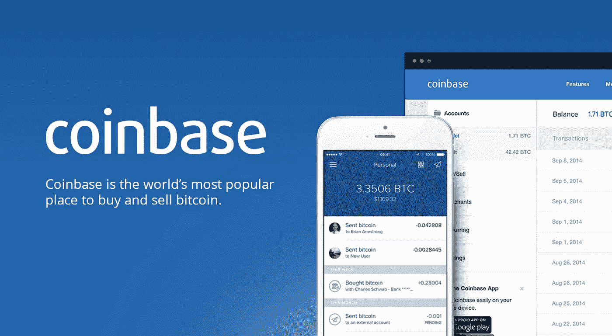
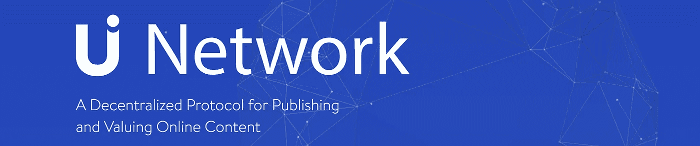
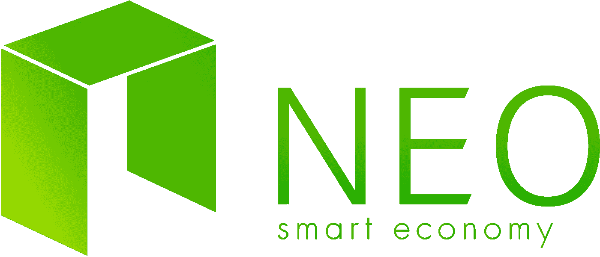
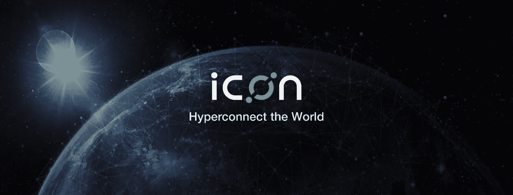
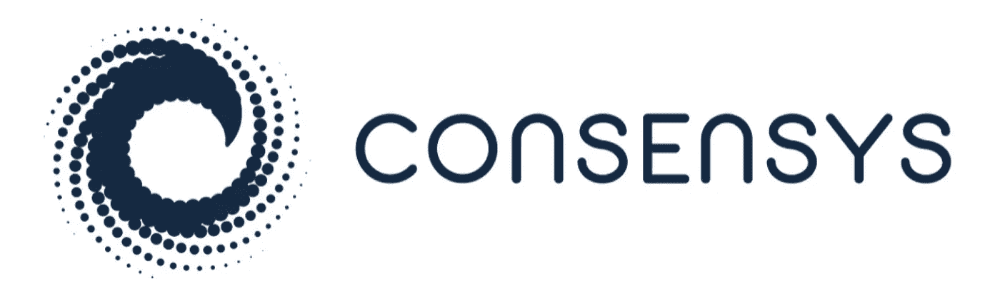
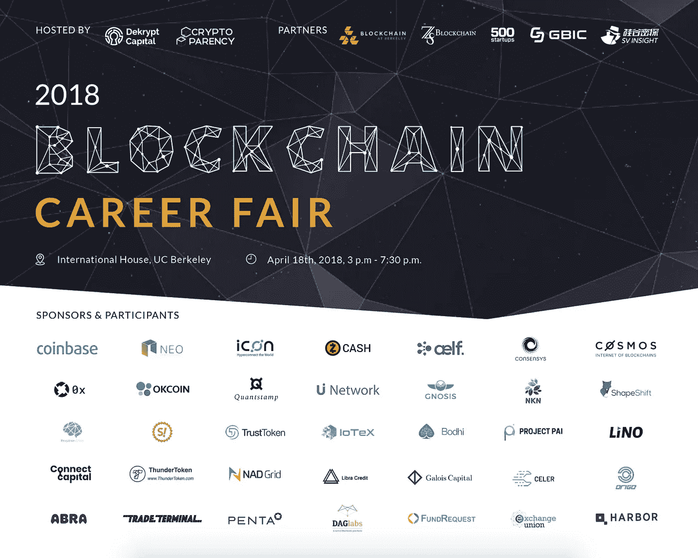

# 如何被顶级区块链公司录用

> 原文：<https://medium.com/hackernoon/how-to-get-hired-by-top-blockchain-companies-e2c19eb3997c>

## 来看看他们有什么要说的。4 月 18 日参加我们的招聘会直播！

[区块链](https://hackernoon.com/tagged/blockchain)开发在最近雇佣最有才华的程序员方面处于领先地位。根据 Upwork 的[报告](https://www.upwork.com/blog/2017/11/freelance-skills-upwork-q3-2017/)，从 2017 年底到 2018 年初，区块链[工程](https://hackernoon.com/tagged/engineering)在劳动力市场最需要的技能中排名第二。根据《计算机世界》的估计，纽约、波斯顿和硅谷等城市的区块链开发者平均年收入为 15.8 万美元。这比软件开发人员的平均薪酬高出 10%以上。从 2016 年到 2017 年，开仓数量也增长了 115%。

然而，包括学生和科技公司员工在内的普通求职者仍然对区块链行业的职业有许多疑问。

最普遍的问题是:

贵公司最需要的职位是什么？

**您认为对区块链科技最大的误解是什么？**

对于仍在学校学习的人来说，他们如何才能最好地准备在这个领域找到工作？

**你认为区块链市场需要哪些非技术性工作？**

为了回答这些问题，我们采访了区块链行业的 6 位领导者:

u 网络项目负责人 Ben EI-Baz；NEO 的负责人 R&D·马尔科姆和全球开发总监赵晨；比特币基地高级招聘人员 Charlene A. Delapena 图标的共同创始人和基金会理事会金玟以及康赛斯的社区领袖安奈利查维斯。

(如果你想跳过问答，可以直接进入文章末尾，了解更多关于区块链招聘会的信息)

**贵公司最需要的职位是什么？**

**U 网:**产品经理、前端开发者、区块链开发者、全球社区成长和全球营销总监。

**Neo:** 核心区块链开发工程师——有许多优秀的开发人员，但是很少有人能够从事协议级开发。

比特币基地:因为这与大学招聘有关——我们迫切需要的是软件工程实习生和大学毕业生。

我们发展迅速，因此需要全方位的帮助。然而，当前首要任务是找到以前启动过实际项目有经验产品经理。

**同意:**

ConsenSys 目前最需要的职位是项目经理、全栈开发人员(了解 Solidity 优先)、智能合同审计员(需要 Solidity)、市场营销和社区经理。

你认为对区块链科技最大的误解是什么？

**U 网:**区块链解决具体问题，而不是所有问题。围绕区块链的所有炒作都是因为许多人没有详细考虑使用区块链作为解决方案的适用性，而不是使用替代技术作为解决方案。几年后，具体的用例将得到验证，人们将更好地理解区块链的成功和容易失败的应用。

**尼奥:**所有的区块链代币都代表技术或公司价值。绝大多数代币代表当前或预期的未来效用。在我看来，注重代币价值最大化的区块链项目更有可能失败，而注重代币效用最大化的区块链项目更有可能成功。

**比特币基地:**我们认为，围绕区块链技术的最大误解是，它是非法活动的管道，容易受到持续的安全漏洞的影响。

真正的乐趣在于区块链技术，而不是加密货币。

**Consensys:** 对区块链技术的最大误解之一是，一切都需要区块链，而且随着区块链解决方案的实施，业务流程可以普遍得到改善。很可能不同的区块链解决方案将同时存在，并将像企业内部网一样运行，直到互操作性起飞。一旦发生这种情况，这些企业内部网将能够与它们自己的区块链解决方案之外的更广泛的企业社区进行交互。

对于仍在学校学习的人来说，他们如何才能最好地准备在这个领域找到工作？

**U Network:** 通过贡献代码、评论代码或者以其他方式与项目互动来参与项目。

**Neo:** 现在就开始，为开源项目做贡献，例如 Neo。如果你是一名开发人员，你将在 Github 中获得一个跟踪记录，或者如果你专注于任何其他领域，你将在社区中为自己建立一个名字。

比特币基地:对于仍在学校学习的人来说，他们该如何为在这个领域找到工作做好准备？我们建议学生围绕加密和区块链空间进行研究，以便他们理解为什么数字货币将为全球每个人创建一个更加开放的金融系统。

**ICON:** 最佳实践是实践。有很多方法可以参与到这个空间中。它可以是区块链项目、会议组织者、白皮书审阅者，甚至是交易。关键是，当你从某个地方开始时，你会开始与他人交往，你会发现新的机会。

**Consensys:** 为在这个领域找到工作做准备的最好方式是自己参与进来，了解这个行业的最新动态和发展(ConsenSys Media 是思想领导力的一个重要来源)。区块链的空间是新的和多样化的，要有创造性，并通过补充区块链教育创造你自己的机会。参加甚至开始一次聚会，与各行各业的人联系，并了解更多关于区块链可能与不同领域重叠或不重叠的信息，找到你可以用 dApp 解决的问题并解决它们，参加黑客马拉松或孵化器，如 ConsenSys 和 Topcoder 的分散影响孵化器。进入区块链空间没有可靠的路径，所以选择你自己的冒险，并在这个过程中享受你自己！

**你觉得区块链市场需要哪些非技术性的工作？**

**Neo:** 产品管理、经济和政治研究者(对于博弈论)，密码学专家优先。

比特币基地:你认为区块链需要哪些非技术性的工作？我们认为，法律、金融和业务/战略发展领域的非技术职位将受到区块链市场的需求。

我知道有很多“社区管理”或“市场营销”的工作离那些远点。寻找商业发展、项目管理和投资基金的机会。基本上，找机会多接触实际产品。

**Consensys:** 项目经理、营销、销售/咨询角色、设计师、作家(尤其是如果你能为更广泛的受众记录以太坊或翻译深奥的信息)和律师。我们需要人们发现并创造对区块链解决方案的需求。没有多少人了解去中心化的好处，有些人甚至可能没有意识到我们当前的中心化系统是多么脆弱，以及它们使我们变得多么脆弱——如果你可以与技术领域以外的人开始对话，并在结束对话时与他们了解我们中心化世界的去中心化替代方案的好处和缺点——那么你可以在这个领域创造自己的机会。

区块链行业正在建设的许多东西都进入了未知的法律领域，因此有兴趣致力于塑造新标准和监管框架的律师应该考虑探索区块链。对于寻求产生持久社会影响的创新技术来说，强有力的法律顾问是必不可少的。

**区块链招聘会:**

区块链招聘会将于 4 月 18 日在加州大学伯克利分校举行。这项全球活动有 10 多家区块链公司参加，包括 NEO、ICON、Zcash、aelf、Consensys、OKcoin、ShapeShift、Cosmos、0x 和 U Network。如果你正在找工作，这是一年中你不能错过的机会！

不能亲自出席的人不必担心。我们将现场直播整个事件！招聘公司将介绍他们的项目，并与无法亲自参加的参与者进行问答。我们还允许在线提交简历:参与者可以通过[www . blockchaincarerfair . io](http://www.blockchaincareerfair.io)申请公司。

以下是参与公司:

**时间:**

**太平洋时间 2018 年 4 月 18 日 15:00–19:30**

地址:

**国际之家**

皮德蒙特大街 2299 号

加州伯克利，邮编 94720

注册:

[https://www . eventbrite . com/e/区块链-职业博览会-加州大学伯克利分校-门票-44312568084？aff=es2](https://www.eventbrite.com/e/blockchain-career-fair-uc-berkeley-tickets-44312568084?aff=es2)

简历提交:(这会增加你的面试机会)

[www . blockchaincarerfair . io](http://www.blockchaincareerfair.io)。

广播链接:

[http://blockchaincareerfair.io/livestream/](http://blockchaincareerfair.io/livestream/)

**组织者:**

隐形眼镜

CryptoParency 是一家技术咨询公司，致力于促进最有前途的区块链平台的发展。从概念验证到部署，我们通过建立强大的开发人员社区，将所有行业利益相关者聚集在我们的客户周围，促进分布式分类帐网络和分散式应用。

十亿资本

Dekrypt Capital 是一家区块链投资公司，专注于隐私保护协议和早期风险投资。我们指导并投资于开发新颖解决方案的团队，以解决可扩展性和隐私的核心问题。

伯克利大学的区块链

柏克莱区块链是最大的大学领导的区块链学生组织。我们把从计算机科学家到商业领袖的兼收并蓄的个人团队聚集在一起，开发我们认为是未来的技术:区块链。我们认为区块链有可能给许多行业带来巨大的颠覆。通过将自己定位为学术界和公共领域之间的桥梁，伯克利的区块链提供了这个快速发展的空间迫切需要的知识和教育。