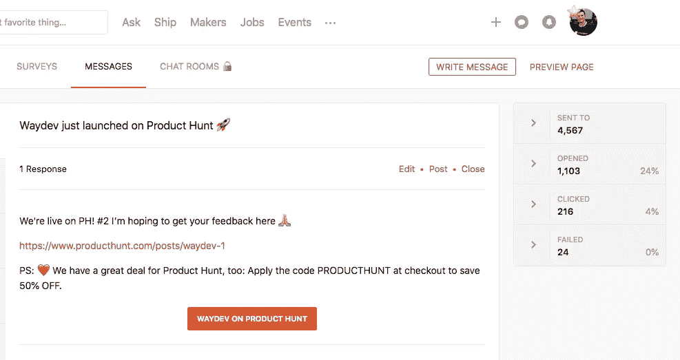

# 如何在产品搜索中获得排名前 5 的产品，并获得他们的简讯

> 原文：<https://medium.com/hackernoon/how-to-get-in-top-5-products-on-product-hunt-and-get-in-their-newsletter-2a2ac20e471f>

因为我喜欢帕累托原则，我不喜欢浪费时间，所以我将解释我们为了在产品搜索中获得前 5 名产品所做的工作。

## 为产品搜寻发布设定目标

首先，设定一个目标:你想实现什么？对我们来说，目标是在当天的前 5 个产品中到达第二天的简讯，在那里我们**向 35 万订户**展示 [**Waydev**](https://waydev.co) **。**

*“赢了宝贝就好。”— Al Davis* [*灵感来自 Ben Horowitz 的博客文章*](https://a16z.com/2011/10/08/nobody-cares/)

**何时推出？**

大多数企业家决定在周二和周三推出产品，但这也是竞争最激烈的一天，因为这是在一周的中间，其他人也会推出，所以你必须决定你的产品是否足够好，足以参与竞争。

> 在 Waydev，我们直到确定产品准备好了才发布。

现在，在计划好你的发布日期后，有趣的事情开始了(收集资源并以团队的方式制定策略)

**Logo**——我建议有一个漂亮且可见的 Logo。

LOGO

**横幅**—我会推荐你的产品附带一个视频或动画 GIF 我们选择了一个动画 GIF 和一些产品的图片。对于动画 GIF，我们使用了[云应用](https://www.getcloudapp.com/)。

BANNERS

**你的介绍—** 推销你的故事，你为什么要创造这个产品？你解决什么问题？你的产品有什么独特之处？为什么产品搜索社区使用你的产品？提供激励也很重要；你面对的是一个创新者社区，很有可能你的早期采用者就在其中。像我们之前的其他人一样，如果他们在我们的网站上使用“producthunt”优惠券，我们决定提供 50%的折扣

INTRO

**您的网站—** 确保您为 PH 社区定制了您的网站。对于定制，我们使用了 [Introbar](https://introbar.com/) ，这是一个非常有用且易于安装的插件。

写博客——在你的公司博客或个人博客(如果你有粉丝的话)上写一篇文章，基本上这是聚集最多观点的地方；这有助于炒作。

**简讯**——准备一份简讯，向你的观众/订户宣布你正在 PH 上直播。不是所有人都有账户，但他们可能认识有账户的人。电子邮件最好在发布后几个小时发出，这样你就可以给他们直接链接。

[**产品搜寻船**](https://www.producthunt.com/ship) **简讯—** 如果您使用 Ship 来发布您即将推出的产品，您将拥有一个数据库，您可以直接从产品搜寻网站向他们发送简讯。

Product Hunt Ship

社交分享— 在脸书、Linkedin、Twitter、IG——所有你能找到的社交网络上发布甚至推广你的发布，你永远不知道一个 PH 粉丝在哪里度过他的社交媒体时间。

SOCIAL SHARE

**DM —** 直接向您的社区发送消息并寻求反馈。不要害怕使用 DMs 来宣布你的 PH 发布；关键是让人们感兴趣，访问链接并留下他们的反馈和想法。

**群组—** 向您所在的群组发帖，寻求反馈。在脸书有很多团体，你可以在那里推销你的产品，你可能会得到有价值的反馈。我们是 Stripe Atlas 社区的一员，他们给了我们很多帮助。

**来自社区的意见和反馈** —我无法强调这有多重要。无论评论是好是坏，处理好每一条评论都是非常有价值的；

**结果—**

*   登录页面上有 1510 个用户
*   应用程序中有 286 个用户
*   60 个账户

我希望这篇文章是有用的，并为一些即将到来的产品制造商提供一些好的见解。如果你喜欢这篇文章，你也可以给我们一些关于产品搜索的反馈[https://www.producthunt.com/posts/waydev-1](https://www.producthunt.com/posts/waydev-1)如果你是一个非技术型的创始人，并且想更深入地了解 Waydev，你可以试试这里:[https://app.waydev.co/demo](https://app.waydev.co/demo)

> 有一个了不起的产品发布会，并继续做出令人惊叹的东西！

产品搜索官方指南—[https://blog . product Hunt . com/how-to-launch-on-product-Hunt-7c 1843 e 06399](https://blog.producthunt.com/how-to-launch-on-product-hunt-7c1843e06399)