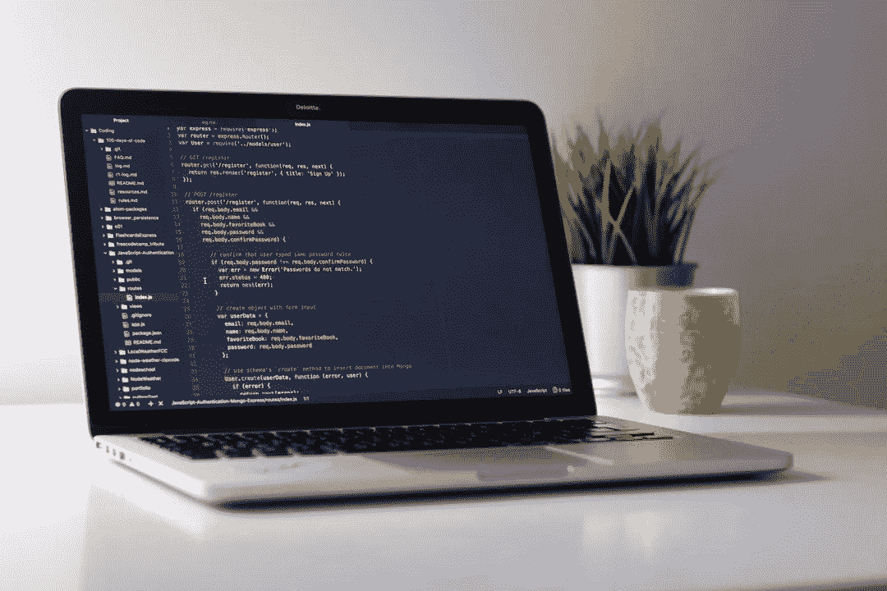

# 如何在本地启动并运行 Laravel 项目

> 原文：<https://medium.com/hackernoon/how-to-get-laravel-projects-up-and-running-locally-cc81935a613e>



在用三个不同的文档页面写完这个指南后，我决定将它抽象成一篇我可以随时更新的文章。请记住，这是一般说明，您可能需要根据您要运行的内容遵循一些自定义步骤。也就是说，你需要做的是:

# 要求

在开始之前，这里有一些你需要的东西:

# 把密码输入你的电脑

让我们假设项目托管在 GitHub 上(或者 GitLab，任何 git 服务都应该可以)。首选方法是执行 git 克隆。您可以通过在您选择的终端中运行以下命令来实现这一点:

```
git clone [https://github.com/someuser/someproject](https://github.com/someuser/someproject)
```

当然，并不是每个人都有或者想要使用 git，所以几乎所有的 git 服务都提供了一种下载资源库压缩版本的方法。只需搜索“*下载 ZIP* ”选项。然后，在进行下一步之前，您需要解压缩它。

# 安装依赖项

为了扩大存储库的规模，Laravel 项目很少将它们的依赖项捆绑在一起。你需要使用`composer`来下载它们。为此，只需在存储库文件夹上打开一个终端窗口，并运行以下命令:

```
composer install
```

根据依赖项的数量，此过程可能需要一至五分钟。

# 设置数据库

大多数 Laravel 应用程序需要一个数据库。为了简单起见，我们将使用一个 sqlite 数据库，它只是一个简单的文件，不需要外部程序。要配置它，在存储库上搜索一个`.env.example`文件，并将其重命名为`.env`。你还需要打开`database`文件夹，创建一个名为`database.sqlite`的空文件。之后，在文本编辑器中打开您的`.env`文件，并进行以下更改:

```
-DB_DRIVER=mysql
-DB_DATABASE=homestead
+DB_DRIVER=sqlite
+DB_DATABASE=database/database.sqlite
```

最后，打开终端窗口并运行以下命令:

```
php artisan migrate
```

# 设置应用程序密钥

简单一点！只需打开一个终端窗口，运行以下命令，就大功告成了！

```
php artisan key:generate
```

# 让服务器运行起来

你几乎可以使用任何服务器来服务你的应用，但是为了简单起见，我们将使用 Laravel 的集成服务器。打开终端窗口，运行以下命令:

```
php artisan serve
```

现在，您应该能够通过[使用此链接](http://localhost:8080/)访问您的应用程序。

# 就是这样！

如果一切顺利，您现在应该可以看到 Laravel 项目的主页了。恭喜你，享受 Laravel 的力量！

*原载于* [*我的博客*](https://miguelpiedrafita.com/laravel-local-environment/) *。*