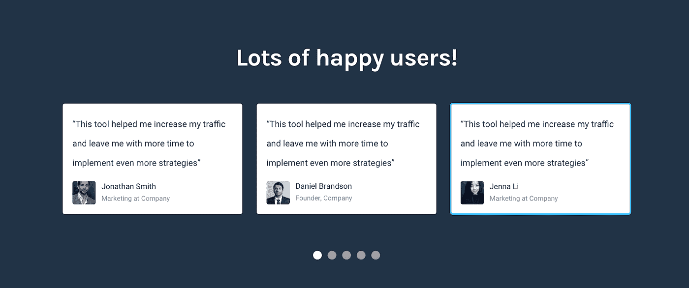

# 如何从 SaaS 登陆页面获得更多免费试用(+真实的例子)

> 原文：<https://medium.com/hackernoon/how-to-get-more-free-trials-from-saas-landing-pages-real-example-897aba0c065a>

Suggested vs Improved

在这篇文章中，我将展示 Find Better Questions 网站存在的问题，这些问题阻碍了它获得更多的免费试用/下载和客户，以及我认为解决方案应该是什么样子。

# 什么是查找更好的问题？

[寻找更好的问题](http://findbetterquestions.com/)是一个[工具](https://hackernoon.com/tagged/tool)，它可以让你从 Quora 上创建问题列表，过滤它们，只回答那些能给你带来最多流量的问题。它完成了列表的所有工作，并对最佳问题进行排序。这是一个很棒的工具，来看看吧:)

# 该过程

这将是具体的，以找到更好的问题，如果你想学习我的 5 步过程，把游客变成客户，你可以应用到你的网站，[这是我的 100%免费电子邮件课程](http://bit.ly/2xwP2fz)。

# 要记住的事情

*   该产品仅适用于 Quora。
*   它的目标是那些已经使用 Quora 来获取流量和线索的人，所以他们更清楚这个工具可以节省多少时间，使用 Quora 有多大价值。
*   该网站还没有社会证明，因为这是最近推出的，但我把它加了进去，所以当他有一些很棒的证明时，他知道在哪里以及如何使用它们来获得最好的结果。

每一个问题都是不同的，我会尽我所能让尽可能多的人知道这个问题。如果你想要适用于所有网站的东西，请查看我的 5 步电子邮件课程(100%免费)。

# 获得更多免费试用的关键

您需要:

*   解释你的产品/服务能做什么。
*   展示你的产品如何为你的潜在客户带来结果。
*   回答人们对你的产品最大的异议([我的免费电子邮件课程](http://bit.ly/2xwP2fz)的第 2 步和第 3 步)。
*   让免费试用显而易见，以减少尝试的承诺。

我在我的免费电子邮件课程中讲述了所有这些要求以及你的网站如何实现[。](http://bit.ly/2xwP2fz)

# 问题及其解决方案(当前版本与建议版本)

# 标题

这是你的公司给潜在客户的第一印象，在一个注意力持续时间极低的世界里，你真的需要介绍你将要解决的问题的“大画面”，一小段描述解决方案可能是什么，最好是一张展示解决方案可能是什么样子的图片。

Current version

*   非常浅的背景上的白色标志使它几乎看不见。
*   标题很好，但是全部使用大写字母会使它更难阅读，因为字母之间失去了它们通常在形状和高度上的巨大差异。
*   下载按钮并不表明这是一个适用于 Windows 和 Mac 的应用程序。
*   没有迹象表明有免费试用。

Improved version

*   这个标题很容易让人一眼就看出这是在 Quora 上找问题，但也让人们产生了足够的好奇心，如果他们需要更多的上下文，可以阅读下面的内容。
*   CTA 现在显示这是一个适用于 Mac OS 和 Windows 的应用程序
*   CTA 只显示 Mac，因为它会自动检测访问者使用的是哪个操作系统，所以我们不必显示两个同等重要的 CTA，这不是一个好主意！
*   请注意，我是如何提到免费试用的，这让下载在整个推介过程中看起来像是零承诺。
*   我在边上添加了插图，只是为了提供更多一点的上下文，但是如果文本居中对齐，它仍然可以获得这个示例的几乎 80%的功能。
*   我没有使用与当前版本相同的颜色，因为我们应该将颜色保持在最低限度，而当前的颜色无法让我正确地重复使用它们，并具有 CTA 所需的高对比度。我选择红色的唯一原因是帮助展示这是为 Quora 制作的(他们的主色是红色)。

# 介绍一下问题！

这一点非常重要，它让你更容易理解你正在解决的问题(因此解决方案也更容易理解)，同时也提醒他们这个问题有多痛苦，他们有多想解决这个问题(希望他们将你的产品/服务视为解决方案)。

很少看到登录页面在解释如何解决问题之前恰当地描述了他们正在解决的问题。

难怪潜在客户会很快提出异议，比如“我不明白它是如何工作的”或“我不知道它是否能解决我们的问题”… **这是避免这些问题的一个简单方法！**

Current version

*   网站直接跳转到解决方案，这是一个失去的机会，提醒游客得到这个问题是多么痛苦，以使他们正确地意识到这可以节省多少时间，以及这个工具有多么有价值。

Suggested version

*   注意到我开始说 Quora 是一种痛苦的浏览方式，因为它不是为这个目的而设计的。
*   我添加了一份证明来帮助展示这一点。如果你和你的客户保持联系(这是你应该做的),让他们给你一份类似的证明并不难。请记住，给他们举几个例子来说明它能表达什么，这样你就能更好地控制它们的有效性。

# 解释其工作原理

在介绍了你可以解决的问题之后，是时候展示你将如何解决这个问题，以及通过使用你的产品/服务来解决这个问题有什么好处。

Current version

*   截图至少是可见的，你可以得到一些关于它如何工作的上下文，但孔输入与输出的事情不是很有效，因为我发现这个工具有更多的功能，并且与你在这里看到的略有不同。
*   如果你想让人们注册，这需要一步一步来创造正确的期望。

Suggested version

*   这更容易理解，因为它被划分为如果他们得到这个工具，他们将经历的确切步骤。
*   这种结构的另一个巨大好处是，当潜在客户阅读时，他们可以将它与他们当前发现问题的方式进行比较，以及这个工具实际上快了多少。
*   这可能看起来太高了，但它很容易浏览，并使一切可见，最好的一点是他们不太可能忽略这一点，因为如果他们没有正确地遵循它，他们就不会了解上下文(你不能跳过这些步骤，也没有其他地方可以看)。

# “好处”

人们购买的是利益而不是功能，所以展示你的功能如何创造真正好的结果和利益是非常重要的。

Current version

*   这并不能说明什么，因为这些术语非常模糊，人们总是在大多数 SaaS 网站上看到这些，这使得效率更低。
*   因为我上面给你看的“它是如何工作的”部分更详细，节省时间的好处仍然很明显，所以不要使用网站来试图说服这些好处是好的，访问者会自己意识到这一点，这是 10 倍的强大！

# 证明书

既然人们已经明白你在解决哪些问题，以及你如何解决这些问题，这就是他们开始怀疑你是否真的能得到他们想要的结果的时候了，这是提出证明和案例研究的最有效时机。

Suggested version

*   这只是一个非常简单的布局，因为通常最早或最容易获得的推荐来自 Twitter。这有类似的设计，或者你可以使用他们的嵌入式工具在这里显示它们，并显示人们对你的产品的看法。

# 定价

Current version

*   免费试用版在任何地方都是不可见的。
*   包含的内容列表不在同一级别，因此您无法正确比较它们。
*   那些下载按钮是非常普通的，它们并没有告诉你将要下载什么以及为什么要下载。
*   我建议把价格放在最后，这样人们在开始对价格提出更多异议之前，可以先看到好处。

Suggested version

*   请注意，我总是确保使用参考来使定价看起来更便宜。我利用它可以腾出的时间尝试其他营销策略，这是主要的好处。
*   这一次，您可以轻松地比较每个计划中包含的内容，并看到基本计划不包含其他计划包含的许多功能。
*   作为一种良好的做法，你通常应该包括这些问号来解释该计划包括什么，从而大大减少围绕价格或功能的不必要的异议。

# 最终 CTA

既然你花了这么大力气来解释你的产品/服务有多好，有些人会愿意转变，那么在你失去抓住他们的机会让潜在客户点击离开，永远不再回来之前，给他们一个简单的方法…

Current version

*   没有动力去注册，特别是当他们看到它的花费后，却看不到尝试的方法。
*   免费试用在哪里？网站上有一个暂时看不到的:P

Suggested version

*   非常明确的无风险应用试用激励。
*   使用 FAQ 作为另一种 CTA，以防他们需要了解更多关于产品的信息。

# 常见问题

*   这里没什么特别的，但是要确保在人们离开页面之前，总是有一个简单的方法让他们的问题/异议得到回答，因为这可能是你永远不会得到的线索。
*   记住……每当一个人问一个问题时，他们身边大约有 20 个人也有同样的问题，但他们并不介意。如果你不想无缘无故地失去线索，请记住这一点。

# 想知道我是怎么做到的吗？👇

这篇文章是我帮助 SaaS 初创公司提高转换率和收入的 5 步过程中的一步。[注册我的免费电子邮件课程](http://bit.ly/2xwP2fz)到**从很少的潜在客户变成一个网站！**

Click here to get my free course

# 需要帮助您转换吗？

我很乐意讨论你的问题，所以请在评论中告诉我你的现状、需求或目标👇或者…

[服务业](http://www.cortes.design/#services)

[感言](http://www.cortes.design/#testimonials)

[免费电子邮件课程](http://www.cortes.design/email-course)

**邮箱:** pedro@cortes.design

**延伸阅读:**

 [## 如何做一个转化驱动的 SaaS 登陆页[2017 版]

### 人类的平均注意力持续时间最近下降到了 8 秒(比一条金鱼还少！)，还有几百个…

blog.prototypr.io](https://blog.prototypr.io/how-to-make-a-conversion-driven-saas-landing-page-2017-edition-9ad4434c9bc2)  [## 剖析一个伟大的登陆页面

### 如果你足够了解你的客户，并且你有一个好的产品来服务他们，那么你可以用…

blog.prototypr.io](https://blog.prototypr.io/anatomy-of-a-great-landing-page-5285a743d981)  [## 围绕异议设计登录页面！

### 在我的每一篇文章中，我都试图解释可以改进产品的通用技术…

blog.prototypr.io](https://blog.prototypr.io/design-landing-pages-around-objections-8cba617c2efd)  [## 最大的登录页面错误以及如何修复它们

### 作为一名专注于优化转化率的设计师/顾问，通过定期分析大量页面…

blog.prototypr.io](https://blog.prototypr.io/the-biggest-landing-page-mistakes-and-how-to-fix-them-c08302c7b1fd)  [## 分解转化驱动的 SaaS 登录页面(旨在获取更多销售线索)

### 在这篇文章中，我将向你展示我是如何设计一个概念页面来捕捉线索的，在这种情况下，它是…

hackernoon.com](https://hackernoon.com/breaking-down-a-conversion-driven-saas-landing-page-designed-to-capture-more-leads-584c569f9565)