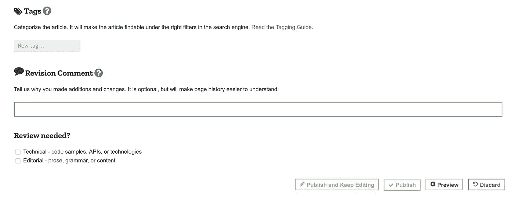
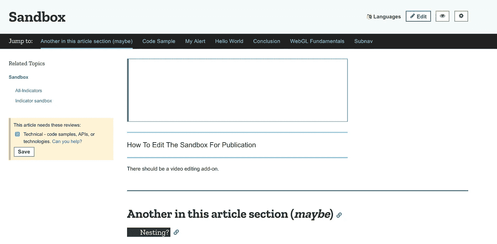
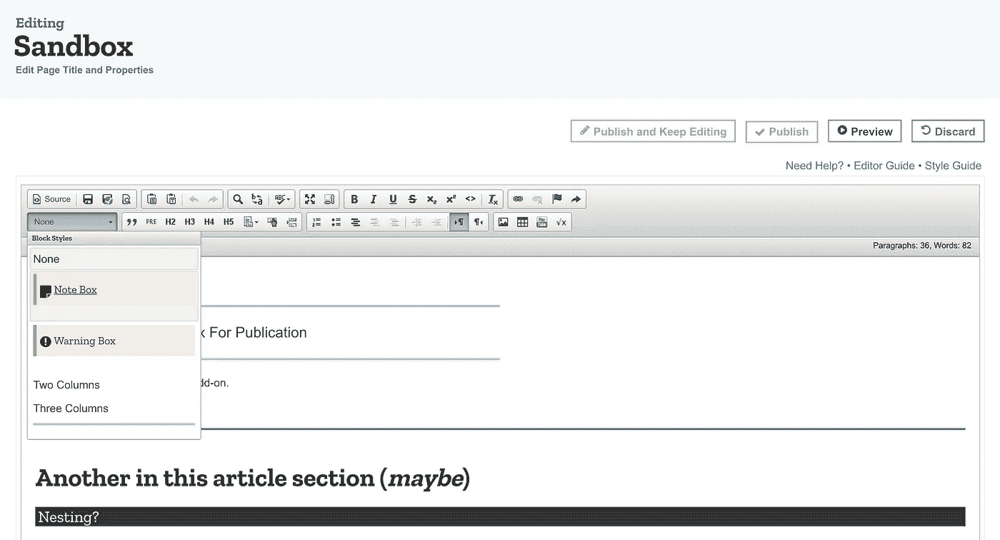

# 如何在 Javascript 世界获得关注

> 原文：<https://medium.com/hackernoon/how-to-get-noticed-in-the-javascript-world-aec7d382b005>

## MDN 文档入门

Firefox? [Source](https://unsplash.com/@rayhennessy?utm_source=medium&utm_medium=referral)

Mozillas Developer Network 拥有世界上最好的 Javascript 文档。我不知道的是，它是由社区驱动的，任何人都可以为此做出贡献。鉴于任何人都可以编辑东西，我很惊讶他们是如何保持文档如此纯净的。

我还不知道的是，作为一名开发者，这是建立信誉的最好地方。

是的，没错。你可以成为文档的一部分。

你可以让你的名字铭刻在互联网上。

下面是如何开始。

第一部分是知道你被允许并被鼓励做出贡献。我对此一无所知，我觉得这是最大的限制。人们不知道你可以这样做。

下一部分是贡献。MDN 官方指南是一个宝贵的资源。

 [## MDN 入门

### MDN 是一个 wiki，任何人都可以在其中添加和编辑内容。你不需要成为一名程序员或者了解很多关于…

developer.mozilla.org](https://developer.mozilla.org/en-US/docs/MDN/Getting_started) 

以下是要点:

## 1.不要害怕犯错误

你之后还有其他人要收拾。这个过程是这样的:你编辑一个页面。接下来，维护人员查看您的更改(它们很容易恢复)。

如果你对修改的准确性没有信心，你可以要求复审。这可以是技术或编辑评论(或两者兼有)。

技术评审检查技术方面——您的代码样本是否正确，您是否使用了正确的 API，等等。

编辑评论检查你的语法。

请求评论的地方在你正在编辑的页面的底部。

Found at the bottom

## 2.使用[沙盒](https://developer.mozilla.org/en-US/docs/Sandbox)

虽然你不必害怕犯错误，但请不要在一个活动页面上测试编辑器。这个沙箱的存在是为了帮助你弄清楚编辑器是如何工作的。

当你打开它时，它看起来可能会有所不同——因为越来越多的人尝试它。你可以随意摆弄这个页面。

## 3.跟随[风格指南](https://developer.mozilla.org/en-US/docs/MDN/Contribute/Guidelines/Writing_style_guide)

这可能是一个痛苦的经历。像您在团队中编写的所有代码一样，样式指南有助于保持可读性。像每一个风格指南一样，你不会一开始就知道每一条规则——你会学到基础知识，然后继续学习。

要坚持的最基本的规则是使用编辑器的预定义格式。它内置了风格指南。看到下面的*注释*和*警告*框了吗？

此外，还有一个[文档结构](https://developer.mozilla.org/en-US/docs/MDN/Contribute/Structures)。几乎所有的页面看起来都一样，因为它们遵循相同的结构。这为文档提供了巨大的力量:当寻找特定的内容时，您确切地知道应该查看页面的哪一部分。像风格指南一样，这个文档也很庞大。

 [## 文档结构

### 在整个 MDN 中，有各种重复使用的文档结构，以提供一致的表示…

developer.mozilla.org](https://developer.mozilla.org/en-US/docs/MDN/Contribute/Structures) 

同样，从小处着手，查看一些现有的文档，复制它们，并在你认为合适的时候进行编辑——你不必从头开始。

## 4.你能做的事情太多了！

*   [编写文档](https://developer.mozilla.org/en-US/docs/MDN/Getting_started#Option_1_I_like_words)(咄，这就是我们一直在谈论的)

然而还有更多。如果你不想写文档，你可以:

*   [将文档](https://developer.mozilla.org/en-US/docs/MDN/Getting_started#Option_4_I_want_MDN_in_my_language)翻译成您自己的语言
*   写代码——在维基平台[库马](https://developer.mozilla.org/en-US/docs/MDN/Kuma)上工作
*   [文件文档错误](https://developer.mozilla.org/en-US/docs/MDN/Getting_started#Option_5_I_found_some_wrong_information_but_I_don't_know_how_to_fix_it)

很快，你就会变成这样

这是我在上工作的一点[。就这样，我的名字永远留在了 Mozilla 的开发者维基贡献者中。](https://developer.mozilla.org/en-US/docs/Web/JavaScript/Reference/Classes#Field_declarations)

请随时寻求帮助，开始行动吧！

喜欢这个吗？👏不要再错过任何帖子了——订阅我的邮件列表吧！

