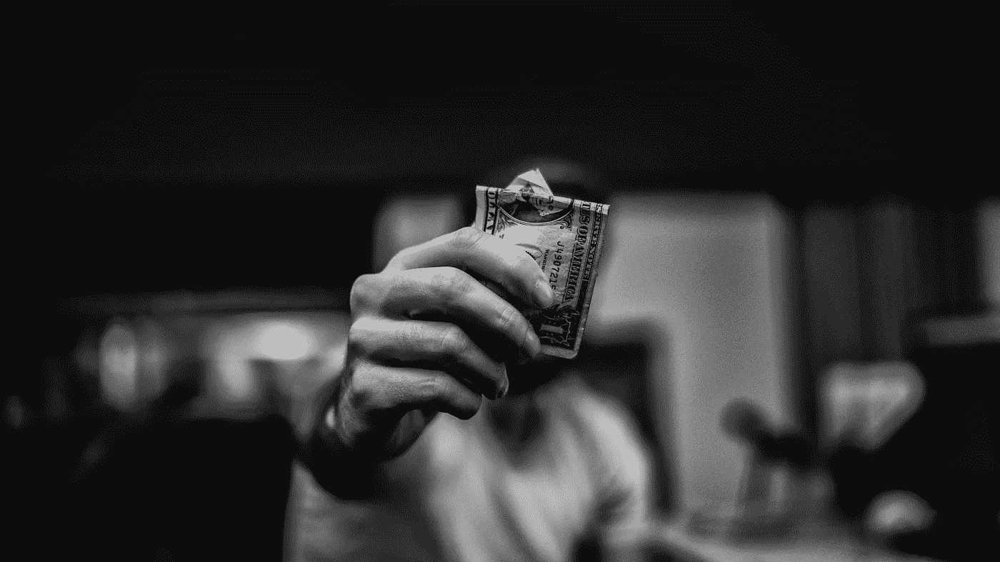
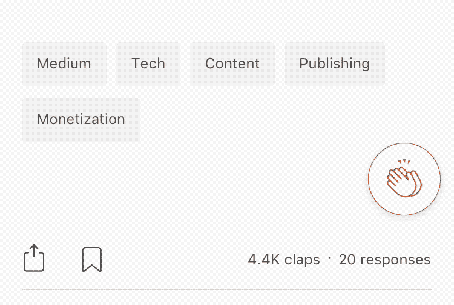

# 如何让潜在的加密投资者购买和 HODL(相信)你的加密货币？

> 原文：<https://medium.com/hackernoon/how-to-get-potential-crypto-investors-to-buy-and-hodl-believe-in-your-cryptocurrency-bc7bbbdb713>

Take my money and go !!

913 密码公司 2017 年做了一个 ICO！！那几乎是每天 3 个新硬币。

几乎 2000 plus 将在 2018 年进行一次 ICO，每天发行 7 枚硬币。

> 即每天 7 个潜在的加密投资机会！！

但问题是，一个典型的加密投资者的钱是有限的。

> **问题是如何从这有限的一袋钱中分得一杯羹？**

在与通过 ico 融资的首席执行官们交谈时，我还遇到了另一个特殊的问题。

*很多投资 ICO 的人* ***推动管理层合伙，来交易所或者发布可能推高价格的随机消息，他们可以迅速退出投资获利*** *。*

***这导致首席执行官/团队更关注上市而非产品！！***

> 当初始投资者理解建立高质量产品体验的重要性并给予反馈以增加产品价值时，ICO 作为一种融资方法是有帮助的。

所以现在问题变成了-

> 如何从相关的高质量加密投资者的钱袋中获得投资份额？

换句话说…

*如何将正确的密码投资者与正确的密码品牌相匹配？*

No of course the solution can’t be like Tinder !!

但这不就是今天投资者投资 ico 的方式吗？

**创始人关注的是登录页面设计，而不是用户教育、产品价值和现实生活影响/用例。投资者正在寻找任何形式的验证…因为视觉验证很容易，他们很乐意继续下去！！**

我们一直在思考和实验这个问题，想和大家分享我们的学习。

*在我们看来，密码行业的可见性和展示指标来吸引合适的投资者是行不通的。* ***优质投资者参与*** *将取代所有其他努力。*

# [Gimmer](https://gimmer.net/) 令牌案例研究

交易机器人 Gimmer 希望接触我们脸书团队的潜在 ICO 投资者[加密货币交易极客](https://www.facebook.com/groups/stature.network/)我们向他们建议了一种新的在线参与形式——***在线挑战形式***

**基本假设 1——人们喜欢挑战**

We verified our assumption and launched the challenge

**基本假设 2——如果假设 1 是正确的，你可以利用这一点在加密品牌及其潜在投资者之间建立积极的互动。**

> 我们在 24 小时内收到了 30 多份回复，我想与您分享前 3 名

## 获胜者——Rajat Awasthi

与使用自动交易机器人进行加密交易相比，手动加密交易有什么好处？

1.手动交易更好，因为它依赖于人的智能，可以理解动态事件的长期后果和短期后果，如国家禁止加密交易等，而自动化机器人将无法做到这一点，因为它依赖于具有有限机动空间的前缀算法。
2。自动机器人知道预先指定的问题的解决方案，但是在像我们这样的动态世界中，理解事件的后果对于成功的交易非常重要。
3。FUDs 尤其可以模拟真实的撞车场景，并且机器人无法理解。
4。手动交易也更好，因为它允许我们根据未来的预期做出决定，如空投或硬分叉。在这种情况下，从机器人程序的角度来看，加密资产目前可能利润较低，但结合空投或硬分叉好处，持有它可能更有意义。
5。关键是“对一个情况的整体理解”，这一点人类可以比机器人做得更好。
6。自动机器人交易更好，因为它在 24x7 监控资产方面胜过人类。人类不能因为加密而暂停他们的日常生活，这就是机器人可以帮助的地方。此外，机器人没有情感，不会像人类一样被 FOMO 迷惑或恐慌抛售。他们有临床精确性。
7。然而，还有另一个主要特点，使手动交易比自动交易更安全，更好，因为机器人是程序，程序可能有错误，它们可能会冻结或产生不利于它们的行为。在真金白银岌岌可危的情况下，交易者最好避免这种风险。

你对自动交易机器人有什么期望？*

我对自动交易机器人的愿望清单。在判断资产的盈利能力时，应考虑硬分叉和空投附加值。
2。如果有机会，它可以进行交叉外汇套利。
3。它应该相当“智能”，扫描主要的加密新闻关键词，并采取行动，通过应用程序上的警报来警告或提醒人类。
4。它应该提醒人类，以防它将要采取涉及交易或转让价值高于预定金额的行动。
5。它还应执行安全措施，如在发生任何可疑交易或转账时向人发出警报。
6。根据交易量的增长和价格的变化率，寻找可能的牛市或熊市，并相应地提醒人们。
7。应该有能力绕过各种交易所的“机器人检查机制”,或在无法单独成功避开时提醒人们。
8。快速反应时间。1 .手动交易更好，因为它依赖于人类智能，人类智能可以理解动态事件的长期后果以及短期后果，例如国家禁止加密交易等，而自动化机器人将无法做到这一点，因为它依赖于具有有限操纵空间的预定算法。

## 亚军——阿克谢·阿卢瓦利亚

**手动加密交易与使用自动交易机器人进行加密交易相比有什么优势？**

1.加密货币交易是许多人的被动收入来源。在手动交易中，很少有人有时间整天盯着价格图表，但是自动机器人/交易可以做这些多余但重要的活动，如价格监控和止损等。
2。自动化交易比人工交易更快更有效，因为机器人在某些情况下可以比人类做得更好，因为它们不像我们一样受情绪驱动。
一切取决于你设置参数的方式。
3。我们可以制定不同的策略，如布林线策略、价格行动策略、乒乓策略等，并确保这些策略一年 365 天、每天 24 小时都不会出错
4。自动化交易可以用来利用市场的低效率，如套利和赚钱。自动化交易也可以比人工交易获取更多的数据。如果这个策略适用于一大堆不同的货币对，你可能一次只能监控几个。有了自动化系统，你只需把它插入你想让它监控的任意数量的图表中，它就不会错过任何信号

你对自动交易机器人有什么期望？*

1.它应该是基于云的
2。它应该支持所有主要的加密货币交易所和替代货币
3。它应该提供真实市场的模拟和回溯测试交易策略，允许交易者测试他们的策略在不同的历史交易条件下如何工作。
4。它应该能够利用多种行业领先指标，如 StochRSI、MACD 直方图、PPO、回归斜率交叉等，并进行预测分析
5。它应该能够识别烛台模式
6。机器人应该根据市场情况调整你的订单。它应该有一个功能，交易者可以分享和讨论成功的交易策略。它应该有一个交易策略库，并根据风险偏好向用户推荐这些策略。它应该向我们更新所有可能影响加密货币的新闻，以及所有硬币的基本面分析
10。投资的资金应该是可获得的和流动的

## 亚军——姆里杜尔·卡迈勒

与使用自动交易机器人进行加密交易相比，手动加密交易的优势是什么？

有了手动加密交易，可以有更自然的交易风格，你的利润更多地在你的控制之下，更多地强调你的基本面，而不是技术。它还能让你从一个非常缓慢的交易中抽身出来，快速进入一个新的策略，实现利润最大化，而不是等到选定的硬币击中目标。它还最大限度地利用了人类的情感，并在新闻和媒体爆发时充分利用了这一点。成就感和坚持下去的动力是手工行业特有的体验。考虑到一个好的交易机器人成本很高，可能需要定期维护，手动交易也很便宜。当谈到汽车交易机器人时，不带感情的游戏和节省时间是最大的收获。机器人总是读取数据并坚持计划，这在大多数情况下会导致更少的损失。它还可以同时进行各种交易选择。事实上，它需要很少的用户干预，这使得它为交易者节省了大量的时间。与人类不同，交易机器人有能力同时跟踪大多数硬币，并同时执行每笔交易的策略，不会错过任何机会。通过正确的算法，它可以带来持续的高收益，并避免巨额亏损。手动和自动交易机器人之间的正确平衡，很难去损失。毕竟，任何人都可以在一天内获得巨额利润，但是减少损失的能力使一个人成为更好的交易者。

**你对自动化交易机器人有什么期待？***

除了基本的自动交易机器人设施，我希望看到以下功能:
干净整洁的界面，直观的导航(也可能是投资组合的详细信息)，保证金交易选项和套利选项，硬币信息和图表统计(可能会或可能不会与领先的网站做同样的事情)，交易的技术统计，策略和回溯测试的虚拟模拟，自动取款到钱包，API 支持，电话/电子邮件交易的即时警报，交易历史数据库导出到 excel 表， 交易信息的隐私和安全，交易实施新策略的可下载文件，影子交易主要交易者，基于社区的建议。 我不支持泵和转储的想法，但如果机器人可以拥有自己的通信网络，用户肯定可以从计划中的机器人 P & D 中受益。

#为努力工作鼓掌:)前 5 名的答案也作为帖子分享给了小组中的每个人。这也有助于其他没有参与的人了解更多关于汽车交易机器人的信息，并决定他们是否要在这方面投入时间和金钱。

这里要注意的有趣的事情是—

1.  我们能够使用参与的挑战模型将参与和概念研究游戏化
2.  我们能够围绕人工交易和自动交易对人们产生一般的看法(这些数据可以用来设计所有的营销和沟通活动)
3.  我们能够从一个自动交易机器人(可以用来计划更新功能的数据)中产生加密投资者的期望

这是我们继续与社区成员一起做的许多实验中的第一个，以帮助他们更好地与他们喜欢的加密品牌联系起来。

如果您想与我们的社区成员一起参与在线挑战，请联系我们 CryptoTradeTalks@gmail.com

查看我们的离线聚会系列[秘密交易会谈](https://www.facebook.com/CryptoTradeTalks/)。这些会议的主要目的是让感兴趣的加密投资者聚集在一起，鼓励他们分享学习，策略，技巧等。我们做的最后一个活动叫做[业余交易者抓捕](https://www.eventbrite.com/e/amateur-trader-takedown-a-battle-of-insightful-crypto-investors-tickets-43285665591#)，这是 7 个有洞察力的加密投资者的战斗。

请查看我们的学习，同时[在 crypto](https://hackernoon.com/building-and-engaging-a-crypto-community-a-playbook-with-example-9e30695e8ae6) 上建立一个参与式数字社区(目前有超过 10，000 名成员，并且还在增长)

喜欢这个故事？？请为我们鼓掌以示感谢

