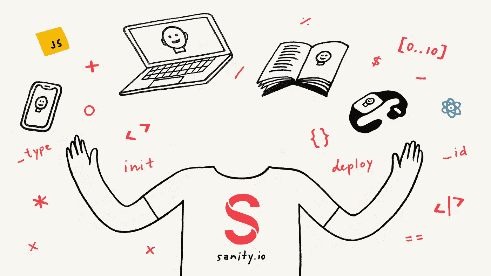

# 如何作为一个无头 CMS 开始理智

> 原文：<https://medium.com/hackernoon/how-to-get-started-with-sanity-as-a-headless-cms-b755a9de1770>



*当你想开始使用 JAMstack，或者你的项目只需要 API 时，Sanity 是一个完美的伴侣。在本教程中，您将学习如何开始使用 Sanity——从用*[*JavaScript*](https://hackernoon.com/tagged/javascript)*配置* [*React*](https://hackernoon.com/tagged/react) *编辑器，到查询 API 和迁移内容数据集。*

如果你发现自己需要一些后端，理智很可能是最快的开始方式之一，而不会在以后惩罚你。为你的周末项目策划一个新的健全项目。那时你需要一个 API 来快速测试一些东西。或者你可以用它来做更严肃的事情。例如，当您需要在遗留系统和您喜欢使用的技术之间建立一个通道时。当你需要人类控制数字内容时，Sanity 有一个开源编辑器，你可以用简单的 JavaScript 进行配置，用 React 进行定制，并在任何你想要的地方托管——无论是在 [Netlify](https://netify.com/) 、现在的[还是在 Sanity 的云上。](https://zeit.co/now)

这是我工作过的最好的、经过深思熟虑的内容后端之一，这就是为什么我现在为理智而工作——并且热爱它的每一天。

*Watch the video “Getting Started with Sanity”*

你可以创建尽可能多的自由健全项目，并在开发人员层完成大量工作，而且[定价](https://www.sanity.io/pricing)是透明和灵活的。

你应该在几分钟内启动并运行——只需使用你的 Google 或 GitHub 登录，接受[服务条款](https://www.sanity.io/legal/tos)，就可以了。从安装 Sanity CLI 开始，并启动一个新项目:

`npm i -g @sanity/cli && sanity init`

`sanity init`命令的指令将带您创建一个项目并在本地下载 Sanity Studio。如果您在项目文件夹中运行【the CLI 将打开一个带有热模块重载的本地服务器，这样您就可以配置它，而不必手动刷新浏览器。工作室总是连接到托管的实时后端，这意味着，一旦您开始在其中处理内容，该内容也将在 API 中可用和可查询。换句话说，在你的编辑可以开始处理内容的地方，你可以很快得到一个项目，你可以在你的项目中获取和使用这些内容。

第一次尝试一些预配置的模板可能会很有用，但是为了向您展示使用模式配置 Studio [是多么容易，让我向您展示一个带有标题字段的简单帖子条目的代码:](https://www.sanity.io/docs/content-studio/the-schema)

```
export default {
  name: 'post',
  title: 'Post',
  type: 'document',
  fields: [
    {
      name: 'title',
      title: 'Title',
      type: 'string'
    }
  ]
}
```

工作室现在看起来像这样:


如果你不在乎工作室，那完全没问题。您可以轻松地使用 Sanity 的补丁 API 来创建和编辑文档。要创建一个可查询的文档，只需要一个[写令牌](https://www.sanity.io/docs/http-auth)，一个`_type`键，并且对于不同的数据类型有一些约定，你将很快学会。使用 [JavaScript 客户端](https://www.sanity.io/docs/client-libraries/js-client)，您可以创建这样一个文档:

```
import sanityClient from '@sanity/cli'
const client = **sanityClient**({
  projectId: '<projectId>',
  dataset: '<datasetName>',
  token: '<tokenWithWritePermissions>'
}) client.**create**({ _type: "post", title: "Hello World" }).**then**(console.log)> { _createdAt: '2018-11-10T20:06:56Z',
_id: 'wK0NtpsoCZRvwU3EDtEub2',
_rev: 'wK0NtpsoCZRvwU3EDtEuYI',
_type: 'test',
_updatedAt: '2018-11-10T20:06:56Z',
title: 'hello world' }
```

如果您想要更改(或添加另一个)值:

```
client.**patch**('wK0NtpsoCZRvwU3EDtEub2').set({ title: 'Hello Worlds!'}).**then**(console.log)> { _createdAt: '2018-11-10T20:06:56Z',
_id: 'wK0NtpsoCZRvwU3EDtEub2',
_rev: 'FUGFhuJJo756q4bO12e29f',
_type: 'test',
_updatedAt: '2018-11-10T20:10:31Z',
title: 'Hello Worlds!' }
```

您可以使用 Sanity CLI 并使用 sanity documents 创建一个新文档，在您喜欢的文本编辑器中创建和写入数据。

Example of ”*sanity documents create”*

# 用 GROQ 查询数据

现在您有了一个文档，您可以使用 GROQ(面向图形的查询语言)通过 API 查询它。它是一种声明性语言，旨在查询大量无模式 JSON 文档的集合。它的主要设计目标是表达性过滤，将几个文档合并成一个响应，并调整响应以适应客户端应用程序。为了进行试验，当您在项目文件夹中时，也可以在 CLI 中这样做，如下所示:

```
sanity documents query "*[_type == 'post']"
```

当您想从前端查询内容时，可以使用其中一个客户端库。有 [PHP](https://packagist.org/packages/sanity/sanity-php) 、[的库。NET](https://github.com/oslofjord/sanity-linq) 和 [JavaScript](https://www.npmjs.com/package/@sanity/client) ，使用后一种，您获取的文档如下:

```
client.fetch("*[_type == 'post']").then(documents => console.log(documents))
```

你也可以把这个输入到你的浏览器中，在那里查看数据，或者使用任何可以发送 HTTPS 请求的东西:`https://<yourProjectId>.api.sanity.io/v1/data/query=*[_type == "post"]`

使用 GROQ 你还可以做一些叫做 [*的投影*](https://www.sanity.io/docs/groq/groq-pipeline-components) 的事情，在这里你可以对你的数据如何被格式化有很多控制。它是通过在过滤器后插入花括号`{}`来使用的，在这里你可以选择你想要的字段。例如，如果我们希望我们的帖子只包含“标题”字段，我们可以这样做:

```
sanity documents query "*[_type == 'post']{_id, title}"
```

# 迁移您的内容很容易

托管内容后端的全部意义在于，对你来说，迁移、复制和移动你的数据应该很简单。特别是如果您想在生产中使用它，您应该有一种简单的方法将内容复制到您可以测试和实验的环境中。明智地说，使用 CLI 将您所有的内容和资产导出到一个整洁的 [ndjson 文件](http://ndjson.org/)(以及一个包含您所有资产的文件夹)中是非常简单的:

```
sanity dataset export <datasetName>
```

反之亦然:

```
sanity dataset import datasetExport.ndjson
```

您甚至可以使用导出 API 获得所有内容的即时 ndjson 转储(这是🚀太快了！):`https://<yourProjectId>.api.sanity.io/v1/data/export/<datasetName>`

# 后续步骤…

你现在应该对理智可以做的事情有了基本的了解。还有更多的东西有待发现，但好的一面是，随着你的需求和抱负的增长，你可以一步一步地去做。你可能想了解更多关于如何[根据客户需求](https://www.sanity.io/docs/content-studio/structure-builder)完全定制你的工作室，或者[利用丰富的图像元数据](https://css-tricks.com/five-interesting-ways-to-use-sanity-io-for-image-art-direction/)，或者钻研一些高级的[修补和突变技术](https://www.sanity.io/docs/http-api/http-patches)。还可以查看 [React Native](https://github.com/sanity-io/example-app-react-native) 、 [Vue](https://github.com/sanity-io/example-frontend-vue-js) 、 [Next.js](https://github.com/sanity-io/example-frontend-next-js) 和 [Nuxt](https://github.com/sanity-io/example-ecommerce-snipcart-vue) 中的前端示例。

无论你选择用理智来做什么，也有一个[社区](https://slack.sanity.io/)乐于听到它，并在你遇到障碍时提供帮助。

*原载于*[*www . sanity . io*](https://www.sanity.io/blog/getting-started-with-sanity-as-a-headless-cms)*。*