# 如何开始使用 React 上下文 API

> 原文：<https://medium.com/hackernoon/how-to-get-started-with-the-react-context-api-ccc41728fa59>

## 使用 React 上下文 API 来更改应用程序中的主题！


Photo by [John Michael Thomson](https://unsplash.com/photos/9m1V6A8Fm-A?utm_source=unsplash&utm_medium=referral&utm_content=creditCopyText) on [Unsplash](https://unsplash.com/search/photos/context?utm_source=unsplash&utm_medium=referral&utm_content=creditCopyText)

## 不过先来点**语境**！🤣

好吧，把糟糕的双关语放在一边，让我们来看看 React Context API 是做什么的。有一个来自 [React docs](https://reactjs.org/docs/context.html) 的很棒的俏皮话…

> *上下文提供了一种通过组件树传递数据的方法，而不必在每一层手工传递属性。*

或者换句话说，你可以使用 React 上下文 API 来避免[道具钻](https://blog.kentcdodds.com/prop-drilling-bb62e02cb691)。如果你需要关于这个概念的更多细节，请查看提供的链接。

我之前在我的 Gatsby 博客中介绍过 React Context API 的实现，我在做的时候做了记录。你可以看到[这里是如何进行的](https://blog.scottspence.me/react-context-api-with-gatsby)。

*可以从*[*@ leighchalliday*](https://twitter.com/leighchalliday)*中找到一个解释 API 的很好的资源，其中有一个关于这个主题的很好的用例* *。*

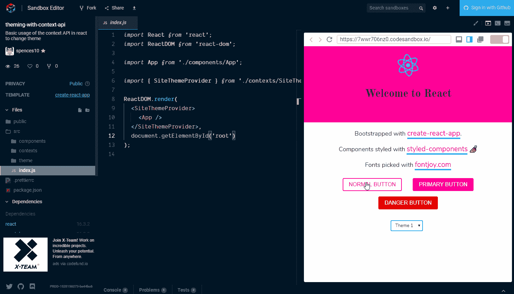

## 我们正在做的事情…

在这篇文章中，我们将扩展我们为[styled-components getting started](/styled-components/styled-components-getting-started-c9818acbcbbd)创建的例子。因为它有大部分代码，我们需要从 React 上下文 API 开始。

我们将扩展该示例来管理示例应用程序的主题状态。

所以总而言之:

*   搭建基础 CreateReact 应用程序
*   使用样式组件💅用于造型
*   使用 React 上下文 API 添加主题进行切换
*   使用 React 上下文 API！

## 我们需要的是…

我们需要的只是一个互联网连接和一个现代化的网络浏览器！因为我们将在棒极了的[代码沙箱](https://codesandbox.io)中在线完成所有这些！

无论你有没有 GitHub 账户，CodeSandbox 都会让你直接开始[编码](https://codesandbox.io/s/new)。

## 版本:

**本指南正与以下依赖版本一起使用。**

*   反应:16.4.2
*   反应范围:16.4.2
*   反应脚本:1.1.4
*   样式组件:3.4.5

# 我们开始吧

所以让我们再一次回顾一下基本的创建-反应-应用程序的主题。这一次，我们将使用 React 上下文 API 来管理状态，而不是将状态添加到组件中。有人会说这对于主题切换来说有点大材小用了。React 文档中给出了一个[何时使用上下文 API](https://reactjs.org/docs/context.html#when-to-use-context) 的例子，所以我将让您决定这一点的有效性。

对于这个例子，我希望它能让您更清楚地了解如何在应用程序中使用上下文 API。

## **依赖关系**

[打开一个 React CodeSandbox](https://codesandbox.io/s/new) 并添加`styled-components`作为依赖项:

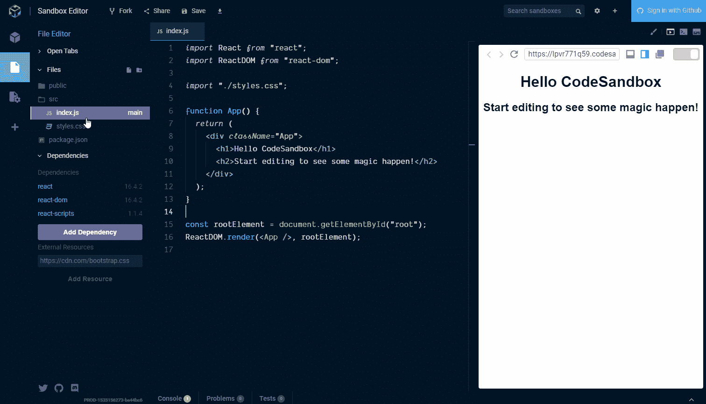

## **文件结构**

[bikeshedding](https://en.wiktionary.org/wiki/bikeshedding) 的另一个领域是文件结构。在这个场景中，我们为`components`、`contexts`和`theme`添加文件夹。请随意组织你认为合适的文件，这就是我们在❤️这个例子中要做的

将目录添加到`src`文件夹中，这样我们就可以添加一些组件了。文件结构应该如下所示:

```
context-demo/
├─ public/
├─ src/
│  └─ components/
│  └─ contexts/
│  └─ theme/
└─ package.json
```

## 搭建一个基本的 Create React 应用程序

好了，我们要做的是将一个`App.js`组件添加到`components`文件夹中，然后在`src/index.js`文件中使用它。

`App.js`组件可以是一个[无状态功能组件](https://reactjs.org/docs/state-and-lifecycle.html#the-data-flows-down)，因为我们将使用上下文 API 处理状态。

在这里你可以看到我创建目录和添加`App.js`组件时的粗略输入。

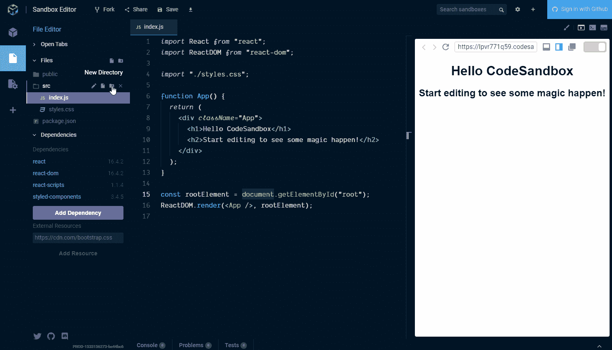

然后我们可以删除`style.css`文件和`src/index.js.`中的引用，我们将使用样式化组件进行样式化💅然后使用我们的`App.js`组件:

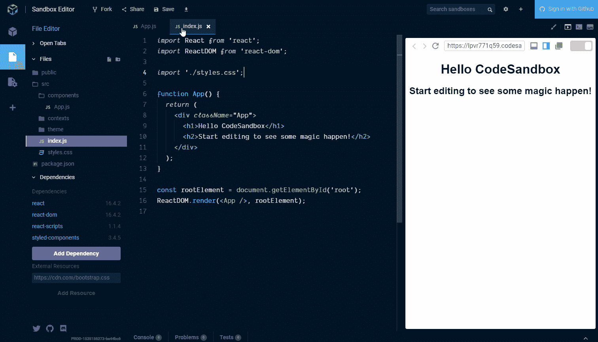

好的，我将`App.js`组件从`src/index.js`文件中抽象出来的原因是，当我们使用上下文 API 时，我们可以将其添加到应用程序的最高级别，即`src/index.js`。

## 其余的呢？

所以这不是真正的 Create React 应用程序，因为我们使用的是 CodeSandbox。我已经检查了在[样式化组件入门](/styled-components/styled-components-getting-started-c9818acbcbbd)帖子中使用的基本样式。是时候参考它来模仿我们需要的风格了。

这意味着，我们将重用组件，而不是深入研究构成基本 Create React 应用程序外观的每个组件的样式。现在将涉及到一些复制粘贴。

Create React App 样板代码有一个文件，我们在[styled-components getting started](/styled-components/styled-components-getting-started-c9818acbcbbd)帖子中对其进行了样式化处理，这个文件就是`App.js`文件。`App.js`的基本风格是:

`**App.css**`

```
.App {
  text-align: center;
}.App-logo {
  animation: App-logo-spin infinite 20s linear;
  height: 80px;
}.App-header {
  background-color: #222;
  height: 150px;
  padding: 20px;
  color: white;
}.App-title {
  font-size: 1.5em;
}.App-intro {
  font-size: large;
}@keyframes App-logo-spin {
  from {
    transform: rotate(0deg);
  }
  to {
    transform: rotate(360deg);
  }
}
```

## 使用样式化组件进行样式化

现在我们将从带有样式化组件的`App.css`文件中重新创建样式。让我们在这里列出它们，并逐一查看:

```
AppWrapper
AppHeader
AppTitle
rotate360
AppLogo
# *We’re adding our own styles for* AppIntro
Underline
StyledHyperLink
Button
```

`AppWrapper`是顶级包装器，在一个更大的组件中，可以用于 CSS 网格或 Flexbox 的布局。在我们的例子中，我们将文本居中对齐。

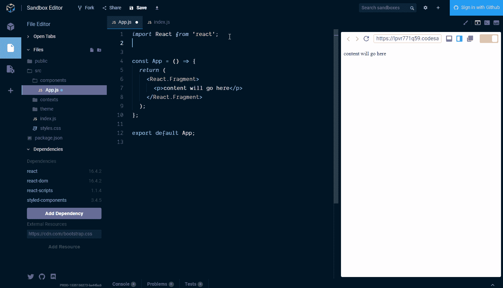

够直接了吧。现在，剩下的大部分组件将使用样式化组件`[ThemeProvider](https://www.styled-components.com/docs/advanced#theming)`，这就是我们要从上下文 API 传递主题的内容。

## 使用 React 上下文 API 添加主题进行切换

好了，我们需要定义一些主题来传递给`ThemeProvider`。我们将定义我们想要更改的几个主题方面，它们是:

```
primary // *colour* secondary // *colour* danger // *colour* fontHeader // *font* fontBody // *font*
```

在`theme`目录中创建一个包含主题对象的文件，并将其命名为`globalStyle.js`。添加以下内容:

```
*import* { injectGlobal } *from* 'styled-components'exportconst *themes* ={
  *theme1*:{
    *primary*:'#ff0198',
    *secondary*:'#01c1d6',
    *danger*:'#e50000',
    *fontHeader*:'Old Standard TT, sans, sans-serif',
    *fontBody*:'Nunito, sans-serif'
  },
  *theme2*:{
    *primary*:'#6e27c5',
    *secondary*:'#ffb617',
    *danger*:'#ff1919',
    *fontHeader*:'Enriqueta, sans-serif',
    *fontBody*:'Exo 2, sans, sans-serif'
  },
  *theme3*:{
    *primary*:'#f16623',
    *secondary*:'#2e2e86',
    *danger*:'#cc0000',
    *fontHeader*:'Kaushan Script, sans, sans-serif',
    *fontBody*:'Headland One, sans-serif'
  }
}injectGlobal`
  @import url('https://fonts.googleapis.com/css?family=Old+Standard+TT:400,700|Nunito:400,700'|Enriqueta:400,700|Exo+2:400,700|Kaushan+Script:400,700|Headland+One:400,700|'); body {
    padding: 0;
    margin: 0;
  }
`
```

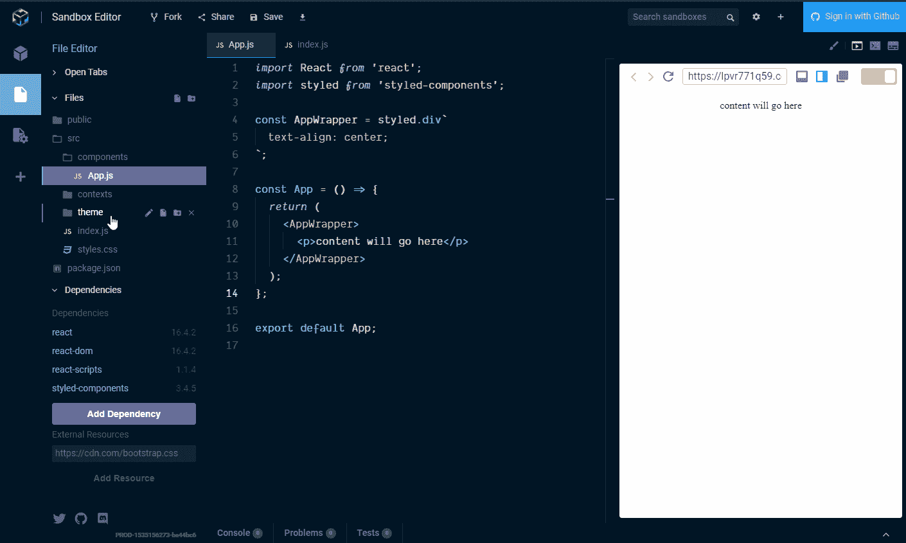

好了，除了设置供以后使用的样式之外，这里什么也没有发生。

你会注意到这里使用了`injectGlobal`。这是我们为整个应用程序设置字体的地方。`ingectGlobal` [应该在一个 app 中使用一次](https://stackoverflow.com/a/42899789/1138354)这样设置全局样式。

向前！现在让我们把重点放在将基本的应用程序风格放入`App.js`组件中。我们现在可以开始使用`App.js`中的`ThemeProvider`。为此，现在，为了获得一些视觉反馈，我们将应用来自`globalStyle.js`中`themes`对象的一个主题。这是如此，因为我们正在添加组件，我们可以看到应用的主题。

我们现在可以用`AppHeader`来做这件事，它是一个样式化的 div:

```
const *AppHeader* =styled*.div*`
  *height: 12rem;
  padding: 1rem;
  color:* ${({ *theme* })=>theme*.dark*}*;
  background-color:* ${({ *theme* })=>theme*.primary*}*;* `
```

你会注意到这里我们开始使用样式组件，`theme`道具。如果我们现在粘贴这段代码，在`ThemeProvider`被传递给`theme`对象之前不会有任何变化。我们将使用`ThemeProvider`组件包装`App.js`，这样由`ThemeProvider`封装的任何组件都能够接收`theme`道具。

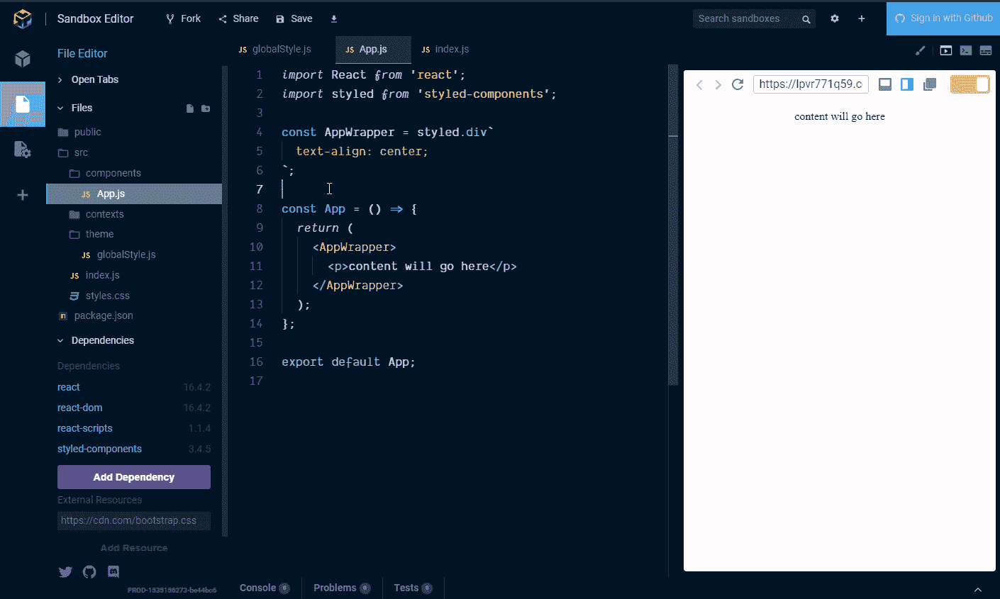

`AppTitle`即将成为 h1 所以:

```
const *AppTitle* =styled*.h1*`
  *font-family:* ${({ *theme* })=>theme*.fontHeader*}*;* `
```

对于旋转的 React 徽标，我们可以使用之前在[样式化组件入门示例](https://codesandbox.io/s/x26q7l9vyq)中使用的资源。我们可以将它添加到`App.js`组件顶部的导入中，并将其作为`img`标签添加到`AppLogo`样式的组件中:

```
const *logo* = 'https://user-images.githubusercontent.com/234708/37256552-32635a02-2554-11e8-8fe3-8ab5bd969d8e.png'
```

为了 React 徽标上的动画，需要在`ThemeProvider`旁边导入`keyframes`辅助对象。

```
const *rotate360* =keyframes`
  *from {
    transform: rotate(0deg);
  }
  to {
    transform: rotate(360deg);
  }* `const *AppLogo* =styled*.img*`
  *animation:* ${rotate360} *infinite 5s linear;
  height: 80px;
  &:hover {
    animation:* ${rotate360} *infinite 1s linear;
  }* `
```

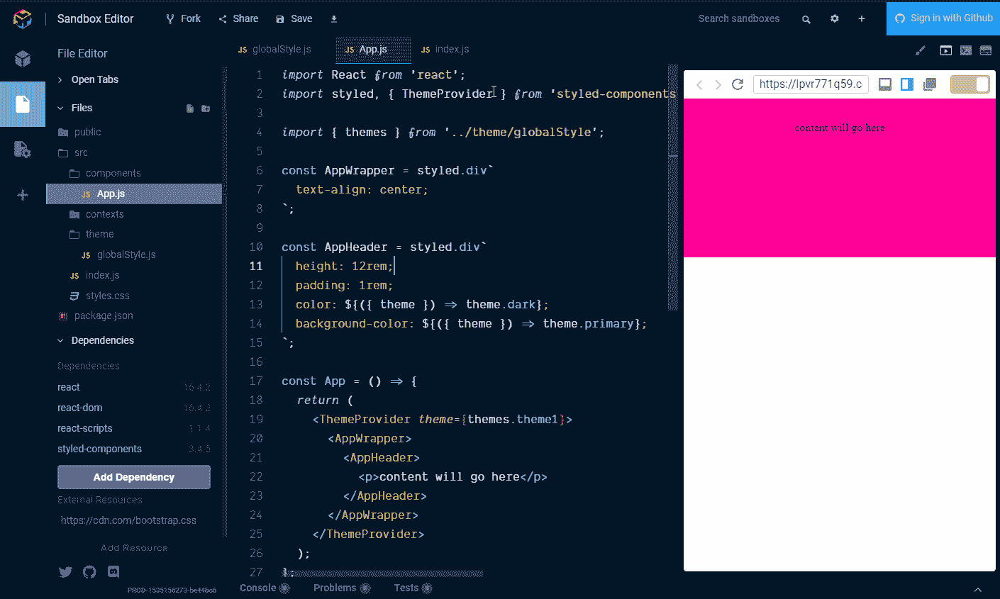

## 共享组件

共享组件包含在[风格化组件入门](https://blog.scottspence.me/styled-components-getting-started)指南中。如果您需要更多信息，在本例中，我们将引入最后几个组件作为`StyledHyperlink`和`Button`的共享组件。在`src/Shared.js`增加以下内容:

`**src/Shared.js**`

```
*import* styled, { css } *from* ‘styled-components’
  exportconst *Button* =styled*.button*`
  *padding: 0.5rem 1rem;
  margin: 0.5rem 1rem;
  color:* ${({ *theme* })=>theme*.primary*}*;
  font-size: 1rem;
  box-shadow: 0 3px 5px rgba(0, 0, 0, 0.1);
  cursor: pointer;
  border: 2px solid* ${*props* =>props*.border*}*;
  background-color: Transparent;
  text-transform: uppercase;
  border-radius: 4px;
  transition: all 0.1s;
  &:hover {
    transform: translateY(1px);
    box-shadow: 0 2px 3px rgba(0, 0, 0, 0.15);
  }* ${*props* =>
    props*.primary* &&
    css`
      *background:* ${({ *theme* })=>theme*.primary*}*;
      border: 2px solid* ${({ *theme* })=>theme*.primary*}*;
      color: white;* `}*;* ${*props* =>
    props*.danger* &&
    css`
      *background:* ${({ *theme* })=>theme*.danger*}*;
      border: 2px solid* ${({ *theme* })=>theme*.danger*}*;
      color: white;* `}*;
  &:hover {
    transform: translateY(2px);
    box-shadow: 0 2px 3px rgba(0, 0, 0, 0.15);
  }* `exportconst *StyledHyperLink* =styled*.a*`
  *cursor: pointer;
  &:visited,
  &:active {
    color:* ${({ *theme* })=>theme*.primary*}*;
  }
  &:hover {
    color:* ${({ *theme* })=>theme*.secondary*}*;
  }
  color:* ${({ *theme* })=>theme*.primary*}*;* `
```

然后像导入其他组件一样导入组件:


现在最后三个组件，`AppIntro`、`Underline`和`StyledHyperLink`:

```
const *AppIntro* =styled*.p*`
  *color:* ${({ *theme* })=>theme*.dark*}*;
  font-size: large;
  code {
    font-size: 1.3rem;
  }
  font-family:* ${({ *theme* })=>theme*.fontBody*}*;* `const *Underline* =styled*.span*`
  *border-bottom: 4px solid* ${({ *theme* })=>theme*.secondary*}*;* `const *StyledHyperLink* = *SHL.extend*`
  *text-decoration: none;
  font-family:* ${({ *theme* })=>theme*.fontBody*}*;
  color:* ${({ *theme* })=>theme*.fontDark*}*;* `
```


将它们添加到`AppLogo`样式的组件下。然后我们可以将剩下的组件添加到`App`函数`return`中，那么，准备好进行另一次复制粘贴了吗？这里:

```
<AppIntro>
  Bootstrapped with{' '}
  <Underline>
    <code>
      <StyledHyperLink
        *href*={`https://github.com/facebook/create-react-app`}
        *target*="_blank"
        *rel*="noopener"
      >
        create-react-app
      </StyledHyperLink>
    </code>
  </Underline>.
</AppIntro>
<AppIntro>
  Components styled with{' '}
  <Underline>
    <code>
      <StyledHyperLink
        *href*={`https://www.styled-components.com`}
        *target*="_blank"
        *rel*="noopener"
      >
        styled-components
      </StyledHyperLink>
    </code>
  </Underline>{' '}
  <span *role*="img" *aria-label*="nail polish">
    💅  
  </span>
</AppIntro>
<AppIntro>
  Fonts picked with{' '}
  <Underline>
    <code>
      <StyledHyperLink
        *href*={`https://fontjoy.com/`}
        *target*="_blank"
        *rel*="noopener"
      >
        fontjoy.com
      </StyledHyperLink>
    </code>
  </Underline>
</AppIntro>
<Button>Normal Button</Button>
<Button *primary*>Primary Button</Button>
<Button *danger*>Danger Button</Button>
```

抱歉代码墙！将它粘贴到结束的`</AppHeader>`标签下，这样我们就有了主题的基础了！

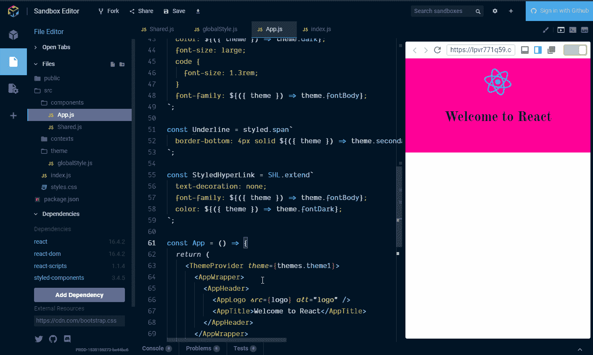

好吗？看起来怎么样？

现在我们有了一个使用样式化组件的基本 React 应用程序！

# 使用 React 上下文 API

现在是重头戏！在这里，我们将讨论:

*   制作主题背景。
*   对组件使用上下文 API。
*   在多个组件中使用上下文 API。

因此，通过组件传递不必要的状态是我们可以使用上下文 API 来避免的。如果我们看一下[样式组件入门示例](https://codesandbox.io/s/x26q7l9vyq)，我们可以看到在`App.js`组件中管理的状态。

`handleThemeChange`函数必须传递给`ThemeSelect`组件，就像任何道具都需要传递一样。这是一个简化的例子。很容易想象，如果这个组件存在于一个页脚组件或一个菜单项上，那么会有几个其他组件需要通过它们传递状态，而这些组件实际上并不需要该状态或属性。有道理吗？

## **示例**

```
<App>                {/* *state begins here* */}
  <Header>           {/* *through here* */}
    <Navigation>     {/* *and here* */}
      <ThemeSelect>  {/* *to be used here* */}
    </Navigation>
  </Header>
  <Footer/>
</App>
```

## 添加网站主题上下文

在我们的`src/contexts/`目录中，我们将让我们的`SiteThemeContext.js`导入做出反应，并定义和导出我们的上下文:

```
*import* React *from* 'react'exportconst *SiteThemeContext* =React*.*createContext()
```

## 那么什么是语境呢？

上下文由两部分组成，提供者和消费者。您有一个提供者，它将在组件树中尽可能高的位置，以便多个消费者可以从提供者那里获得状态和属性。

希望您还记得我们从`src/index.js`文件中抽象出`function App`组件的时候。这样我们就可以在应用程序的最高级别添加上下文提供者，在`src/index.js`文件中。这意味着应用程序中的任何消费者，无论组件树有多深，都可以从顶层获得状态和道具。

现在创建一个提供者，这个提供者是一个常规的 React 组件，所以:

```
*import* React *from* 'react'exportconst *SiteThemeContext* =React*.*createContext()export class SiteThemeProvider *extends* React*.*Component { render() {
    *return* (
      <SiteThemeContext.Provider *value*={}>
        {this*.props.*children}
      </SiteThemeContext.Provider>
    )
  }
}
```

由`<SiteThemeProvider>`返回的是`<SiteThemeContext.Provider>`和该组件的子组件。你必须提供给提供商的一个道具是`value`道具。这是消费者可以访问的变量。消费者是`<SiteThemeContext.Consumer>`(稍后将详细介绍)。

所以我们现在能做的是让传入`value`的东西成为一个对象`value={{}}`，这样它就能存储在`SiteThemeContt`中定义的状态和函数的多个属性。

上下文的状态需要是`theme`。我们需要从`src/theme/globalStyle`导入主题，并将其添加到状态中。我们将默认主题(和状态)为`theme1`，并通过扩展到状态[`…`❤️].]将它的副本添加到`value`道具中它应该是这样的:

```
*import* React *from* 'react'
*import* PropTypes *from* 'prop-types'*import* { themes } *from* '../theme/globalStyle'exportconst *SiteThemeContext* =React*.*createContext() export class SiteThemeProvider *extends* React*.*Component {
  state = {
    theme: themes['theme1']
  }

  render() {
    *return* (
      <SiteThemeContext.Provider
        *value*={{
          ...this*.*state
        }}>
        {this*.props.*children}
      </SiteThemeContext.Provider>
    )
  }
}
```

好了，已经有一段时间没有加 gif 了，是时候再加一张了！

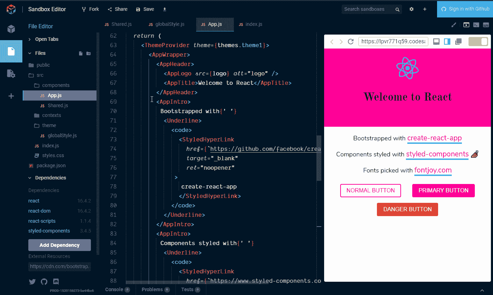

并引入`themes`并添加状态:

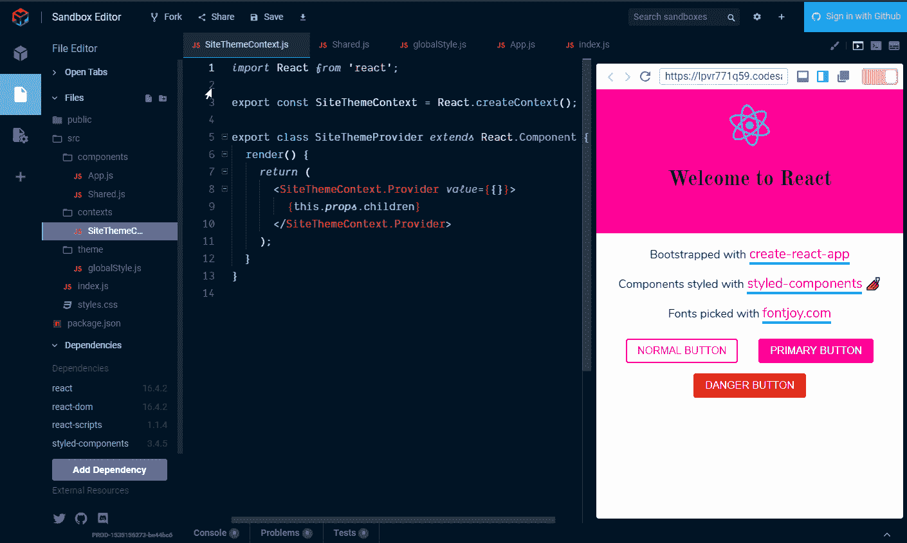

现在，我们可以向提供者添加一个函数，根据通过`handleThemeChange`事件值选择的内容来更改主题状态:

```
handleThemeChange = e => {
  const *key* =e*.target.value* const *theme* =themes[key]
  this*.*setState({ theme })
}
```

任何想要使用它的提供者都可以使用它。我们需要将它添加到`value`道具中，就像这样:

```
*import* React *from* 'react'
*import* PropTypes *from* 'prop-types'*import* { themes } *from* '../theme/globalStyle'exportconst *SiteThemeContext* =React*.*createContext()export class SiteThemeProvider *extends* React*.*Component {
  state = {
    theme: themes['theme1']
  } handleThemeChange = e => {
    const *key* =e*.target.value* const *theme* =themes[key]
    this*.*setState({ theme })
  } render() {
    *return* (
      <SiteThemeContext.Provider
        *value*={{
          ...this*.*state,
          handleThemeChange: this*.*handleThemeChange
        }}>
        {this*.props.*children}
      </SiteThemeContext.Provider>
    )
  }
}
```

好了，这就是站点主题上下文组件，非常简单，对吗？

我应该提到的是，`handleThemeChange`函数中的`e`将是我们将要制作的主题选择框中的事件。

让我们完成添加函数并将其添加到状态中:

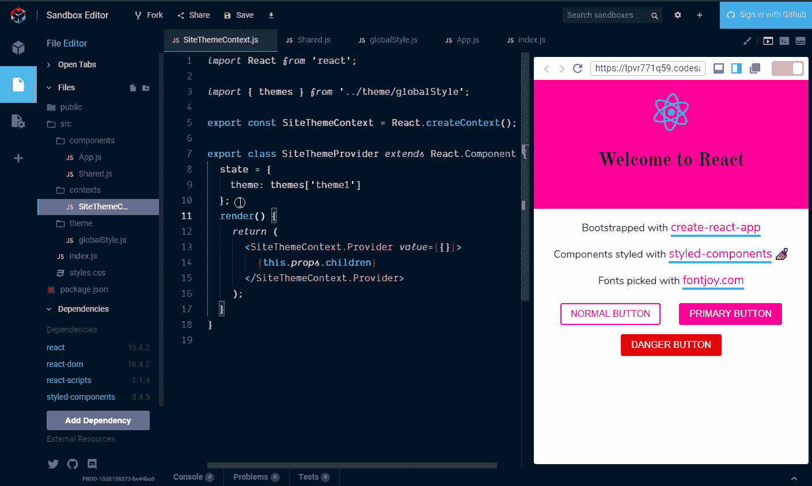

现在我们可以将主题提供者添加到`src/index.js`中，这样依赖关系树中更低的任何东西都可以通过消费者访问它。

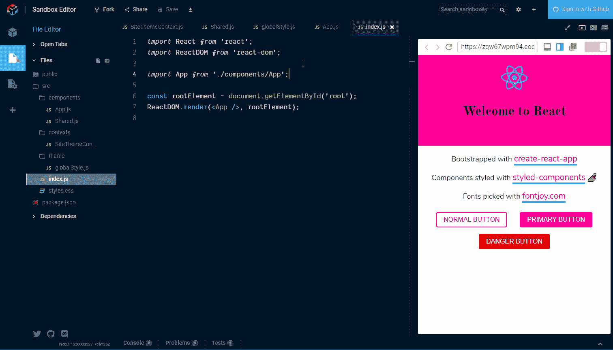

## 添加主题选择

现在我们想要通过`SiteThemeContext`调用`SiteThemeProvider`的一部分`handleThemeChange`函数。我相信现在这一切都很有意义(🤣)所以让我们直接进入这里，定义我们将用来使用一个`ThemeSelect`组件消费`SiteThemeContext.Provider`的组件！

在`src/components`目录中添加一个新的`ThemeSelect.js`组件。这是我们将与消费者一起消费站点主题上下文的地方。

消费者的孩子不是一个组件，而是一个函数。所以我们需要做的是在函数的返回中选择主题。

让我们首先设置组成选择的样式化组件:一个选择框、一些选项和一个包装器。

首先，我们将在没有消费者的情况下进行，然后我们将把它添加进来。

`**ThemeSelect.js**`

```
*import* React *from* 'react'
*import* styled *from* 'styled-components'*import* { themes } *from* '../theme/globalStyle'const *SelectWrapper* =styled*.div*`
  *margin: 0rem 0.5rem 0rem 0.25rem;
  padding: 0rem 0.5rem 0rem 0.25rem;* `const *Select* =styled*.select*`
  *margin: 1.5rem 0.5rem;
  padding: 0.25rem 0.5rem;
  font-family:* ${({ *theme* })=>theme*.fontBody*}*;
  border: 2px solid* ${({ *theme* })=>theme*.secondary*}*;
  box-shadow: 0px 0px 0px 1px rgba(0, 0, 0, 0.1);
  background:* ${({ *theme* })=>theme*.foreground*}*;
  border-radius: 4px;* `exportconst *SelectOpt* =styled*.option*`
  *font-family:* ${({ *theme* })=>theme*.fontBody*}*;* `constThemeSelect= *props* =>{
  *return* (
    <SelectWrapper>
      <Select>
        {*Object.keys*(themes)*.*map((*theme*, *index*)=>{
          *return* (
            <SelectOpt *key*={index} *value*={theme}>
              Theme {index + 1}
            </SelectOpt>
          )
        })}
      </Select>
    </SelectWrapper>
  )
}export default ThemeSelect
```

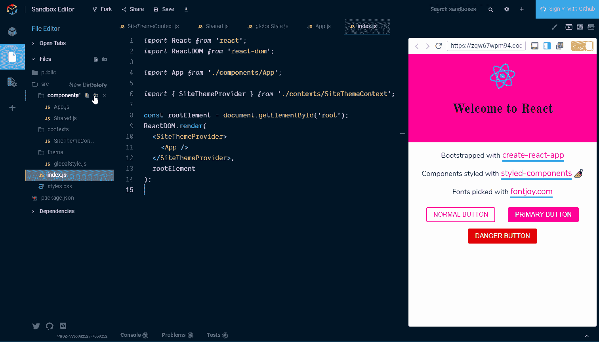

因此，我们可以在`themes`对象中列出可用的主题。但仅此而已，处理主题变化的功能存在于`SiteThemeProvider`上。

回到`SiteThemeContext.Consumer`。正如我前面提到的，消费者的孩子是一个函数。`()=>()`第一部分是来自提供者的`value`(`<SiteThemeContext.Provider>`)，所以让我们快速看一下我们之前在提供者中定义的内容:

```
value={{
  …this*.*state,
  handleThemeChange: this*.*handleThemeChange
}}
```

从`<SiteThemeContext.Provider>`可得到的是状态和功能。因此，我们可以提取这些项目中的任何一项，并将其传递给提供者。或者换句话说，消费者可以访问这些值。

这里我们可以使用析构来拉我们需要改变主题的`handleThemeChange`函数。

```
*import* React *from* 'react'*import* { SiteThemeContext } *from* '../contexts/SiteThemeContext'constThemeSelect= *props* =>{
  *return* (
    <SiteThemeContext.Consumer>
      {({ *handleThemeChange* })=>()}
    </SiteThemeContext.Consumer>
  )
}export default ThemeSelect
```

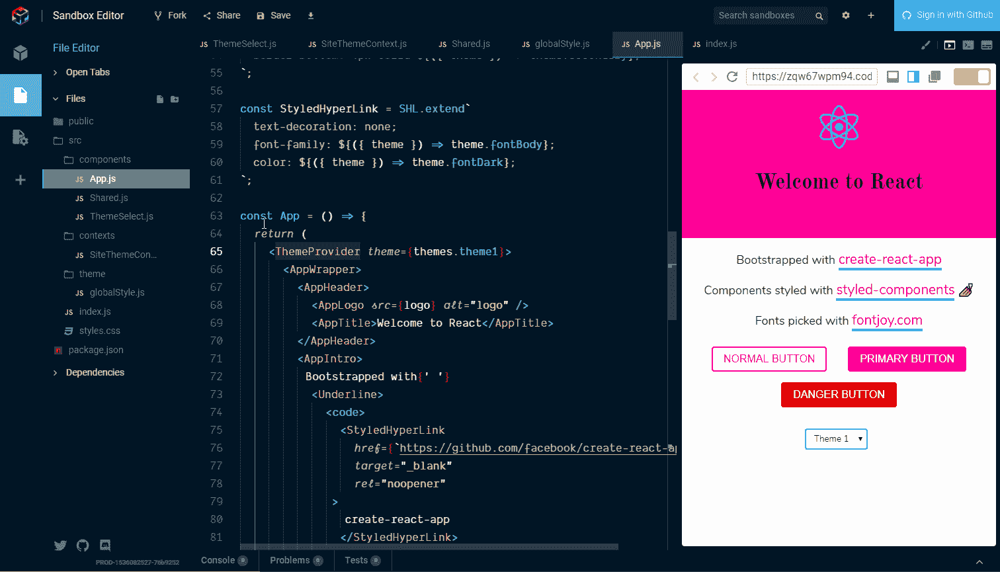

目前这不会改变主题，因为我们已经将它硬编码到样式化组件`ThemeProvider`中。我们想要做的是在`SiteThemeContext`中为当前选择的主题使用一个消费者。

在此之前，我们还需要添加我们想要用来将事件(`e`)传递给`SiteThemeContext`上的`handleThemeChange`函数的`onChange`事件。

然后在`App`组件中，我们可以导入我们的`<SiteThemeContext.Consumer>`来消费`SiteThemeContext`状态上的`theme`，并将其传递给样式化组件`ThemeProvider`。

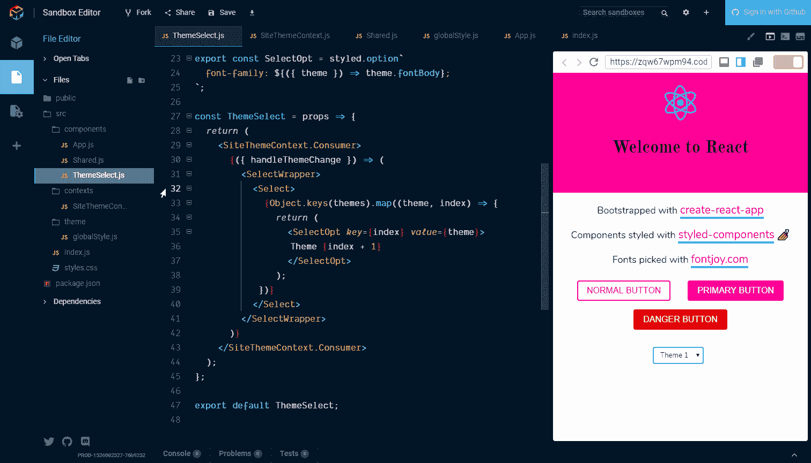

## 想了解更多？

正如本文开头提到的，一个很好的资源是 [@leighchalliday](https://twitter.com/leighchalliday) 和[他的 YouTube 频道](https://www.youtube.com/channel/UCWPY8W-FAZ2HdDiJp2RC_sQ)。您可以找到他的 React 上下文 API 的[伟大用例](https://www.youtube.com/watch?v=yzQ_XulhQFw)。

还有 spectrum 上的 [React 社区](https://spectrum.chat/react)和 spectrum 上的[风格组件](https://spectrum.chat/styled-components)。

[演练的示例代码](https://codesandbox.io/s/5vl16n5oxp)可在 [CodeSandbox](https://codesandbox.io) 上获得。

## 感谢阅读🙏

如果我错过了什么，或者有更好的方法，请告诉我。

这是最初发布在我的[博客上的](https://blog.scottspence.me)你可以在这里查看如果你喜欢，请看看我的其他内容。

在 Twitter 上关注我，或者在 GitHub 上问我任何问题。