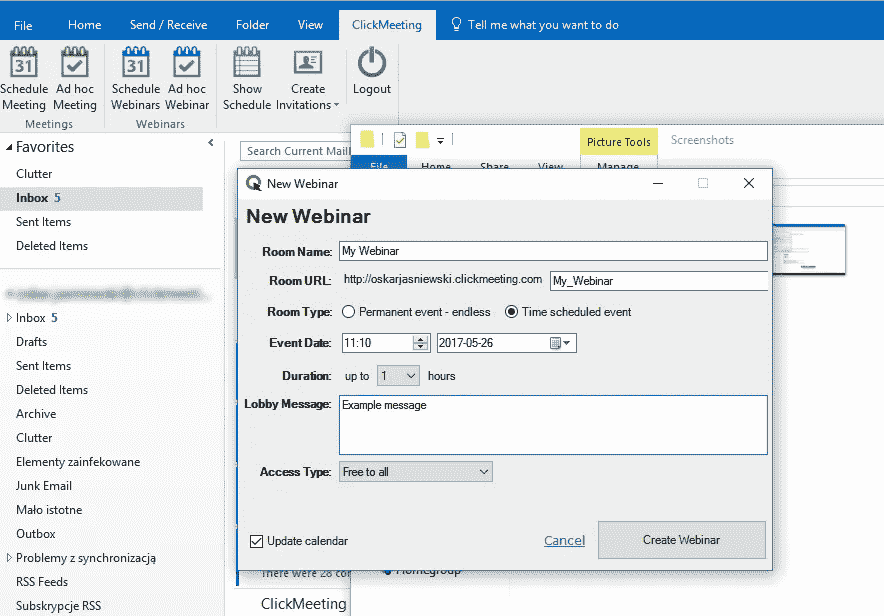
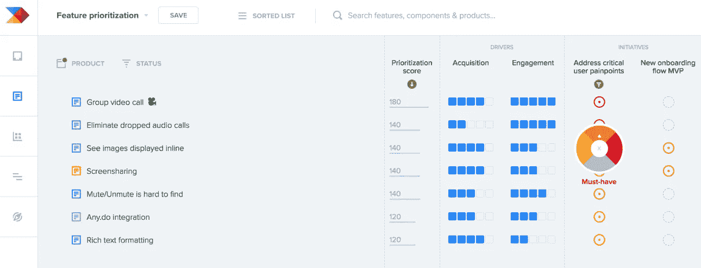

# 如何让你公司的非技术人员对你的软件感兴趣

> 原文：<https://medium.com/hackernoon/how-to-get-the-non-techies-at-your-company-excited-about-your-software-a6d82f289f09>

很难让你部门之外的同事关心你在做什么。

我个人不写代码，但作为一名研究公司文化的营销人员，我多次看到这是多么令人沮丧。

尽管开发和编程对科技产品的运作至关重要，但其他领域的人对此却有一种奇怪的态度。因为他们不太理解我们正在做的事情，所以很难和他们谈论这些。这使得在你需要的时候很难获得热情和支持——就像有一个大的展示，你可以使用一些宣传，文件或认可。

你坚持不懈，但还是很烦人。过一段时间后，这种挫败感有时会让你的工作不那么令人满意。为什么要和一群根本不在乎的[人分享你正在做的事情，即使他们的薪水取决于此？](https://hackernoon.com/how-coders-can-improve-envioronment-74e5f88cbc9)

此外，开发团队也不可能独自完成工作。[你需要顾客和与我们密切合作的同事的意见](https://hackernoon.com/5-product-jedi-mind-tricks-to-better-manage-stakeholders-75bc37f95cbf)。越多越好。

所以，做个大点的人，给他们一点鼓励。让你公司最不懂技术的同事也能理解你在做什么，并支持你。也许你甚至可以让他们兴奋地学习和理解更多。

这里有一些你可以做的事情来在你的公司文化中传播对你的开发工作的兴奋。

# 帮助他们提高技术知识

让我们解决第一个障碍:很难让任何人对他或她不理解的事情感到兴奋。

你的大多数同事可能不理解你正在做的工作——他们只知道这对公司和产品很重要。但是如果没有深度的知识去理解细节，他们对你所做的工作就没有背景或参照系。

如果你告诉他们修复某个 bug 有多难，他们不会知道这是好是坏，甚至不会知道如何回应。这不是他们的错，因为他们没有足够的背景来做出适当的回应。

所以帮助他们学习。

想办法让他们更好地理解运行我们共同开发的产品的[技术](https://hackernoon.com/tagged/technology)。

开始做这件事的一个简单的方法是简单地把他们指向正确的和相关的在线资源。这可能只是简单地发送一个与你在 Slack 上谈论的主题相关的维基百科页面，这样他们就可以获得一些背景信息，或者更多关于你的公司所拥抱的技术趋势的自以为是的博客帖子。

为了更进一步，你可以举行内部培训，比如一系列的“午餐和学习”会议，或者每周一次的网上培训和网上研讨会。如果您使用 [ClickMeeting](https://clickmeeting.com/) 平台来实现这些目的，那么您可以轻松地设置一个定期 Outlook 日历事件，邀请关键利益相关者团体参加您的演示——并且您可以在收件箱中完成这一切。

在这些教育会议中，你有人们的全部时间和注意力来分解对你的公司重要的复杂话题。您还可以创建过去演示文稿的资料库，供点播重播。

最后，如果缺乏[持续学习的机制是你公司的一个比你自己的挑战更广泛的问题](https://www.forbes.com/sites/markmurphy/2018/01/21/if-your-employees-arent-learning-youre-not-leading/)，你可能想考虑与人力资源领导或任何控制公司政策和文化的高管讨论这个问题。

你也许可以启动一项计划来帮助团队成员的职业发展，比如购买有趣的书籍和参加 [Skillshare](https://www.skillshare.com/) 或 [General Assembly](https://generalassemb.ly/) 课程的预算。例如， [Buffer 每月为员工提供一小笔津贴](https://open.buffer.com/learning-stipend/)，用于投资个人和职业发展。

# 让他们参与合作项目

提升你同事的技术技能和理解力的一件很酷的事情是，在不同的项目上与他们合作，带来新的想法和观点会变得容易得多。这意味着你可以更频繁地这样做，这是让他们参与进来并关心你所做的事情的好方法。

在游戏中加入皮肤会自动增加某人的情感投入。

例如，考虑与销售和客户支持团队交流。他们站在客户的第一线，与最终用户的交流最为频繁，因此他们有丰富的专业知识来参与某些产品开发和路线图讨论。他们越了解背后的技术，他们作为技术团队和最终用户之间的中间人就越有帮助。

你甚至可以把你的整个产品路线图计划移植到一个像 [Productboard](https://www.productboard.com/product-roadmap-software/) 这样的平台上，它允许人们讨论、投票赞成、投票反对、优先排序、分配和协作开发计划。

这不仅仅让人们因为参与而对项目感到兴奋，你还能为你的客户创造更好的产品。[没有人能在筒仓里取得成功](https://hackernoon.com/nobody-succeeds-in-a-silo-1db5f4f16dd2)，当涉及到你的同事认为令人困惑的技术时，你可能需要成为那个伸出援手的人。

# 分享定期进度更新

最后，让你的同事对你的工作充满热情的一个简单方法是对你正在进行的工作保持透明。技术团队往往被隔离起来，说着自己的编程行话，但上面的提示都是关于改变这种状态的[。](https://hackernoon.com/you-are-not-paid-to-write-code-daf42c9ebc33)

一旦你这样做了，分享你目前正在做的事情的定期更新可以让你带着他们一起进行产品开发。有很多方法可以做到这一点，所以你可以选择看起来最简单和最适合你的公司动态的方法。

例如，如果你使用 Slack 来讨论你的 sprints 的范围，邀请其他团队成员加入你的渠道，这样他们就可以看到不同更新的状态和正在进行的事情。如果您的公司向员工发送内部简讯，您可以要求包含某些更新。

但只要有可能，就表现出来，不要说出来。尤其是在任何大型新发布之前，随着计划的推进，向整个公司展示您的成果是一个好主意。例如，召开会议进行现场预览有助于他们了解技术团队的进展，并提出对每个人都有深刻见解的问题。

# 传播科技之爱

如果你对工作充满热情，这种热情很容易传染，这只会有助于公司文化。然而，你的同事需要了解你在做什么，他们才会真正对此感到兴奋。

不要抱怨缺乏支持，开始用这些想法培养你需要的支持。