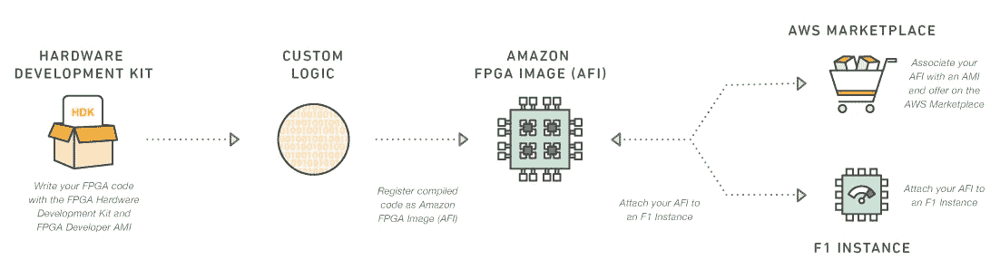
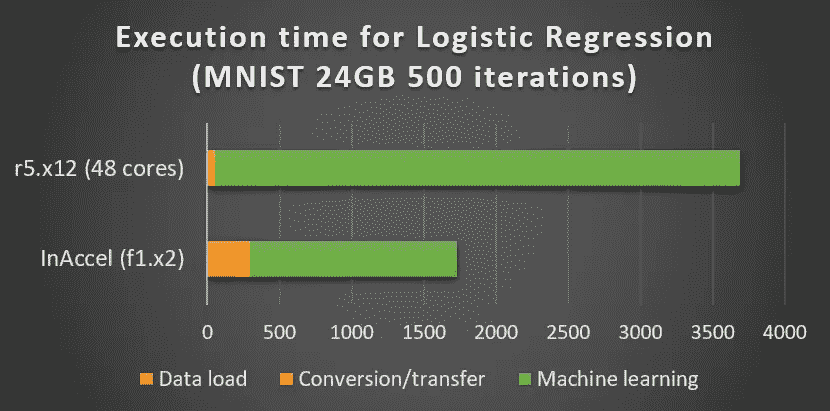
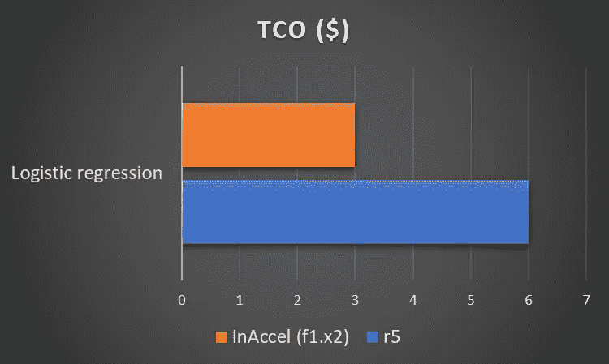

# 如何使用 FPGAs 将 Apache Spark ML 提升 3 倍&而不改变一行代码

> 原文：<https://medium.com/hackernoon/how-to-give-3x-boost-to-apache-spark-ml-using-fpgas-without-a-single-line-of-code-a4e7db0d0995>

*原文由* [*克里斯·卡克里斯*](https://www.linkedin.com/in/kachris/) *发布于* [*InAccel 博客*](https://www.inaccel.com/blog/accelerating-data-science)

机器学习、人工智能和大数据分析等新兴云应用需要高性能计算系统，能够在不消耗过多电力的情况下维持不断增长的数据处理量。为此，许多云运营商已经开始采用部署硬件加速器(如 FPGAs)的异构基础设施来提高计算密集型任务的性能。然而，大多数硬件加速器缺乏编程效率，因为它们是使用 OpenCL、VHDL 和 HLS 等不太广泛使用的语言编程的。

根据 2016 年 Databricks 的一项调查，91%的数据科学家最关心他们应用程序的性能，76%关心编程的容易程度。因此，对于数据科学家来说，利用 FPGAs 等硬件加速器来加速应用的最有效方式是使用 IP 内核库，该内核库可用于加速算法中计算量最大的部分。理想情况下，大多数数据科学家想要的是更好的性能、更低的总拥有成本，并且不需要修改他们的代码。

应用程序加速领域的全球领导者 in acel 发布了新版本的加速 ML 套件，允许数据科学家加速机器学习应用程序，而无需更改他们的代码。InAccel 在 [AWS](https://aws.amazon.com/marketplace/pp/B07D2GWCJN) F1 实例上提供了一个新颖的套件，可用于加速云(AWS)中 Apache Spark MLlib 的应用程序，其中 ***零代码更改*** 。所提供的平台是完全可扩展的，并支持 Apache Spark 的所有主要新特性，如**管道**和**数据帧**。对于喜欢使用 C/C++、Java、Python 和 Scala 等通用编程语言的数据科学家来说，InAccel 在 [AWS](https://aws.amazon.com/marketplace/pp/B07B8X8ZN2) 上提供了所有必需的 API，允许在云中使用 FPGAs，就像使用编程函数一样简单。

How F1 instances work From [https://aws.amazon.com/ec2/instance-types/f1/](https://aws.amazon.com/ec2/instance-types/f1/)

目前，InAccel 提供了两种广泛用于机器学习训练的算法:*逻辑回归 BGD* 和 *K-means 聚类*。这两种算法都是使用 MNIST 数据集(24gb)进行评估的。100 次迭代的性能评估表明， [InAccel 加速的 ML suite for Apache Spark](https://www.inaccel.com/accelerated-machine-learning.html) 在机器学习方面可以实现超过**3 倍的加速比**，整体(包括 Spark 的初始化、数据提取等)可以达到 2.5 倍。).

虽然数据加载和数据提取在 r5 上运行得更快，但由于使用了 48 个内核，当涉及到计算最密集的机器学习部分时，与多核相比，FPGA 加速的内核可以实现高达 3 倍的加速。

数据科学家不仅可以享受更高的加速，还可以降低总体拥有成本，让公司的首席财务官满意。在性能评估中，我们将加速的 ML 套件与 r5 . x12 大实例进行了比较，r5 . x12 大实例的成本与 f1 . x2 大实例相同，加上 InAccel IP 内核的价格(3 美元/小时)。使用用于 Apache Spark 的 InAccel 加速 ML 套件不仅可以实现高达 3 倍的加速🚀，但是您也**将成本降低了 2.5 倍📉🤑**。

如果您的应用程序运行了 2.5 小时，成本为 7.5 美元，现在您可以在 1 小时内获得相同的结果(2.5 倍的加速)，总成本将为 3 美元/小时。

TL；你可以在不改变代码的情况下获得 3 倍的速度提升和 2 倍的 TCO 降低。有什么陷阱吗？目前，加速的 ML 套件可以支持多达 784 个逻辑回归和 Kmeans 特征，以及多达 32 个类/质心。目前，FPGA 架构已经过优化，可以处理上述特性。很快，我们将发布完全可定制的新框架，它可以支持更多的特性和类。

有兴趣了解更多信息吗？给我们发信息，我们是友好的一群。🤖