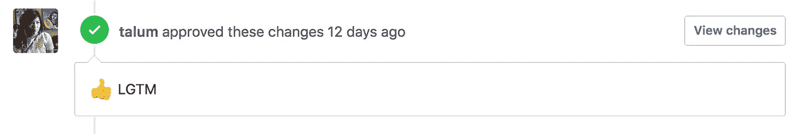
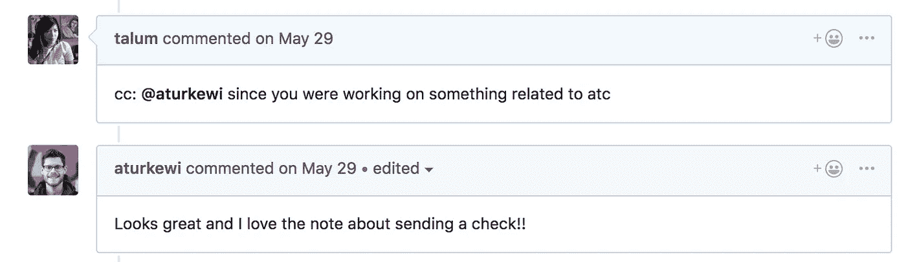
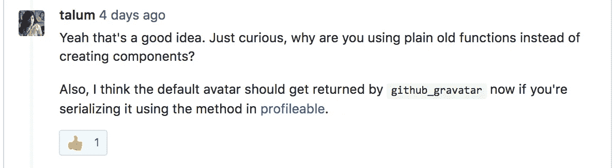
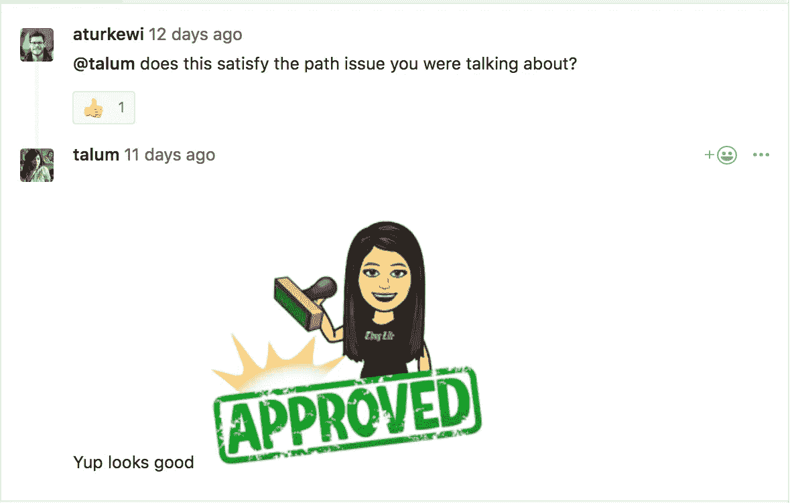

# 如何给出并获得更好的代码评审

> 原文：<https://medium.com/hackernoon/how-to-give-and-get-better-code-reviews-e011c3cda55e>

## 问任何一个开发人员他们最讨厌他们工作的哪一部分，你会经常听到“*代码审查”*这样的话。

Photo by [Artem Sapegin](https://unsplash.com/photos/DErxVSSQNdM?utm_source=unsplash&utm_medium=referral&utm_content=creditCopyText) on [Unsplash](https://unsplash.com/search/photos/code?utm_source=unsplash&utm_medium=referral&utm_content=creditCopyText)

代码审查有时是阻止您发布的步骤。它甚至可能是站在你和你的项目冲刺结束之间的最后一件事——你已经工作了几个月，迫不及待地想要结束的那件事。更有诗意的是，这是你，开发者，工匠，艺术家，在评论家委员会面前展示你的作品，请求他们用竖起大拇指的表情符号和“LGTM”来祝福你的杰作的时候

要求审查代码让许多人紧张，因为对于那些将编程视为一门手艺的人来说，这就像暴露你的创造性灵魂一样。这可能是一个充满压力和压倒性的经历，但它也是获得对代码的反馈、发现打字错误和错误，以及更广泛地说，作为一名工程师成长的最佳方式之一。

是的，我知道，接受批评性的反馈很难，但这是你变得更好的唯一方法。尽管有时在媒体上被描述为孤独和反社会的，但编码是一种团队协作的努力。认识到这一点，并且知道代码审查是编程体验的重要部分，您可能想知道是否有方法让代码审查对您和您的工程团队来说不那么糟糕。好消息是:有！今天我要分享的是我在过去几年里学到的获得和给出更好的代码评审的技术。

# **获得更好的代码审查**

1.  **将你正在解决的问题放在情境中。**我的团队通过 GitHub 问题或 JIRA 跟踪大部分项目工作，因此当我们打开 pull 请求时，我们发现从 PR 正文中链接到 GitHub 问题或 JIRA 票证对解释问题和建议的解决方案非常有帮助。写一份变化、权衡和剩余待办事项的快速总结或列表；用标签标记拉式请求；并且包含功能截图或者前端改动的 gif 也是超级有帮助的。

**2。在正式提交代码供评审之前，评审您自己的代码。这听起来很明显，但是这是代码审查过程中经常被忽视的一步。甚至在你让别人检查之前再看一遍差异也能帮助你发现错别字或遗漏。或者，它可能会帮助你找出其他问题或依赖，阻止你的公关被合并。消除你的拉式请求中的句法、语法和文体错误会给你的审阅者留下你关心的印象，并让他们专注于你的修改的更具体的方面。所以是双赢。你提供了一个更干净的代码包，你的评审者给了你更好的反馈。**

**3。在你特别不确定或需要反馈的地方做注释。作为查看我的拉取请求的一部分，我经常扫描我的代码，寻找我真正想要反馈的地方。我知道我的队友很忙，所以为了得到最好的建议，我喜欢把他们的注意力引向我有问题的地方并@提及人。其他时候，我会预测哪里会出现问题，并留下评论来证明我做出改变的理由。这经常会引发一场健康的辩论，并给我留下一些新的想法或不同的观点。**

**4。标记正确的人。**当你刚加入一个团队时，这可能会特别困难，你可能会忍不住把自己的公关扔进荒野，希望一些慷慨的人会同情你。(这是我作为新手时倾向于做的事情。)现在，我试图识别代码所有者，或者熟悉我所接触的代码库的任何部分的人。这可能是 git 责备谁最后接触了文件，或者甚至询问谁是某个特性的项目或团队负责人来寻找领域专家。通过明确标记人，你将避免旁观者效应，并可能获得更多可操作的结果。最坏的情况是，那些人会把你指向其他人。

**5。深吸一口气，消化这些评论**。随着你的公关通知越来越多，你自己的焦虑可能会开始积累。深吸一口气，提醒自己，你的团队成员是好意，用心良苦。(如果他们没有，也许[会考虑加入我的团队](https://flatironschool.com/careers/view-posting/?gh_jid=51001)？)查看评论，做出回应，并尽最大努力整合反馈或使您的设计决策合理化。

# **给出更好的代码评审**

1.  **提问。从我参加的写作研讨会中，我学会了将我的大部分反馈表述为问题或思考。我不会说“嘿，这个类是垃圾”，而是写类似“你探索过 X idea 吗？”“您使用这种方法的目的是什么？”或者“我想知道将这一行移到另一个类是否会使功能更清晰？”注意措辞和语气可以改变你的反馈被接受的方式，以及你作为团队成员的形象。很难在网上找到正确的语气，所以我有时会做的是，以防我的反馈过于刺耳(但主要是为了搞笑和突发奇想)，我会加入一些表情符号、位图和 gif。还有，不要害怕在现实生活中说话。有些想法面对面交流更好。此外，您也可以随时在代码审查中配对！**

**2。阐明问题(如果有的话)并提出替代方案。扫描一些没有通过“斜视测试”的代码，并写下类似“Oof”的注释，这是很有诱惑力的。这是一堆蹩脚的意大利面条代码”或者“我也不知道哪里出了问题，但是感觉很糟糕。”我建议你不要。(我经常做后者，但我正在努力。相反，努力表达你的批评。某些东西可以被重构得更清晰或更易读吗？是否对领域有根本性的误解？作者是否遗漏了什么？一旦你表达了你的批评，建议几个替代方案也是很好的。链接到代码库中的文档或代码行。你甚至可以写一个片段来证明你的意思。**

**3。尝试理解上下文和建议的解决方案。没有任何背景，很难给出好的评论。就像你应该在给出内联反馈之前阅读整篇文章一样，我建议在到处乱放评论之前先浏览一下整个 pull 请求。阅读摘要和更改。了解情况。如果你想的话，把代码拉下来，然后处理一下。有时代码是在运输压力下或者没有完善的知识和远见的情况下编写的。没关系。作为评审者，你应该记住与被评审者感同身受，并在打破新手的梦想或老手的自我之前考虑背景。**

**4。亮点胜出。没有人想听到公正的批评。如果有人有一个非常酷的方法，认可他们！在评论中大声说出来，在这种情况下，一定要用你想要的所有奇思妙想来庆祝——表情符号、位图、gif、纸屑，任何你能找到的东西。**

代码审查是一项真正的技能，它结合了技术专长和巧妙的反馈。你做得越多，就会越好。在我的团队中，我们鼓励新的团队成员审查 pull 请求，作为熟悉代码库的一种方式。有经验的开发人员也做同样的事情，尽可能地留下智慧的金块，并指出不同方法的优缺点。对于经验丰富的开发人员来说，这很难，但我们发现这也是一个有价值的过程，可以提高我们团队的技能，改善我们代码库的整体质量。希望使用上面的技术，过程和代码质量对你来说也会变得好一点。