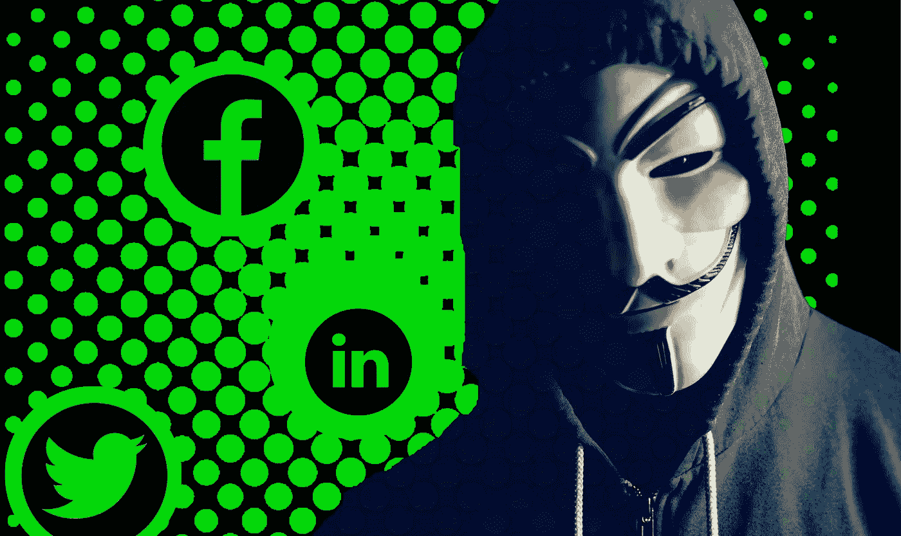
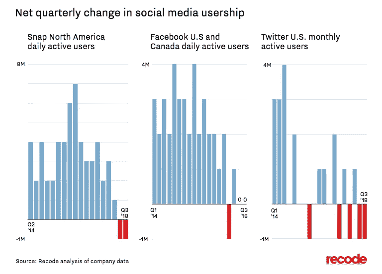
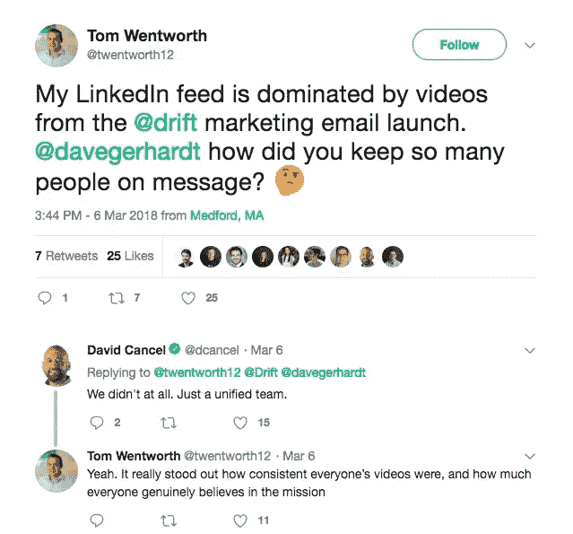
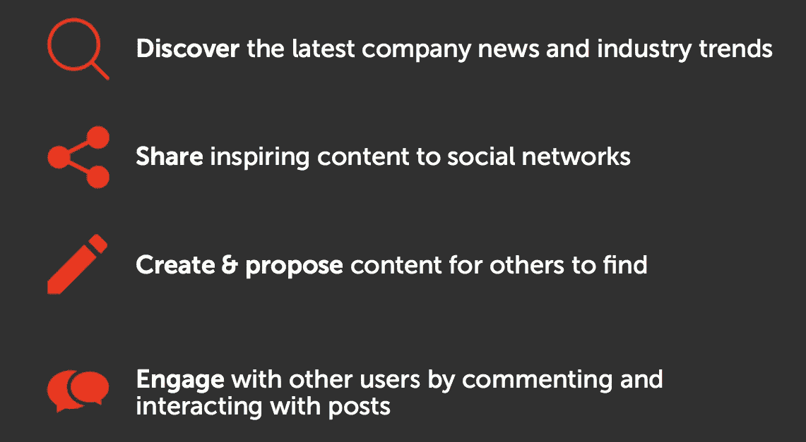
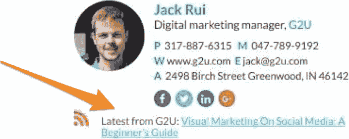
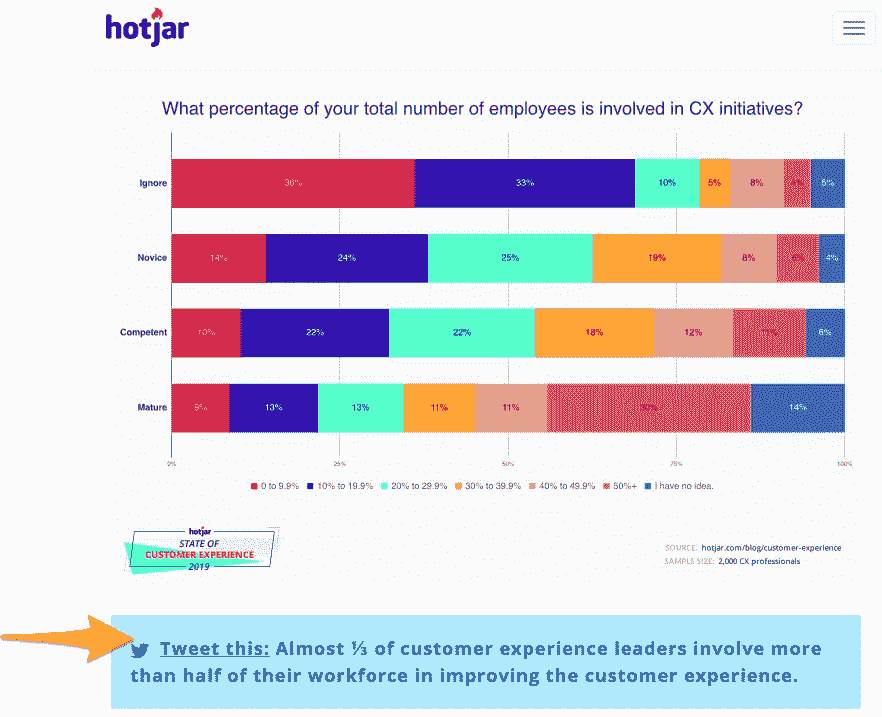

# 如何黑掉社交媒体上的内容推广

> 原文：<https://medium.com/hackernoon/how-to-hack-content-promotion-on-social-media-f816b9c1be14>

让我们面对现实吧。这是有机社交媒体的黑暗日子。

网络中断了。利基市场已经饱和。一旦关键战术失效。

随着“每家公司都需要成为媒体公司”的口号最终被全面采纳，观众被这些噪音淹没了。许多品牌发布的媒体根本没有抓住目标，所以没有人愿意参与推广这些内容的帖子。

觉得我过于消极了吗？让我们看看事实:

*   虽然从 2014 年[到 2016 年](https://www.shareaholic.com/blog/search-engine-social-media-traffic-trends-report-2017/)，社交网站在网站流量推荐方面的表现优于搜索，但今年，谷歌[向你推荐访客的可能性是](https://www.parse.ly/resources/data-studies/referrer-dashboard/#google,facebook.com)[脸书](https://hackernoon.com/tagged/facebook)的两倍。
*   脸书[切断](https://techcrunch.com/2018/03/28/facebook-will-cut-off-access-to-third-party-data-for-ad-targeting/)基于第三方数据提供商的广告定位。
*   他们今年还暂停了平台上新机器人和应用程序的所有审批超过一个月。
*   根据 BuzzSumo 的数据，去年，所有内容中有一半在主要社交渠道获得的份额不到五分之一，这比两年前下降了 50%。
*   用户在社交媒体上花费的时间越来越少，而公众对社交平台的负面情绪却有增无减。

*Image source:* [*https://www.recode.net/2018/11/5/18043528/social-media-growth-facebook-twitter-snap*](https://www.recode.net/2018/11/5/18043528/social-media-growth-facebook-twitter-snap)

但不可否认的是，社交媒体分享仍然是分发内容和接触潜在客户的最有力的方式之一。

> 当你周围的一切都变得越来越困难的时候，你怎么能让它继续为你工作呢？

你黑进去。

无论如何，分享你的企业个人资料的内容从来都不是推广你的信息的唯一方式——我们只是觉得这是一个简单而有效的选择。现在它变得不那么可靠了，让我们看看你如何走出不再舒适的舒适区，侵入社交网络，为你的内容吸引更多的眼球。

# 提升员工口碑

你的员工是你社交媒体内容最大的秘密加速器，尤其是在 B2B 领域。与你的品牌社交媒体账户相比，他们通常与你的目标受众有着更多更强的联系。例如，一个新客户可能会在 LinkedIn 上联系他们的客户经理，然后在其他地方关注你所有的品牌客户。

让你的团队在社交媒体上帮助分发内容或公司新闻，将有助于建立影响力和口碑势头。当[漂移](https://www.drift.com/)今年早些时候推出电子邮件功能时，他们在社交媒体上召集了整个公司。随着员工将自己的视频上传到 LinkedIn 和其他社交渠道，[他们创造了超过 30 万的视频浏览量](https://soundcloud.com/seekingwisdom/marketing-linkedin-takeover)，并在该渠道上迅速传播。

Image source: [https://twitter.com/twentworth12/status/971169646329171968](https://twitter.com/twentworth12/status/971169646329171968)

无论你推出的是产品、功能还是新内容，你都可以利用员工的个人关系网来扩大你的销售渠道。

像 [Smarp](https://www.smarp.com/) 这样的工具将帮助你的整个团队组织和激活，作为你社交媒体战略的一部分。

Image source: [https://resources.smarp.com/](https://resources.smarp.com/)

他们可以快速轻松地帮助分发内容，这既可以产生线索，又可以跟踪他们，以广告为目标，培养并最终将他们从您的品牌账户中转化出来。

# 使用聊天机器人创建对话

此外，你可能不想完全使用 Facebook Messenger 机器人，但这不应该完全阻止你使用聊天机器人。还有其他平台——如现场聊天、Slack 社区、Telegram groups 和其他社交网络的私人消息——可以建立，你仍然可以使用你的品牌已经以新方式建立的任何信使机器人。

这让你可以将电子邮件的参与度和影响力——比社交媒体新闻更直接、更可靠——与当今社交媒体规范的可访问性和一对一沟通相结合。虽然在过去，聊天机器人经常被用于客户支持和潜在客户，但它在内容分发方面非常有效，可以将人们推向社交媒体，甚至转化潜在客户。

聊天机器人可以帮助你与你的观众创造更加个性化的对话体验，这正是被今天的新闻推送算法所惩罚的陈旧的社交媒体策略所缺少的。

你可以使用信息工具[与你的社交媒体网络围绕你的内容展开直接对话](https://blog.rundexter.com/content-distribution-in-the-age-of-messaging-b591fc4a5996)，就像你用电子邮件向你的订户列表发送内容一样。

# 利用一对一的电子邮件

当脸书限制我们的有机接触，我们的客户在社交媒体上花费的时间越来越少时，猜猜他们仍然在一天的大部分时间里保持开放的是什么？他们的收件箱。

除了将内容整合到你的品牌以电子邮件为中心的[营销](https://hackernoon.com/tagged/marketing)自动化战略中，想想你如何再次利用你的员工和他们的网络来接触你的受众。考虑每个团队成员每天发送多少封电子邮件，无论是发给业内的同事和朋友、现有客户还是潜在客户。

它可能每周加起来有数百封电子邮件，许多包括链接到你的主页或社交媒体源的电子邮件签名。但是有一种更好的方式来利用这些不动产进行内容分发。

鼓励员工在其电子邮件签名中链接到特定的活动或内容，而不是链接到一般的业务页面。

Image source: [https://www.wisestamp.com/signature-examples](https://www.wisestamp.com/signature-examples)

像 [Gmail 的固定回复](https://blog.hubspot.com/sales/gmail-templates-canned-responses)、 [WiseStamp 的](https://www.wisestamp.com/)动态签名插件和 [HubSpot 的免费签名生成器](https://www.hubspot.com/email-signature-generator)这样的电子邮件工具都可以轻松创建定制签名文件，以推广内容帖子和其他营销资产。例如，您可以为多个受众角色提供电子邮件签名内容，以便员工可以包含与每个收件人最相关的内容。

它是一对一规模的分段电子邮件。

# 在内容中嵌入直接社交 CTA

最后，通过重新思考如何鼓励读者分享来改变你的社交内容分布。我们大多数人在博客的边栏或页脚设计中都有微妙的分享栏，读者需要从六个选项中选择一个来分享，定制分享文本，并发布自己的内容。

这是我们多年来一直在做的事情，但正如我上面提到的，它已经不起作用了。增加机会的一个方法是消除分享过程中的所有摩擦。

通过在内容中嵌入或链接预先制定的社交帖子草稿，将您的现场内容参与和社交媒体足迹结合起来。而且有了 [ClickToTweet](https://clicktotweet.com/) 这样的工具，设置起来都超级简单。

看看 [HotJar 如何有效地使用这些 CTAs】在他们充满令人信服的数据点和专家报价的博客帖子中。](https://www.hotjar.com/blog/customer-experience)

*Image source:* [*https://www.hotjar.com/blog/customer-experience*](https://www.hotjar.com/blog/customer-experience)

这不仅让人们更容易在社交媒体上分享或参与你的内容，而且有助于扩大你的品牌和帖子在社交媒体上的有机覆盖范围，弥补其他挑战。

# 不要放弃——只要找到变通办法

不要成为一遇到挑战就放弃社交媒体的营销人员。只要你的销售前景在社交媒体上，就有希望有很多好的方法去接触他们。由你来决定如何去做。