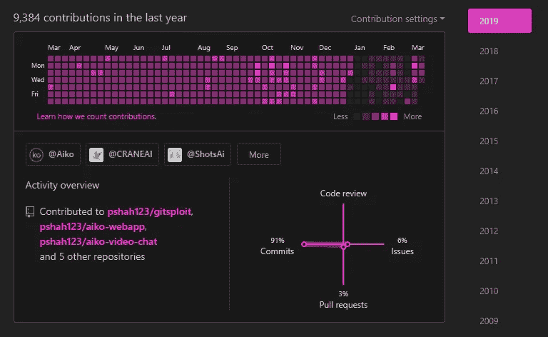
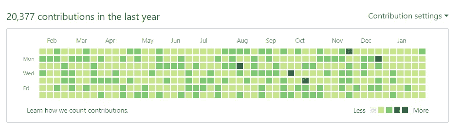

# 如何黑 GitHub(有点)

> 原文：<https://medium.com/hackernoon/how-to-hack-github-kind-of-12b08a46d02e>

一天一次的承诺让虫子远离你！但是我们一天要做 100 次提交。



众所周知，GitHub 的贡献列表并不安全。事实上，通过用预先配置的提交历史推一个存储库，您可以获得提交作为贡献。

我喜欢编码。真的。我真的很喜欢开源。当我开始时，开源是我最喜欢做的事情:构建软件，为每个人发布它，并为其他人的项目做出贡献。

这是我仍然喜欢做的事情，但这是我被迫牺牲的事情。最近，我开始全职工作于 Aiko AI，这是一家旨在通过将人工智能的进步集成到日常产品中，将它们的好处带给公众的初创公司。我们落后于像 [Aiko Meet](https://helloaiko.com/meet) 和 [Aiko Mail](https://helloaiko.com/mail) 这样受欢迎的产品，我们最近的成功意味着我做开源工作的时间越来越少。

[](https://helloaiko.com) [## Aiko AI - AI 研究与解决方案

### Aiko 正在通过人工智能的整合挑战传统技术。我们致力于数字…

helloaiko.com](https://helloaiko.com) 

不幸的是，这意味着我必须在对 Aiko 的热情和对开源的热爱之间做出选择。我时不时地继续从事开源项目，但 Aiko 已经优先考虑了，这意味着我不能像以前那样频繁地投入工作。

这意味着我的贡献表将会干涸——除非我们用承诺填满它😉


Sneak peek of my contribs chart in 2 months

对于那些不常使用 GitHub 的人来说，贡献图表每天都会跟踪你的提交，以查看你的编码活动/对开源的共同贡献。它同时也是所有 flexes 中最古怪的一个，也是展示你开源努力的一个不错的小奖杯。

以至于一些雇主会看你的 GitHub 贡献表来了解你是一个多么狂热的程序员。当然，这并不能真正反映你的编码能力；您可能不经常使用 GitHub，或者您可能主要是在开发封闭源代码。也许你在一个角色中，你很少承诺，但是有很大的功能/很重的负荷。或者也许你看着这个图表，感到一种不安全感，就像你想的那样，*我所有的朋友都有更多的 GitHub 提交！*

无论是必要性、好奇心还是冒名顶替综合症激发了你，都有一个简单的解决方法——只需获得一堆开源提交！

当然，这需要时间，而且你不能回到过去编辑你的历史，你能吗？我将向你展示如何破解 GitHub 的贡献图表，并获得你如此渴望的绿色牧场。


Pictured: the hacker known as _____

在我开始之前，我将向你介绍另一个基于相同系统的项目 [Gitfiti](https://github.com/gelstudios/gitfiti) ，它可以让你在 GitHub 的贡献上画画。

我们将重点关注*提交历史*以获得欺诈提交，而不是艺术！我将尽我所能解释 bash，但这需要对终端和`git`有所了解——如果你对 CLI 不太熟悉，我建议你在深入了解之前查看一下 [Bash Academy](http://www.bash.academy/) 。

只想要剧本？这就是。

不想编码？查看一下 Github Gardener ，这是一个免费的网站，可以帮你解决问题！

# 它是如何工作的

利用**提交历史**，我们可以使用`git`的提交时间戳“创作”提交。

让我们从在我们选择的日期创建一个提交开始。为此，我们需要更改 git 用来设置提交时间戳的两个环境变量，`GIT_COMMITTER_DATE`和`GIT_AUTHOR_DATE`。这两个变量持有标准的`YY-MM-DD HH:MM:SS` ISO 格式时间戳。我们还将在那个时间戳上提交，以覆盖所有的基础——这样，我们可以完全确定没有办法区分我们的假提交和那个时间点上的实际提交。

```
export Y = 2000
export M = 12
export D = 20
export GIT_COMMITTER_DATE="$Y-$M-$D 12:00:00"   
export GIT_AUTHOR_DATE="$Y-$M-$D 12:00:00"   
git commit --date="$Y-$M-$D 12:00:00" -m "Committed on $M $D $Y"
```

上面的片段将“创作”一个来自 2000 年 12 月 20 日的提交。这也可以扩展到“作者”提交，比如说，1970 年 1 月 1 日；在你可能编码这个之前！因此，您的“git”历史是易受攻击的(事实上，不是“历史”，它更像是预先创作的结构的集合)。


Write your own history! Didn’t turn out so great for Churchill though…

然后，我们可以将它扩展为从设定的日期开始每天创作一个提交历史。这可以通过 bash for 循环轻松实现，其结构如下:

```
for VAR_NAME in {start..end}
```

下面的缩进块将能够在执行中使用`$VAR_NAME`作为变量。因此，bash for loops 对我们来说非常理想，因为我们可以遍历年、月、日来创作虚假的提交历史。

# 让我们写一个剧本

*这个剧本的最终版本可作为要旨* [*此处*](https://gist.githubusercontent.com/pshah123/0513d98556021d738c0cb72be0a63615) *。*

我们可以通过*依次循环*年、月、日来实现这种“利用”:

```
for Y in {1999..2018}
    for M in {01..12}
        for D in {01..28}
```

我们每年循环从 1999 年到 2018 年(我选择 1999 年作为 2000 年之前的猜测)。然后我们循环每个月，最后是每一天。请注意，我们只从 1 到 28 循环，因为二月可能是一个 28 天的月份！如果我们想的话，我们可以每天循环，但是这对于二月份是无效的；在这种情况下，您可以使用条件来选择日期。我考虑的另一种方法是使用 Python 将年、月和日设置为工作日，以便只选择工作日——选择哪个由您决定！我将坚持使用 1–28，因为从速度的角度来看这是最好的(提交这么多提交可能需要一些时间)。

我们还需要每次创建一个新文件:

```
echo "Committed on $M/$D/$Y" > commit.md
```

下面是一个完整的脚本，用于创建文件并提交它们:

```
for Y in {1999..2018}
do
  mkdir $Y
  for M in {01..12}
  do
    cd $Y
    mkdir $M
    cd ../
    for D in {01..28}
    do
      cd $Y/$M
      mkdir $D
      cd $D
      echo "Committed on $M/$D/$Y" > commit.md
      cd ../../../
      export GIT_COMMITTER_DATE="$Y-$M-$D 12:00:00"
      export GIT_AUTHOR_DATE="$Y-$M-$D 12:00:00"
      git add $Y/$M/$D/commit.md -f
      git commit --date="$Y-$M-$D 12:00:00" -m "$M $D $Y"
      git push origin master
    done
  done
done
```

这将使作者从 1999 年提交到 2018 年。您可以在任何 bash 提示符下执行它——我建议将它放在一个可执行的 bash 文件中并运行它。

但这显然是极其缓慢的！我们怎样才能让它变得更快？

1.  首先，除非你有嵌套的 git repos，否则我们不需要在每次提交时遍历目录树。
2.  事实证明，GitHub 的“推送”并不考虑当前的时间戳(因此允许您将旧的本地 git repos 推送到 GitHub)，所以我们可以在脚本的末尾进行**推送。**
3.  最后，虽然不是真正的速度提升，但通过上述改进，增加对第 29 天到第 31 天的支持不会真正影响我们的性能，GitHub 会自动清理多余的天数。

这将速度提高了十倍，我们可以通过在末端推动来达到更高的高度。

```
for Y in {1999..2018}
do
  mkdir $Y
  cd $Y
  ...
        git add commit.md -f
        git commit --date="$Y-$M-$D 12:$i:00" -m "$i on $M $D $Y"
      done
      cd ../
    done
    cd ../
  done
  cd ../
done
git push origin master
```

实现这些更改，加上**删除最后的文件夹**进行清理，我们得到了最终的脚本:

您会注意到，我引入了另一个带有变量`i`的 bash 循环——它控制每天提交**多少次**,并且可以与这个快得多的脚本一起使用。如果您得到一个“无效的”日期格式错误，请检查您使用的日期是否在计算机之后(您能做的最早日期是 1970 年 1 月 1 日)，并且您的 bash 版本是否足够新以支持 for 循环中的前导零。

最精彩的部分是作者在**未来提交。
这意味着以后你每天都会有一个 commit！**

我已经把完成的脚本[放在这里](https://gist.githubusercontent.com/pshah123/0513d98556021d738c0cb72be0a63615)。(快捷链接:[git.io/vxnon](http://git.io/vxnon))

贯穿示例:

```
priansh@laptop:~$ cd ~/Documents/github
priansh@laptop:~$ mkdir gitsploit # make the repo folder anywhere
priansh@laptop:~$ cd gitsploit && git init
priansh@laptop:~$ # Next we'll set up tracking a GitHub repo
priansh@laptop:~$ git remote add origin <YOUR GITHUB REPO LINK HERE>
priansh@laptop:~$ echo "Hello World" > README.md && git add --all
priansh@laptop:~$ git commit -m "init" && git push -u origin master
priansh@laptop:~$ wget https://git.io/vxnon -O a_million_commits.sh
priansh@laptop:~$ chmod a+x a_million_commits.sh # make executable
priansh@laptop:~$ ./a_million_commits.sh
```

# 验尸

我将提到 GitHub 也可以被机器人进一步利用(因为他们没有验证码！)并用于明星、关注者等等，尽管我不会在这篇快速的文章中涉及这一点(我也不鼓励这样做，因为它近乎恶意)。

只是一个快速的图片来证明这是可行的:



20k commits!

您可以删除正在提交的回购以移除虚假历史记录，或者将其设为私有并将贡献设置仅设为公共，以实现与从图表中移除虚假历史记录相同的效果。(您也可以完全覆盖分支/提交历史。)

虽然我们没有恶意利用 GitHub，但这仍然有一定的意义，因为一些公司在招聘过程中会检查你的贡献计数——这意味着这可能(潜在地)影响你获得工作的机会。这也会让你成为课间最酷的孩子。快乐“黑客！”

[](https://github.com/pshah123) [## pshah123(普里安什·沙阿)

### pshah123 有 80 个可用的存储库。在 GitHub 上关注他们的代码。

github.com](https://github.com/pshah123) 

像这样，还有更多？在 [Aiko AI](https://helloaiko.com) ，我们热爱开源项目以及探索和可视化数据！