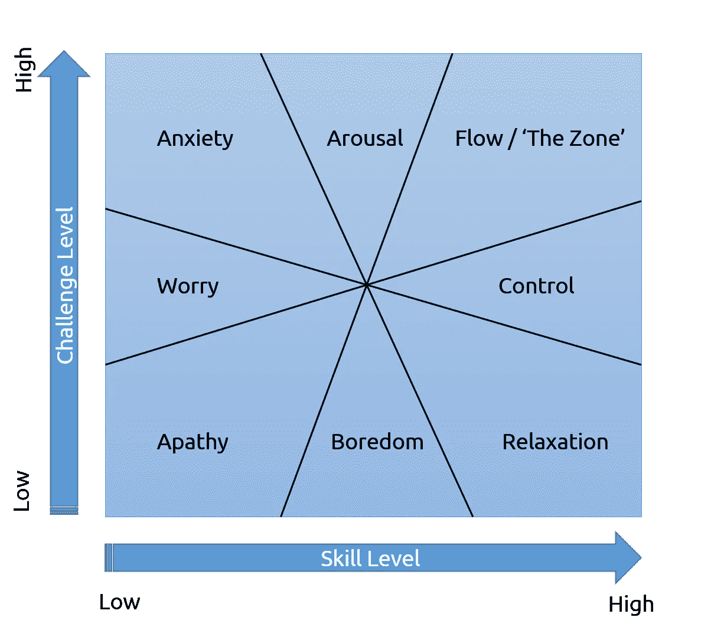

# 如何破解你的学习，并发挥创造力

> 原文：<https://medium.com/hackernoon/how-to-hack-your-learning-and-be-creative-e5927c3a30b6>

在这个数字时代，信息变得越来越杂乱，并且瞬间变得越来越大，有时我们会偶然发现如何快速学习，或者如何应对这一代人可以获取的大量信息。像我这样的开发人员似乎经常受到这种压力，因为技术进步和标准变化非常快。如果说有什么不同的话，那就是我们非常渴望[快速学习](https://hackernoon.com/tagged/learning)。

此外，一个人如何在短时间内快速学习也有很多变数。有些人生来就有照相般的记忆力，有些则没有。很多时候，我们无法断定一个人快速学习新概念的几率是否真的取决于智商测试、证书、高等教育程度等标准。

尽管我们也不得不承认，当一个人可以称他/她的追求为成功时，我们会有所不同。有时候，你需要努力学习你想学的东西。其他时候都是关于聪明的学习。

不管你属于哪一方，这些列表一定会帮助你作为开发者应对技术的变化:

# 充满激情

你可能听过或读过每一个成功人士的故事和他们的生活，就在他们在他们的领域出名之前，或者他们如何经营他们的生意。有时他们只是发现他们必须做些什么才能成功。但是你经常可以在这些人身上看到一个共同的模式:他们只是太好奇和热情了。他们不成功，因为他们只是努力工作，但他们也渴望学习，尤其是他们好奇做出改变。

查尔斯·达尔文，他在英国皇家海军贝格尔号上航行后，立即开始了他的进化论。人们认为他更喜欢骑马和射击，而不是学习，他似乎对收集甲虫感兴趣。当他不收集标本时，达尔文花时间试图了解这些岛屿的地质特征，尤其是他在 Buccaneer Cove 的露营地附近突出的凝灰岩锥。所有这些都是因为他对大自然的热爱和热情。

埃隆·马斯克(Elon Musk)只是对人类能否在火星上飞行和生活充满好奇和热情。比尔·盖茨很好奇牛郎星 8080 是否能运行标志着微软开端的 BASIC 编程语言。史蒂夫·乔布斯热爱书法，并在麦金塔产品中实现了他对书法的热爱。

更重要的是，**不断表现出对一切事物的兴趣，包括琐碎的小事**让你的激情燃烧。

# 渴望学习

每个行业最伟大的名字都有一个共同点:他们热爱学习。我认为这是显而易见的，因为你热爱你的工作。

对我来说，学习新东西是我做更多事情的动力。我越好奇，就越兴奋。它在恢复我的能量。我通过读书、向我的导师学习、对我所做的事情表现出兴趣以及其他方式来做到这一点。

# 利用你的奖励系统

当你试图学习一个困难的概念，或者试图完成一项困难的任务时，你可能想利用奖励系统是如何工作的。人们喜欢被奖励，不管你的职业或你试图掌握的手艺如何。

以下是一些可能对你利用你的奖励系统有用的技巧:

## 解决难题后吃点好吃的

在完成困难的事情后奖励自己，可以是任何事情(吃美味的食物，做运动，等等)。).

## 在社交媒体上公布你的成就(但不要吹嘘太多)

作为人类，我们需要被认可，被爱，需要有人称赞我们的努力。让这成为你的奖励系统。尽管如此，还是要小心使用这个，因为社交媒体已经被证明是会上瘾的。

# 享受过程，而不是结果

许多人认为，只有当他们有所产出时，他们才能享受某种东西。

不对。事实上，当你从第一天开始就不喜欢做某件事的时候，很有可能你无论如何都不会到达终点。你必须信任过程和你的输入，而不是关注你的输出。

我记得有一段时间，我喜欢为了开发软件应用程序而开发软件，直到我赚了一些足够的收入来维持自己的工作。在我追求的大部分时间里，我享受并热爱学习的过程。我享受在通往成功的道路上的每一次成功和失败，并通过加入我所相信的团队来产生影响。

要想学得快，你必须享受这个过程。通过享受它，你可以避免在做你必须做的工作来实现它时被轻易耗尽的风险。

# 为你的追求寻找合适的环境

如果你想把自己发挥到极限，寻找一个合适的环境让你茁壮成长是绝对必要的。毕竟只呆在自己的舒适区是无法成长的。

我们人类热衷于新奇事物或尝试新事物。根据我目前的经验，我同意这一点，因为我越是陷入没有挑战的相同的日常事务中，我就越感到无聊，最终无法进一步拓展自己。而我越不舒展自己，就越学不到新的东西。

由于我与全球各地的客户远程合作，我利用咖啡店来了解新的环境，在他们来咖啡店时看到我周围的新人，并且每天都给我带来活力，因为我将在新的环境中工作。我不断地从一家咖啡店转到另一家，并培养自己总是忙碌的动力。

此外，当你在寻找一个让你成长的环境时，同时设定目标，比如改变你的环境来快速完成某件事。

# 对你所在领域的基本原理有扎实的理解

当谈到理解我们所追求的东西时，我们似乎忘记了一些东西。如果有什么不同的话，学习基础知识是你获得成功的关键一步。

在该领域做出重大贡献的人知道他们在做什么。数学家，科学家，工程师。那些出了名的人至少对他们各自领域和工艺的基础有扎实的理解。

在商业中，不学习诀窍已经被证明在你的努力和时间上也是昂贵的。你不能在不知道自己在做什么的情况下就简单地创业。最起码的基本理解是必须的。

# 一次专注于一件事，提高你快速学习的技能

已经证明，一心多用会导致不愉快和压力，而一次专注于一项活动被证明是让一个人快乐并更快完成工作的事情。

Mihaly’s concept of `Zone`

为了支持这一证据，根据米哈里·奇克森米哈里的“心流”概念，米哈里的概念侧重于“专注于”当下或你当前的活动，以实现最大的潜力和最佳体验。在这个概念中，当你进入“心流”状态时，你通常会有这种无法解释的感觉，你太专注于你正在做的事情，以至于根本不关心你周围的环境。你只需要专注于你试图解决的时刻、活动和困难，但最终会感到真正的满足和成就感。

不仅一次专注于一件事会让你很快达到目标并获得成功，同时你也会感到快乐和满足。当我做编程的时候，我经历过几次，我真的很兴奋去完成我开始的事情。突然间，我进入了“心流”状态，我成功地完成了当天的任务。

## 触发流程的关键要点

*   **心理或内部触发因素是我们内心环境中产生更多心流的条件——**它们是将注意力引入当下的心理策略。`**Clear goals, immediate feedback, and the challenge/skills ratio**`为最关键的三种。
*   **模式识别**——大脑分解现有模式、颜色、数据、形状、动作、声音、概念、成功、风险、失败等的能力。，并通过链接新想法，使用这些模式创造新想法
*   冒险——将这些新想法带到这个世界的勇气
*   **即时反馈** —这个触发器是明确目标的伙伴。清晰的目标告诉我们正在做什么，即时反馈告诉我们如何做得更好。如果我们知道如何实时提高绩效，大脑就不会去寻找改进的线索。
*   **换个角度思考**——对于我们这些想要生活更加流畅的人来说，我们必须换个角度思考，就这么简单。

# **提高你的“毅力”**

> 我们在教育中需要的是从动机的角度，从心理学的角度，更好地理解学生的学习

安吉拉·杜克沃斯在纽约市公立学校教七年级学生时发现了一个有趣的现象。令她吃惊的是，一些表现出色的人并没有很高的智商，但他们在学习材料中表现出色，得分也很高。此外，一些最聪明的孩子表现不佳或学得不快，但他们在一些科目上取得了优异成绩(至少如此)。

她称之为**“勇气”**——这是对长期目标的热情和坚持。勇气越大，追求目标的毅力就越大。要提升 ***【砂砾】*** ，你其实只需要拥有我们所说的 ***【成长心态】*** 。学习的能力不是“固定”的。它实际上可以随着你的努力而改变。

这种态度可以极大地应用到你的开发者生活中。

如果你喜欢我的故事，在推特上关注我，或者给我买杯咖啡捐款。:)

 [## 桑尼·雷西奥(@YellowFlashDev) |推特

### 桑尼·r·雷西奥的最新推文(@YellowFlashDev)。10%的企业家/健身爱好者/软件工程师/…

twitter.com](https://twitter.com/YellowFlashDev)  [## BuyMeACoffee.com，给桑尼·r·雷西奥买杯咖啡

### 给我买杯咖啡帮助创作者以友好的方式获得观众的支持。快速接受捐赠和…

buymeacoff.ee](https://buymeacoff.ee/f8AFXLh)