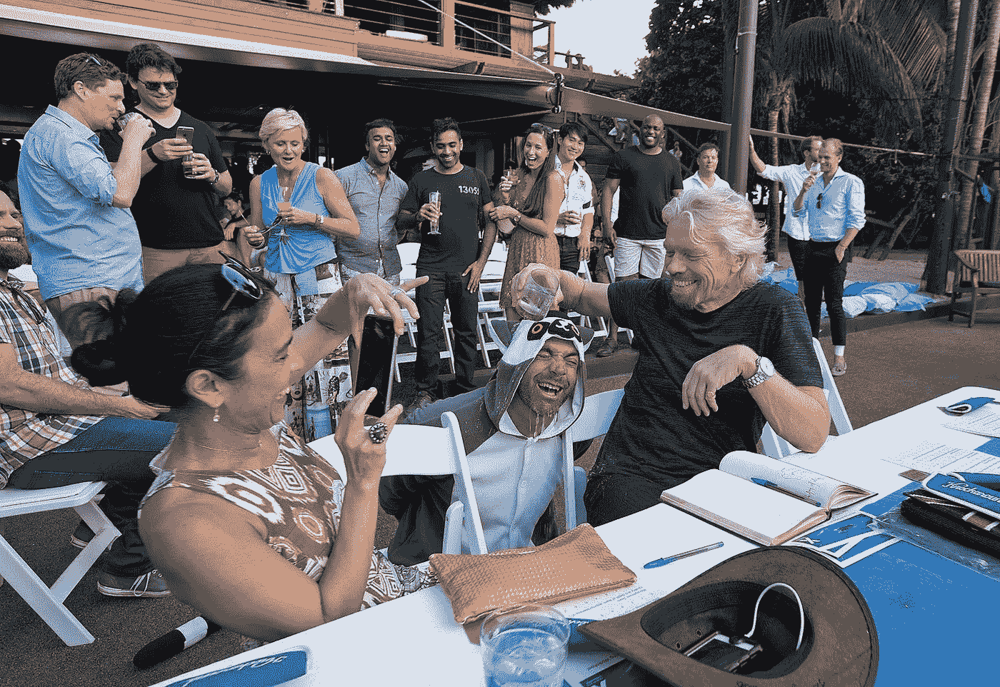
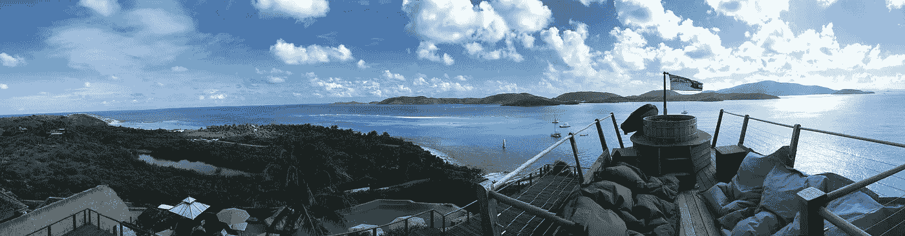
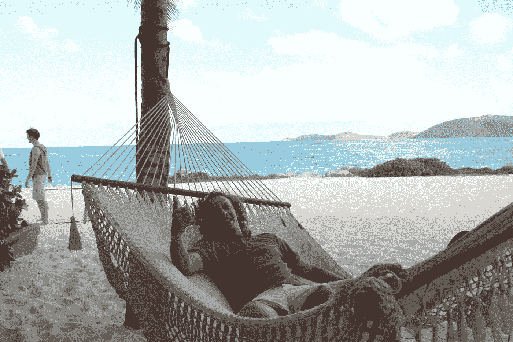
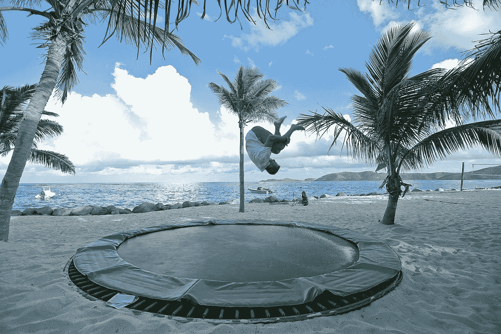
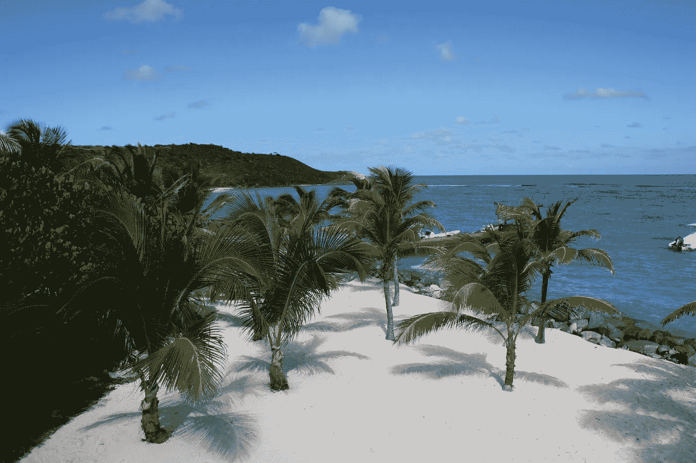
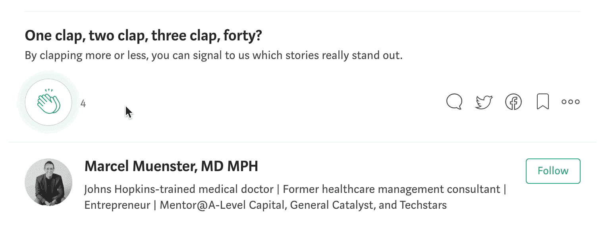

# 如何破解你的思维，像理查德·布兰森一样思考

> 原文：<https://medium.com/hackernoon/how-to-hack-your-mind-to-think-like-richard-branson-959dc53238b7>

## “努力工作，尽情玩耍。”

Extreme Tech Challenge, Necker Island

*创业不插电博客系列之一:博客 5*

我最近的在 Reddit 最大的[企业家](https://hackernoon.com/tagged/entrepreneur)频道上的 [AMA](https://redd.it/880ubr) (问我任何问题)是一次伟大的回忆之旅。其中一个用户让我分享我最疯狂的创业故事。我最难忘的经历是在理查德·布兰森的天堂内克岛见到他。

理查德·布兰森的生活方式和商业成功让我钦佩不已。作为最著名的连续创业者之一，我们可能都读过他的“努力工作，尽情玩乐”的经商之道。

> “我不认为工作是工作，玩耍是玩耍。这都是生活”——理查德·布兰森

就我个人而言，我只是通过他的《失贞》《去他妈的，我们做吧》之类的书认识他的。阅读他的信仰是一回事。听他谈论他们是一种完全不同的体验。亲自去。在内克岛上！

View from the Great house, Necker Island

回到 2015 年，我有幸代表我的第一家创业公司 TraveDoc 参加了[极限科技挑战赛。](http://www.extremetechchallenge.com/)布兰森在他位于英属维京群岛的私人岛屿上举办了这场活动。但是这个博客不是旅行报告。相反，这是对我的连续创业者或首次创业者的一个鞭策，让我把布兰森“努力工作，尽情玩乐”的态度放在心上。

六年前，我从一名“学者”一跃成为一名全职的、第一次创业的科技创业者。我热衷于改变世界。

在创业的早期阶段实现工作与生活的平衡是一项挑战，这一点毋庸置疑。然而，这也是你成功的必要条件(也是保持激情和能量的必要条件！).

在内克岛度过的时光和向他本人的学习教会了我如何达到这种平衡以获得最终的成功。

> “后悔没做某件事比后悔做了某件事更糟糕。意味着我可以问心无愧地睡觉了。我们都必须为我们的价值观而战，保护对我们重要的东西，但也要欣赏生活带来的快乐。”—理查德·布兰森

Richard’s hammock, Necker Island

你需要在你的生活中开辟出一些不被战略、筹款和招聘所困扰的时期。经验丰富的企业家知道这说起来容易做起来难；实际上，你每时每刻都在做这三件事情中的一件。

我找到的最好的方法是什么？腾出时间与鼓舞人心的人交谈，以理清你每天的混乱。重获你的创造力不仅有助于你开发创意，也有助于你建立自己的公司。

> “一项业务必须参与其中，必须充满乐趣，还必须锻炼你的创造本能。”—理查德·布兰森

Wild night on Necker Island

我在 2017 年 2 月改变了我的生活和商业方式。作为震撼我生活的经历的结果，我知道改变是必要的。布兰森的方法似乎很完美。事后看来，我希望我能早点采取行动。

以下是我为保持头脑-身体-灵魂三重平衡所做的事情，因此，工作-生活的划分不会那么混乱:

**头脑**

直到一年前我做出改变，我总是优先考虑工作，而不给我的大脑必要的休息。当你对一个项目充满热情时，你所想做的就是 24/7 的工作，努力做到最好。然而在这样做的时候，你通常会陷在自己的方式中，以至于只见树木不见森林。

当我意识到我的习惯正在损害我的生产力时，我开始更加关注我的睡眠。现在，我不再在睡觉前翻阅电子表格，而是通过阅读一本好书或了解我一无所知的话题来放松。最终，我的目标是刺激我大脑的不同部分。

附:这在网络对话中也会有所帮助！对一系列话题有一个基本的了解有助于任何对话的进行。

P.P.S:你知道你的智能手机“发光”会影响你的睡眠吗？减少睡前 15 到 30 分钟的[屏幕时间](https://www.webmd.com/sleep-disorders/features/power-down-better-sleep#1)有助于改善睡眠。

That’s me feeding lemurs on Necker Island

**正文**

我一直是个活跃的人:跑步、健身、爬山，只要你说得出的。但是我的创业生活把事情搞得天翻地覆。我不仅忙得不可开交，漫长的一天让我筋疲力尽，而且很难找到动力。

我做的第一个彻底的改变是我的饮食。我改用蒂姆·费里斯的慢碳水化合物饮食法，不吃糖和白色碳水化合物。这是我一生中最彻底的改变之一。

我的工作效率几乎在一夜之间就达到了顶峰。太令人震惊了。一天中的任何时候都不要再吃会让我慢下来的油腻食物。

我还拿起了我以前的训练计划。现在我回到了正轨，每周锻炼五到六次。结果是:我瘦了，自我感觉也好多了。别再找借口了。无论何时何地，我都会挤出时间。

而且不仅仅是我(还有蒂姆·费里斯)！几项研究表明，低碳水化合物饮食有助于减肥，降低有害胆固醇，降低患心脏病的风险。对于那些想了解更多影响的人，这里有一本[的好书](/gethealthy/how-to-avoid-a-carb-crash-and-other-productivity-hacks-861e187fab82)。

Beach trampoline, Necker Island

**灵魂**

我的许多企业家朋友相信冥想是一种找到你的禅的生活方式。当我在去年二月做出改变的时候，我就开始了，不可否认，这很难开始。找时间“安静”会让你觉得时间最好花在开始的时候。然而，养成一个习惯可以让你保持一致，并帮助你快速适应这个习惯。

一个简单的开始方法是下载像[平静](https://www.calm.com/)和[顶空](https://www.headspace.com/)这样的应用程序。它们使用起来简单直观。一开始，我建议每天早晚练习五分钟。

冥想有助于改善你的睡眠、能量水平和幸福感。制定一个常规会帮助你变得更有效率！

> "学习任何事情的最好方法是实践."—理查德·布兰森

Red dock, Necker Island

你努力工作。如果你是一名企业家，这是理所当然的。你也可以努力为你的企业家精神充电。或者，也许你做了一些完全不同的事情。

告诉我:你是如何放松的？在下面的评论区分享吧！

➡️每周从你的收件箱里收到一篇值得一读的文章。[在这里报名](https://goo.gl/forms/p6gnR2OTUiZc47in2)。🙏

PS:大家可以拍手跟我来，这样会有更多的人在 Medium 上看到这篇文章(见下面的视频)。👏 👍

你可以通过以下方式联系到我:

**推特:** [@marcelmuenster](https://twitter.com/marcelmuenster?ref_src=twsrc%5Egoogle%7Ctwcamp%5Eserp%7Ctwgr%5Eauthor)

**个人网站:**[about.me/marcelmuenster](http://about.me/marcelmuenster)(了解更多关于我的信息并安排通话)

**LinkedIn:** 给我发一封[的邮件](https://www.linkedin.com/in/marcelmuenster/)或一封[的直接消息](https://www.linkedin.com/in/marcelmuenster/)