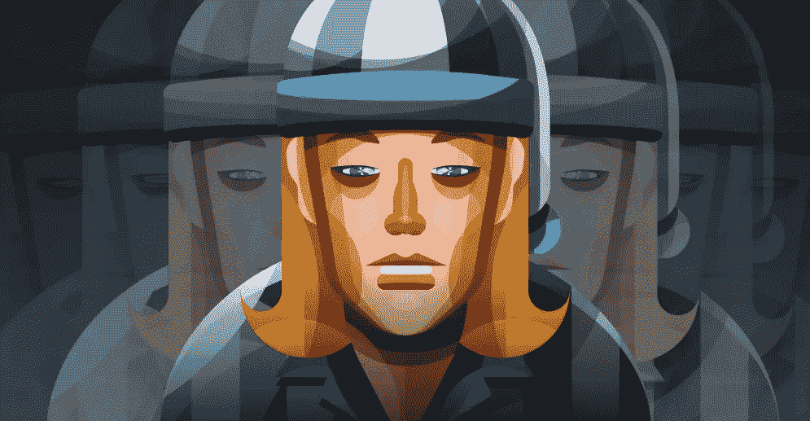
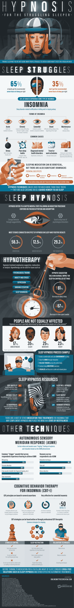

# 如何通过催眠破解你的睡眠周期

> 原文：<https://medium.com/hackernoon/how-to-hack-your-sleep-cycles-through-hypnosis-b41d522910fb>

像许多情况一样，失眠的常见潜在原因往往在于我们的饮食、锻炼习惯(或缺乏锻炼)和压力。甚至其他精神健康诊断可能会出现影响我们入睡和保持睡眠的症状。对于一些人来说，安眠药是一种可靠的治疗方法，但围绕人类睡眠周期的神秘使得药物不是每个人的选择。副作用包括潜在的依赖性，记忆力问题，讽刺的是，嗜睡。幸运的是，除了药物治疗之外，还有其他治疗睡眠障碍的方法，而且很多正在研发中。

由于睡眠的敏感性和高度个体化的性质，针对睡眠障碍的治疗和个人方法一直在寻求睡眠催眠方法。催眠不仅仅是魔术师的派对把戏，它背后的科学隐藏在我们潜意识深处；催眠其实只是暗示性的一种练习。大多数关于催眠和睡眠行为效果的研究都显示出大约 60%的积极效果。

我们生命中有三分之一的时间是在睡眠中度过的，难道我们不应该尽我们所能来确保我们在梦境中获得最多的时间吗？看看这张信息图，了解更多关于我们集体睡眠的状况，开发失眠和其他睡眠状况的疗法，以及催眠疗法如何成为一些人夜间睡眠斗争的关键。

