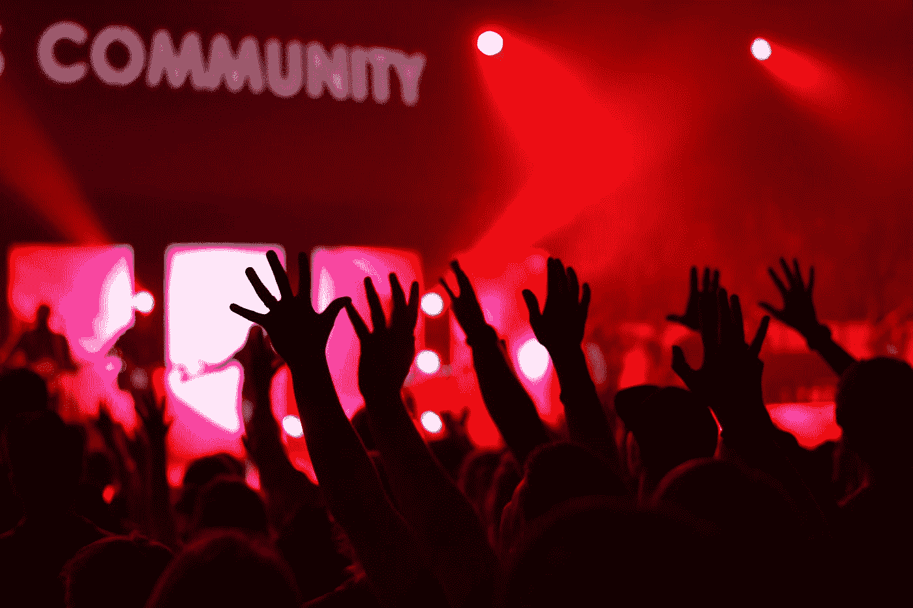

# 如何在社交媒体上获得成功

> 原文：<https://medium.com/hackernoon/how-to-hack-your-way-to-success-on-social-media-c465669cff48>

[**@imstevecampbell on Instagram**](https://instagram.com/imstevecampbell)

## 注意:这个帖子只针对 2018 年的观众。

我为自己是[一个被困在营销人员体内的黑客](https://hackernoon.com/what-it-means-to-be-a-hacker-trapped-inside-of-a-marketers-body-d89413830273)而自豪。这是一个镜头，通过它我可以看到世界有一点点不同于 T4。

正因为如此，我不常公开承认自己是“数字营销者”。不，你更可能发现我把自己标榜为专业作家、个人品牌专家，或者仅仅是内容创作者。

因此，当我谈论像社交媒体或营销这样广泛的话题时，我喜欢尝试给讨论带来一些新的或不同的东西，因为**这是你提供价值的方式**。

正如我之前提到的:

> 营销世界已经发展到了这样一个地步，众所周知，企业和品牌需要在这些平台上有意义的存在。

也就是说，仍然有很多人从根本上不理解*如何创造“有意义的存在”*

更糟糕的是，如今围绕“社交媒体上的成功”的许多信息往往涉及过时的策略和快速致富(至少在追随者增长方面)的计划。

这并不令人惊讶。毕竟， ***营销者毁了一切*** *…*

但是，鉴于这些社交平台将继续存在，我想尝试为这场对话提供一个新的视角。如果你足够关心这个话题，点击这篇文章，我希望你会发现这里的信息很有价值。

# ①确定听众时间的价值

Photo by [Lukas Blazek](https://unsplash.com/@goumbik?utm_source=medium&utm_medium=referral)

## 每个人都珍惜自己的时间。对于营销人员来说，我们的工作就是尽我们所能去乞求、借用和窃取消费者的注意力。

这一点，你很少听说，但这是我经常想到的。

也就是说，要想在社交媒体上取得成功，你需要深入了解你的目标受众如何重视他们的价值。

对于许多营销人员来说，社交上的成功可以归结为一个简单的等式:

`**Impressions** x **Frequency** = **Engagement** + **Attention**`

注意力，或者说“把注意力集中在一个物体或一个想法上”，是这个游戏的名字。因此，注意*黑客*、这里讨论的，在很大程度上是我们这一代的流行病。

作为 2018 年的营销人员，你正在与所有人竞争，所以你需要尽可能地尝试和发展任何竞争优势。

我们都知道，**较短的副本**通常效果更好，**视觉效果**帮助很大，你应该总是为**移动**进行优化。

我们不经常考虑的是:

1.  这些目标受众到底是谁
2.  他们如何度过一天/一周/一月/一年
3.  他们认为什么信息最有价值

通常，营销人员只关注特定的人群。*“我们的目标是吸引住在郊区、每周在全食超市购物一次、年龄在 24 岁至 34 岁之间的妈妈们……”*然后他们会针对这个特定群体投放广告。

2018 年这还不够。

你需要**侵入你的核心消费者的头脑**。是什么让它们滴答作响？他们是如何打发时间的？他们发现了哪些有价值的信息？

然后，一旦你放下那些无形的东西，你就可以为他们创造一些有价值的东西，表现出你真的了解他们的需求。

> 拥抱创造力，因为它是一个变量。创造力值得关注，尤其是当它和价值结合在一起的时候。

也许你的目标主要利用社交来快速逃离一天。也许他们在寻找灵感，或者围绕某个话题的提示和建议。

又或许，是这些东西的结合。也许这里有一些关键的东西是你的社交媒体营销努力目前没有覆盖的。

当你开始拥抱以上，你会开始在社交媒体上找到成功。印象和频率之类的东西会让你与目标受众有更多的接触，但是考虑他们如何珍惜他们的时间会让你获得他们更多的关注。

# ②尊重你所在的每个平台

Photo by [Jakob Owens](https://unsplash.com/@jakobowens1?utm_source=medium&utm_medium=referral)

## 这是我经常看到的事情，然而，90%在社交媒体上推销自己的人仍然从根本上犯了错误。

要想获得成功，你必须尊重平台。

同样，你需要了解你的目标受众如何珍惜他们的时间，你需要了解用户在访问某些平台时的心态和意图。

作为一个[出版物所有者](https://theascent.pub/)就在媒体上，我总是看到这种情况。我们收到无数提交的文章，有大段(未经编辑的)文字，没有图像的帖子，以及极短的阅读……尽管在这个平台上并不缺少成功的证据。

不要误解我，你可以也应该尽你所能将你的个性注入你的社交媒体形象和品牌中。

但是你创建和消费内容的每个平台都有一定的优势，充分利用这些优势可以创造新的机会。

> 你不能违反规则，直到你完全理解它们。世界上最好的数据安全专家也是世界上最好的黑客，这是有原因的。

说到社交，除了别的以外，我坚信应该采取一种**测试、学习和适应**类型的策略。这就是[我如何在短短 10 天内成为两个独立类别的媒体](https://writingcooperative.com/i-bet-i-can-make-you-a-top-writer-on-medium-in-7-days-time-66534a041bb5)上的顶级作家。

此外，这里有一些你不常找到的建议:

## 使用微妙的自动化对你有利。

涉足自动化，尤其是在我的世界里，通常是一个大禁忌。每当我被一个新的追随者自动拒绝或“问候”时，我个人都会鄙视，仅仅因为我知道这种互动不是真诚的。

我并不孤单。*这里有多少人讨厌自动消息和评论？* ✋

然而，我认为如果使用得当，**随着时间的推移，自动化可以在你的账户发展中扮演微妙的角色**。

正如我上面提到的，人们珍惜他们的时间。自动化社会互动的作用是告诉这个人他们不值得你花费实际时间。即使你认为你做得很好，他们也不喜欢，而且**他们更希望那 3 秒能回来**。你实际上剥夺了他们的时间。

> 那么，微妙的自动化实际上是什么样子的呢？

**精细自动化是大规模自动化低风险、高回报功能的行为。**这是关于你的目标、耐心和不贪婪。这也是为了让*看起来*尽可能像个人。

全天喜欢 Instagram 上来自某些用户或标签的帖子(我最近发现[这篇文章](/the-mission/how-to-automate-an-effective-instagram-bot-that-isnt-spammy-b2146a2c0b19)，减去附属链接，是一个很好的资源)是低风险高回报活动的一个例子。这是一个很好的互动，不管它来自谁，并且随着时间的推移，有能力产生额外的关注。

比方说，我放弃写这篇文章，而是坐在这里自己一天执行数百个目标赞的机会成本很高。付钱给别人做这件事也不值得。在这种情况下，尽管是最后的手段，微妙的自动化是关键。

不要为自动化而疯狂。如果你要自动化任何东西，确保它是单调乏味的。否则，尊重你所在的平台，尽可能地像个人一样。

# ③利用你所掌握的工具

Photo by [Barn Images](https://unsplash.com/@barnimages?utm_source=medium&utm_medium=referral)

## 我为自己是一个知道如何得到东西的人而自豪。

把我想象成摩根·弗里曼在《肖申克的救赎》中的角色。

因此，我的热情和爱好之一是寻找和测试新工具，尤其是那些能帮助我更有效地进行内容创作的工具。

当谈到控制社交媒体时，不缺少工具。见鬼，有些读到这里的人可能自己也在建造一些。

2018 年，在这里开辟你的成功之路意味着培养一种能力，在更多地方变得更加活跃**。就我而言，有两种截然不同的方法可以做到这一点:**

1.  **雇佣一个团队**
2.  **采用更好的系统和工具**

**为了持续有效地运营和执行顶级出版物、每周播客、每日 vlog 以及脸书、Twitter、LinkedIn、YouTube 和 Instagram 上的每日内容，我需要价格更优惠的好工具。**

**这里有一些我发现在我的社交媒体黑客工作中非常有用的伟大工具(抱歉，因为这些都是 iTunes 的链接):**

*   **[**CutStory**](https://itunes.apple.com/us/app/cutstory-for-instagram-stories/id917630934?mt=8) ，自动将视频剪切成 10-20 秒的片段，发布在 Instagram、脸书和 Snapchat Stories 上**
*   **[**JetPack**](https://itunes.apple.com/us/app/jetpack-hashtag-assistant/id1276424638?mt=8) ，一个 hashtag 助手，让你存储和访问不同的 30 个 hashtag 集，方便在 Instagram 上复制+粘贴**

*   **[**后来的**](https://itunes.apple.com/us/app/later/id784907999?mt=8) ，一个伟大的工具，为脸书、Twitter 和现在的 Instagram 提供了一个非常好的提前安排帖子的免费选项**

**利用你所掌握的工具来开辟你的成功之路。**

****

# **④拥抱渐进式改进**

****

**Photo by [Oliver Kiss](https://unsplash.com/@ninetothree?utm_source=medium&utm_medium=referral)**

## **一步一个脚印，越走越好。**

**[**忘记那些数字**](https://artplusmarketing.com/1-critical-thing-keeping-you-from-success-on-your-favorite-platforms-4351fec3001b) 。当你每天努力让自己变得更聪明或更优秀 1%时，这些数字最终会到来。**

**在上面第二条的基础上，花你的“空闲时间”去了解你所在的平台，学习他们的最佳实践。浏览一篇文章或跳过一段视频几乎不需要任何时间，而且你通常会学到至少一件新东西。**

**证据就在媒体上。如果你回到过去，看看我的一篇早期文章，你会发现我很聪明地加入了一张图片，并利用了 Medium 的一些特性，比如标题、副标题和引言。**

**你不会看到的是我现在采用的一些策略，既可以让**在视觉上区分我在这个平台上的作品**，也可以让**让人们参与进来**。**

**我说的是在我的标题中使用 ASCII 符号，以及在每一节的结尾使用小图片作为彩色的换行符。我说的是你会在本文末尾找到的临时 Instagram 和 Twitter 标志，它们链接到我的其他账户。**

> **我没有一下子学会所有这些策略，但是随着时间的推移，我学会了每一个，我开始一前一后地使用它们，现在它们一起工作产生了很大的效果。**

**当你遇到一个可能有助于你的工作脱颖而出的策略或想法时，试着采纳它，然后*根据你自己的风格和品牌调整它*。**

**每天进步一点点，随着时间的推移，你们的集体工作会越来越突出。**

****

# **⑤系统地参与你的社区**

****

**Photo by [William White](https://unsplash.com/@wrwhite3?utm_source=medium&utm_medium=referral)**

## **参与你的社区是你以前可能听过的建议。如果你像我一样，你已经听过无数遍了…**

**这是有原因的:它是真的，而且有效。**

**不久前，我终于决定关掉手机上的所有通知。我把金融和新闻应用留在了原处，但我的“社交通知”(我的大部分通知)已经不见了。**

**这本身真的创造了奇迹，解放了我一天中的某些部分。例如，当我想坐下来写一篇 2000 字的文章时，我不再需要整整 8 个小时才能完成。**

**然而，这样做的一个副作用是需要安排社交和互动的时间。现在，在每天的开始和结束时——或者每当我发现自己在旅行或者有一点儿休息时间的时候——我会在我的日历上留出时间来系统地参与。**

**当我去 Instagram 的时候，我会先看看那天我之前发的帖子。如果有任何意见，我一定会提出来。然后，我开始搜索并输入我最重要的标签。查看热门帖子，如果有任何与我有共鸣的，我会访问它们并参与其中。**

**访问一个新的平台，然后冲洗，并重复。**

**这释放了我更多的时间，因为它消除了我一天中所有的小暂停。**

**简而言之，我每天都在社交媒体上**开辟一条通往成功的道路**，如果你采纳了我在这里尽力传达的心态和一些行为，你也可以。**

****************************** [## 社交媒体-黑客正午

### 阅读《黑客正午》中关于社交媒体的文章。黑客如何开始他们的下午？

hackernoon.com](https://hackernoon.com/tagged/social-media)**