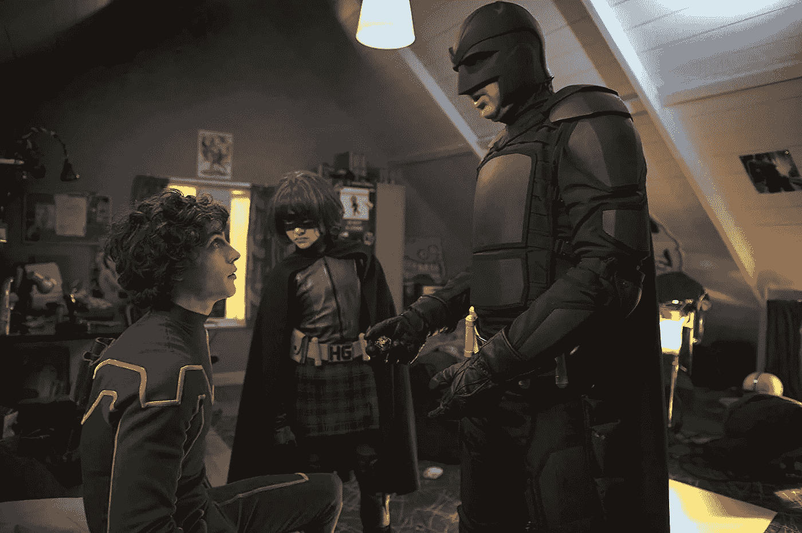

# 如何帮助你的家人免受比特币可能带来的灾难

> 原文：<https://medium.com/hackernoon/how-to-help-your-folks-from-the-possible-bitcoin-catastrophe-ce86ca6e8c3c>

我在社交媒体上观察到一些焦虑的问题。

> " ***为什么比特币没有恢复？***
> 
> ” ***涟漪的价格暴跌有什么原因吗？会恢复吗？***

我感到困扰，因为我在某种程度上理解心理压力。一些人已经投资了他们一生的收入，一些人甚至抵押了他们的房子。如果你认识这样的人，我建议你阅读这篇文章，如果我的理由有道理，请说服他们兑现他们的投资。

我说的不是已经合理投资的人。但是，那些没有交易经验的人，那些被“ ***快速致富*** ”骗局所害的人，以及那些不了解密码市场风险的人。

我不是能告诉你比特币是不是泡沫的专家。但是，如果事实证明这是一个泡沫，那么就会出现抑郁症，最糟糕的情况是自杀。我希望我们可以在某种程度上防止这种情况。我已经来不及接受和意识到，否则这本书会写得更早。

比特币的发明改变了游戏规则，其底层技术区块链肯定会对世界产生积极影响。但是*，*我们忘了问 ***发明的意图是否仍然成立？发明它是为了给没有银行账户的人提供银行服务，帮助移民，支持穷人，等等。*** ***让我们来做一个现实的检查。真相是什么？它帮助了贪婪的人还是贫困的人？它帮助了罪犯还是无辜的人？***

我可能错了(*我祈祷我是*)。写这样的文章我会出柜的。但是，我会抓住机会，因为我没什么可失去的。我只请求你考虑一个问题， ***如果怀疑者的恐惧是真的，结果会是什么？***

> 相信自己的人是愚妄的，但凭智慧而行的人必蒙拯救箴言 28:26

我们的思想与我们作对。它诱使我们做出愚蠢的决定。我想指出投资比特币时可能成为受害者的常见心理偏见。这些偏见同样适用于我们做出的每一个决定。即使我们研究了它们，它们在欺骗我们方面还是如此强大。你可以在《寻求智慧》或《清晰思考的艺术》中研究这些偏见。

乔在回家的路上。他注意到一群人在他朋友的茶馆附近。他决定去看看。这是一个三张牌的赌桌。当经销商看到乔时，他问“你想看看今天是不是你的幸运日吗?”？你为什么不投入 1 美元去发现呢？”这个游戏很简单，当庄家快速重新排列目标牌时，乔必须跟踪它。如果他赢了，他的钱会翻倍。如果他不这样做，他将失去他的钱。他决定试一试。第一次试投时，他投了 1 美元。他是对的，他拿回了 2 美元。他又重复了 10 美元，50 美元。他继续获胜。他认为自己有某种特殊的能力。一份礼物。这次他投入了 500 美元。当发牌员亮出目标牌时，乔快乐的脸变得严肃起来。经销商安慰乔“别担心，你为什么不再试一次？你只输了一次*却赢了三次？”。乔又下了 500 美元，结果输了。*

# 报酬

当我们因为一个行为得到奖励时，我们很可能会再次重复这个行为。前三次，庄家让乔赢了。他的行动得到了加强。以比特币为例，2013 年它的价格约为 300 美元，一年前为 1000 美元，上个月涨到了 19000 美元。如果一个初学者在时间线内投资，他可能已经上瘾了。这可能会导致他进行更高风险的押注。

# 一致性

乔本可以一走了之，而不是再次下注。他想让别人相信他是对的。这让他把口袋里最后的 500 美元押了出去。有一些人在想“ ***”我不想在卖出我不断下跌的比特币时面临损失。我必须证明我是对的*** ”。我们中的大多数人在某个时候都在一些项目上投入了时间或精力，尽管结果很差。一旦我们意识到我们在一个洞里，我们必须努力出来，而不是继续挖掘。目前比特币的价格是 14K 美元。人们仍然可以通过出售至少一些硬币而获益。

# 自负

> 所有的人都认为所有的人都会死，除了他们自己爱德华·杨

我们经常认为自己比别人更聪明。在乔的例子中，最初的成功使他过于自信。“ ***我已经连续赢了三次，我一定是特别的，*** ”他想。我希望人们考虑出错的可能性。我们要考虑这些问题" ***如果我错了怎么办？我会失去什么？我能处理吗？***

爱丽丝急切地等待着乔的归来。他们计划了一个浪漫的夜晚。她开始想是什么让乔迟到了？突然，她听到门铃响了。她朝门口跑去，却看到乔心烦意乱。“怎么回事？”她问。“那个商人，他骗了我”他生气地喊道。

# 自欺欺人

> “愚弄人比让他们相信自己被愚弄要容易得多。”马克·吐温

乔不承认他犯了一个错误。他反而责怪经销商。改正错误的第一步是接受。仍然有人相信比特币的价格会神奇地上涨。他们需要考虑否认的代价。

# 社会证明

> “但是其他人都在这么做。"

有些人会因为同伴效应而投资。如果你和一群吸烟者混在一起，你很可能会成为其中一员。最令人不安的事件之一发生在 1978 年 11 月 18 日，[琼斯镇大屠杀](https://www.huffingtonpost.com/adst/the-jonestown-massacre_b_8592338.html)。人民圣殿教的成员按照他们精神领袖的建议喝了毒药。社会证明是原因之一，他们决定宁死也不与群体疏离。记住， ***如果一百万人说一件傻事，它仍然是一件傻事——阿纳托尔·法朗士。***

# 确认偏差

我们经常看到我们想看到的。我们经常试图找到证据来支持我们的信念或假设。你会在谷歌找到“*个投资比特币*的理由”和“*个不投资比特币*的理由”的结果。但是，大多数人可能只搜索和看到前者。我要求他们找到反对他们决定的证据，并了解风险。他们的确认偏见可能使他们看不到这篇文章。这就是我依赖他们朋友的原因。我只提到了一些偏见。但是，我希望你明白我的意思。

*“我的积蓄都没了，很抱歉让你失望了”，乔结束了这个故事。爱丽丝看到泪水夺眶而出，她紧紧地拥抱着他，“没事的，我没有失去你”。*

不要依赖专家的预测。还记得之前的总统选举吗？从长远来看，比特币可能会成功。问题是多久？也许五年后，也许十年后。人们应该问 ***“我能坚持到那时吗？”***

> 我的下一个故事将是关于如何通过学习比特币的底层技术——区块链——来受益。跟着哈克农和我，这样你就不会错过他们。我不会把我的内容放在付费墙后面。如果你喜欢我的内容，你可以给我买杯咖啡来支持我。

