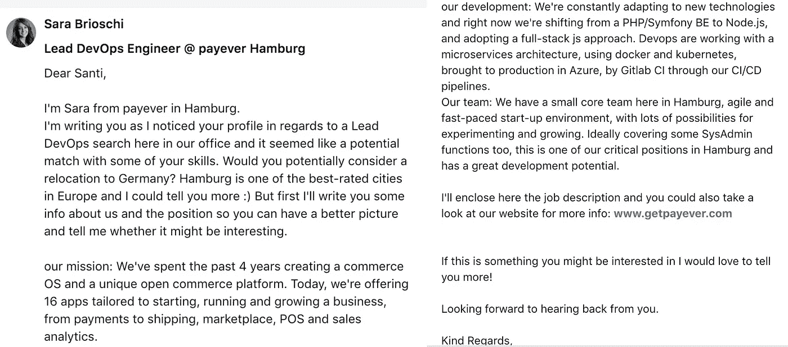

# 如何聘用 DevOps 工程师

> 原文：<https://medium.com/hackernoon/how-to-hire-a-devops-engineer-4e59e7847e9b>

Photo by [rawpixel](https://unsplash.com/@rawpixel) on [Unsplash](https://unsplash.com)

如今，在发展一个 IT 团队和公司时，最大的挑战之一是找到并雇佣具备必要技术知识和足够软技能的优秀专业人士一起工作。市场的巨大需求和这些职位所需的高度专业化的简历，使得招聘过程成为一个真正的挑战。

# 为什么是这篇文章？

我目前在阳光明媚的巴塞罗纳市的一家初创公司担任开发人员工程师，巴塞罗纳是一个创业中心快速发展的城市，这种发展与开发人员、开发人员、质量保证工程师、区块链大师等职位需求的增长密切相关

需求的增加意味着拼命发送招聘信息的招聘者的增加。我写这篇文章的目的是写下我对接触潜在候选人的过程的想法，以及从他们那里得到积极回应有多难。

# 我最终忽略了 98%的工作机会

和我的同事开发人员一样，我平均每天收到 3 份工作邀请，这意味着一周结束时，我会通过 Linkedin 或电子邮件收到 15 条直接信息，其中我最多回复一条，还有更多招聘人员的联系请求，我最终会拒绝。

不回复他们已经成为这个领域的正常行为，这并不是我真正感到自豪的事情。但这是有原因的，并不是因为开发者粗鲁:p

1.  许多工作机会甚至与我们目前的工作职位或经验水平都不接近。更不用说还有其他人名字的信息了。这表明招聘人员在联系候选人时完全缺乏过滤和个性化，迫使他们忽略这些信息。
2.  **缺乏信息或背景**。有些工作机会只是几行字，告诉他们正在寻找一个 DevOps，但没有任何关于公司、团队甚至职位本身的讲话。其他的工作机会来自人力资源咨询公司，他们不能告诉你最终的公司或工资范围，因为“这是保密的”，但这有什么意义呢？不提供关于职位和公司的基本信息可能会让应聘者失去兴趣。为什么不在第一枪就全部下注，让你的目标最感兴趣呢？
3.  我想说的第三点也是最主要的一点，**缺乏与其他公司的区别点**，这就是我认为对报价感兴趣与否的区别所在。那么我们就在文章下面的部分来谈谈这个话题吧。

# 如何在第一次接触中引起潜在候选人的兴趣

显然，所有的工作机会并不是为所有人提供的，每个人都有不同的情况，她/他或多或少会有兴趣倾听新的机会，作为一名招聘人员，你的目标是接触尽可能多的人，增加获得积极回应的机会，使用一些过滤器通过直接信息淹没 Linkedin。

发送标准工作邀请我们都认为回复率很低，这使得这个过程非常低效，作为一名工程师，我的直觉告诉我这可以改进。

在我看来，一份标准的工作邀请只针对那些积极寻求改变的人，但它并不能吸引其余的潜在候选人。

对我来说，一份标准的工作聘书只是规定了职位的名称和典型的要求，没有更多的信息，我可以告诉你，我已经收到了相当多的聘书，甚至没有这些。

> 你好，我有一个新的机会给你，如果你有兴趣，告诉我什么时候我可以打电话给你。

*当真？这更像是约会的信息，而不是工作邀请！*

我喜欢把招聘人员和潜在候选人之间的关系比作汽车经销商和潜在买家。上面的例子就像卖家试图卖给我一辆车，但没有给我更多的信息，如果我急需一辆车，它可能会工作，然后我会要求更多的信息，但如果我的车仍然工作，我可能会懒得重播。

那么让我们继续讨论整个问题的要点，**一条信息应该怎样才能得到那些不积极找工作的人的最大回应率呢？**

我已经考虑了很长时间，我想出了这几点可以增加工作机会的价值，目的是给它一个清晰的画面，也给潜在的候选人提供所有必要的信息，让他们对这份工作有第一个有用的看法:

1.  公司简介。像推销给投资者一样推销它。对于人力资源顾问来说，不要错过这一点，介绍你所代表的公司。只有公司本身才能给一份工作增加巨大的价值，这总是需要考虑的重要一点。
2.  使用职务的全局定义指定职务。很可能该职位的要点与其他公司的报价相同，所以最好给出一些一般要点，并将详细信息留给扩展报价的 PDF。
3.  列举出你的报价与其他报价/公司相比的区别点。这是最重要的一点，你是在向候选人推销 offer，她/他必须在看完这一部分后感到有动力，至少足以回复消息。这一点可以包括她/他将使用的技术/平台、将参与的项目、该职位的目标等
4.  说说团队。评价最重要的一点就是你的队友。不同公司的职位可能非常相似，大多数时候，你的团队和环境是让你决定跳槽到另一家公司的主要因素。
5.  谈论工作环境，办公室，福利。
6.  附上延长的工作邀请以及职位本身的所有详细信息。如果可能的候选人对主要信息感到兴奋，延长的工作邀请将是决定他是否感兴趣的一个重要因素。

在写这篇文章的时候，我收到了一份工作邀请，这是一个可以效仿的完美例子，它几乎具备了以上所有的要点，也证明了希望还没有丧失。经她允许，我很高兴与大家分享:)

# 建立一个社区

接近潜在候选人的另一个策略是参与他们的社区，在你的办公室里创建聚会，黑客马拉松，发布技术帖子，参加活动，最后，让你自己为人所知。

Photo by [Annie Spratt](https://unsplash.com/@anniespratt) on [Unsplash](https://unsplash.com)

# 摘要

因为我们在一周内可以收到大量的邀请，而其中大多数都缺乏信息/背景，所以要吸引潜在的候选人，必须努力给人留下良好的第一印象，目的是提供更好的回应率。

尝试添加本文中提到的所有要点，我们可以提高信息的质量和对潜在候选人的吸引力，使流程更加高效，使潜在候选人更加开心和舒适。

不要忘记参与社区活动，因为你的公司越受欢迎，你就越能吸引潜在的候选人，直到你不再需要浏览 Linkedin 寻找人才，因为他们会主动来找你:)