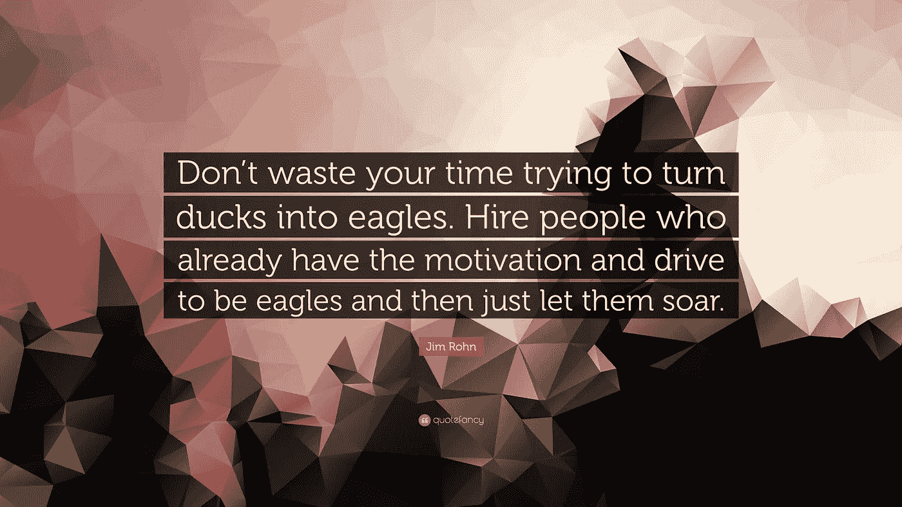
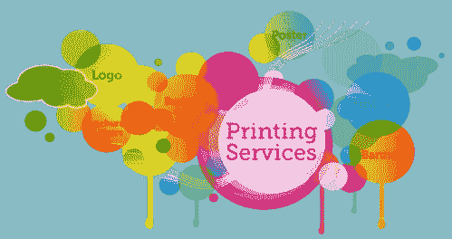
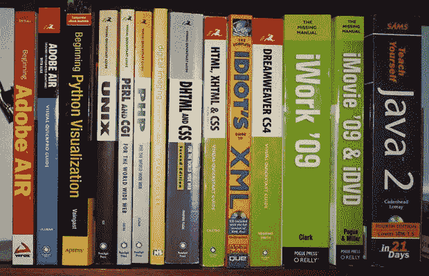

# 如何雇佣合适的设计师或开发人员

> 原文：<https://medium.com/hackernoon/how-to-hire-a-right-designer-or-developer-d4f24d78e2e1>

[图像来源](https://quotefancy.com/quote/837957/Jim-Rohn-Don-t-waste-your-time-trying-to-turn-ducks-into-eagles-Hire-people-who-already)

美国著名企业家、作家和励志演说家伊曼纽尔·詹姆斯·“吉姆”·罗恩(Emanuel James“Jim”·Rohn)引用道:“不要浪费你的时间去试图把鸭子变成老鹰。雇佣那些已经有成为雄鹰的动机和动力的人，然后让他们翱翔。这句话完全符合当今全球的商业生态系统，但要让他们像老鹰一样翱翔，你自己必须了解天空和飞行，尤其是当你为你的创业公司雇用设计师或开发人员时。

在雇佣“合适的”设计师或开发人员时，你应该想到更多的问题，以下是几个例子:

-你真的需要吗？

-你应该雇佣什么类型的设计师？

-除了技术知识，开发人员还必须具备哪些素质才能满足您的需求？

在进入面试大厅之前，我们先详细调查一下！

# 你真的需要一个吗？

在一个自身转变为超音速的生态系统中保持领先，在创新和创造力方面，吸引人群是一个巨大的挑战。你正处于数字在线创业和数字营销时代，仅仅创建一个网站或应用程序是不够的。你需要专注于深度，建立一些不应该与市场上任何其他产品重叠的东西。

在解决问题时，只有当用户界面或用户体验是最好的时候，你才是赢家。你提出的解决用户所面临的问题的方案，应该会带来令人愉快的、与众不同的用户体验。当你拥有无可挑剔的、杰出的设计师或设计师团队时，这也是可能的。

# 理解设计师的角色

设计师专注于 Photoshop 或 illustrators 来创作绘画或图片，试图创造用户在使用产品、服务或解决方案时的确切感受的日子已经一去不复返了。这种目光短浅的设计者只能提供视觉上吸引人的结果，却没有有效的用户体验。

你必须理解创建一个伟大的用户界面/UX 平台所需的工作。要做到这一点，对设计师不同侧面的理解是必须的。你可以将当今的设计师分为以下几大类:

# -平面设计师

图形设计人员可以执行以下操作:

**1。**创建图像、广告、图标、标志、印刷品等。
2**。他们是创造图像和图形的专家，但不仅限于此。
**3。许多平面设计师也是出色的网站设计师。****

[图像来源](https://www.indiamart.com/proddetail/3d-graphics-designing-services-14757327433.html)

通常，平面设计师缺乏将设计应用于网站功能的能力，因为他们不具备使用 HTML 和 CSS 构建网站的代码知识。

# -网站设计师

有需求的人，网站设计师，在网站上将你的愿景转化为现实。他们是设计和建设网站的专家。它们执行以下操作:

**1。**他们开发网站的图形，包括属于网页设计的布局。

**2。**他们有编码能力，可以编写一个网站。然而，他们还不够资格被称为“编码员”。

**3。通常，他们使用无代码网站构建器来创建网页。**

[图像来源](http://i2isoft.in/web%20design%20services%20company%20chennai%20india/web%20site%20design%20and%20development%20experts%20in%20chennai%20india/best%20website%20development%20company%20chennai%20india.html)

网站设计师不一定是优秀的程序员，期望他们完成工作是不合理的。

# -全栈开发人员

他们是创建任何你能想到的网站的大师。

**1。他们是出色的程序员，因此能够解决技术问题和复杂的功能。**

**2。他们是工程师，将负责你网站的基本技术框架。**

[图像来源](https://nootriment.com/th/brain-pills/)

开发者通常不太擅长设计和图形；因此，你不能指望他们是所有三种类型的设计师的军队。

# 拍摄！

你必须雇佣三两个以上的人来组建一个强大的团队。此外，你可以根据自己的需要和预算决定继续。因此，你可以雇佣一个平面设计师和一个开发人员，或者一个网站设计师和一个开发人员。与此同时，你必须评估你的需求，这样就不会发生错误的招聘。

# 你的期望是什么？

在雇佣设计师或开发人员时，你必须问自己很多问题才能做出准确的决定，比如:

-你希望设计师传达什么？

-你能详细解释一下开发者到底应该做些什么吗？

-你是否记录了每个页面、设计和图形的细节，以及你对网站或应用的愿景和使命？

你这方面的完全清晰会带来完美的招聘和最终的结果。这是你的清晰和想法，设计师将遵循和你的指导和蓝图，他必须遵循。为了详细说明，

a.你不能要求平面设计师“改造你的网站设计和优化网页”。为此，你必须聘请一个“网站设计师”。

b.同样，要添加自定义图像滑块，你应该雇用一名开发人员，而不是网站设计师。

因此，当专业人士的特定技能符合你的期望时，你必须雇佣他们。

# 合适的设计师或开发人员的先决条件

要想给你的客户留下深刻印象，并在竞争中领先，你必须用“鹰眼”来雇佣员工，而不要只雇佣第一个“看上去很像”的候选人。合适的候选人必须具备以下条件:

# 1.了解客户生命周期

他们必须具备客户旅程和体验的基本知识，因为这将有助于他们更准确地提出概念或愿景。他们对客户的理解将是推出一个最好的用户界面/UX 平台的决定性因素。

# 2.以开放的心态加入

设计师必须带着学习和再学习的开放态度加入组织。即使是一个有偏见的专家也不能提供你所期望的东西。他们必须乐于接受指导，提高自己的技能。

# 3.跟上工业的最新发展

他们必须熟悉全球或各州网页设计生态系统的最新变化、趋势、事件和发展。这将有助于开发者和你都处于领先地位，并实现最新的交付良好的用户体验。

# 4.一个好学徒

为了面对和竞争网页设计行业的最新趋势和发展，候选人必须是一个优秀的学生，掌握得很快。抓的越快，输出越好。

# 5.人际关系技巧

他们必须有良好的人际关系和沟通技巧，以便他们能够逻辑地工作，并证明他们的想法和工作。由于他们不会孤立地工作，他们必须能够与客户、组织内的各种职能部门合作，并实际讨论时间表、建议和想法。

# 6.自我驱动

一旦工作分配给开发人员，他们必须在最少的指导或干预下独立管理和工作。他们必须立即控制项目，并在时限内交付期望的工作，而无需管理层徘徊。

# 7.寻找他们以前的工作

要求他们以前的工作，找出他们的实力和相关经验。

# 8.询问具体的客户推荐人

尝试获得具体的客户推荐和参考，因为客户满意度是最重要的，是他们能力的证明。

# 9.求推荐

另一种方法是向你的同事寻求建议。你的朋友可能知道他们可以推荐的质量设计师或开发商。在你的专业领域，人们可能会遇到优秀的开发人员，并雇佣他们作为自己项目的自由职业者。他们可能希望向您推荐同样的产品。除了这些个人属性，你还必须评估他们的专业能力，为此你自己应该有一些细节，如:

**a .**PHP 和 Ruby 的基础学习，
**b.** 知道如何使用 CSS 以及何时使用它，
**c.** 各种 JavaScript 框架及其用法，
**d.** 互联网上各种网站都有，可以帮助你理解它们。

[**图像来源**](https://mashable.com/2010/09/17/hire-designer-developer-tips/#ryVwVxoH9aqV)

# 所需的技能

以下是任何设计师或开发人员都必须具备的技能:

**一、平面设计师能力:【Adobe Photoshop、Illustrator 等任何图像编辑器。**

**二。网站设计师的能力:**除了图像编辑还必须精通 CSS/ CSS3、HTML/ HTML5 和 PHP。

**三。开发人员/编码人员的能力:**他们必须具备 CSS/CSS3、HTML/HTML5、PHP、jQuery 和 JavaScript 方面的技能。

# 评估技能

稍微探究一些品质和经历，会让你对设计师的技巧有更深的洞察。

**一、设计和建造的演示:**让设计师使用或通过演示详细说明他如何使用代码设计和建造解决方案，可以突出他在设计中带来活力的能力。你也可以请他做原型。

**二。用户友好的设计流程:**对于设计师来说，理解用户需求并围绕这一需求构建流程以提供有效的解决方案至关重要。因此，一个好的设计师将永远在这些线上工作，而不是给设计师群体留下深刻印象。

**三。出现在设计师社区:**一个好的设计师总是喜欢和其他专业设计师保持联系，并通过在 Dribble.com 和 Behance.net 这样的网站上分享他的作品。这也将他们的作品置于扫描仪下，只有优秀的设计师才会欣赏和敢于这样做。

**四。它们对复杂性友好吗:**专为桌面网站设计已经成为历史。一个专业的设计师将有能力为不同的屏幕、显示能力和设备功能创造设计。

**五、最新趋势——社交媒体友好:**设计师或开发人员应该了解社交领域，并积极参与其中，能够创建一个用户界面/UX 平台，激励消费者分享内容。这将通过病毒式分享让你在增长牵引力上保持领先。

# 其他提示

建立一个网站或雇佣专业人员来做这件事是很有挑战性的，尤其是当你不是熟练的设计师或开发者的时候。因此，你必须记住以上所有内容，但即使如此，也要遵循一些规则，保持快乐，减少对成本与交付比率的担心。

**a .给招聘者分配一个小项目:**当你不确定被录用的候选人时，给他们提供一个小项目。这对创业来说是真实的，你必须首先启动一个小项目，并在项目完成并取得预期结果后继续前进。你也可以从一个非关键项目开始，这将使你免受任何可能的损失，同时，你可以评估被雇佣的设计师的能力。

**b .聘用资质优于技能的人:**聘用紧跟当前趋势、在方法上超前的设计师或开发人员总是明智的。这意味着有人不只是停留在特定的技术，但可以适应新的进步，并快速学习相应的交付。你可以通过问类似以下的问题来判断这一点:

给我们讲讲你最近学习的新编程语言。

**二。你在哪里以及如何了解网络产业的最新发展？**

**c .开放式问题:**试着在面试中问一些开放式问题，看看他们在沟通中的熟练程度，以及他们是如何解释技术术语的。你可以问以下开放式问题:

**一、**当不同的人管理相同的数据时，你如何管理 web 应用中的冲突？

**二。**分享一下你用过的设计模式，在什么情况下？

# 婚前约会

就像你在结婚约会前所做的那样，在特定的点上通过特定的参考资料来探索兼容性的后续工作将会让你对候选人的能力有一个深入的了解。通过询问以下问题，从至少三个过去的客户或证明人中找出候选人的执行能力:

一、分配的工作是否按时交付？

**二。**项目是否在分配的预算内进行？

**三。**候选人交付任务后，客户的满意度如何？

# 定义职务/工作简介

就像你必须估计你希望在任务中创造什么一样，同样，你也必须有一个明确的设计师的工作简介或工作大纲。这不仅有助于雇佣正确的候选人，还能避免以后潜在的延误和挫折。你可以立即开始工作后，招聘没有任何进一步的延误。

一、设计模型:与设计师分享你的理想设计，加快规划过程。设计师可以模拟梦想的设计，并实现理想的。

**二。分享样品设计:**你可以分享一些与你想要的设计接近的样品设计。你可以要求开发商建造或设计一个类似的设计，将你的设想作为背景。这将带来对他们能力的以下理解-

**a.** 对设计的理解，
**b.** 他们对你品味的识别有多准确，
**c.** 他们有多创新或创意。

# 面试的样题

你可以给候选人记下标准的面试问题，但是除此之外，你应该问一些可能有助于你理解他们的理解和概念清晰的问题，特别是关于你自己的品牌。几个例子是:

-发布后，您将如何更新网站？
-描述我们的品牌？你研究过我们的品牌吗？你觉得有什么不足，可以改进的地方？你希望怎么做？
-你认为一个有效的网页设计师应该具备哪些主要能力？

# 设计师招聘的预算分配

你可以决定雇佣一个自由设计师或者雇员，但是不管是哪种情况，设定同样的预算总是值得的。如果你是雇员，你可以保持一个固定的范围，但如果是自由职业者，可以有不同的方式，如:

- **小项目:**由于项目将有一个很短的时间框架，可能从几个小时到几天，尝试雇佣-按小时支付(有经验的设计师)和支付固定价格(经验较少的开发人员)。

通常，专家们按小时计酬工作，只是因为他们快速、高效地完成了工作，并且更愿意从事下一项工作。这样他们可以得到更多的项目。经验不足的开发人员可能需要一些时间，但这就是他们同意降低预算的原因。

- **大型项目:**这类项目通常需要专家，因为项目很复杂，需要更好的理解和多次修改。但是为了避免不愉快的经历，对你和设计师来说，确保你有完整的设计细节，并与专业人士讨论。你也可以雇佣一个经验较少的设计师，但是要对他们有耐心。以任何方式保持你的预算固定，因为每小时的工资对你来说可能会变得昂贵。

- **考虑预算的灵活性:**如果你不喜欢财务灵活性，那就自己定价格，因为这样只会吸引那些能按照你的预算工作的设计师。

如果你的预算灵活，你可以允许设计师报价，因为有可能你意想不到的低报价会从你这里抢走一个高质量的设计师。

# 它们实际上值多少钱？

自由设计师有两种市场和价格表:

-美国、加拿大或英国等发达国家
-菲律宾、印度或东欧国家等发展中国家。

价格卡可能看起来像:

# 雇用平面设计师的成本:

经验丰富的平面设计师-发达国家:60-120 美元/小时

发展中国家:每小时 20-40 美元

低端平面设计师新手-发达国家:每小时 25-35 美元

发展中国家:每小时 5-15 美元

# 聘请网站设计师的成本:

经验丰富的网站设计师——发达国家:80-150 美元/小时

发展中国家:每小时 25-50 美元

刚接触低端网站设计者的发达国家:25-45 美元/小时

发展中国家:每小时 8-18 美元

# 雇佣开发人员或编码人员的成本:

经验丰富的开发人员-发达国家:90-200 美元/小时

发展中国家:30-65 美元/小时

低端开发人员发达国家的新手:35-75 美元/小时

发展中国家:每小时 15-20 美元

# 聘请最好的！

与最优秀的人在一起是人们一直渴望的，这就是你选择工程师巴布的原因。我们提供世界一流的产品和服务，有充分的理由成为最受欢迎的开发者。

工程师巴布:

-了解设计师的真正角色。
——了解你的需求，从而理解你的客户的生命周期。
-虚心倾听。
——熟知行业最新动态。
——随时准备向你学习！
-拥有交付优质 IT 产品、解决方案和服务的传统和经验。
-可以容纳所有预算项目，从小到中到大。

**带发动机的汽车修理部:**

-全球客户的名单是无止境的。
-通过聊天，你有在录用前面试的自由。
-我们提供高质量的产品和世界级的服务，例如:

- Logo 设计
- Web 开发
- Android 开发
- UI & UX
-成长营销
- iOS App 开发。

# 结论

雇用合适的设计师或开发人员，尤其是对于技术不健全或刚起步的人来说，可能是一个难题，但有了专注的方法、一些基本的理解和寻找谨慎候选人的热情，任务就变得简单了。

如上所述，寻找一个有活力的设计师或开发人员似乎很有挑战性，但是一旦完成，你就会意识到你所得到的回报的成本和收益。你不仅会为无与伦比的设计感到高兴，还会为你的客户提供冲动的用户体验。

# 阅读我的其他 Hackernoon 文章

1.[我的非技术女联合创始人是如何为顶尖创业公司打造 45 位 CTO 的！](https://hackernoon.com/how-my-non-tech-female-cofounder-built-45-ctos-for-top-notch-startups-12a9a9a31167)
2。[做一个手机 app 要多少钱？](https://hackernoon.com/how-much-does-it-cost-to-make-an-mobile-app-7343dbd99f68)
3。[如何搭建一个交友 App？约会手机 App](https://hackernoon.com/how-to-build-a-dating-app-an-ultimate-guide-on-dating-mobile-app-aaa6964cb7f1)
4 终极指南。[如何搭建一个订餐 App？手机点餐 App](https://hackernoon.com/how-to-build-a-food-ordering-app-an-ultimate-guide-on-food-ordering-mobile-app-c19441826aca)
5 终极指南。[Mayank Pratap 如何打造 engineer Babu——一家盈利的 IT 服务公司](https://hackernoon.com/how-mayank-pratap-built-engineerbabu-a-profitable-it-service-company-generating-more-than-50-000-per-month-bcd3006bdbb5)

*我是 Mayank，*[*engineer Babu*](https://www.engineerbabu.com/)*的联合创始人。请随时联系我关于*[*Linkedin*](https://www.linkedin.com/in/mayankpratap/)*| mayank@engineerbabu.com* 此外 [EngineerBabu](https://www.engineerbabu.com/) 帮助初创公司、企业和所有者通过构建高级 IT 解决方案来发展他们的业务。他们开发的项目 95%都按时完成了。 [30+由风投](https://www.engineerbabu.com/casestudies)资助，获得最具创新总理设计奖，入选 Y-Combinator 2016 & 2017。