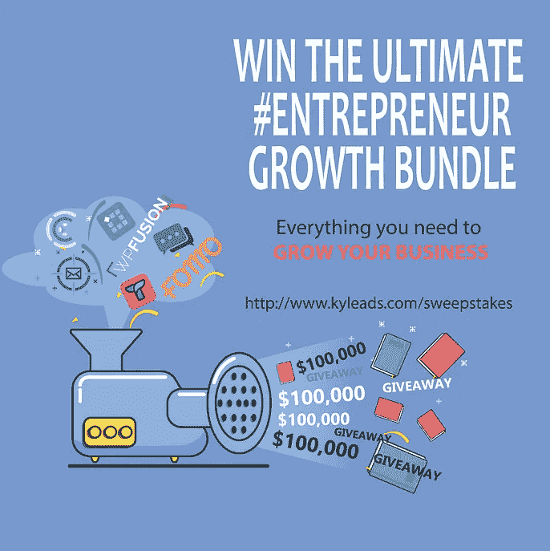
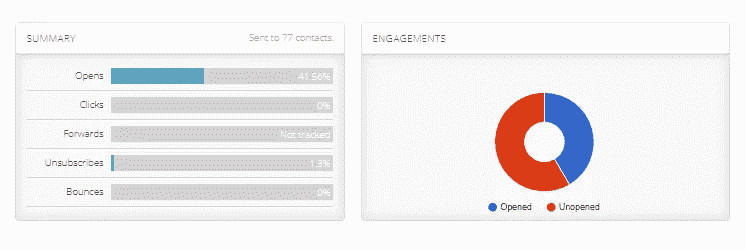

# 如何举办一个赠品，而不是粉碎它——我们的经验

> 原文：<https://medium.com/hackernoon/how-to-host-a-giveaway-and-not-crush-it-our-experience-2d086bf3bb58>

几周前，我们讨论了如何在测试版发布前为 [KyLeads](https://www.kyleads.com/) 建立知名度和电子邮件列表的想法。我们一直在其他平台上写博客和创建内容，所以每天都会带来一些访问者。

我们需要相对便宜的东西，因为我们没有关于我们的核心指标的数据，如 LTV、ARPU、MRR(我们知道，它是零)、用户价值、试用客户转换率等。我们唯一知道的是，我们想要能给我们带来奇怪结果的东西——快。

这意味着内容营销和[网站优化](https://www.kyleads.com/blog/website-optimization)被淘汰。它可能会给我们奇怪的结果——我不能说它会很快。

广告过时了。当我们不知道我们的数字时，我们不准备花很多钱。

宣传推广并不理想，因为当时我们没有任何令人信服的东西可以分享。经过一番自我反省，我无意中发现了一些关于如何举办赠品的帖子。

读了一点之后，我心想——这不会太难。一旦我把它推销给团队和几个朋友，每个人都同意了。我们把它锁定在六月初，然后开始工作。

这篇文章概述了我们做了什么，什么有效，什么无效，以及我们的主要收获。

# 我们是如何决定赠品的奖品的。

如果你在网上寻找如何为赠品选择最佳奖品的信息，建议是一致的。不要使用 iPhone 或任何其他普通消费品。原因是你会获得很多兴趣，但这些人不适合你的核心提议。

我们出售允许网站所有者[制作弹出窗口](https://www.kyleads.com/forms)和[测验](https://www.kyleads.com/quizzes)的软件，以产生更多的电子邮件订户并个性化他们的信息。

至少，赠品应该对拥有网站的人有吸引力。最好的情况是博客作者、数字企业家、作家等积极建立在线形象的人。有了合适的奖励，转化率可以高达 85%。

这意味着像 x 门票、电话、电脑等一般奖品被排除在外。

我们选定了一套与商业和营销有关的书。总的来说，有六本书是我亲自读过的，也有人向我推荐。这是一个很好的奖品，而且很便宜(不到 100 美元)。

我们可以像那样生活，但我认为我们可以做得更好。为什么不赠送一些相关的软件呢？KyLeads 可能不为人知，但有很多软件公司可以补充我们的产品。

我越想越觉得这听起来不错。我花了整整 30 分钟想出这个主意，并改编了一个快速模板，以接触到的人。

又花了 2 个小时编制了一份潜在合作伙伴的名单，并获得了决策者的电子邮件地址。总之，我最终列出了 30 家我认为合适的公司。

我亲自联系了名单上的每一个人。在发送第一封邮件的几分钟内，Ryan Kulp 回复并同意了一个终身帐户。

我很兴奋。这比我想象的要容易得多。在接下来的一周里，回复开始慢慢出现。

有些人不能参与，但他们仍然回答，让我很容易失望。他们对整件事都很冷静。

来自 [Buzzsumo](https://www.buzzsumo.com/) 的苏珊甚至感谢我对她的跟进。她最后说不，但她的回答令人鼓舞。向来自 [Groove](https://groovehq.com/) 的 Alex 和来自 Hunter[的 Francois](https://hunter.io/) 这样的人致敬，他们即使不必要也很有礼貌。

> **旁注** *:在这些情况下，最糟糕的事情莫过于有人拒绝你或者无视你的邮件。没有人会因为你给他们发了邮件而追捕你并破坏你的生活。只管去做吧。*

尘埃落定后，我们有了七个合作伙伴，还有几个表示了兴趣。在一封冷冰冰的邮件上，成功率是 20%。回复率约为 50%。

我们的合作伙伴包括:

[Inputkit.io](http://inputkit.io/)

[Tettra.co](https://tettra.co/)

[Usefomo.com](https://usefomo.com/)

[Wpfusionplugin.com](https://wpfusionplugin.com/)

[Complice.co](https://complice.co/)

[Pixelme.me](https://pixelme.me/)

忍者拓展

非常感谢所有参与的人。

我们的奖池已经扩大到 10 万美元以上。每家公司都赠送了至少一个终身账户。10 万美元是一个保守的估计。

不用说，有了这样的奖金池，我敢肯定我们会赢。

# 准备举办一个赠品

我们知道制造赠品是不够的。我们必须尽可能广泛地推广它。经过一番深思熟虑，我们决定尽可能多地进攻。

这将是有机的，广告，和其他人的网络。为了做好准备，我发起了一个脸书广告活动，创建了自定义图像，并编制了一份可能帮助我们传播信息的有影响力的人的名单。

以下是我们使用的一些图片:

为了找到有影响力的人，我搜索了与营销和创业相关的播客。名列前茅的是:

*   [着火的企业家](https://eof.com/)
*   纳特·埃利亚松秀
*   [重要的生活技能](https://lifeskillsthatmatter.com/podcast)。

在选定播客后，我浏览了过去的嘉宾，听了一些相关的节目，并做了笔记。

有 2000 多名客人可供选择。

然后我会去客人的网站，找到他们的电子邮件地址，并保存在一个 excel 文件中。最终，我有了大约 80 个名字和电子邮件地址。

我用来寻找影响者的另一个策略是输入“顶级营销博客”、“顶级小企业博客”和“其他相关博客”

我在寻找有影响力的人的合集，他们会发现赠品很有趣，并可能与他们的观众分享。

除此之外，我们还开展了脸书广告活动。我会在策略部分给你更多的细节。

# 设置多灌装量以获得最大结果

我们有很多赠品的目标。

*   通过让尽可能多的人关注《T4》来建立对《KyLeads》的认知。
*   获得更多电子邮件订户。
*   在脸书和推特上增加我们的社交媒体关注。

我们需要能够让我们不用手动完成大部分工作就能完成这些目标的软件。我们也想要一个内置病毒的软件。

我们看了 Gleam，kingsumo 和 Vyper。

我们最终选择了 Vyper 。设置过程非常简单。我非常喜欢 Vyper，因为他们有一个很棒的登录页面和一个排行榜来鼓励更多的行动。你可以在这里查看[登陆页面截图](https://www.kyleads.com/wp-content/uploads/2018/06/Contest-landing-page.png)。

您可以设置大量自定义操作，为参与者提供额外的条目，增加他们赢得大奖的机会。我们利用了这些特性。

我们决定采用三个奖励等级。如果您参加赠品，您将获得一份奖品，两名基于点数的获奖者和三名随机抽取的获奖者。

任何人都可能赢，每个人都保证会得到一份奖品。

评论博客文章，分享文章，在脸书和 Twitter 上关注我们，在社交媒体平台上分享，等等。一旦技术方面的一切都设置好了，我们就运行赠品，以确保一切都按预期工作。

赠品于 5 月 28 日上线。

# 我们用来推广抽奖活动的策略。

无论你认为你的赠品有多棒，如果你不广泛推广，它也不会有任何作用。我们做了很多准备，导致实际的赠品，现在是关键时刻。

我们有 14 天的时间要么做大要么回家。

# 被骚扰的朋友

我做的第一件事就是利用我自己的关系网来启动这个项目。如果需要支持你的人不支持你，那就一定是出了问题。幸运的是，我有一些很酷的人。

因为我们已经定期交流，所以我没有给自己强调我发给他们的邮件该怎么写。基本上是我告诉他们在社交网站上分享它，并列出所涉及的内容。

来自[博客向导](https://bloggingwizard.com/)的亚当通过推特把它发给了成千上万的粉丝:

你的关系网只有这么多。至少，我们的网络相对较小，所以没用多长时间就用尽了所有的途径。我们直接用电子邮件发送我们现有的名单。

# 通过电子邮件发送我们的列表

下一步就是让我现有的观众参与进来。这是一个独立于[和](https://www.kyleads.com/)的观众群，但仍然是相关的。在赠品上线的前一个星期五，我发了一封电子邮件让他们知道我有一个惊喜。

我没有让他们确切知道这是什么，但我明确表示，这是史诗。

在接下来的周一，我用一封更长的邮件透露了赠品的细节。目标是让他们知道发生了什么，这与他们有什么关系，并让他们点击了解所有细节。

这就是我们第一次获得赠品注册的原因。

在发放过程中，我们又发出了三封电子邮件。一种是让他们知道比赛已经进行了一半，并想办法获得更多的参赛作品(或者首先参赛)。

第二个是让他们了解当前的排行榜，并记住赠品。第三封邮件是宣布赠品只剩下几个小时了。

我想过激励我邮件列表中的落后者，但是当最后一封邮件的时间到来时，我决定反对。

# 脸书广告

脸书是一只善变的野兽。当我们准备这个赠品的时候，它向我们展示了它的本来面目。

谈到脸书广告，我是个老手。没有什么是一成不变的，所以我遵循一个简单的策略。想出你史诗般的广告角度，找几个创意，用小预算，调整直到你有一个赢家，然后扩大规模直到人们累了。

很直白。直到它不是。

我为 KyLeads 赠品做了一个广告宣传，并遵循了我会采取的正常步骤。

我制作了三套针对不同人群的广告。我为每个广告设定了 15 美元的低日预算，只是为了感受一下什么有效，什么无效。

我不会用细节来烦你，因为这不是这篇文章的重点。创建广告集后，我深入研究并为每个广告集创建了三个不同的广告。最后，我已经准备好了九个广告。

旁注:如果你在写广告，试着写长的和短的。我知道有哪个学派的冠军短抄。我不知道为什么。我经常看到长拷贝在面对面测试中表现得更好。问题是，如果有人阅读了所有的内容并点击进入，那么你更有可能得到一个转换。

我跑题了。

一切准备就绪后，我决定尽早支付我的未清广告余额，这样我就不会在比赛中遇到任何问题。所以，我点击支付，然后嘣，这就是我看到的。

我很生气。我对我花费的时间或我的帐户被暂时封锁的事实并不那么恼火。这是因为脸书的顾客服务是我见过的最差的。如果他们在同一个月内解决了这个问题，我会很幸运，更不用说在我们工作的时间范围内了。

我们试图联系他们，但他们在第一周没有回复任何有用的信息。我想花的那一大笔钱对他们的几十亿美元没有任何影响。

我必须向前看——要快。

# 绊倒在广告上

我们的下一个选择是 StumbleUpon 广告。我过去使用过它们，但我绝不是这个平台的专家。当我登陆他们的广告登录页面时，我看到了这个:

在这一点上，感觉好像全世界都在密谋反对我们和这场比赛。我有一瞬间的软弱，我想认输。它过去了。

我登录了我的 StumbleUpon 广告账户，看看是否能挽回些什么。那是美好的一天。我以前竞选的时候还剩下几块钱。我试着往我的账户里存些钱，他们马上就退还了。三次之后我放弃了。

我发起了一场运动并让它运行。这最终带来了几百次点击。

**边注** : StumbleUpon 本身也在经历转型。他们将于本月底(2018 年 6 月)搬到 Mix.com。对于一个承诺拥有数百万用户的平台来说，这可能是一个早期采用者的好机会。

# Twitter 广告

我之前在 Twitter 上做过一次广告。那是 2016 年的事了。当时我得到的结果让我决定把它一笔勾销。

我别无选择。脸书被枪杀了。Stumbleupon 被枪杀了。Pinterest 表现得像个混蛋。

我回到 Twitter，决定再试一次。在很大程度上，它类似于其他广告平台。我不喜欢的是如何实现跟踪。它不是放在 head 标签中，而是放在 body 中。

我不能让它和我正在使用的软件一起正常工作。最后，我不得不在谷歌分析中施展一些魔法。

我们制作了四个 Twitter 广告，并向全世界发布。

绝对结果还不错。

我们的目标似乎是关闭的，因为即使我们得到了成千上万的点击，他们转换很差。我再次调整了目标定位，这一次，每次点击的成本飙升了 100 倍。

不用说，我关掉了那个，也关掉了 Twitter。

**旁注:**推特上的人。在你的平台上很难找到数据。

# Quora 广告

当 Quora 推出广告时，我请求访问，但没有收到他们的回复。当时，我没有多想，继续我的生活。

直到我看到一家公司的广告，我知道这家公司处于早期阶段，每月无法支付 5000 美元以上的费用，我才再次感到好奇。

比赛期间，我们决定试一试。该界面类似于脸书，因为它有活动，广告集和广告。

我不喜欢的是有限的文本空间和他们的标点规则。他们一直反对我的广告，因为他们的软件不喜欢我构建句子的方式。我是一个长拷贝的粉丝，这有助于对点击我网站的人进行资格预审。随着时间的推移，我相信他们真正的客户——广告商——会改变这一点。

我该拿它怎么办？

与我用过的其他平台相比，点击费似乎有点高。通常，当你的点击率上升时，你的点击费就会下降。在我发送的一个直播广告中，点击率约为 1.5%(不错)，但点击费超过了 2 美元。我觉得很奇怪。我让广告持续播放，看看它是否能自我平衡。

最终，点击率和点击费分别降至 0.06%和 1.50 美元。

虽然它没有带来太多的流量，但我会在以后重新访问 Quora 广告，并真正深入了解如何让它为我们服务。

在这一点上，我们已经运行了我们的付费广告选项，甚至没有考虑谷歌，因为我们将要竞价的关键词太贵了。我们浪费了几天时间，没有时间或动力去调整展示广告活动。

这给我们留下了一些选择。

# 电子邮件外联

我们从一开始就知道我们会做大量的电子邮件宣传。我们只是认为在开始这个过程之前我们应该有更多的参与。

随便啦。

我们拿出数百封电子邮件的清单，开始工作。

考虑到环境因素，我们的结果还算不错。这些是我们发给人们的冷冰冰的电子邮件，希望他们推销我们的产品，而不给他们任何可见的回扣。我们的转化率大约是 15%。

也许他们在赌我们的未来和我们以后回报的能力。不太可能。回想起来，我认为这是因为比赛是史诗般的，他们是慷慨的人。

一些人对此非常冷静，在推特上分享，甚至给我们回了邮件。在一些情况下，它导致了有趣的对话和未来可能的机会。

像萨姆·赫利和 T2 这样的人帮了我们大忙。

# 接入现有流量

那时我们去 [KyLeads](https://www.kyleads.com/) 的流量不大，所以没有太多的流量可以利用。这并不是说我不能从我拥有的其他网站获取流量。

我在我的一个网站上放了一整页来宣布这个赠品。

我测试了两个版本的 CTA，看起来人们更喜欢“了解更多”这个短语，而不是“赢得比赛”

它转化了超过 53%的游客。

通过所有这些策略，很难监控通过特定渠道的转化率。我正忙着分割谷歌分析数据。过了一段时间，我只是监测总体转化率。

如果 KyLeads 有更多的流量，我们可以做很多事情。

1.  在所有页面上使用[浮动条](https://www.kyleads.com/forms)来增加认知度。
2.  在侧边栏中添加了行动号召，以吸引博客读者
3.  添加一个网站范围的弹出窗口，以建立更多的意识。

# 发布在社交媒体上

当然，我们在所有社交渠道上发布了赠品。我们将它添加到 Pinterest 上的多个群组板上，[使用这个工具](https://developer.linkedin.com/plugins/share)在多个 LinkedIn 群组中发布帖子，在 Twitter 上发布多次，在脸书发布了一个关于它的帖子，并在其他主要社交网络上发布。

令我惊讶的是，这个帖子在 Reddit 上几乎完全被忽略了。即使是那个告诉我去生活的巨魔也不行。只是被埋没了。

有很多关于如何使用特定社交媒体渠道的指南，所以我不会深入探讨。

# 我们本可以做得更好的事情。

我们是一个小团队。这是一个可以做得更好的时候。即使这只是通过虚拟助理的方式临时增加人数。

那不重要。回顾过去，我们可以做一些具体的事情来改善我们的赠品效果。

# 为挫折做好准备。

我没想到脸书会这样踢我们的屁股。我们花费了大量的时间和预算，在这上面投入了大量的资源。当它失败时，我们不得不努力寻找替代方案。

尽管 Twitter 带来了大量的流量，但它并没有很好地转化为我们的流量。与此同时，其他途径在我们有机会探索它们之前就关闭了。

我们本可以通过准备一些应急计划来减少这件事对我们的影响。这可能看起来像是提前在不同的网络上准备广告，并通过其他途径测试人们的兴趣。

最好的计划也可能会失败。这就是发生在我们身上的事情，我们最终变得被动，而不是在情况发生时积极应对。

我敢肯定，如果我们能够在中途回忆起自己，并朝着不同的方向前进，我们可能会有不同的结果。

吸取教训。永远为你的计划出错做好准备——它们会出错的。

# 写了一篇博文

我考虑过写一篇博客，因为正如我之前提到的，KyLeads 没有太多的流量。也就是说，如果我们写了这篇文章，并采取了独特的角度，这不会伤害我们。

除了举办赠品活动，这也是宣传品牌本身的另一个机会。

至少，它会成为一个有趣的读物。事实上，我们的大部分努力都集中在异地工作上。

展望未来，我们将博客不仅仅作为一种帮助客户成功的方式。是的，关于如何[创造引人注目的销售线索磁铁](https://www.kyleads.com/blog/lead-magnets/)的帖子是必不可少的。他们不是我们唯一能生产的东西。

我写这篇文章的事实就是这种承诺的证明。以前的我会对此保持沉默，继续我的一天。现在，我更倾向于分享。

# 与合作伙伴更好地协调

我们让合作伙伴参与促销的唯一方法是在赠品之前、期间和之后给他们发几封电子邮件。现在，不要把这和不和他们交流混淆了。

我们在流程的每一步都让他们保持最新状态。我的意思是，我们没有向他们推销。我觉得他们已经帮了我们一个大忙，所以我们有责任把消息传出去。

本着这种想法，我分享了一些我们为社交媒体制作的图片，并鼓励他们分享给自己的粉丝。没有其他专门的信息要求他们参与。

事后看来，我本可以选择战略机会让他们参与到各自的受众中。

1.  在发布会上
2.  中间点
3.  只剩下几个小时了。

不是每个人都会接受我的建议，但是那些接受的人会有很大的不同。展望未来，当我们进行交叉推广时，我们将为所有利益相关方创建宣传材料:

1.  社交分享图片
2.  发布到不同社交媒体网络的模板。
3.  电子邮件模板

用不用是他们的选择。[如果你通过降低人们的认知负荷和风险，让他们更容易少说，他们就更有可能参与](https://www.lynda.com/Leadership-Management-tutorials/Make-it-easy-say-yes-you/578056/615906-4.html)。

# 更好地识别影响者

我们的另一个不足之处是通过外联与合适的影响者沟通。我们使用了一种通用的方法，发给顶级博主的电子邮件在很大程度上被置若罔闻。

不出所料，给播客嘉宾的邮件中提到他们播客片段的特定部分得到了最高的回应。在某些情况下，这只是告诉我们，它不会是一个很好的适合。

想想看，他们不仅打开了我们发送的电子邮件，还阅读了它，并感到有必要回复一个完全陌生的人。

这显示了一封定制邮件的优点和力量。

展望未来，我们将专注于我们外联活动的质量，而不是我们外联活动的规模。显然说起来容易做起来难，但我认为我们有能力完成这项任务。

# 我们的赠品统计明细

最后，让我们看看我们从赠品中得到的结果。

总浏览量:150，000(赢)

脸书:1 万

推特:10 万(付费和有机)

Quora: 25，000(付费和有机——我是社区的活跃成员)

其他(黑客新闻、Reddit、Stumbleupon 等):15000

点击率:3.0%

访客总数— 4，500 名独立访客

页面浏览量 5 000

转换率(合计):3.62%

新电子邮件订户总数:163

虚假/无效或包罗万象的电子邮件地址:9 或 5%(平均约为 15-20%)

赠品期间的平均邮件打开率为 42%

新脸书喜欢:27

新的推特追随者:8

博客评论:14

病毒得分:42

Virality score 是 Vyper.io 的一个指标，它让你知道推荐在你的竞争中有多成功。从 1 到 100，数字越大越好。

正如你从我们的数据中看到的。我们得到了大量的原始信息，但最终，这些信息并没有带来我们想要的结果。

# 结论

我们做了很多正确的事情，也做了很多错误的事情。我对我们能够建立的学习经历和联系感到高兴。

我希望我们有 10，000 个电子邮件订户吗？当然了。

我担心这是更大趋势的一部分吗？一点也不。你有得有失。

我想再次感谢我们所有的合作伙伴，你们是真正的 MVP(队友那种，不是软件🙂)以及所有参与赠品的人。

如果你认为我遗漏了什么，请在评论中告诉我，不要忘记分享。

*最初发表于*【www.kyleads.com】

*请跟随我分享我们的创业之旅。*