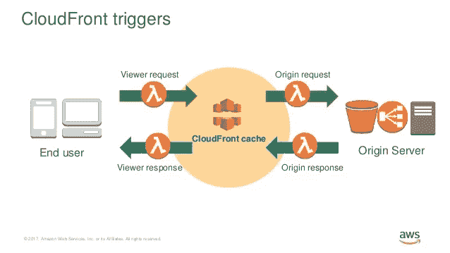
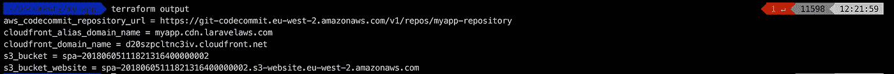
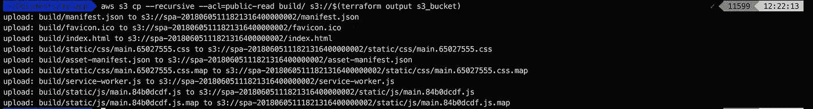
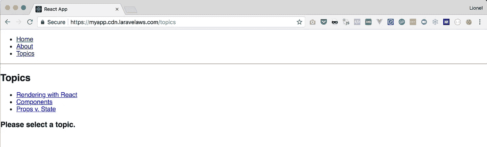

# 如何用 AWS CloudFront 和 Lambda@Edge 托管单页面应用程序

> 原文：<https://medium.com/hackernoon/how-to-host-a-single-page-application-with-aws-cloudfront-and-lambda-edge-39ce7b036da2>

## 配置 CloudFront 以支持推送状态 URL

这似乎是一个简单的方法，然而我被浪费在配置静态网站托管的 [AWS](https://hackernoon.com/tagged/aws) 上的时间震惊了，一定有更好的方法:

— **无服务器**:我们将托管静态资产，所以不要再浪费服务器了
— **廉价且超高性能**:通过利用 AWS CDN，我们将获得世界一流的全球分发和缓存，只需几分钱
— **自动化**:这不是 AWS 控制台的教程。我咨询的一些营销机构通常会每周部署新的登录页面或静态网站。如果这也是你经常做的事情，那么花一个小时把它自动化成一个按钮式的过程是值得的，不是吗？

## 关于自动化

即使是很小的事情，自动化也有非常强大的力量。随着时间的推移，其好处远远超过节省时间的总和，它将减少人为错误，提高服务的可靠性，让您的员工忙于更高价值的工作，并通过消除无聊的低价值任务来提高员工的士气。它改善了你的全球业务。

> 游戏改变者:有了 Lambda@Edge，我们现在可以配置 CloudFront 来支持*推送状态 URL*

到目前为止，在 CloudFront 上托管 SPA 的问题是，我们无法支持*推送状态 URL*，因为 CloudFront 不提供“无所不包”的配置，也就是说，我们无法为域的任何请求提供相同的`index.html`文件。解决方案是使用散列状态的“丑陋”的 URL，这对于大多数人来说是一个障碍。

2017 年，AWS 发布了 Lambda@Edge，这是一种在云“边缘”运行 Lambda 功能的服务，即在 CDN 查询其缓存之前/之后立即运行:

*   *查看器请求*:CloudFront 收到查看器的请求后
*   *原点请求*:在 CloudFront 转发请求给原点之前
*   *原点响应:【CloudFront 收到原点响应后*
*   *查看器响应*:CloudFront 将响应转发给查看器之前

这将让我们重写*源请求*上的请求，以便我们总是为所有推送状态路由请求服务`index.html`。快乐的日子！

Our origin-request Lambda@Edge function

## 我需要什么？

*   在您的 AWS 帐户中注册为托管区域的现有域名
*   适用于所有子域的通配符 SSL 证书
*   在您的机器上安装和配置的`terraform`和`aws` CLI
*   要部署的虚拟 React 或 Vue 应用程序

## 给我看看地形模块！

我已经发布了一个 [Terraform](https://hackernoon.com/tagged/terraform) 模块，它可以为您完成所有繁重的工作:

 [## li0 nel/terraform-AWS-单页-应用程序

### terra form-aws-single-page-application-terra form 模块，允许您使用 Git Push 在 AWS 上部署 spa

github.com](https://github.com/li0nel/terraform-aws-single-page-application) 

将示例文件复制到您的 SPA 根文件夹:
`wget https://raw.githubusercontent.com/li0nel/terraform-aws-single-page-application/master/examples/main.tf
wget https://raw.githubusercontent.com/li0nel/terraform-aws-single-page-application/master/examples/outputs.tf
wget https://raw.githubusercontent.com/li0nel/terraform-aws-single-page-application/master/examples/terraform.tfvars`
`wget https://raw.githubusercontent.com/li0nel/terraform-aws-single-page-application/master/examples/variables.tf`

This will pull the Terraform module from the Terraform registry

用您的`aws` CLI 配置文件名称、应用程序名称和域名替换`terraform.tfvars`中的值。确保您拥有*美国东部-1* 地区`*.cdn.mydomain.com`的现有证书。

运行`terraform init`，然后运行`terraform apply`，等待 S3 桶、Lambda 函数和 CloudFront 分布被创建:

现在，您可以在本地编译您的前端资产，并将它们直接推送到 S3 存储桶来部署您的应用程序:

`yarn build && aws s3 cp --recursive --acl=public-read build/ s3://$(terraform output s3_bucket)`

另一种方法是使用由 Terraform 模块创建的 CodeCommit Git 存储库和 CodePipeline 管道，让 AWS 构建您的应用程序，运行您的测试并在 S3 上部署。

不管怎样，您的应用程序现在运行在 CloudFront 上了！

The push-state URL working properly when refreshing the page

*莱昂内尔是总部位于伦敦的初创公司 Wi5 的首席技术官，也是《面向未来的工程文化课程* *的作者。你可以在【https://getlionel.com】*上联系他**