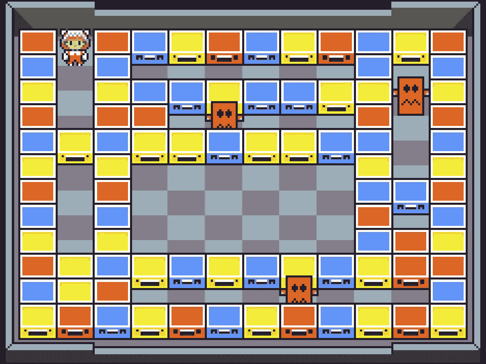
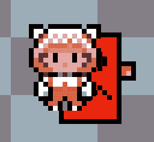
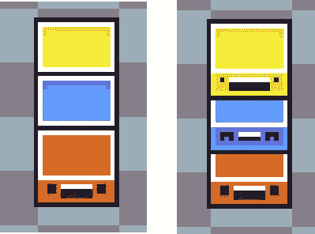
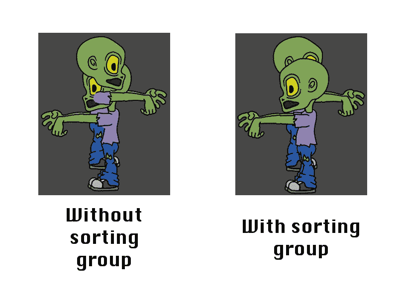
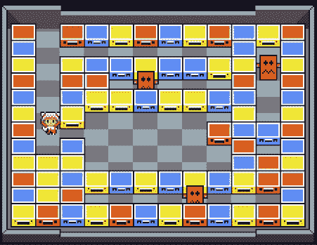

# 如何在 Unity 中实现 2D 等距视图

> 原文：<https://medium.com/hackernoon/how-to-implement-2d-isometric-view-in-unity-7717d4914eee>

我们的**push&Pully**游戏有一些等距视图。如果你还是不知道这个游戏，让我给你看一个截图:

Main game area (not the final sprites)

如你所见，这个视图介于自上而下和特定角度之间。更像是前置等轴相机。但是 2D 的 Unity 只有一台“普通”或正交的相机。(据我所知)你无法向摄像机表明你想要的是一个等距图。所以我们必须用代码来解决这个问题。

# 绘图对象如何工作

首先要理解的是，我们[在运行时从文件](https://hackernoon.com/generating-a-level-from-an-image-in-unity3d-225b51a68172)中读取级别定义后生成级别。所以我们必须画出每个物体，顺序很重要。作为 2D 游戏的一般规则，你画的最后一个物体会显示在前面的物体之上。

## 统一之道:分层

在 Unity 中，你可以为你的对象定义**层**。您还可以设置图层的绘制顺序。例如，你可以为你的角色定义一层，为敌人定义另一层。你可以设置它，这样如果两者重叠，敌人将永远在角色的后面。

Unity layer magic

即使你在同一层中有多个对象(想象不同的敌人或方块)，Unity 在层中有一个称为**顺序的属性，可以解决冲突。假设你实例化了 3 个块，在某个时候它们重叠了。然后 unity 将通过使用层中的顺序属性来解决这个问题:编号较大的层将始终位于顶部。不管你按什么顺序画。**

Objects in the same layer with different order in layer

但是当不同的层相互重叠时会发生什么呢？如果你有一个预置(非 Unity 人员的通用“类”),你会用相同的层和层中的顺序实例化很多次(比如我们的块),那该怎么办？

# 重叠解决方案

有两种可能的方法来解决这个问题。最简单的方法是改变每个物体的 z 坐标来匹配谁应该在上面。在 Unity 中，即使你在 2D 工作，你仍然在每个物体中有 3 个坐标。z 坐标定义了一个物体离相机有多远或多近。更改 z 坐标可以有效地将一个对象放在另一个对象的上面。

我真的不喜欢这种方法，因为感觉有点乱。我也不确定我的碰撞系统是否能正常工作。所以我决定研究其他方法，我发现了 Unity 的另一个很好的特性:**对组进行排序。**

## 什么是排序组？

想象你有一个由不同部分组成的精灵:一个头，一个身体，几条胳膊和腿。你想把所有东西都搬到一起，但是你该怎么做呢？你是否将它们放在同一层，并尝试获得正确的顺序？如果它与另一个同样由零件组成的精灵重叠会发生什么？

> 我将用取自 Unity 手册的[图片来解释这一部分，因为它们非常适合解释这一部分(我没有多图片精灵)。](https://docs.unity3d.com/Manual/SortingGroup.html)

为了避免这些问题，Unity 有一个叫做排序组的组件。这有两个属性:层和层中的顺序。就像精灵渲染器中的其他渲染一样。但是有了这个分类组，你可以把精灵的每一个部分都归在一个组里，所以即使它们在同一层里，在层属性里有不同的顺序也没关系。当渲染你的精灵时，排序组将有优先权。

这就是用不用的区别:

Check how the left image overlaps

# 为我们的等距视图应用排序组

我采用的解决方案是在**所有**我的 sprite 对象中使用排序组。

我使用的每个对象都有排序组组件。它们都在同一个排序组图层中(在我的例子中，我使用了默认图层，因为这无关紧要)。一个脚本根据子画面的位置控制那个(排序组)层的顺序。

我们显然需要动态的，因为玩家和敌人都在移动。我们需要在最后时刻更新层中的顺序，所以我们将在所有内容都更新后在 *LateUpdate* 中完成。

您可以在此处看到该脚本的示例:

topMaxPosition 只是一个属性，指示你的精灵可能在的最高位置。我需要从我的观点中减去它的原因是，我的视图需要屏幕底部的对象(接近 y = 0)在顶部。因此，我们需要“反转”我们的 y 位置，以便在排序顺序中使用它。

下面是实际运行的代码:

Pushy walking easily between layers of blocks

正如你所看到的，所有的积木都被正确放置，我们的玩家可以在它们之间行走。需要的时候积木会留下来。

# 那都是乡亲们！

我希望这篇文章可以帮助那些试图实现类似于我们等距视图的东西的人。如果你有任何疑问，请随时评论。

下周见！

