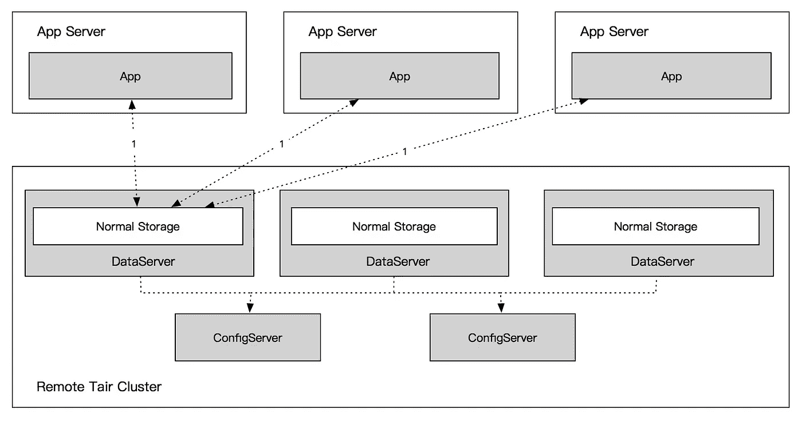
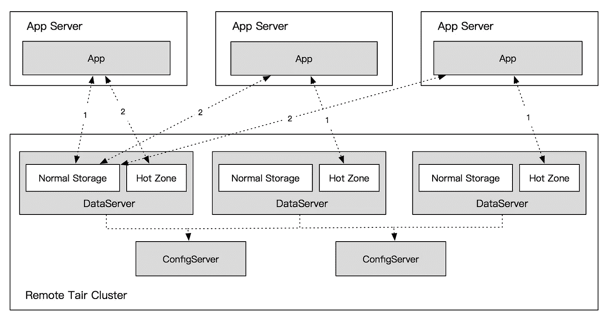

# 如何在弹性缓存平台上改进热点数据哈希

> 原文：<https://medium.com/hackernoon/how-to-improve-hotspot-data-hashing-on-an-elastic-cache-platform-6999d729e305>

*当购物者疯狂抢购阿里巴巴光棍节的特价商品时，其工程师正面临热点数据散列的挑战……*

答访问热点数据是分布式缓存平台经常遇到的问题，例如阿里巴巴电子商务平台上的卖家促销。

Tair 是阿里巴巴的内部弹性缓存平台，在整个公司广泛使用。它支持高可用性和统一的数据访问，提供高性能、可扩展性和可靠性。Tair 经过定制，通过独特的存储和访问机制来处理热点数据识别、读取和写入，从而减少性能瓶颈。

# “分布式”和“弹性”缓存平台

Tair 是一个弹性缓存平台，一种为云计算开发的分布式缓存平台。

分布式缓存将数据存储在集群中。数据集分布(或“分区”)在一系列节点上，每个节点负责一部分缓存数据，同时共同提供统一的访问接口。

随着云平台的快速发展，分布式缓存技术受到越来越多的关注，这导致了弹性缓存平台的发展。弹性平台强调动态可伸缩性(支持透明的服务扩展)和高可用性(集群处理节点故障的能力)。

分布式缓存平台使用数据散列进行数据分段和路由。

# 数据哈希和数据热点

许多分布式缓存平台应用一致散列算法。Tair 最初是由麻省理工学院的研究人员在 1997 年构想的，它使用了亚马逊在 2007 年提出的算法的改进版本。

一致性哈希算法将哈希空间划分为大小相等的数据分区，称为虚拟节点。这些然后被存储在缓存节点上，缓存节点的数量必须大于或等于虚拟节点的数量。每个缓存节点根据其容量被分配不同数量的数据分区。

哈希函数将客户端请求的数据键值映射到服务器位置。该位置被标记为令牌。令牌值再次被散列映射到分区标识符。

在客户端获得分区标识符后，客户端搜索缓存节点的分区服务器映射表以检索数据分区，然后访问其中的数据。

这种方法的一个局限性是每个单独的数据键总是映射到一个固定的数据服务器。当多个客户端需要访问同一个数据密钥时，这会导致问题，如下图所示:

因此，单个数据服务器节点成为读写单个数据键的瓶颈。这不能通过水平扩展节点来解决。

阿里巴巴不断以卖家促销的形式处理热点数据。因此，就如何管理热点数据而言，提高整个缓存平台的性能和可靠性是必要的。

# Tair 的改进热点数据哈希解决方案

Tair 的热点数据哈希解决方案以热点识别、热点读取和热点写入为目标，允许水平节点扩展。

读/写解决方案依赖于服务器首先能够正确识别热点。该解决方案还依赖于提供相应的客户端 API 来支持预先将特定数据键或命名空间的键标记为热点键。

# 使用数据服务器统计的热点识别

当数据服务器收到来自客户端的请求时，处理这些请求的每个工作线程都会生成统计信息。工作线程用于热点统计的数据结构是那些处于 ThreadLocal 模式并且完全解锁的数据结构。

热点识别算法使用精心设计的结合多级加权 LRU 链接和 HashMap 的数据结构。它生成完整的请求统计数据，并允许准确识别每秒查询数(QPS)热点和流量热点，后者出现在 QPS 较低但数据本身较大的情况下。这种方法依赖于服务器能够以足够的效率处理请求。

在每个采样周期结束时，工作线程将统计数据结构传输到统计线程池进行后台分析和处理。生成统计数据的任务在后台异步运行，不会占用正常数据请求的处理资源。

# 阅读热点

## 服务器端设计

该解决方案中使用的方法建立了一个隔离的 HotZone，它是数据服务器上的一个存储区，可以保证对热点数据的访问。

多级缓存架构如下所示:

跨数据服务器的 HotZone 之间不存在权重关系，并且相同的读取热点数据存储在每个 hot zone 中。任何数据服务器的 HotZone 上都随机实现了对 hot zone 数据键的客户端请求。

通过这种方式，单点热点请求被散列到几个节点上，甚至整个集群上。

## 客户端设计

每个客户端都被分配到一个 HotZone。在客户端初始化之后，在它发出请求之前，它会获取整个 Tair 集群的节点信息和完整的数据路由表，以及在所有数据服务器上配置的 HotZone 的总数(hot zone“节点范围”)。然后，客户端随机选择一个 HotZone 作为其固定的读写区域。只要数据服务器和哈希机器的数量保持不变，这个选择就不会改变。

客户端从服务器端接收热点密钥，该密钥在有限的时间内有效。在此期间，当客户端访问密钥时，它将首先尝试从 HotZone 节点访问热点数据。

HotZone 节点和存储源数据的 DataServer 节点构成了客户端已知的两级缓存模型。如果 HotZone 上的数据不可用，客户端将请求源数据节点；同时，获得的数据异步存储到 HotZone 节点。只需在 Tair 客户机中使用一个应用程序来调用接口，并通过标准方法检索数据。

热点反馈和识别的过程是透明的，多级缓存访问也是如此。HotZone 中缓存数据的一致性由初始化客户端时设置的过期时间来保证。过期时间由服务的缓存数据不一致的最大容许时间决定。

如果客户端本地存储的热点反馈已经过期，则数据键从源数据服务器节点读取数据。如果密钥在服务器端仍然处于热点状态，客户端将再次接收到热点反馈包。

因为每个客户端存储的本地热点反馈信息具有唯一的失败模式，所以永远不会出现所有请求同时返回到源的情况。即使所有请求都返回到源，也只需要读取一次源数据，最大读取次数就是所应用的机器数量。

如果在返回到源之后发现密钥不是热点，则客户端将返回到其正常访问模式。

# 写作热点

## 服务器端设计

写入热点不能使用多级缓存来解决，因为它们会导致数据不一致。如果工作机器崩溃，数据可能会被写入本地缓存，但不会异步更新到源数据服务器。

而是在服务器端通过请求组合的方式处理写热点。

IO 线程上的 hotspot 键中的写请求被分配到一个特殊的 hotspot，用于组合线程处理。这个线程根据 key 组合一定时间段的写请求，然后定时线程根据预设的组合周期将组合后的请求提交给引擎层。

结果不会通过组合过程返回给客户端。在请求被组合并写入引擎后，它被集体返回。这避免了多种问题，包括数据不一致、读取旧数据和错误写入。

可以在服务器端配置组合周期，并且可以动态编辑有效期。

## 客户端设计

编写热点解决方案对客户端完全透明，不需要任何编辑操作。

# 性能测试结果

在使用 LDB 存储引擎的集群上进行的压力测试发现，单个键组合可以实现每键数百万的 QPS 编码(组合周期为 1 毫秒，组合数量不限)。然而，对于实际的在线聚类，该周期被限制为 0.1 ms，并且一次的最大组合数被限制为 100。

这样，引擎层上单个键的最大 QPS 可以保持在 10，000 或以下(取决于应用程序的访问频率)。

Tair 客户机的包处理是完全异步的，这意味着热点请求的组合操作不会阻塞其他请求的处理。

唯一的负面影响是当客户端对 hotspot 键有写请求时 RT 增加。然而，使用现有配置(0.1 ms)，影响可以忽略不计。

(Original article by Liu Huan 刘欢)

# 阿里巴巴科技

关于阿里巴巴最新技术的第一手、详细、深入的信息。**关注我们**:【www.facebook.com/AlibabaTechnology 