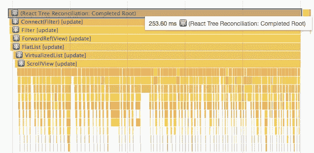
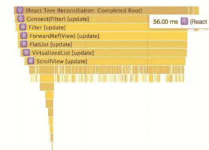

# 我们如何改进 React 原生列表性能(5X)

> 原文：<https://medium.com/hackernoon/how-to-improve-react-native-list-performance-5x-times-b299c8a23b5d>

Photo by [Sanjeevan SatheesKumar](https://unsplash.com/photos/iZp4h1gXiEQ?utm_source=unsplash&utm_medium=referral&utm_content=creditCopyText) on [Unsplash](https://unsplash.com/?utm_source=unsplash&utm_medium=referral&utm_content=creditCopyText)

最近，我的团队已经开始开发第一款大型 React 原生应用。很快，我不得不实现一个带有过滤器列表的页面:

# 问题

在页面的初始版本中，单击 checkbox 元素会导致明显的延迟。

*FlatList[update]* takes most of **250ms**

列表中有 75 个元素，在某一时刻只有 11 个可见。所以我期望 [FlatList](https://facebook.github.io/react-native/docs/flatlist) (它有现成的虚拟化特性)只重新呈现一个改变的元素(在最坏的情况下——只有可见的元素)。但是它**重新渲染所有项目**。

**原来的方法**
显示一个可选的类别列表，我从 redux 状态中检索`Categories`，并创建一个新的数组`extendedCategories`，其中包含类别数据和标志`isShown`:

# 解决办法

After the small change, render time went down to **56ms.**

为了将渲染时间缩短 5 倍，我不得不停止改变平面列表的数据源，只有当它们发生变化时才重新渲染。

1.  我没有在每次重新呈现后创建新的数据源对象，而是使用现有的`categories`数组进行映射。并在`FlatList`级别上计算`isShown`。现在数据源总是同一个对象，只有当 checkbox 改变它的值时,`isShown` prop 才会获得新值。

2.将`PureComponent` 用于`renderItem`

> `PureComponent`类似于`Component`。两者的区别在于`Component`不实现`shouldComponentUpdate()`，而`PureComponent`用一个浅层的道具和状态比较来实现。`PureComponent`的`shouldComponentUpdate()`只是浅浅的比较对象。如果这些包含复杂的数据结构，可能会对更深层次的差异产生假阴性。

# 还原状态

*   `Categories` —关于类别的所有元信息的数组
*   `SelectedCategories` —仅包含选定类别{id，name}的数组

点击类别后，添加到`SelectedCategories`数组，`Categories`对象始终不变，没有突变。如果用户点击一个已经选择的类别，它将从`SelectedCategories`数组中删除。

# 压型

根据我的经验，与 React 不同，React Native 中的额外 rerender 对用户体验的影响要糟糕得多。寻找额外渲染的最快方法是在渲染函数中使用旧的`console.log`。发现问题后，使用开发者工具中的 Chrome Profiler 选项卡深入研究。或者[新的 React Profiler](https://reactjs.org/blog/2018/09/10/introducing-the-react-profiler.html#reading-performance-data)(16.5 版即将推出)。

想玩代码？查看 GitHub 回购！

 [## 产品制造商/rn_perf

### 在 GitHub 上创建一个帐户，为 ProductCrafters/rn_perf 开发做贡献。

github.com](https://github.com/ProductCrafters/rn_perf) 

*附:如果你喜欢这篇文章，还想要更多这样的，请拍下* *和* ***分享给可能需要的朋友*** *。*

🚀[我的团队](http://productcrafters.io) **使用 JS 和 React 构建生产应用超过 3 年**。我们帮助初创公司的创始人将他们的想法付诸实践。如果你需要帮助，发消息给✉️[Oleg @ product crafters . io](mailto:oleg@productcrafters.io)