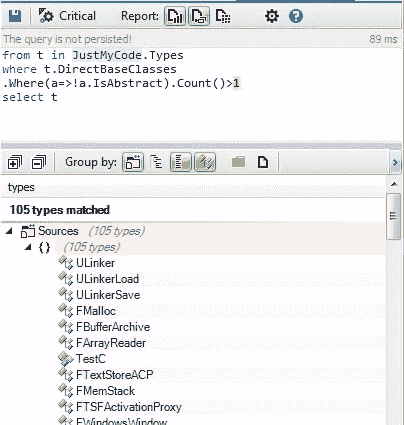
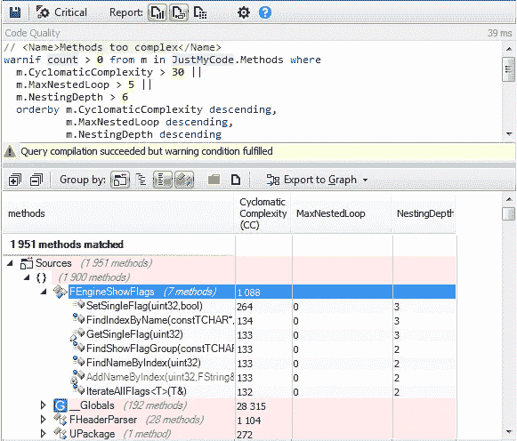

# 如何从令人敬畏的项目中提高你的 C++技能

> 原文：<https://medium.com/hackernoon/how-to-improve-your-c-skills-from-awesome-projects-251b300ed5a1>

## 虚幻引擎案例研究

[虚幻引擎](https://www.unrealengine.com/)是由[史诗游戏](http://en.wikipedia.org/wiki/Epic_Games)开发的游戏引擎，首次展示于 1998 年的第一人称射击游戏*虚幻*。虽然主要是为第一人称射击游戏开发的，但它已经成功地用于各种其他类型，包括潜行、MMORPGs 和其他 RPG。

它的代码是用 C++写的，现在被许多游戏开发者使用。它的源代码可以从 GitHub 获得，对学生是免费的。许多令人惊叹的游戏都是用这个引擎开发的，它允许生成像这样非常逼真的渲染。

产生这种逼真渲染的幕后执行的源代码是什么？

走进这个强大的游戏引擎，发现它是如何设计和实现的，这非常有趣。C++开发人员可以从它的代码库中学到许多最佳实践。

让我们使用 [CppDepend](http://www.cppdepend.com/) 和 [CQLinq](http://cppdepend.com/cqlinq) 来探索它的源代码，以检测它的开发团队的一些设计和实现选择。

# 1-名称空间

虚幻引擎广泛使用名称空间有三个主要原因:

*   许多名称空间只包含枚举，如下面的 CQLinq 查询所示，它给出了只包含枚举的名称空间。

在一个大型项目中，你不能保证两个不同的枚举不会都用相同的名字调用。这个问题在 C++11 中通过使用**枚举类**得到了解决，该枚举类隐式地将枚举值限定在枚举名称的范围内。

*   匿名命名空间:没有名字的命名空间避免了产生全局静态变量。您创建的“匿名”命名空间只能在您创建它的文件中访问。以下是使用的所有匿名名称空间的列表:

*   模块化代码库:让我们搜索所有其他名称空间，即既不是匿名的也不是只包含枚举的名称空间:

名称空间是模块化应用程序的一个好的解决方案；Unreal Engine 定义了 250 多个名称空间来加强其模块化，这使得代码更具可读性和可维护性。

# 使用的 2-范式:

C++不仅仅是面向对象的语言。正如比雅尼·斯特劳斯特鲁普指出的，“C++是一种多范式语言。”它支持许多不同风格的程序或范例，面向对象编程只是其中之一。其他一些是过程编程和泛型编程。

**2–1 程序范例**

*2–1–1 全局函数*

让我们搜索虚幻引擎源代码中定义的所有全局函数:

我们可以将这些功能分为三类:

1-效用函数:例如，其中 6344 个函数涉及 Z _ Construct _ UXXX 函数，用于创建引擎所需的实例。

2 —操作符:许多操作符都是由 CQLinq 查询的结果定义的，如下所示:

虚幻引擎源代码中几乎实现了各种运算符。

3 —与引擎逻辑相关的函数:实现了许多包含一些引擎处理的全局函数。也许这些类型的函数可以按类别分组，比如将静态方法分组到类中，或者分组到名称空间中。

*2–1–2 静态全局函数:*

最佳实践是将全局函数声明为静态的，除非您特别需要从另一个源文件调用它。

许多全局函数被声明为静态的，并且如前所述，其他全局函数被定义在匿名名称空间中

2–1–3 个候选静态全局函数。

全局未导出函数，未在匿名命名空间中定义，也未被定义它们的文件之外的任何方法使用。这些都是可以重构为静态的很好的候选者。

正如我们所观察到的，一些全局函数可以被重构为静态函数。

**2–2 面向对象范例**

*2–2–1 继承*

在面向对象编程(OOP)中，继承是建立对象间关系的一种方式。它经常被混淆为重用现有代码的方法，这不是一个好的实践，因为实现重用的继承导致了紧密耦合。代码的可重用性是通过组合实现的(组合胜于继承)。让我们搜索至少有一个基类的所有类:

为了更好地了解这个查询所涉及的类，我们可以使用 Metric 视图。

在 Metric 视图中，代码库通过树形图表示。Treemapping 是一种通过使用嵌套矩形来显示树结构数据的方法。CppDepend treemap 中使用的树结构是通常的代码层次结构:

*   项目包含命名空间。
*   命名空间包含类型。
*   类型包含方法和字段。

treemap 视图提供了一种表示 CQLinq 请求结果的有用方法；蓝色的矩形代表这个结果，所以我们可以直观地看到请求所涉及的类型。

正如我们所观察到的，继承在虚幻引擎源代码中被广泛使用。

多重继承:让我们搜索从多个具体类继承的类。

多重继承并没有被广泛使用，只有少数类从一个以上的类继承。

*2–2–2 个虚拟方法*

让我们搜索虚幻引擎源代码中定义的所有虚拟方法:

许多方法是虚拟的，其中一些是纯虚拟的:

作为过程化范式，OOP 范式也广泛应用于虚幻引擎源代码中。泛型编程范式呢？

**2–3 通用编程**

C++提供了通过模板表达泛型编程思想的独特能力。模板提供了一种形式的参数多态性，允许表达通用算法和数据结构。C++模板的实例化机制确保当使用通用算法或数据结构时，将创建完全优化的专用版本，并针对特定用途进行定制，从而允许通用算法与其非通用对应算法一样高效。

*2–3–1 通用类型:*

让我们搜索引擎源代码中定义的所有泛型类型:

只有少数类型被定义为泛型。让我们搜索通用方法:

超过 40000 个方法是通用的；它们代表了所实现的方法的 25%以上。

要恢复虚幻引擎源代码，请混合使用这三种范例。

# 定义数据模型的 3-pod

在面向对象编程中，普通旧数据(POD)是一种数据结构，只表示为字段值(实例变量)的被动集合，不使用面向对象的功能。在计算机科学中，这被称为被动数据结构

让我们在虚幻引擎源代码中搜索 POD 类型

超过 2000 种类型被定义为 POD 类型，其中许多用于定义引擎数据模型。

# 四人组设计模式

设计模式是一个软件工程概念，描述软件设计中常见问题的重复解决方案。四人帮模式是最受欢迎的。让我们来发现虚幻引擎源代码中使用的一些。

*4–1 单胞胎*

单例是最受欢迎和使用最多的一种。下面是源代码中定义的一些单例类:

TThreadSingleton 是 Singleton 的特殊版本。这意味着每个线程只创建一个实例。调用它的方法 Get()是线程安全的。

4–2 个工厂

使用工厂来隔离逻辑实例化和增强内聚性是很有趣的；下面是源代码中定义的工厂列表:

这是一些抽象的例子:

*4–3 名观察员*

观察者模式是一种软件设计模式，在这种模式中，一个对象维护一个称为观察者的依赖者列表，并自动通知它们任何状态变化，通常是通过调用它们的方法之一。

它们是一些在其源代码中实现的观察者，FAIMessageObserver 就是其中之一。

下面是一个依赖关系图，显示了这个观察器的 OnMessage 方法的调用:

*4–4 命令*

命令模式是一种行为设计模式，其中使用一个对象来表示和封装稍后调用方法所需的所有信息。

与命令模式相关的四个术语是命令、接收者、调用者和客户。command 对象有一个 receiver 对象，并以特定于该 receiver 类的方式调用 receiver 的方法。

以下是从 IAutomationLatentCommand 继承的所有命令:

# 5-耦合和内聚

5–1 联轴器

低耦合是可取的，因为应用程序的一个方面的变化在整个应用程序中需要较少的变化。从长远来看，这可以减少与修改应用程序和向应用程序添加新功能相关的大量时间、精力和成本。

低耦合可以通过使用抽象类或使用泛型类型和方法来实现。

让我们搜索虚幻引擎源代码中定义的所有抽象类:

只有少数类型被声明为抽象类型。通过使用泛型类型和泛型方法，可以更好地实现低耦合。

以下是至少使用一种泛型方法的方法:

正如我们可以观察到的，许多方法都使用泛型方法，低耦合性是通过函数模板参数实现的。事实上，这些参数的真实类型可以在不改变被调用方法的源代码的情况下改变。

**凝聚力**

单一责任原则规定一个类不应该有一个以上的改变理由。这样的类被称为内聚类。高 LCOM 值通常指出一个内聚性差的类。有几个 LCOM 指标。LCOM 的取值范围为[0–1]。LCOM 房协(房协代表恒基兆业卖方)的取值范围为[0–2]。高于 1 的 LCOM HS 值应被视为警报。以下是计算 LCOM 指标的方法:

> LCOM = 1 —(总和(MF)/M*F)
> LCOM HS = (M —总和(MF)/F)(M-1)

其中:

*   m 是一个类中方法的数量(静态和实例方法都计算在内，它还包括构造函数、属性 getter/setter、事件 add/remove 方法)。
*   f 是类中实例字段的数量。
*   MF 是访问特定实例字段的类的方法的数量。
*   Sum(MF)是该类的 MF 总体实例字段的总和。

这些公式背后基本思想可以陈述如下:如果一个类的所有方法都使用它的所有实例字段，则该类是完全内聚的，这意味着 sum(MF)=M*F，然后 LCOM = 0，LCOMHS = 0。

LCOMHS 值高于 1 应视为报警。

只有一些类型被认为是不内聚的。

# 6-不变性、纯度和副作用

*6–1 不可变类型*

基本上，一旦对象被创建，如果它的状态没有改变，那么它就是不可变的。因此，如果一个类的实例是不可变的，那么这个类就是不可变的。

支持使用不可变对象的一个重要理由是:它极大地简化了并发编程。想一想，为什么编写合适的多线程编程是一项艰巨的任务？因为很难同步线程对资源(对象或其他 OS 资源)的访问。为什么很难同步这些访问？因为很难保证多线程对多个对象进行的多次写访问和读访问之间不会出现争用情况。如果没有更多的写访问呢？换句话说，如果线程访问的对象的状态不变，那会怎样？再也不需要同步了！

不可变类的另一个好处是它们永远不会违反 LSP(lis kov subtution 原则)，下面是从其 wiki 页面引用的 LSP 的定义:

> Liskov 的行为子类型的概念定义了可变对象的可替代性的概念；也就是说，如果 S 是 T 的子类型，那么程序中 T 类型的对象可以用 S 类型的对象替换，而不改变该程序的任何期望的属性(例如，正确性)。

下面是源代码中定义的不可变类型列表:

6–2 纯度和副作用

不可变类型的主要好处来自于它们消除了副作用。我说不出比韦斯·戴尔更好的话了，所以我引用他的话:

*我们都知道通常使用全局变量不是一个好主意。这基本上是暴露副作用的极端情况(全局范围)。许多不使用全局变量的程序员没有意识到同样的原则在更有限的范围内也适用于字段、属性、参数和变量:除非有充分的理由，否则不要改变它们。(…)*

*提高设备可靠性的一个方法是消除副作用。这使得将单元组合和集成在一起变得更加容易和健壮。因为它们没有副作用，所以不管在什么环境下，它们都是一样的。这被称为参照透明。*

编写没有副作用的函数/方法——所以它们是纯函数，也就是说，不改变对象——更容易推断程序的正确性。

这里列出了所有没有副作用的方法

超过 125 000 种方法是纯的。

# 7-实施质量

7–1 太大的方法

太大的方法不容易维护和理解。让我们搜索超过 60 行的方法。

虚幻引擎源代码包含超过 150，0 00 个方法，所以不到 1%就可以认为太大了。

7–2 种带有许多参数的方法

很少有方法有 8 个以上的参数，大多数都是泛型的，以避免定义变量函数，就像 TCStringt::Snprintf 方法一样。

7–3 种具有许多局部变量的方法

不到 1%有很多局部变量。

7–4 种方法太复杂

存在许多度量来检测复杂函数，NBLinesOfCode、参数数目和局部变量数目是基本的度量。

还有其他有趣的度量来检测复杂函数:

*   圈复杂度是一个流行的过程化软件度量，等于一个过程中可以做出的决策的数量。
*   嵌套深度是在方法上定义的度量，相对于方法体中嵌套更深的范围的最大深度。
*   最大嵌套循环等于函数中循环嵌套的最大级别。

这些指标的最大容许值更多地取决于团队的选择，没有标准值。

让我们在虚幻引擎代码库中搜索被认为复杂的方法。

只有 1.5%的方法可以被重构以最小化它们的复杂性。

## 7–4 霍尔斯特德复杂度

HALSTEAD 复杂性度量是由 MAURICE HOWARD HALSTEAD 在 1977 年引入的软件度量。HALSTEAD 观察到，软件的度量应该反映不同语言中算法的实现或表达，但独立于它们在特定平台上的执行。因此，这些指标是从代码中静态计算出来的。

Halstead 引入了许多度量标准，让我们以 timetoimplementation 为例，它表示以秒为单位编写方法所需的时间。

1748 个方法需要一个多小时才能实现。

# 8- RTTI

RTTI 是指系统在运行时(相对于编译时)报告对象的动态类型并提供该类型信息的能力。然而，RTTI 在 C++社区中引起了争议。许多 C++开发人员选择不使用这种机制。

虚幻引擎开发者团队呢？

没有方法使用 dynamic_cast 工具。虚幻引擎团队选择不使用 RTTI 机制。

# 9-例外

异常处理也是另一个有争议的 C++特性。许多已知的开源 C++项目不使用它。

让我们搜索一下虚幻引擎源代码中是否抛出了异常。

在一些方法中会引发异常；就像 RaiseException 一样:

正如他们的注释中所指出的，异常可能是为 header 工具生成的，但是在正常的运行时代码中，他们不支持异常处理。

# 10-一些统计数据

10–1 最受欢迎的类型

了解项目中使用最多的类型很有趣；事实上，这些类型必须被很好地设计、实现和测试。他们身上发生的任何变化都会影响整个项目。

我们可以使用*类型使用我*度量来找到它们:

然而，还有另一个有趣的指标来搜索流行类型:TypeRank。

TypeRank 值是通过在类型依赖关系图上应用 [Google PageRank](http://www.iprcom.com/papers/pagerank/) 算法来计算的。应用中心为 0.15 的同质性，以使 TypeRank 的平均值为 1。

应该更仔细地测试具有高 TypeRank 的类型，因为这种类型中的错误可能更具灾难性。

根据 TypeRank 指标，以下是所有流行类型的结果:

10–2 种最流行的方法

10–3 个方法调用许多其他方法

了解使用许多其他方法的方法是很有趣的，它可以揭示这些方法中的设计问题。在某些情况下，需要重构以使它们更具可读性和可维护性。

**结论:**

探索实现良好的项目的源代码非常有趣。我们可以学习一些有用的设计和实现最佳实践。