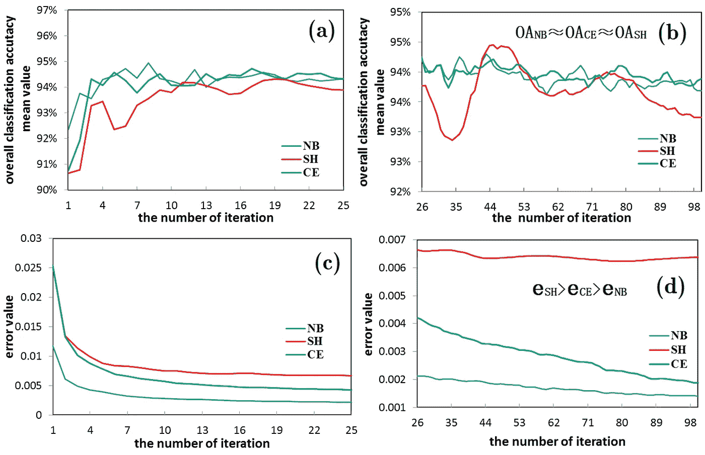

# 如何初始化神经网络中的权重，使其表现良好？Xavier 随机权重初始化的超快速解释

> 原文：<https://medium.com/hackernoon/how-to-initialize-weights-in-a-neural-net-so-it-performs-well-3e9302d4490f>

[http://www.mdpi.com/1099-4300/19/3/101](http://www.mdpi.com/1099-4300/19/3/101)

我们知道，在神经网络中，权重通常是随机初始化的，这种初始化需要相当/大量的重复才能收敛到最小损失并达到理想的权重矩阵。问题是，这种初始化容易出现消失或爆炸梯度问题。

减少这个问题的一种方法是仔细选择随机权重初始化。Xavier 的随机权重初始化(也称为 Xavier 算法)将网络的大小(输入和输出神经元的数量)纳入方程，并解决了这些问题。

Xavier Glorot 和 Yoshua Bengio 是初始化更好的随机权重这一概念的贡献者。这不仅减少了遇到梯度问题的机会，而且有助于更快地收敛到最小误差。

## 使其初始化更好权重的一般方法:

**a)如果你在深网中使用 ReLu 激活函数(我说的是隐藏层的输出激活函数)那么:**

1.  从平均值为 0 且标准偏差为 1 高斯分布中生成权重的随机样本。
2.  将样本乘以(2/ni)平方根。其中 ni 是该层的输入单元数。

**b)同样，如果你使用双曲正切函数:**

1.  从平均值为 0 且标准偏差为 1 高斯分布中生成权重的随机样本。
2.  将样本乘以(1/ni)平方根。其中 ni 是该层的输入单元数。

# 那么这个 Xavier 的初始化是什么呢？

**Xavier 初始化中唯一的主要区别是输出没有项。我们添加该层的输出单元的数量。**

**对于 Tanh:**

1.  从平均值为 0 且标准偏差为 1 高斯分布中生成权重的随机样本。
2.  将样本乘以(1/(ni+no))平方根。其中 ni 是输入单元的数量，no 分别是该层的输出单元的数量。

> # python 代码在这里
> 
> 将 numpy 作为 np 导入
> 
> **W = np.random.rand((x_dim，y_dim))*np.sqrt(1/(ni+no))**

# 为什么这种初始化有助于防止梯度问题？

这种初始化有助于将权重矩阵设置为既不大于 1 也不小于 1。因此，它不会爆炸或消失梯度分别。

我从 Coursera 令人敬畏的深度学习专业:deeplearning.ai 中学到了这一点

> 改进深度神经网络:超参数调整、正则化和优化；
> 
> [https://www.coursera.org/learn/deep-neural-network/](https://www.coursera.org/learn/deep-neural-network/)

**以下是原文:**

> **了解训练深度前馈神经网络的难度**
> 
> ***泽维尔·格罗特，约舒亚·本吉奥***；PMLR 9:249–256

如果你喜欢这篇文章，那就鼓掌吧！:)也许一个跟随？

在社交网站上与我联系:

 [## Rakshith Vasudev | LinkedIn

### 查看拉克什特·瓦苏德夫在全球最大的职业社区 LinkedIn 上的个人资料。拉克什特教育上市…

www.linkedin.com](https://www.linkedin.com/in/rakshith-vasudev/)  [## 拉克什特·瓦苏德夫

### 拉克什·瓦苏德夫。和我一起学习人工智能，让这个世界变得更美好。张量流…

www.facebook.com](https://www.facebook.com/imrakshithvasudev/)  [## 拉克什特·瓦苏德夫

### Datascience 入门，最佳编程实践。主题包括机器学习和其他。

www.youtube.com](https://www.youtube.com/c/rakshithvasudev)