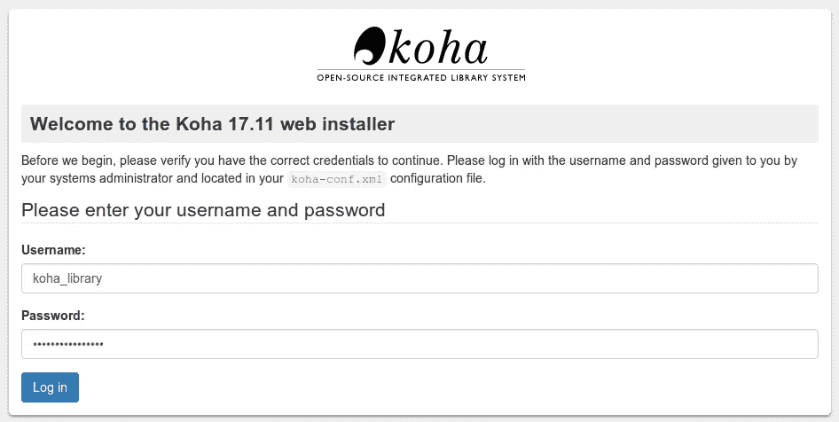
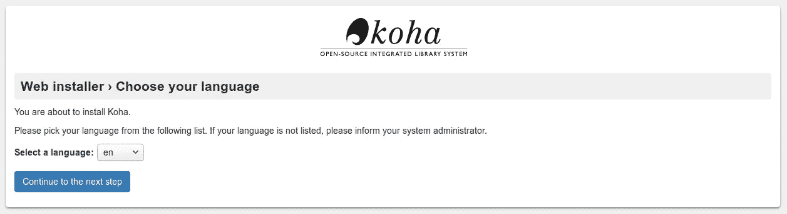
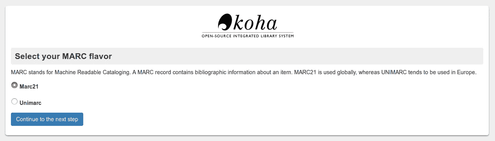
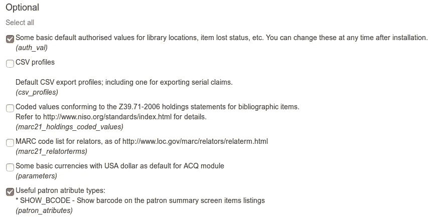
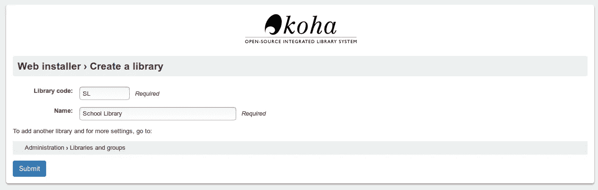
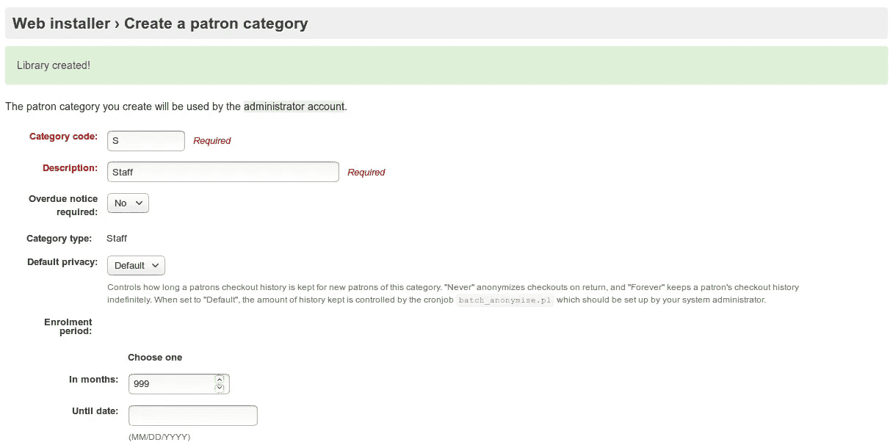
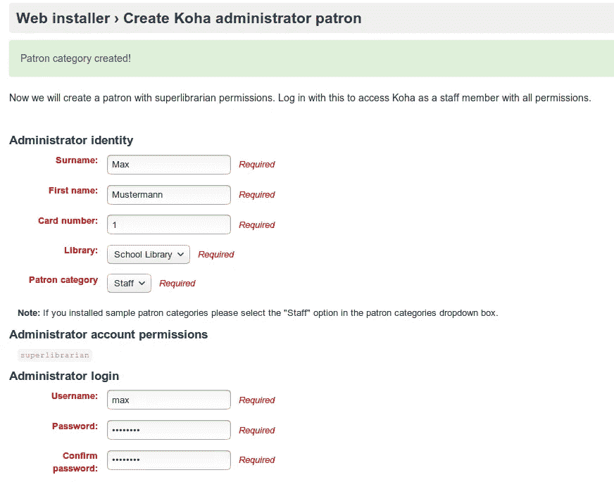
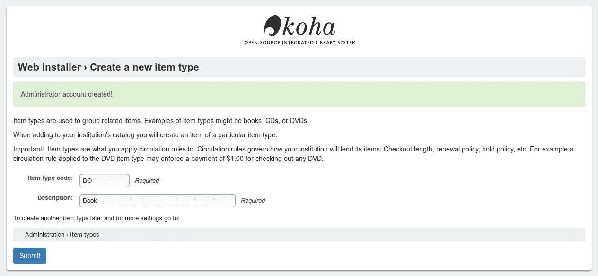
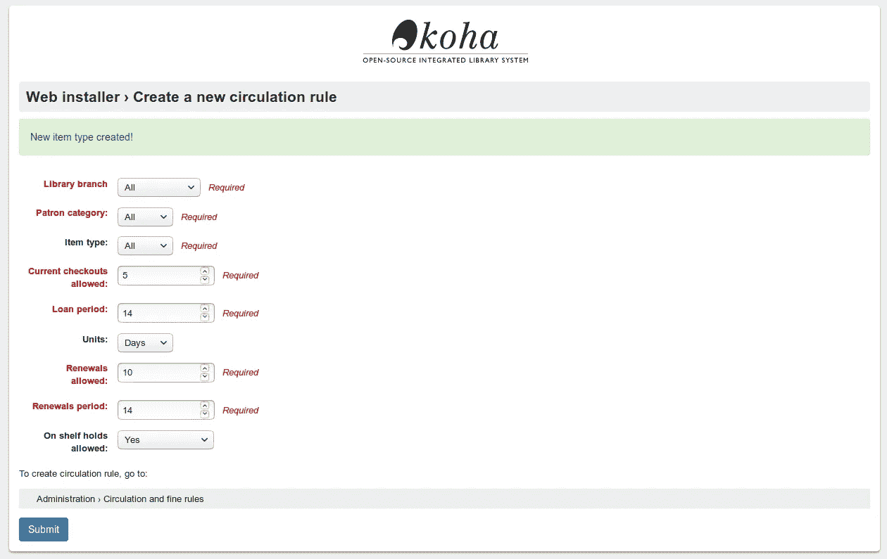
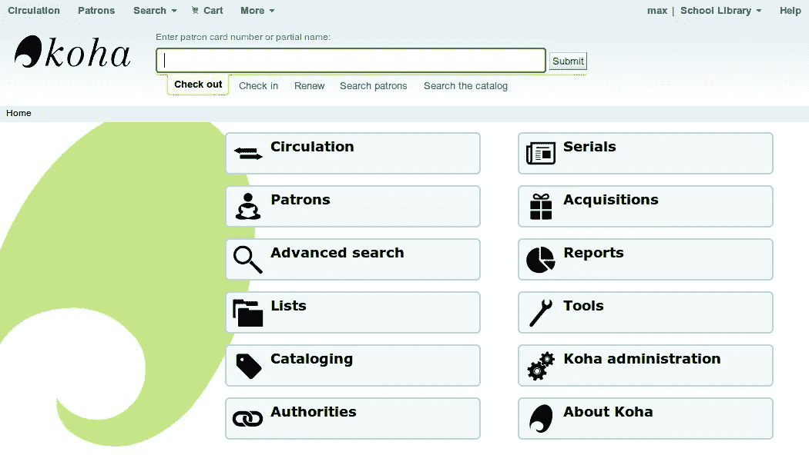

# 第 1 部分:安装——如何为学校安装和设置 Koha

> 原文：<https://medium.com/hackernoon/how-to-install-and-set-up-koha-for-schools-part-1-6ee576568351>


Koha，一个集成的图书馆系统，是我所知道的 T2 最好的开源项目之一。我们在学校和教材库中使用它。它被世界各地的许多学校、大学和图书馆使用。它有很多特性，你可以非常灵活地配置和定制它。然而，有一个缺点:如果你到目前为止还没有怎么接触过图书馆，那么这个条目就相当陡峭，不是太多的 Koha，而是[书目数据格式 MARC21](https://en.wikipedia.org/wiki/MARC_standards) ，这就是为什么我想在这个系列文章中展示如何为学校安装和设置 Koha。

第一部分处理 Koha 的基本安装和第一个库的建立。

本文是系列文章的一部分:

*   [第一个库的安装和设置](https://openschoolsolutions.org/how-to-install-and-set-up-koha-for-schools-part-1/)
*   [书目框架](https://openschoolsolutions.org/bibliographic-framework-install-koha-schools/)
*   [基础设置](https://openschoolsolutions.org/part-3-basic-settings-how-to-install-and-set-up-koha-for-schools/)
*   [编目](https://openschoolsolutions.org/part-4-cataloging-how-to-install-and-set-up-koha-for-schools/)
*   [打印标签](https://openschoolsolutions.org/part-5-label-creator-how-to-install-and-set-up-koha-for-schools/)
*   流通和罚款规则
*   连接到 Z.39.50 / SRU 服务器
*   通知和提醒
*   过期通知和费用

# 装置

## 准备

Koha 是一个 web 应用程序，所以我们需要一个 web 服务器。这可以是您自己的计算机、虚拟机或 Linux 容器。在这个例子中，我们将使用一个装有 Ubuntu 16.04 的 [LXD 容器](https://openschoolsolutions.org/5-reasons-use-lxd/)，但是任何其它装有 Debian 或 Ubuntu 的计算机都可以。

首先，我们为 Koha 添加包源代码和相应的密钥:

```
$ echo deb [http://debian.koha-community.org/koha](http://debian.koha-community.org/koha) stable main | sudo tee /etc/apt/sources. list.d/koha. list
$ wget -O- [http://debian.koha-community.org/koha/gpg.asc](http://debian.koha-community.org/koha/gpg.asc) | sudo apt-key add -
```

之后，我们必须更新一次包源代码:

```
$ sudo apt update
```

现在我们可以安装 Koha 和数据库服务器了:

```
$ sudo apt install koha-common mariadb-server
```

为了使我们的数据库服务器更加安全，我们可以使用以下命令更改一些设置:

```
$ sudo mysql_secure_installation
```

除了第一个问题，所有问题都可以用 Yes(“Y”)来回答。应该设置 root 密码！

在设置 Koha 之前，我们需要在***/etc/Koha/Koha-sites . conf***中做一些基本的设置。这是一个确定 Koha 和 OPAC(用户可以搜索图书馆并登录他们的帐户的网站)以后可以到达的域的问题。其组成如下:

*   OPAC: *库.域. tld*
*   koha-Intranet:*library-intra . domain . TLD*

为此，我们打开文件并更改以下参数:

*   域—我们在这里输入主域，例如。我的学校。
*   INTRASUFFIX —默认“-intra”，例如库 *-intra* 。my-school.org

```
$ sudo nano /etc/koha/koha-sites. conf
```

之后，我们激活了一些 web 服务器模块，以便稍后可以访问 Koha:

```
$ sudo a2enmod rewrite
$ sudo a2enmod cgi
$ sudo service apache2 restart
```

## 安装语言包(可选)

我们可以这样安装一个语言包(例如德语):

```
$ sudo koha-translate — install de-DE
```

后来，Web 安装程序和 Koha 都有了德语版本。要列出所有可用的语言，请使用以下命令:

```
$ sudo koha-translate — list — available
```

## 创建库实例

使用 Koha，我们可以创建和管理多个库。但到目前为止还没有，所以我们必须先创建一个。

```
$ sudo koha-create — create-db library
```

如果 Koha 应该稍后在*library.my-school.org*可访问，我们必须使用*库*作为库名。

接下来，激活 web 服务器的新配置并重新启动它:

```
$ sudo a2enmod deflate
$ sudo a2ensite library
$ sudo service apache2 restart
```

为了访问 web 安装程序，我们需要在 DNS 服务器或本地主机文件中输入 IP 和域名。在 Ubuntu 中它位于 ***/etc/hosts*** 。例如，可以通过`ifconfig`找到 IP。

```
$ sudo nano /etc/hosts
…
10.97.127.207 library.my-school.org
10.97.127.207 library-intra.my-school.org
…
```

# 设置 Koha

## 基础安装

在 http://library-intra.meine-schule.org，我们到达网络安装程序。



用户是 koha_ *库名*。使用以下命令获得密码(adjust libraryname！):

```
$ sudo xmlstarlet sel -t -t -v 'yazgfs/config/pass' /etc/koha/sites/library name/koha-conf.xml;echo
```

下一步，我们可以选择语言:



在接下来的步骤中，检查依赖性，例如，是否所有的 Perl 模块都可用，建立数据库表，并且必须选择 MARC 格式(MARC21 是标准)。



然后有一个更长的页面，我们可以用不同的模板和样本数据填充数据库。在这里，每个人都必须自己决定他们想要在数据库中包含什么。除了已经标注的内容之外，我们还选择了以下内容:

*   默认的 MARC 21 书目框架。
*   FA，一个“快速添加”的最小 MARC21 框架，适用于 ILL 或 on-the-fly 编目。
*   图书馆位置、物品丢失状态等的一些基本默认授权值。安装后，您可以随时更改这些设置。
*   有用的赞助属性类型
*   允许访问下列服务器以搜索和下载记录信息



这就完成了基本安装。

## 设置库和初始设置

现在我们被问到我们的图书馆应该叫什么。为此，我们定义一个缩写(以后不能更改)并指定一个名称。姑且称之为*学校图书馆*。



接下来，我们将创建第一个用户类型。我们将要创建的管理员帐户使用这种类型的用户。同样，我们必须为类别(“S”)分配一个缩写或代码，一个描述和成员资格的持续时间。后者确定用户帐户在此类别中何时过期。



创建用户类型后，我们将创建管理员。该用户拥有“超级图书馆”权限。所有字段都是必填的。



现在我们定义第一种媒体类型。这些可以是书、CD、DVD、卡片等。同样，我们需要一个以后不能更改的代码和一个描述:



最后，我们确定新创建的媒体类型的借出条件。设置非常灵活。您可以设置借出期限或指定规则适用的库或用户类型。我们可以以后改变规则。目前，我们将“允许当前借阅”设置为 5 本，因为我们不允许学生一次借阅超过 5 本书。



这就完成了 Koha 和我们第一个库的基本安装！在 http://library-intra.my-school.org 的[](http://library-intra.my-school.org)*，我们现在可以用我们的管理员帐号登录并进入 Koha 的管理页面。在那里，我们做所有进一步的调整，登记或检查图书。*

**

# *结论*

*我们现在有了一个工作的 Koha 装置和第一个库。然而，在我们为 Koha 的第一本书添加记录之前，许多其他设置是必要的。我希望在本系列的后续文章中展示这一点。*

**原载于*[*openschoolsolutions.org*](https://openschoolsolutions.org/how-to-install-and-set-up-koha-for-schools-part-1/)*。* ***注册*** *订阅我们的时事通讯，获取免费的 PDF 格式的开源应用程序，用于您的课堂，或者在 Twitter 上关注*[*@ OpenSchoolZ*](https://twitter.com/OpenSchoolZ)*。**