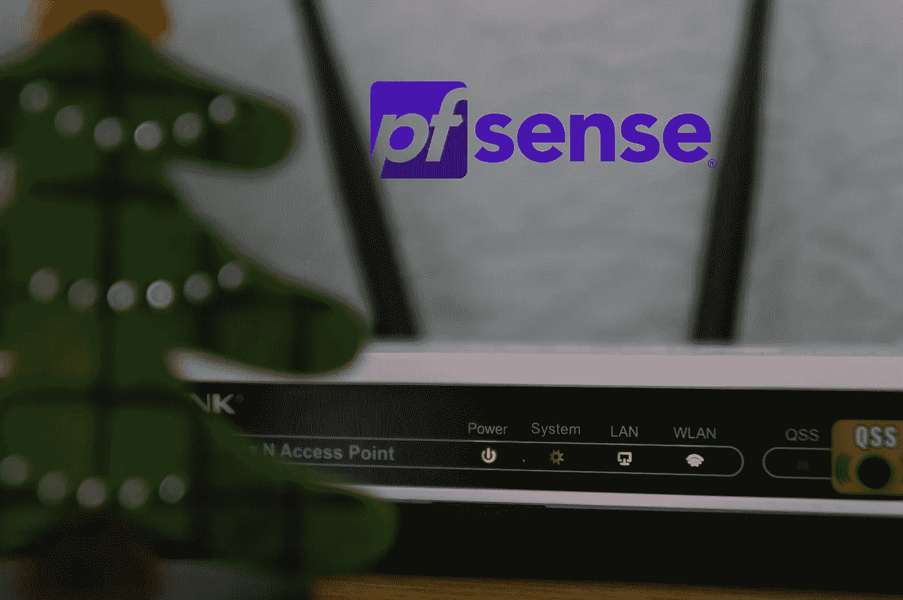
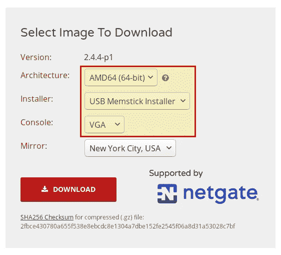
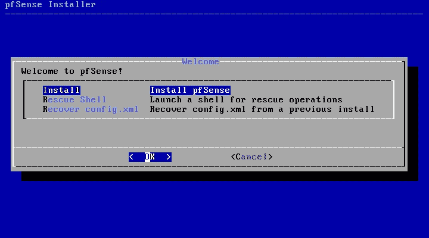
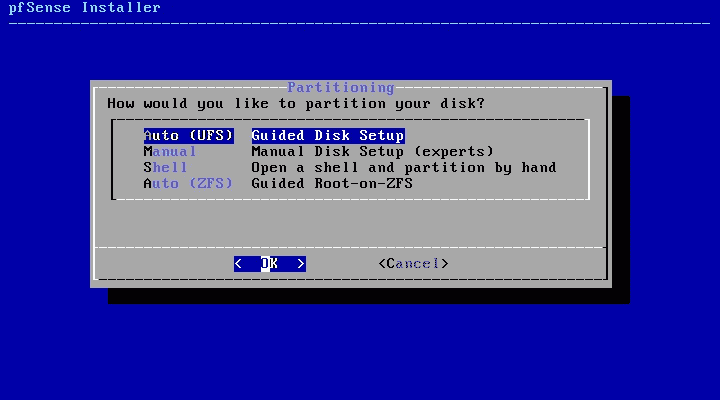
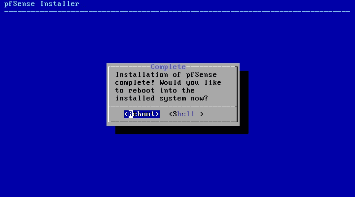
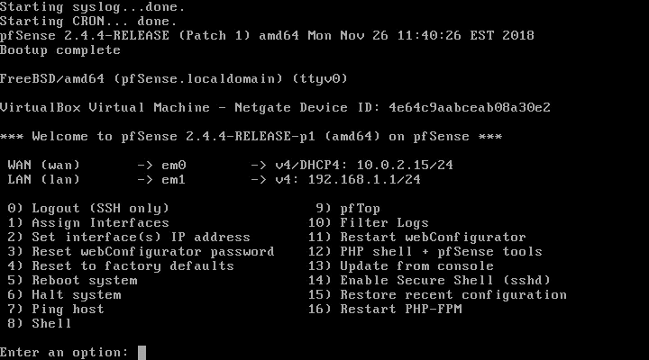
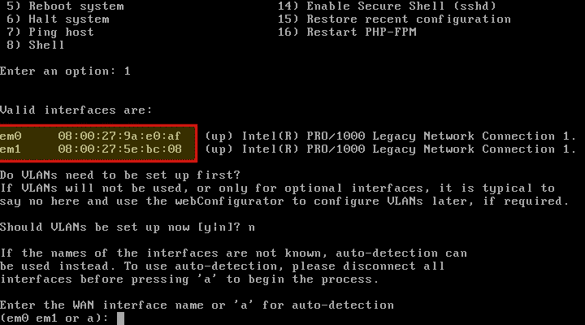
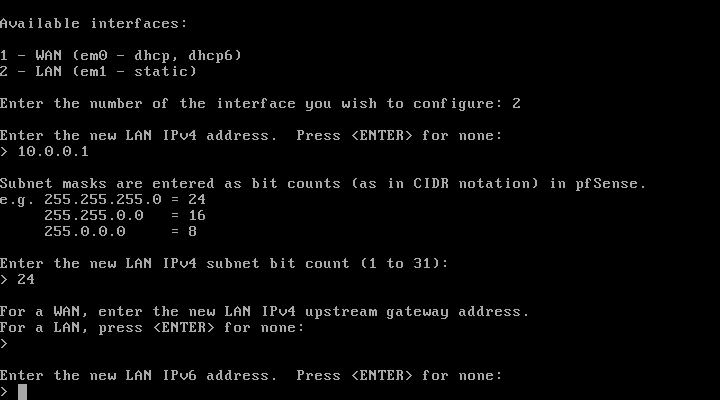
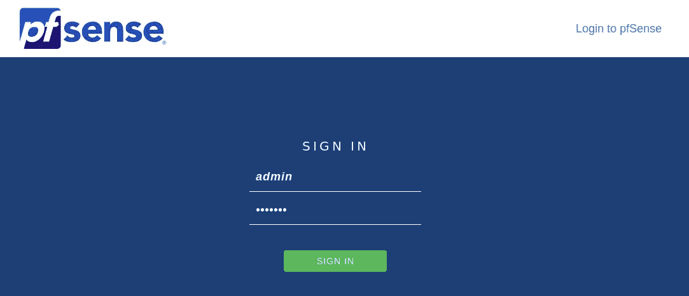
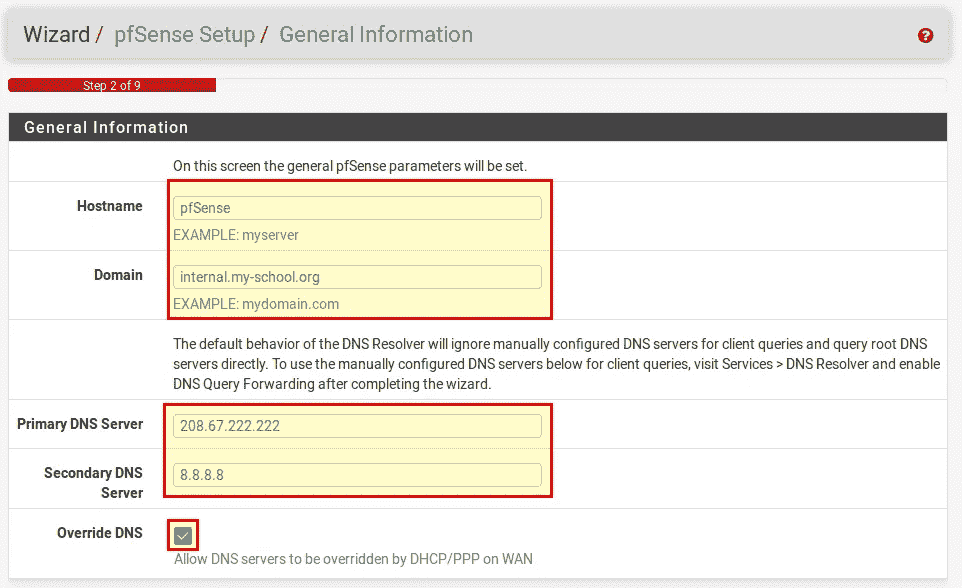

# 如何安装 pfSense

> 原文：<https://medium.com/hackernoon/how-to-install-pfsense-dad8a98d5c6>



pfSense 是使用最广泛的开源防火墙解决方案之一。我们已经在学校使用它好几年了，我们对它非常满意，因为它提供了许多[的功能](https://www.pfsense.org/about-pfsense/features.html)，而这些功能你必须在别处投入大量资金。今天我想向大家展示如何安装 pfSense 以及如何设置它。在此之前，我想先说说各种适合运行 pfSense 的硬件。

# 我需要什么硬件？

一般来说，你可以说理论上你可以用任何一台至少有两块网卡的电脑来运行 pfSense。例如，这可能是一台您不再需要的旧计算机，您为它配备了第二块网卡。但通常旧电脑不是很节能，其他替代品更合适。除了功耗，预期用例也起着决定性的作用。我是在只有几个用户的家里使用防火墙，还是在有更多访问的学校或公司使用防火墙，这是有区别的。

家用电脑引擎的 [**APU2C4**](https://amzn.to/2GpNfNG) 板很受欢迎(主要在欧洲)，但也有被动冷却的迷你电脑，如[](https://amzn.to/2S4enDn)**或 [**那台**](https://amzn.to/2ChEmSd) 。对于学校或公司，建议使用至少 4 块网卡的主板，具体取决于要求。我们使用 Netgate 的 SG-4860。如果你在亚马逊或全球速卖通搜索 pfSense，你会发现很多优惠。唯一重要的是 CPU 支持 AES-NI，因为 pfSense 的这个特性在以后的版本中是绝对必要的。**

**在 pfSense 项目的[网站上，有一些关于硬件要求的一般提示:](https://www.pfsense.org/products/#requirements)**

*   **最低→512 兆内存，500 兆赫 CPU**
*   **推荐→ 1GB 内存，1Ghz CPU**

**选择硬件时还应考虑可用带宽，否则 pfSense 可能会成为瓶颈。**

*   **10–20 Mbps→至少 500MHz 的英特尔或 AMD CPU。**
*   **21–100 Mbps→当前 1Ghz 的英特尔或 AMD CPU**
*   **101–500 Mbps→当前英特尔或 AMD CPU，至少 2 Ghz 和一个 PCI-e 网卡**
*   **501+ Mbps →服务器硬件，带多核 CPU，每个 CPU 至少 2 Ghz，PCI-e 网卡**

# **准备 pfSense 安装**

## **下载图像**

**在开始安装之前，您需要知道您需要哪个 pfSense 映像。例如，这取决于所使用的硬件是具有 VGA/HDMI 输出还是只有串行控制台。或者是想通过光盘、u 盘还是直接在硬盘上安装。因此，我想在这里给出一些提示:**

**建筑:**

*   **只有当您也使用 Netgate 产品时，才需要 Netgate ADI。**
*   **AMD64 适用于所有其他产品(英特尔 AMD64 位 CPU)**

**图像类型**

*   **使用 USB 记忆棒进行安装需要 USB 记忆棒安装程序。**
*   **光盘映像(ISO)安装程序用于光盘安装或虚拟机安装**

**安慰**

*   **串行—如果只有一个串行端口可用(USB 或 RS-232)**
*   **VGA —如果使用的硬件具有 VGA/DVI 或 HDMI 输出。**

**如果你知道你需要哪个图像，你可以从 pfSense 网站下载。**

****

## **准备 USB 闪存驱动器**

**[pfSense 文档](https://www.pfsense.org/download/)包含了很多关于准备 u 盘的信息。在我们的例子中，我们假设一个 USB 记忆棒 VGA 安装程序。首先你应该格式化或清空 u 盘。这在 Linux 下非常容易**

```
$ sudo dd if=/dev/zero of=/dev/sdz bs=1M count=1
```

> *****注意:一定要注意 of=/dev/之后指定的是哪个设备。否则，您可能会清空主分区，数据会不可挽回地丢失！*** *要找出设备名称，最好插上 u 盘，然后在一个终端中运行* `*dmesg*` *。然后你就可以看到 u 盘得到了哪个设备名(往往是* /dev/sdb *)。***

**在上面链接的文档中可以找到在 Windows 或 macOS 下清除 USB 闪存驱动器的说明。**

**现在，您可以将下载的映像写入 USB 闪存驱动器。**

```
$ gzip -dc pfSense-memstick-2.4.4-RELEASE-amd64.img.gz | sudo dd of=/dev/sdz bs=1M $ sync
```

**USB 闪存驱动器现已准备就绪。下一步从这个 USB 拇指驱动器启动，并开始安装。根据 BIOS，记忆棒将被识别为 USB 设备或另一个硬盘。引导顺序必须经常改变，以避免从第一个硬盘引导。如果引导不起作用，文档[也提供了一些想法。](https://www.netgate.com/docs/pfsense/install/installation-troubleshooting.html)**

# **安装 pfSense**

**成功引导后，会出现 pfSense 欢迎屏幕。**

****

**这里你选择“*安装*”。在下一个对话框中，您可以定义键盘布局。对于分区，最好使用“*自动(UFS)* ”，并按回车键再次确认。**

****

**然后自动安装开始。安装完成后，会询问您是否要打开一个 shell(您可以否认)。最后，您必须重启系统(“ *Reboot* ”)。在接下来的引导中，你应该确保你不会再从 u 盘引导，而是从硬盘引导！**

****

# **设置网络接口**

## **分配网络接口**

**重启期间，pfSense 会自动尝试配置 WAN 接口。WAN 接口是连接到互联网服务提供商的路由器或互联网的网卡。如果自动配置成功，将出现 pfSense 控制台菜单，否则将出现一个对话框。**

****

**要更改 WAN 和 LAN 接口，选择 1“分配接口”。现在你必须回答一些问题:**

*   **现在应该设置 VLANs 吗？→否(否)**
*   **输入 WAN 接口名称或“a”进行自动检测→您必须在此输入 WAN 网卡的名称。MAC 地址显示在对话框的开头。在我们的例子中，它被称为 *em0* 。**
*   **输入 LAN 接口名称或“a”进行自动检测→您必须在此输入 LAN 网卡的名称。在我们的例子中，它被称为 *em1* 。**
*   **是否要继续→ y(是)。作业的简短摘要将会预先展示。**

****

## **设置 IP 地址**

**如果 DHCP 服务器在 WAN 接口上运行，它应该自动拥有一个 IP 地址。否则，您必须为 WAN 和 LAN 接口配置 IP 地址。作为一个例子，我将在这里展示它的局域网接口。选择№2 " *设置接口 IP 地址*。**

*   **输入您要配置的接口编号→ 2 表示 LAN 接口**
*   **输入新的局域网 IPv4 地址→例如 10.10.10.1 或 10.10.10.1/24**
*   **如果在上一步中没有指定网络掩码，现在必须指定:输入新的 LAN IPv4 子网位数(1 到 31)。→ 24(相当于 255.255.255.0，即 254 个 IP 地址)。**
*   **在下一个问题中，必须定义网关。这对于 LAN 接口不是必需的，对于 WAN 接口才是必需的。→只需按回车键(无)。**
*   **输入新的局域网 IPv6 地址。按<enter>无→回车(无)</enter>**
*   **您想在局域网上启用 DHCP 服务器吗？→ y(是)，除非局域网中已经有 DHCP 服务器。**
*   **输入 IPv4 客户端地址范围的起始地址→ 10.10.10.10(客户端可以在局域网中获得的第一个 IP 地址)**
*   **输入 IPv4 客户端地址范围的结束地址→ 10.10.10.200(客户端可以在局域网中获得的最后一个 IP 地址)**
*   **是否要恢复 HTTP 作为 webConfigurator 协议？→否(不，HTTPS 应保留)**

****

# **Web 界面中的更多设置**

**使用一台连接到局域网的计算机，您可以通过 [https://10.10.10.1](https://10.10.10.1) 访问 pfSense web 界面进行一些基本设置。第一次出现证书警告。因为这是用于 HTTPS 连接的自签名证书，所以您必须接受它。默认凭证为 ***admin*** ，密码为 ***pfsense*** 。**

****

**登录后，你会看到一个助手。在第二步中，您可以为防火墙分配一个主机名并输入域。同样重要的是主 DNS 服务器和辅助 DNS 服务器，以及是否可以通过 WAN 接口上的 DHCP 覆盖 DNS 服务器(例如，使用互联网服务提供商的 DNS)。**

****

**在接下来的步骤中，您将设置时区，再次检查 WAN 和 LAN 接口的配置，并在步骤 6 中分配一个新的管理员密码。这就完成了设置。**

# **结论**

**安装 pfSense 通常很容易。有时很难选择正确的镜像来安装或从 u 盘引导，或者设置串行连接。pfSense 文档处理了许多这样的问题，并提供了解决方案的建议。初始配置完成后，防火墙就可以使用了。然而，防火墙仍然可以大大扩展和适应。这应该是以后文章的主题。**

***原载于*[*openschoolsolutions.org*](https://openschoolsolutions.org/install-pfsense/)*。***