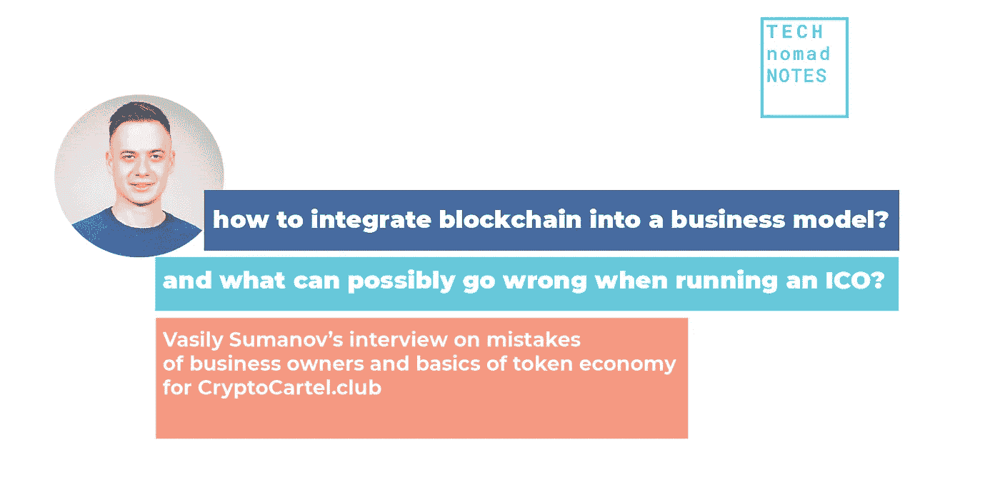

# 如何将区块链融入商业模式？运行 ICO 时可能会出现什么问题？

> 原文：<https://medium.com/hackernoon/how-to-integrate-blockchain-into-a-business-model-6652cf89f873>

*采访 IcoBench 专家和 Cointelegraph 撰稿人瓦西里·苏马诺夫*

**一个成功的 ICO 是好的产品、有效的营销策略和恰当的市场定位的结合。在区块链创业之前，瓦西里建议仔细考虑一个新创建的企业的结构元素将如何协同工作，相互促进和补充。**

*瓦西里，首先，是什么把你带到 ICO 和密码行业的？我的意思是你毕业于莫斯科国立大学化学系，似乎与科技和区块链领域几乎没有关系？*

是的，但是在学习化学的时候，早在 2012 年，我也开始在莫斯科中央证券交易所交易石油期货和 RUR/美元对。我对这样一种观点感到非常兴奋，即资产的运动不主要是由资产价值的根本变化引起的，而更经常的是由更大规模的金融运动引起的，即国家金融当局的货币政策能够极大地改变市场。在仔细研究了菲亚特经济及其运作原则后，我得出的结论是，它根本不是最完善的系统。更有甚者，它实际上歧视了大多数人的权利。这涉及到方方面面:对市场、危机和财富的控制。2013 年 10 月，在一个在线论坛上，我偶然了解到比特币，并开始深入研究这个问题。不久之后，我和哥哥开始开采莱特币，到 12 月份，我们已经有了第一批投资者，然后创建了一个工业采矿场。随着时间的推移，我们在研究新的硬币，参加密码社区活动，跟踪行业的发展，并试图保持在循环中。在这里，我的化学背景非常有用，因为我特别从事量子化学，对数学算法、数据处理和统计学了解很多。由于所有这些，我明白了比特币是如何运作的，以及为什么它是一种全新的网络支付工具，具有巨大的潜力。

除了在莫斯科国立大学的科研活动，您还积极参与区块链咨询和 ICO 咨询。告诉我们更多关于 ICO 内部架构的细节。

我认为自己更像一个顾问，而不是咨询师。在 2017 年夏天-秋天-当 ICO 炒作风起云涌时，我为相当多的项目提供了建议。目前，我更倾向于为初创公司创造代币经济提供建议，撰写代币经济和项目总体业务架构的白皮书章节——因为我发现，不幸的是，许多初创公司创始人并不完全了解如何以最佳优势营销他们的产品。更多的时候，他们只是用一个新的封面来包装现有的产品，而且做得相当笨拙。

该项目的架构最大的问题是，ICO 是一个全新的系统，投资者期望从他们的贡献中获得极高的利润。理想情况下，他们会希望资金增加 100 倍，这与传统市场的利润完全无法相比。为什么这样嗯，因为 ICO 本质上是一个快速增长的业务，正在高速发展并扩展到新的市场。它最好是国际化的，并有某种创新，使其独一无二。也就是说，所有的经济互动——或至少其中一些——都是由有限数量的令牌描述的，即令牌的发行是有限的。因此，当业务发展时，商品的质量在增长，因此，代币的价格显著上升，给投资者带来利润。因此，利润不是由业务或产品本身产生的，而是由我们称之为“令牌”的 ICO 项目单元产生的，它与业务流程相对应。

在 ICO 项目架构中，设计业务流程和销售令牌是非常重要的，这样才能吸引投资，并在扩展项目时既有外部市场价值增长的潜力，也有内部价值增长的潜力。项目本身应该是有效的，并为社区带来一些效用，特别是执行它原本的任务。换句话说，令牌是第一个关键元素，项目及其内部机制是第二个元素。我们所要做的就是让这两者一起工作，这样他们就有了一个坚实的共同目标。我不得不说，这是一个巨大的任务！没有多少创业公司有能力处理这个问题:通常情况下，业务本身和代币是对立的。老实说，在有些情况下，如果根本不引入令牌，企业实际上会运营得更好。

你认为我们如何识别开发商正在建造一个合法的 ICO 项目？

这很难说，真的，因为现实中的 ICOs 是一个筹资活动，而不是项目的实际实现。这是营销活动和社区管理等。等等。运营 ICO 是公关和营销人员以及首席执行官的任务，他们积极吸引项目的注意力和投资者。该项目本身是用 ICO 筹集的资金推出的产品。实际的产品开发在 ICO 之后开始，这是开发人员的任务。我将区分筹款活动的成功和团队在进一步项目建设中的表现——这实际上是两回事。这就是为什么对我来说，一个成功的 ICO 的关键首先是最大规模的公共关系活动和社区管理。其次是项目透明度和实际质量。

*您能分享一下您对发行代币时使用什么平台更好的看法吗？*

令牌发行不仅是一个技术过程，也是一个政治过程，因为如果你在开发项目时选择，许多平台会提供各种帮助。例如，Stellar 和 NEO 正在从与其生态系统相关的多个基金会提供支持，也包括财政支持。他们为什么这么做？嗯，通过这样做，他们为自己获得了更多的晋升和扩张。例如，有一个建立在区块链基础上的“Golos”社交网络，它拥有自己的基金，为参与其中的项目提供资金。这就是为什么开发人员应该真正注意这一点，因为基础平台的选择可以真正预先确定项目在市场上的成功。

具有基本功能的区块链项目最常见的框架无疑是以太坊。这是一种简单方便的工作工具。但是当然，对于更复杂的任务有更多的选择。

*你有一个单独的关于 ICO 经济的大师课。能否请您详细阐述一下创建生态经济模型的关键原则？*

再说一遍，网络经济和代币经济是两回事。ICO-economy 的目标是为进一步销售准备代币。我想强调的是，ICO 纯粹是一种筹资活动，事实上是一种未来产品和该产品所包含的经济工具的销售。我想我想说的是，代币很重要，但更重要的是产品，也就是在融资后创造出来的东西。这就是我优先考虑代币经济而不是 ICO 经济的原因，这很简单:你需要做的就是决定一个 ICO 拍卖模式。但是，为未来产品和代币集成业务创建经济模型是一个完全不同的故事，相当复杂。

说到代币经济的关键原则，我们首先需要确保它本质上不是一种安全——否则会与监管机构产生很多矛盾。第二，令牌应该有机地集成到业务中，不损害业务流程，但给创始人和用户带来一些额外的好处。同样重要的是，系统必须是封闭的，这样代币才能在其框架内流通:如果人们购买代币后只是为了转售，那就没有任何意义了。当代币进入交易所时，这种循环应该是内部和外部的，这样谁将购买和出售代币是透明的。有许多创业公司创造了巨大的代币供应，但需求真的很低，这也没有太大意义。