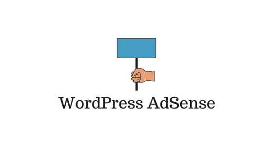

# 如何在你的 WordPress 站点上集成谷歌广告

> 原文：<https://medium.com/hackernoon/how-to-integrate-google-adsense-on-your-wordpress-site-5684a2fc53ea>

维持一个 WordPress 网站不是一件容易的事情。如果你打算长期维护你的网站，你需要找到几种方法来赚钱。Google AdSense 是在你的网站上展示广告的好方法，你可以从中获得收入。事实上，有了谷歌的管理 AdSense 程序，你就不用再和广告商直接打交道了。谷歌将为你管理这一部分，并为你提供与广告相关的收入。这篇文章将解释 WordPress AdSense 集成的过程，这个过程没有太多的麻烦。

# WordPress 广告集成

基本上，WordPress AdSense 集成的过程包括三个步骤。首先，你需要注册 Google AdSense。之后，你必须创建你的广告并生成代码。最后，您可以将这段代码粘贴到 WordPress 站点上的一个定制 HTML 小部件上，以显示由 Google 管理的广告。

现在，让我们更详细地看看这个过程。

# 注册 Google AdSense

要注册 AdSense 计划，您需要:

*   您的网站 url
*   gmail 帐户

你需要创建一个谷歌帐户才能使用谷歌广告。如果你已经有一个 gmail 帐户，你也可以用它来注册 Google AdSense，否则就创建一个新的。

在 Google AdSense 主页上，点击右上角的“登录”。

下一个屏幕将要求您输入您的网站 url 和电子邮件 ID。输入这些详细信息，然后单击“保存并继续”按钮。

现在，Google 会花一些时间来审核你加入 AdSense 计划的申请。基本上，他们会根据条款和条件检查您的网站是否有资格参加该计划。这些条款包括账户持有人必须年满 18 岁，并且只能持有一个账户。在注册之前，您可能需要详细阅读(您的账单地址)所在国家/地区的条款和条件。

一旦你的申请被谷歌审核通过，你就可以开始创作你的第一个广告了。

# 创建一个广告并获得 JS 代码

您将收到一封来自 AdSense 团队的电子邮件，告知如何激活帐户。一旦您的帐户被激活，您就可以开始制作第一个广告了。登录 AdSense 账号，进入 **MyAds >内容>广告单元**。现在，点击**+新广告单元**按钮创建一个新广告。

一旦你点击+新的广告单元按钮，你必须选择你想要在你的网站上展示的广告类型。

这里有三种选择。

*   文本和显示广告
*   植入广告
*   文章内广告

让我们快速了解一下每种产品的特点:

展示广告是最简单的方式。你只需要选择广告的位置、大小和风格，就万事大吉了。如果你刚刚开始使用这个程序，你可以选择这个选项来避免一开始的复杂性。

**内嵌广告**被放在你网站的一个提要里面。提要通常是在您的站点上列出的一组产品或文章。因为它没有干扰用户的流量，植入式广告被认为更有利于用户体验。此外，它们更适合移动屏幕，并且高度可定制。

**文章内广告**显示在文章内的段落之间。同样，由于它们放置在段落之间，这些广告也被设计成不会扰乱用户的流动。

选择您希望在网站上显示的广告类型。

在下一个屏幕上，您将能够为广告单元指定以下功能。

**名称** —您可以为单元指定一个名称，仅供您参考。例如，您可以命名为“您的站点侧栏”。

**广告尺寸** —你可以在这里选择广告的尺寸。谷歌建议选择更宽的尺寸。此外，一些尺寸将无法显示某些广告。最好[通读文档](https://support.google.com/adsense/answer/185665)以了解不同尺寸会产生怎样的影响。

**广告类型** —在这里您可以选择显示文本或显示广告，或者两者都显示。谷歌建议两者都选，因为这样你就可以收录大多数广告商的广告。

**文字广告风格** —这让你可以控制你的商店上的广告的外观。

**自定义频道** —该选项允许您通过不同的参数将广告分组。

**如果没有广告可用** —您可以在这里指定显示选项，以防谷歌没有定向广告。您可以选择空白、纯色或自己选择的图像。

最后点击**保存并获取代码**按钮获取 JavaScript 代码。

现在，您将看到一个带有 JavaScript 代码的模态窗口和一条消息，说明广告已成功创建。您需要复制这段代码，它需要粘贴到您的 WordPress 站点上的一个小部件上。

# WordPress AdSense 与定制 HTML 小工具的集成

这是比较容易的部分。只要登录到你的网站的管理端。在管理面板上，导航到**外观>小部件**。将一个定制的 HTML 小部件拖放到侧边栏区域，并将 JS 代码粘贴到小部件的内容部分。最后，点击**保存**按钮，你就完成了！

你应该看看你网站的前端，确保广告以你想要的方式显示。

# 借助插件来管理广告

和你能想到的其他功能一样，也有很多插件选项来管理 WordPress AdSense 集成。谷歌有自己的插件，但是过了一段时间就停止了。如果你正在寻找一个插件来帮助你管理你的商店上的广告，那么请阅读下面的部分。

## [贴吧广告中的 WP](https://learnwoo.com/refer/mythemeshop-wp-in-post-ads)

这个插件帮助你在你的 WordPress 站点上获得 Google AdSense 程序的全部优势。事实上，它将帮助你从你的网站上获得最大的金钱利益。这个插件的一个重要特点是可以选择对你的广告进行分割测试。你可以在你的网站上测试不同的广告位置，选择一个能带来最多收入的位置。它还提供了你的广告浏览量的统计，这样你就可以知道你的广告被浏览的比率。

该插件还提供了在你的网站上不同位置放置广告的灵活性。例如，你可以把广告放在文章标题之后，或者放在所有内容之后的底部。当您在段落之间放置广告时，它还可以让您灵活地选择在何处插入广告。另一个很棒的特性是可以在你选择的任何地方放置广告的短代码选项。

WP 在 Post Ads 插件中也给了你在你决定的特定时间间隔内选择性显示或隐藏广告的选项。它还可以帮助你管理专门针对单个帖子的广告。此外，在这个插件的帮助下，你可以选择不向登录的用户显示广告。这个插件的单个站点许可价格是 39 美元。

## [高级广告](https://wordpress.org/plugins/advanced-ads/)

这是一个简单的插件，可以在几个广告网络中使用。它有坚实的功能来帮助你的谷歌广告。该插件支持 AdSense 中所有类型的广告。在这个插件的帮助下，你可以改变广告的大小和类型，而无需登录你的 AdSense 账户。它确保没有广告显示在你的 404 页上，按照指导方针。此外，这个插件有助于广告健康集成和广告违反检查。

超过 60，000 个活跃安装和即时支持，这个插件可以是一个方便的工具来管理你的谷歌广告。

# 增加广告收入的最佳实践

正如你所看到的，在 Google AdSense 帐户的帮助下，在你的 WordPress 站点上设置广告非常简单。然而，谷歌建议网站所有者遵循一套准则来充分利用你的 AdSense 计划。让我们快速看一下其中的几个:

## 尝试不同的广告类型

在创建一个广告单元时，你可能已经注意到有不同的广告类型。谷歌建议尝试混合搭配的方法，看看哪一个对你的网站最有利。你的网站访问者有各种各样的品味和兴趣——有些人可能喜欢链接，而有些人喜欢视频块。重要的是你有一个适合所有类型的游客的选择。此外，当你在你的网站上展示不同类型的广告时，也有机会包含更多的广告客户。

## 选择适合您的领域的内容

互联网是一个地方，你可以很容易地找到特定领域的行为模式。在你的网站上投放广告时，理解这一点是很重要的。例如，谷歌为新闻网站和旅游网站的主页推荐完全不同的广告位置。另一个策略是观察你的竞争对手是如何投放广告的。这将给你一个很好的推荐点，开始你的 AdSense 计划。

虽然有一些推荐的选项，但为了获得最佳效果，最好还是自己测试一下。比如你可以根据一般的推荐在特定的时间段投放广告。之后，你可以尝试另一个短期的竞争策略。最后，你可以比较两种策略，选择一种能带来更好回报的策略。

## 确保你正在添加新的内容到你的网站

当你不断地在你的网站上创造新的相关内容时，你的网站流量就会增加。除此之外，确保你遵循所有的 SEO 最佳实践，以获得更好的搜索排名。总的来说，你的广告收入将主要取决于你网站的访客数量。

## 使用策略来提高网站的受欢迎程度

你应该把重点放在有助于提高网站知名度的几个方面。这些可能包括自然反向链接建设连接到博客网络和类似网站的领域。同样，你也可以利用社交媒体渠道来推广你的网站。

## 移动友好性

移动用户构成了大多数网站流量的主要部分。你在制作广告的时候也需要考虑这个因素。最好的方法是检查分析数据，以了解你的网站流量中是否有大部分移动用户。如果你的移动流量相当大，你最好也让你的广告有响应性。这样，它们在移动设备上看起来就不会奇怪。

您可以在此阅读最佳实践的详细信息[。](https://www.google.com/adsense/start/resources/google-adsense-best-practices.html#/)

# 结论

广告是增加网站收入的好方法。你可以有效地使用谷歌 AdSense 选项，在你的网站上创建一个无障碍的广告选项。只要有一个谷歌账户，你就可以在你的 WordPress 网站上设置这个选项。这篇文章概述了 WordPress AdSense 集成的过程。此外，请记住，任何广告项目的成功都与网站流量的增长直接相关。如果你想分享一些关于 Google AdSense 的见解，请告诉我们。

## 相关阅读

*   [SEO 优化选项](https://learnwoo.com/best-seo-plugin-for-wordpress/)
*   [提高你网站的流量](https://learnwoo.com/woocommerce-seo-tools-tips-conversions/)

*原载于 2018 年 5 月 10 日*[*learnwoo.com*](https://learnwoo.com/wordpress-adsense-integration/)*。*