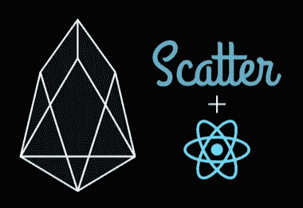

# 如何使用 Reactjs 将分散桌面钱包集成到您的 EOS Dapps 中

> 原文：<https://medium.com/hackernoon/how-to-integrate-scatter-desktop-wallet-into-your-eos-dapps-using-reactjs-170d6d83d7a0>

你可能已经熟悉了 [Scatter](https://hackernoon.com/tagged/scatter) ，这是一个网络/桌面钱包，让普通用户可以轻松存储他们的私钥并与应用程序进行交互。将 Scatter 整合到应用程序中可能会很棘手，因为 Scatter 正在快速改进，最近已经引入了一些突破性的变化。有很多人问我关于整合 Scatter 的问题，所以我写了这篇教程，讲述如何将最新版本的 Scatter Desktop 整合到你的分布式 [EOS](https://hackernoon.com/tagged/eos) 应用中。



# 创建您的分散集成

我们将从在组件内部设置散布开始，并创建一个事务方法。我们将能够在应用程序中的任何地方使用它，使用户能够用 Scatter 签署交易。

## 创建单独的分散文件并安装依赖项

确保导入 eosjs、scatterjs-core 和 scatterjs-plugin-eosjs2。注意，我们正在导入‘scatter js-plugin-eosjs 2 ’,因为我们的 EOS js 版本大于 16。

```
npm i -S eosjs
npm i -S scatterjs-core
npm i -S scatterjs-plugin-eosjs2
```

我强烈建议将您的核心分散功能分解到一个单独的文件中，我通常称之为 eosio-client.js。

```
import React from “react”;
import { Api, JsonRpc, JsSignatureProvider } from “eosjs”;
import ScatterJS from “scatterjs-core”;
import ScatterEOS from “scatterjs-plugin-eosjs2”; 
```

## 设置您的网络和端点

接下来，我们要定义一个端点和网络。您的端点将是您的 eosio 合同的所在地。如果您在本地机器上使用契约，它可能类似于 [http://localhost:8888。](http://localhost:8888.)如果你已经部署到丛林网，你可以从这里选择一个端点:[http://jungle.cryptolions.io/#apiendpoints](http://jungle.cryptolions.io/#apiendpoints)。在 mainnet 上，大多数块生产者都有可用的 api 端点，您可以从这些端点中选择任何一个:[https://www.eosdocs.io/resources/apiendpoints/](https://www.eosdocs.io/resources/apiendpoints/)。

我们将访问部署到丛林网络的合同，因此我们将使用以下端点:

```
const endpoint = "[http://jungle2.cryptolions.io:8](http://jungle.cryptolions.io:18888)0";
```

接下来我们将建立我们的网络。网络引用某些区块链，所以你可以获得帐户，并建立签名提供商。注意，在这个例子中我们将使用 Jungle(测试网)chainId。如果我们使用 Mainnet，我们将使用 chainId“ACA 376 f 206 b 8 fc 25 a 6 ed 44 dbdc 66547 c 36 c 6 c 33 e 3a 119 FB beaef 943642 f 0 e 906”。我们也指定了正在使用的区块链，因为你实际上可以和其他区块链像以太坊和创一起使用散射。

```
const network = {
  blockchain: "eos",
  protocol: "http",
  host: "jungle2.cryptolions.io",
  port: 80,
  chainId:      "e70aaab8997e1dfce58fbfac80cbbb8fecec7b99cf982a9444273cbc64c41473" 
};
```

## 设置您的组件

我们将能够在应用程序中的任何地方实例化 EOSIOClient 的实例，这将使我们能够访问我们在这里创建的变量和方法。我们将设置我们的构造函数来接受一个参数 contractAccount。这将使我们能够通过为特定的 EOSIOClient 实例传递我们想要使用的任何契约名称来与应用程序中的多个契约进行交互。

```
export default class EOSIOClient extends React.Component {
 constructor(contractAccount) {
  super(contractAccount);
  this.contractAccount = contractAccount; 
```

从我们的构造函数中设置 ScatterJS。确保传入新的 ScatterEOS()，这将告诉 Scatter 我们正在使用“scatterjs-plugin-eosjs2”。

```
ScatterJS.plugins(new ScatterEOS());
```

## 连接到散点并创建参考

我们在构造函数中要做的最后一件事是连接到 Scatter，创建一个对您的帐户的引用，并创建一个对完全初始化的 Scatter 代理的引用。这有很多代码，但是最好将其显示为一个单独的块。如果这需要更多的解释，请在评论中告诉我。

```
try {
   ScatterJS.scatter.connect(this.contractAccount).then(connected => {
     if (!connected) return console.log("Issue Connecting"); const scatter = ScatterJS.scatter; const requiredFields = {
     accounts: [network] // We defined this above
   }; scatter.getIdentity(requiredFields).then(() => {
     this.account = scatter.identity.accounts.find(
       x => x.blockchain === "eos"
     ); const rpc = new JsonRpc(endpoint);
       this.eos = scatter.eos(network, Api, { rpc });
     }); window.ScatterJS = null; // Don't forget to do this!

     }); } catch (error) {
    console.log(error);
  }
} // Close the constructor function
```

请注意，设置上面的 this.accounts 非常重要，而不是硬编码您的帐户信息或向您的用户询问信息。

## 添加交易方法

您现在已经准备好使用散点来签署交易。每当我们在 EOSIOClient 实例上调用事务方法时，我们都要传入动作名称和数据。这是一个相当简单的事务，我们将用它来与我们的智能合约进行基本的交互。您可以查看 eosjs 文档来构建更复杂的(多动作)方法，但这应该适用于最基本的智能契约交互。

```
transaction = (action, data) => {
  return this.eos.transact(
    {
      actions: [
        {
          account: this.contractAccount,
          name: action,
          authorization: [
            {
              actor: this.account.name,
              permission: this.account.authority
            }
          ],
          data: {
       ...data
      }
     }
    ]
   },
   {
    blocksBehind: 3,
    expireSeconds: 30
   }
  );
 };
```

祝贺您，您已经成功地设置了您的应用程序，以便用户可以使用 Scatter 签署交易。你可以在这里看到这个文件[的完整版本。](https://github.com/liebeskind/ScatterExample)

# 在应用程序中创建一个 EOSIOClient 实例

确保将 EOSIOClient 导入到文件中。

```
import EOSIOClient from "../utils/eosio-client";
```

在构造函数内部，创建一个 this.eosio 引用。请确保您也浏览了 [ScatterApps](https://github.com/GetScatter/ScatterApps) ，并将您的应用添加到 apps.json 文件中。将契约帐户名传递到初始化器中。

```
this.eosio = new EOSIOClient(“YOUR APP NAME”);
```

## 创建您的第一笔交易

我们准备创建我们的第一个事务。在本例中，用户打算购买 RAM。在我们的界面中，用户可以输入要购买的字节数，然后点击“立即购买”,这将触发这个函数调用。

```
handleBuyRam = async event => {

  event.preventDefault();
  let bytes = event.target.bytes.value; const actionName = "buyrambytes";
  const actionData = {
    buyer: accountName,
    receiver: accountName,
    bytes: parseInt(bytes)
  }; try {
    const result = await this.eosio.transaction(actionName, actionData); console.log(result);
      this.getBalance(); // We can check a user's EOS balance.
    } catch (e) {
      console.log("\nCaught exception: " + e);
      if (e instanceof RpcError) console.log(JSON.stringify(e.json, null, 2));
    }
};
```

# 后续步骤

这里有另一个链接指向完整的 eosio-client.js 文件，以防你错过了上面的链接。

您现在可以设置散点，创建多个指向不同合同的 EOSIOClient 实例，并调用事务。如果您想让我写一篇关于从区块链获取信息并显示给您的用户的后续文章，请告诉我！