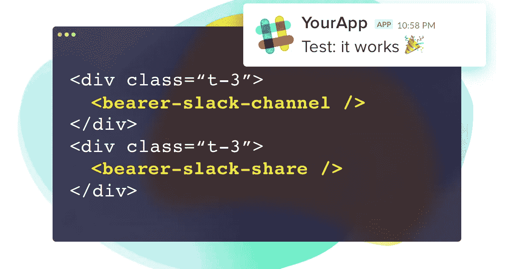

# 如何在 5 分钟内将时差通知集成到您的应用程序中

> 原文：<https://medium.com/hackernoon/how-to-integrate-slack-notifications-to-your-app-in-5-minutes-587b8fcaac13>

如果你的一些用户要求你与 Slack 集成，这并不奇怪。但是，如果可以的话，很多人会使用它，他们只是对此保持沉默。

那么，**你的 app 怎么支持 Slack** ？在不增加技术债务的情况下，**最快的构建方式是什么？**

# 整合 Slack 的繁琐路径

当你开始与 Slack 集成时，你需要做几件事:

*   **Slack API** :你需要了解它；为了我们的利益，这是有据可查的
*   后端:**设计** it 和**编码** it，玩 **API 客户端**和 OAuth
*   前端:设计 **UI 元素**，编码
*   并且:**托管它**，测试它，监视它，**维护它**

你可以用快速肮脏的方式实现它，把事情做好。但是那样你会降低你的代码质量，并且积累技术债务。

对于本应简单明了的事情来说，这是一项复杂的工作。我们在为你的团队讨论几个小时的工作。

而这只是针对一个应用，针对你的产品。有多少其他团队正在为同样的结果编写代码？

# 五分钟松弛通知，所有！

一天早上，我的联合创始人[塞德里克·法比安斯基](https://medium.com/u/cbcbd8358b83?source=post_page-----587b8fcaac13--------------------------------)和我决定**解决这个棘手的** **整合闲置通知的问题**。

这是一个快速的**解决方案，可以在五分钟内将松弛通知集成到您的应用程序中，**复制粘贴几行代码，并准备好运行:

*   它是完全分离的
*   它被优化了
*   最后，它不再重复任何代码！

把它想象成一个快速的 MVP 工具:你不需要投入太多时间，你就能完成很多工作。

它还**让你自治**，因为你不需要后端开发者安装，复制粘贴只需要几行 HTML 和 JS。

哦，它是免费的，代码完全开源。

是的，你没有借口:你花在阅读这篇文章上的时间和开始玩它是一样的。

**请务必立即查看:** [https://www . product hunt . com/posts/slack-notification-for-your-app](https://www.producthunt.com/posts/slack-notification-for-your-app)

谢谢大家！