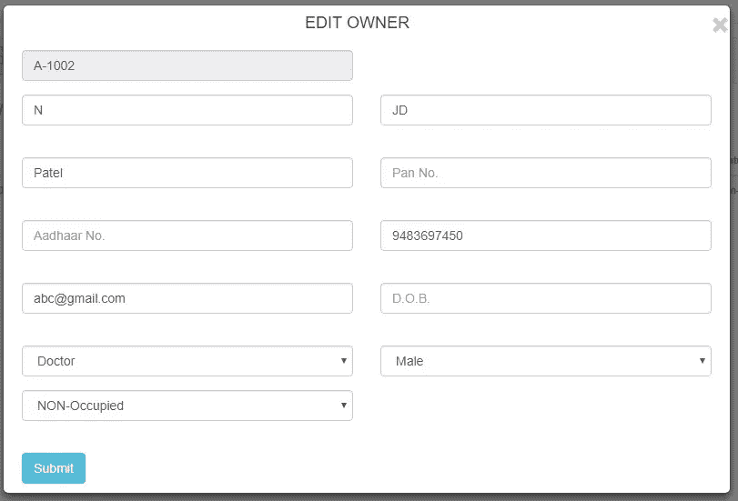

# 如何整合 Vue？带有 ASP.NET 核心 Web 应用程序的 JS 和 Typescript

> 原文：<https://medium.com/hackernoon/how-to-integrate-vue-js-typescript-with-asp-net-core-web-application-6e9aa6f2bcef>

> **快速总结:**在本教程中，您将了解 Vue.js & Typescript，以及如何将二者与新的 ASP.NET 核心框架集成，以创建一个执行 CRUD(创建、读取、更新、删除)操作的简单 web 应用程序。

周围发生了很多事。网络生态系统。例如，微软最近首次发布了一个开源的跨平台框架，并将其命名为 ASP.NET 核心。

对于那些不知道的人来说，ASP.NET 核心基本上是 ASP.NET MVC 框架的重新设计，旨在为创建现代应用程序提供更优化的开发环境。

## 什么是 Typescript？

Typescript 是一种由微软创建和维护的开源编程语言。它是为构建大规模应用程序和 JavaScript 代码转换而设计的。简而言之，Typescript 可用于构建客户端和服务器端执行的 JavaScript 应用程序。

## 什么是 Vue。JS？

另一方面，Vue.js 是一个非常流行的 JavaScript 框架，用于构建用户界面。

**现在在你问之前:** *既然已经有两个强大的 JavaScript——Angular&React——可用，为什么我还需要使用另一个 JavaScript 框架？*

事实是，Vue.js 不仅仅是市场上的另一个 JavaScript。它结合了 Angular 和 React 两者的特点，易学易上手。

事实上，Vue.js 现在正经历着巨大的增长。据bestof.js.org报道，Vue.js 去年增加了 4 万颗星，成为 Github 上排名第一的 JavaScript 框架。此外，Vue.js 还可以作为一个 web 应用程序框架，支持高级的单页面应用程序。

# 简而言之…

如果你对 Angular 和 React 不满意，或者你需要更简单、更快的选项，那么 Vue.js 值得考虑。

Vue.js 是一个轻量级、高性能的 JavaScript 框架，具有虚拟 DOM 实现。除了高性能，Vue.js 中的声明性语法允许开发人员以最简单的方式构建反应式用户界面。此外，它还带有设计良好的组件模块，允许您决定在将组件映射到文件时哪种风格最适合您。

# 最棒的是。

Vue.js 的设计方式是不在视图层结束。这意味着，您可以采用它的核心库，并使用它来创建您自己的视图层。同时，它还可以通过组件和插件进行扩展，以构建更复杂的单页面应用程序(SPA)体验。

这反过来让你完全控制你到底需要把什么带入你的项目，并根据这些需求进行挑选。

然而，如果你想知道每一个细节，究竟是什么 Vue。JS 能提供什么，你能用 Vue 做什么？JS，请阅读作者尤雨溪的详细文章。

但是就像我说的，如果你不是 Angular 或 React 的忠实粉丝，并希望探索其他 JavaScript 选项，Vue。JS 是现在最好的选择。在本教程中，我将展示如何集成 Vue。通过在 ASP.NET 核心中创建一个简单的 web 应用程序。

> 我们开始吧！

## **#1 —使用 ASP.NET 核心模板创建新的 VUE 项目:**

首先我们需要安装 NPM，Node.js，VS 代码和 VS 2017。

然后我们还需要使用控制台安装微软提供的单页应用程序模板:

> 点网新-安装微软。AspNetCore.SpaTemplates::*

这个软件包将为 Vue 安装模板。

现在要创建一个新的 Vue 项目，在控制台上运行以下命令:

> mkdir 新项目
> 
> cd 新建-项目
> 
> dotnet 新 vue

接下来，在您的项目根上运行 *npm install* 来恢复所有需要的节点模块，比如 webpack 及其依赖项。

最后，使用控制台执行 *dotnet run* ，您的应用程序将在 *"localhost:5000"* 上运行，如下图所示。

可以看到，客户端 app 位于 **/ClientApp** 中。

这个新项目的内容如下:

ASP.Net 核心后端
SPA 前端使用 Vue 2 和 TypeScript
Bootstrap 3 样式
web pack 生成最终发送到浏览器的 js/css 包，连接开发和生产模式。

项目结构看起来像，

现在，让我们打开 **ClientApp/boot.ts**

这是我们客户端代码的入口点，该文件包含在代码编辑器中启动 Vue 应用程序的代码(VS 代码):

在这个文件中，我们可以进行这样的配置，如路由器配置、组件注册和主 Vue 应用程序。

## **#2 —网络包配置**

基本上，配置一个名为“main”的包，由从 ClientApp/boot.ts 开始的文件组成:

> 条目:{'main ':'。/ClientApp/boot.ts'}，

现在跳转到输出属性。

现在，要在项目的 **wwwroot/dist** 文件夹中生成包，使用包的名称作为文件名:

> 输出:{
> 路径:path.join(__dirname，bundleOutputDir)，
> 文件名:'[名称]。js '，
> publicPath: '/dist/'
> }，

## #3 —添加一个 Vue(模板+类型脚本)页面

导航到文件夹**client app/components/Member，**，添加一个名为 **members.ts** 的新文件，如下图所示:

现在添加它的设计模板文件命名为**member.vue.html**

> <template></template>

接下来，我们需要在 **boot.ts** 中添加新的 route，将以下条目添加到 **routes** 数组中，以便通过导航访问该页面:

> { path:“/member，component: require('。/components/member/member . vue . html ')}

最后，打开**navmenu.vue.html**并向菜单添加另一个条目，以呈现/成员:

> *   <router-link to = "/member ">
>     TODO list
>     </router-link>
>     </李>

在这里，我们对新添加页面的基本导航是通过上述步骤完成的。

现在我们需要从数据库中获取、插入、删除、更新数据。为此，我们必须通过 Vue 提供的 **axios** 库调用 WEB API。

只需运行命令:

> npm 安装 axios–保存

在 memebr 类中导入 axios。然后从后端 api 获取成员列表，如下所示:

> getData() {
> axios({
> 方法:' GET '，
> URL:'[https://localhost:44371/API/members/GET members '](https://localhost:44371/api/members/getmembers')，
> data: this.memberForm，
> headers:{
> ' Content-Type ':' application/JSON '
> }
> })。然后(response = > response.data)。然后(data =>{
> this . membergriddata = data；
> })；
> }

Vue 上的界面将看起来像:

> 接口成员{
> 名字:字符串；
> 姓氏:字符串；
> 地址:字符串；
> 性别:号；
> 占用者:人数；
> mntncPaidFreq:数字；
> 维护:编号，
> 成员 Id:字符串；
> }

这里，用**创建了一个新项目。csproj 文件**，其中内置了 ASP.Net web API 控制器，我们也可以添加自定义控制器。

## #4 —创建 ASP。Net Core Web API 使用 VS 2017

一个 ASP.NET 核心 MVC 应用程序，使用实体框架执行基本的数据访问。您将使用逆向工程来创建基于现有数据库的实体框架模型。

完成本演练需要以下先决条件:

Visual Studio 2017 15.3
从控制面板启用 IIS
。NET 核心框架
。网芯 2.0 SDK。
·MS SQL 数据库

创建新的 WebAPI 项目。

打开 Visual Studio 2017
文件- >新建- >项目
从左侧菜单中选择已安装- >模板- > Visual C# - > Web
选择 ASP.NET 核心 Web 应用程序(。NET Core)项目模板
输入 Vue-Web-API 作为名称，然后单击确定
等待新的 ASP.NET 核心 Web 应用程序对话框出现
在 ASP.NET 核心模板 2.0 下，选择 Web 应用程序(模型-视图-控制器)
确保身份验证设置为无身份验证
单击确定

现在，使用逆向工程来创建基于现有数据库的实体框架模型。

*打开 VS 2017 - >工具>获取包管理器>包管理器控制台*

运行以下命令:

> 安装包微软。SqlServer
> 安装包微软。EntityFrameworkCore.Tools
> 安装包微软。visual studio . web . code generation . design

现在，基于您现有的数据库创建 EF(实体框架)模型，运行命令:

> scaffold-db context " Server =(local db)\ mssqllocaldb；数据库=博客；Trusted _ Connection = True 微软。SqlServer -OutputDir 模型

反向工程过程基于现有数据库的模式创建了实体类和派生的上下文。

现在我们必须将数据库提供者的配置移动到 **Startup.cs** 。

在文件开头添加以下 using 语句:

> 使用 EFGetStarted。AspNetCore . ExistingDb.Models
> 使用微软。EntityFrameworkCore

将下面一行复制到 *ConfigureServices()* 方法:

> var connection = @ " Server =(local db)\ mssqllocaldb；数据库=博客；Trusted _ Connection = TrueConnectRetryCount = 0 "；
> 服务。AddDbContext<BloggingContext>(选项= >选项。use SQL server(connection))；

既然搭建已经启用，我们可以为任何实体搭建一个控制器。

*   右键单击解决方案资源管理器中的控制器文件夹，并选择添加->控制器
*   使用实体框架选择带有视图的 MVC 控制器，然后单击确定
*   设置模型类和数据上下文类

*   单击添加

**它将看起来如下:**

> 使用系统；
> 使用系统。集合。泛型；
> 使用系统。Linq
> 使用系统。线程。任务；
> 使用微软。AspNetCore . Http
> 使用微软。AspNetCore . Mvc
> 使用微软。EntityFrameworkCore
> 使用社会管理。模特；
> 使用社会管理。视图模型；
> 
> 命名空间社会管理。控制器
> {
> 【路由(" API/[控制器]/[动作]")】
> 【API controller】
> 公共类 members controller:controller base
> {
> 私有只读社会管理上下文 _ 上下文；
> 
> public members controller(SocietyManagementContext context)
> {
> _ context = context；
> }
> 
> //GET:API/Members
> 【http GET】
> 【ActionName(" GET Members ")】
> public IEnumerable<Members viewmodel>GET Members()
> {
> var list Members = _ context。Members.Include("FamilyDetail ")。包括(“停车”)。包括(“承租人”)。包括(" FlatDetail ")。to list()；
> 返回 getMembersViewModel(list members)；
> }
> }

**现在，运行应用程序来查看它的运行情况。**

执行后，Vue 项目将如下所示:

**成员网格:**

**会员添加:**

**成员编辑:**

# 结论

在今天的教程中，我们已经使用 Vue.js & Typescript 通过 CRUD 操作[构建了一个 ASP.NET 核心 web 应用](https://www.zealousys.com/asp-net-core-development/)。您可以在我们的 [Github](https://github.com/Zealous-System-Pvt-Ltd/asp-net-core-vuejs-typescript) 档案中找到这个演示 web 应用程序的源代码。