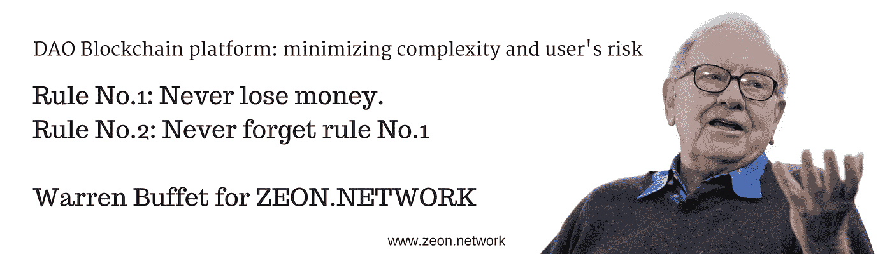
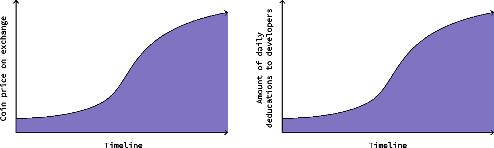

# 如何投资一个 ICO/IOE 不亏？三大建议。

> 原文：<https://medium.com/hackernoon/how-to-invest-in-an-ico-and-not-lose-or-how-take-back-control-of-your-money-af233c4a5803>

如何投资 ICO/IOE 而不亏损？

有人收到过这样的信息吗，无论是朋友、同事还是家人，你会如何回应？这就是我们的反应。

*朋友:我在一次加密聊天中发现了你。我想找个人谈谈这个话题。我想开始投资，但我对其他人的意见感兴趣。我一直在考虑开始交易。但我得到投资 ICO/IOE 的建议。他们说投资 ICO/IOE 更赚钱。你有投资 ICO/IOE 的经验吗？*

我们都可以承认，曾几何时，我们是秘密经济的新来者&我们也可以承认，我们收到过这样或相当类似的信息。密码市场很复杂，而且不断变化。答案是经验，让我们与你分享我们的经验。

今天我们来讨论一些关于 ICO */IOE* 投资的问题，比如新闻标题。

大多数项目都是从首次发行硬币开始的。初创公司以诱人的价格向他们未来的客户提供代表其产品功能的令牌。虽然创业的成功依赖于成功的区块链公用事业的发展，令牌的价值也可以增加。项目团队的成功在于产品和代币持有者享受代币的增值。这是创造成功投资的要素。

理论上看起来不错。每个人都可以成为一个小的风险投资者，让他们的资本倍增。然而，反之亦然，代币可能会贬值。

谁对你的钱负责？或者区块链众筹的问题。

没有人。

这是区块链的本性。当您将钱转移到任何钱包时，任何代币都将成为钱包所有者的财产。没有人能退还你的投资。这是投资 ICO */* IOE 的主要问题。

这种情况有几种解决方法。一些 ICO 有托管服务，以确保投资者的资金。政府讨论 ICO */* IOE 监管，但不利的一面是如何在区块链生态系统中体现它们。

这是关于把马车的木轮子装在全新的跑车上，这是行不通的。

区块链问题的区块链解决方案。或者如何夺回你的钱的控制权。

为了恰当地解决这个问题，我们需要寻找区块链解决方案，它可以处理可以在生态系统中实施的区块链特定问题。

一些秘密项目进行了尝试，但这是情况的时刻。ZEON 提出了一个全球性的决定。这是一个由社区推动的项目，有着聪明的区块链。

ZEON 提出了一个叫做 Atlas 的概念。Atlas 让投资者参与最初的项目开发过程，使 ico 更加安全。它为开发人员提供了一定程度的责任，并让令牌持有者更加放心，他们的投资是安全的。有了 Atlas，ZEON 就能保证他们的令牌持有者得到最低限度的可行产品，或者收回他们的钱。

它是如何工作的？

ZEON 平台免费为每个开发者分配一个钱包地址来收集投资。所有的资金都锁在一个捐助者和开发者都可以使用的钱包里。开发商只能按照双方约定的比例退出。这是阿特拉斯协议。

与 ICO/crypto 项目的两种交互类型:

1.ZEON tokenholders 发行担保购买。随着 ICO/crypto 项目团队对 ZEON 网络的熟悉，这将在初期更受欢迎。

2.ICO/crypto 项目本身发行安全购买。

一旦 ZEON token 作为特定 ICO 项目的一部分被购买，用户将收到 ZEON Multi Wallet 中的令牌(包括 ETH 子令牌、替代币或其他资产)。这允许对项目资金进行监控，并允许双方投票决定是减少还是增加团队的日常融资(DAO 原则)。每个用户都可以确信他们的购买得到了 ZEON 的可靠保护。

ZEON main 区块链、smart-contracts、Hyperion oracle 和 smart 区块链(sharding)使安全投资成为可能。

**亥伯龙神谕**

Hyperion 系统不断接收来自交易所的数据。一旦启动硬币在交易所发行，初始汇率将通过 Hyperion 协议存储，以供后续分析。

初始分析利用连续 3 天的数据来标准化该硬币的轮廓。

Hyperion 协议随后分析该简档，并使用专有公式确定“ICO 令牌的当前值的平均算术值”(以下称为“新价格”)。

著名的密码顾问或华而不实的漂亮项目网站的存在并不能保证投资的资金可以被收回，或者对硬币或代币的增长有任何影响。

在很多情况下，创始人之间愿景的分歧或主要开发者的离开会导致失败或丑闻。

密码行业需要像 ZEON 和其他项目，因为他们将从一个开放和高效的社区的力量中超越其他人。