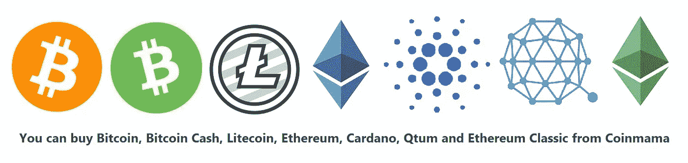

# 如何投资比特币和其他加密货币:完整而全面的指南

> 原文：<https://medium.com/hackernoon/how-to-invest-in-bitcoin-and-other-cryptocurrencies-comprehensive-guide-9187fc34745a>

## 关于如何轻松投资几乎任何加密货币的详细指南

比特币是一种数字货币，可以以非常低的费用转让给世界上的任何人，并且对你可以向谁或向哪里发送比特币没有限制。

与可以无限生产的现金不同，比特币只能有 2100 万枚。由于其稀有性和高需求，比特币的价格已经从 2009 年的几美分上涨到现在的 1 万多美元。幸运的是，如果你打算得到一个比特币，你不必购买完整的比特币，你甚至可以购买价值 100 美元/100€100 的比特币。

如果你有兴趣购买或投资比特币，本指南将向你展示如何购买比特币以及其他加密货币，包括以太坊、比特币现金、Ripple、Dash 和 Stellar Lumens。

你会在这篇文章中看到几次提到比特币现金，如果你想购买比特币，那么在交易所购买时选择“比特币”，“比特币”和“比特币现金”是两种不同的加密货币。

多年来，进入加密货币投资的门槛已经降低，本指南着眼于投资加密货币的多种方式。

# CEX

[CEX](https://cex.io/r/0/up106280379/0/) 是一个伟大的交易所，可以快速方便地购买比特币以及以太坊、比特币现金、比特币黄金、Ripple、Dash、Zcash 和 Stellar Lumens。

这种交换支持世界上每个国家，帐户设置也很快和简单。

像其他交易所一样，它有一个内置的钱包，但你也可以选择在购买后直接将比特币发送到你自己的个人钱包，使用这个选项可以节省你的转账费用，因为比特币会直接发送到你的个人钱包。

支付方式包括电汇、网上银行转账和信用卡/借记卡支付。

## 需要注意一些事情:

基本账户每天最多可以购买价值 1000/1000 美元的加密货币，每月最多可以购买 3000/3000 美元。

经过验证的账户可以无限量买卖 CEX 上提供的任何加密货币。

基本账户只能使用借记卡/信用卡购买加密货币，如果你想使用银行转账将资金存入 CEX，你必须首先验证你的账户，但验证过程快速简单。

CEX 支持世界上所有的国家，是我个人最喜欢的。

## 在这里可以用 CEX 购买比特币:[在 CEX 购买比特币](https://cex.io/r/0/up106280379/0/)

# 比特熊猫

**注:该交易所目前只允许欧洲国家的投资者购买加密货币，未来可能会有所改变。**

然而，世界上任何国家的投资者都可以在这个交易所出售密码。

[BitPanda](https://www.bitpanda.com/?ref=3127933809251797450) 是目前欧洲最受欢迎的比特币交易所，它允许您使用各种方法立即购买比特币以及比特币现金、以太坊、Ripple、莱特币、IOTA、EOS、Komodo 和 Dash，包括银行转账、电汇、信用卡/借记卡支付、Neteller 和 Skrill。

处理时间大约需要 20 秒，验证只需几分钟，您可以:

通过银行转账每天向€存款 49，990 欧元/ 44，874.17 英镑

通过银行转账每天从€提取 50 万欧元/ 448，750.68 英镑

交易限额是无限的，这意味着你可以随心所欲地买卖加密货币。

当你购买任何加密货币时，它会被存储在 BitPanda 的内置钱包中(他们有比特币钱包，莱特币钱包，Ripple 钱包，欧元钱包等)。)

你可以很容易地将你的硬币发送到我推荐的另一个钱包，如果你打算长期储存你的硬币，我会在本指南末尾列出我的钱包推荐。

## 需要注意一些事情:

所有欧洲国家都支持 BitPanda，据我所知，目前只有欧洲国家可以使用 BitPanda 在 T2 购买加密货币。

然而，如果你想在**出售**加密货币，你可以在世界上任何一个国家这样做。

BitPanda 支持以下法定货币:

*   欧元(€)
*   英镑
*   瑞士法郎
*   美元

[BitPanda](https://www.bitpanda.com/?ref=3127933809251797450) 目前为基于菲亚特的交易所提供最多的加密货币支持，提供 14 种加密货币:

*   比特币
*   比特币现金
*   以太坊
*   涟漪
*   莱特币
*   极微小
*   潘托斯
*   恒星流明
*   科莫多岛
*   黎明的女神
*   破折号
*   奥米塞戈
*   占卜师
*   0x

此外，他们的选择还会不断增加。

我发现 BitPanda 非常快速可靠，这是目前居住在欧洲任何地方的投资者的最佳选择之一。

新的硬币总是被添加到这个交易所，这是个人最喜欢的 CEX。

## 可以在这里用 BitPanda 购买比特币:[从 BitPanda](https://www.bitpanda.com/?ref=3127933809251797450) 购买比特币

# Coinmama

使用 [Coinmama](http://go.coinmama.com/visit/?bta=37404&nci=5343) 购买比特币和其他加密货币非常容易，你可以在几分钟内使用信用卡或借记卡购买加密货币。像 CEX 一样，该交易所支持全球所有国家。

Coinmama 提供比特币、以太坊、比特币现金、莱特币、Cardano、Qtum 和以太坊经典，这是一个基于现金的交易所的许多加密货币。

在从 Coinmama 购买比特币之前，您需要一个比特币钱包地址，但有一个内置选项可以使用单独的比特币钱包提供商生成一个免费的软件钱包。

用护照验证的账户可以购买价值 10，000 美元(7，836 英镑)的加密货币，用 2 种形式的 ID 验证的账户可以购买价值 50，000 美元(39，197 英镑)的加密货币，3 级验证及以上的账户没有限制。

Coinmama 有其他支付方式，包括银行转账和电汇，但我只看到了信用卡/借记卡支付，其他支付方式可能取决于您所在的国家。

Coinmama 支持全球所有国家

## 可以在这里使用 Coinmama 购买比特币:[在 Coinmama 购买比特币](http://go.coinmama.com/visit/?bta=37404&nci=5343)

# 比特币基地

作为购买比特币最知名的网站之一，比特币基地还允许您使用银行转账、电汇和信用卡/借记卡支付来购买以太坊、以太坊经典版、比特币现金和莱特币。

像 BitPanda 和这里列出的其他交易所一样，每种货币都将存储在自己的比特币基地生成的钱包中，你可以在比特币基地网站上买卖这些货币。

比特币基地支持英国、美国、加拿大、澳大利亚、新加坡和欧洲部分地区。

## 在这里可以用比特币基地购买比特币:[在比特币基地购买比特币](https://www.coinbase.com/join/592b7d7f64a015a3716ebdad)

# 本地比特币

[LocalBitcoins](https://localbitcoins.com/?ch=d7ch) 是一种快速简单的买卖比特币的方式，它的工作原理是让用户互相买卖比特币，这也被称为点对点(P2P)或场外交易(OTC)买卖。这个过程是安全的，因为 LocalBitcoins 使用托管保护来防止欺诈和保护买家和卖家。

LocalBitcoins 还有一个内置的信誉系统，可以帮助用户过滤掉不可靠的客户，比特币的价格也会不断更新。

要购买比特币，你只需选择一个卖家并点击“购买”，一些卖家会要求你验证身份，然后你才能从他们那里购买比特币。

LocalBitcoins 有多种支付方式可供选择，包括 SEPA、银行转账、信用卡/借记卡和 PayPal，其他方式包括西联汇款(由于风险较高，不推荐)和许多特定国家的支付方式。

LocalBitcoins 支持全球所有国家。

## 可以在这里用 LocalBitcoins 购买比特币:[在 LocalBitcoins 购买比特币](https://localbitcoins.com/?ch=d7ch)

# 在哪里储存你的比特币

# 比特币钱包的工作原理

一旦你拥有比特币(或任何其他加密货币),你就需要将它们存储在个人钱包中，在那里你可以控制私钥或钱包种子，不建议将硬币长期存储在交易所，因为交易所可能会被当局黑客攻击或关闭。

## 比特币钱包通常由三个要素组成:

*设置* [*总账比特币钱包*](http://bit.ly/BuyBitcoin_Wallets) 时的恢复密码示例

**钱包种子/恢复短语:**也称为助记密码短语，这是一个备份短语，用于在比特币钱包丢失时恢复钱包。您应该始终在一张纸上保留钱包种子或恢复短语的备份，或者您甚至可以使用[物理备份工具。](http://bit.ly/BuyBitcoinKR_LedgerCryptosteel)

**公共地址:**这是你发送比特币的目的地，它是一串字母数字字符，代表比特币转账的可能目的地。

**私钥:**在加密货币钱包中，私钥是一个秘密数字，让用户可以花比特币。每个比特币钱包都包含一个或多个私钥，这些私钥保存在钱包文件中。从钱包生成的所有比特币地址都与其私钥相关，如果钱包没有为您提供钱包种子或恢复短语，建议您备份您的私钥，以及您的恢复短语您不应向任何人透露您的私钥。

# 软件钱包

你可以把你的比特币储存在一个软件钱包里，这个钱包是一个简单的软件程序或应用程序，可以让你储存、接收和发送比特币。

如果你正在寻找快速简单的钱包，我推荐使用 Copay 或 GreenAddress，它们允许你将钱包导入到另一个设备中，例如，如果你使用 PC 创建钱包，你可以下载智能手机应用程序，并将钱包导入到智能手机应用程序中。

可以从这里获得 Copay 比特币钱包: [**Copay 比特币钱包**](https://copay.io/#download)

您可以从这里获得 GreenAddress 比特币钱包: [**GreenAddress 比特币钱包**](https://greenaddress.it/en/)

把你的比特币留在交易所是另一种选择，但把它们放在你自己的钱包里总是更好。

# 冷藏

*比特币纸质钱包的例子*

冷存储就是简单地离线存储你的比特币，它可以通过使用纸质钱包或硬件钱包来完成。

纸质钱包是一个简单的文件，包含您的钱包种子，公共地址和私人地址，纸质钱包最好用于长期存储，每个钱包应该只使用一次，您还应该保留一个备份您的纸质钱包存储在一个单独的地方或扫描并保存在外部硬盘驱动器或离线 PC 上。

## 纸质钱包的潜在缺点

纸质钱包的一个缺点是，如果你想消费或转移资金，需要将它们导入软件或硬件钱包。

由于它们由纸制成，因此非常容易受到水、火和磨损的损坏。

您可以向纸质钱包发送比特币，发送次数不限，但出于安全考虑，建议您在发送比特币后创建一个新的纸质钱包。

当创建纸质钱包时，最好坚持使用特定硬币的官方纸质钱包生成器，对于比特币，我推荐[bitaddress.org](https://bitaddress.org/)，因为它基于鼠标移动的随机数生成器。

# 硬件钱包

硬件钱包(或物理比特币钱包)是一种特殊类型的比特币钱包，它使用安全和加密的硬件设备在离线环境中存储用户的私钥。

## 硬件钱包比软件和纸质钱包有更大的优势:

一个钱包可以存储多种加密货币，因此管理多种加密货币更加容易。

你可以从硬件钱包发送比特币，次数不限。出于安全原因，纸质钱包只能使用或发送一次。

硬件钱包不受试图发现用户私钥的计算机病毒或恶意软件的影响，这是因为它们内置的加密程序使私钥无法被任何未授权方识别。

硬件钱包可以用来在任何时候接收和发送加密货币，而不是纸质钱包，如果你想从其中转移比特币，必须将其导入软件或硬件钱包。

# 我的建议:

## 莱杰纳米 S

Ledger Nano S 和 Ledger Blue 是目前最受欢迎的硬件钱包，它支持最大数量的加密货币，并定期添加新的硬币。

## 看看这里:[莱杰纳米 S](http://bit.ly/BuyBitcoin_LedgerNanoS)

## 分类帐蓝色

Ledger Blue 是 Ledger 最新的实体钱包，也支持数百种加密货币，它包括一个大型的彩色触摸屏。

您的钱包私人密钥使用 BIP 16，BIP 32，BIP 39 和 BIP 44 加密安全离线存储。

## 看看这里:[莱杰蓝](http://bit.ly/BuyBitcoin_LedgerBlue)

## 我希望这个指南对你有所帮助，欢迎随时关注我的 [Medium](/@cryptonitecj900) 和 [Twitter](https://twitter.com/CryptoniteTweet) ，获取更多帖子、技巧和新闻。