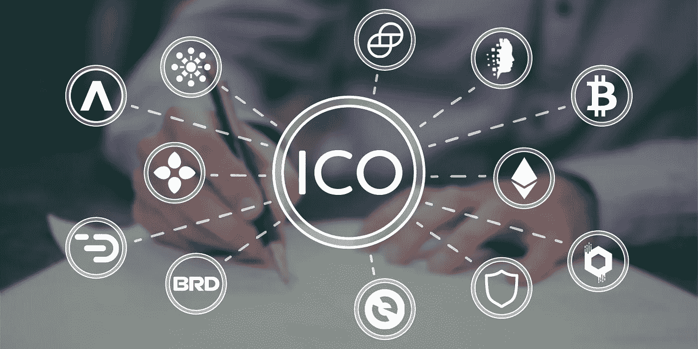

# 如何投资 ico 以及我从投资五个 ico 中学到了什么

> 原文：<https://medium.com/hackernoon/how-to-invest-in-icos-and-what-ive-learned-investing-in-five-icos-fc40f2a3b1fc>

How To Participate in Initial Coin Offering (ICO)

***免责声明:*** *作者不是财务顾问，也不是区块链科技专家。本文不提供任何投资建议，也不应被视为投资建议。作者是* [*信托钱包*](https://trustwalletapp.com/) *的顾问。*

“你怎么看待[比特币](https://hackernoon.com/tagged/bitcoin)？”几周前我父亲在电话里问我。这是一个令人震惊的问题，来自一个努力保持电子邮件有序或改变 iPhone 基本偏好的人(对不起，爸爸！).显然，我父亲在一次跨年晚会上听说了比特币，觉得这可能是一个稳健投资的机会。

“这不是一个简单的问题，”我回答道。“(区块链)技术有巨大的潜力，但如今比特币是一项风险极高的投资。”

投资加密货币的理念已经渗透到我们社会的很多地方。想到人们会愿意把自己辛辛苦苦挣来的钱投资在他们几乎无法理解的东西上，真是令人震惊，但这正是密码世界似乎正在发生的事情。

生活在硅谷的好处之一就是比世界上任何人都更早地在闲聊中了解新事物和新技术。无论是自动售货机还是机器人咖啡吧，如果你在旧金山的咖啡店、酒吧和街道上闲逛，你就会发现这一点。

我已经不记得第一次听到***【ICO】***这个名词了。我猜是 2016 年的夏天或秋天。随着对加密市场的大肆宣传，我的好奇心占了上风。我开始积极阅读和研究区块链技术及其应用。

没有参与这个过程，我对 ICOs 的理解并不完整。很快，我开了一个比特币基地账户，并投资了几千美元来看看这个“系统”是如何运作的。我订阅了加密简讯和 ICO 警报。在接下来的几个月里，我参与了一些 ico，有时成功，有时不太成功。

> ICO 是发行公共硬币或代币的过程。这类似于公司通过在公共证券交易所(如纽约证券交易所或纳斯达克)上市进行首次公开发行(IPO)。硬币或代币在区块链发行，这意味着它们不受监管。它们可以很容易地交易，但这就是棘手的地方。

与反映公司所有权的股票不同，代币代表由发行它的公司创建的特定网络中有价值的公用事业或资产([阅读更多有关硬币和代币之间的差异的信息](https://masterthecrypto.com/differences-between-cryptocurrency-coins-and-tokens/))。换句话说，代币不代表所有权，它们构成了网络本身创造的价值。公司或项目的成功增加了代币的效用，使其价值上升( [WTF 是 ICO？](https://techcrunch.com/2017/05/23/wtf-is-an-ico/))。

在我们继续之前，让我推荐一些学习基础知识的资源:

*   [比特币白皮书](https://bitcoin.org/bitcoin.pdf)
*   [以太坊白皮书](http://www.the-blockchain.com/docs/Ethereum_white_paper-a_next_generation_smart_contract_and_decentralized_application_platform-vitalik-buterin.pdf)
*   [纽约时报《超越比特币泡沫》](https://www.nytimes.com/2018/01/16/magazine/beyond-the-bitcoin-bubble.html)
*   菲尔·弗格森秀:[第一部](https://www.spreaker.com/user/8084919/242-the-one-about-bitcoin-part-1)和[第二部](https://www.spreaker.com/user/8084919/243-the-one-about-bitcoin-part-2)
*   [主加密](https://masterthecrypto.com/)
*   [投资媒体](https://www.investopedia.com/terms/b/bitcoin.asp)
*   [A16Z 编辑的文章列表](https://a16z.com/2018/02/10/crypto-readings-resources/)

## **1。入门:你几乎必须从比特币基地**开始

在你投资一个 ICO 之前，你必须先买以太坊。没有多少地方可以用美元(或者用密码术语来说是法定货币)购买 ETH。因此，默认和最简单的路线是使用比特币基地。该公司享有早期进入者的地位。随着对比特币和加密货币的大肆宣传，比特币基地作为最早的参与者之一获得了不成比例的回报。去年，比特币基地创造了超过 100 亿美元的 1B 收入。

还有其他选择，比如《脸书传奇》中的两兄弟拥有的[双子星](https://gemini.com/)、[。虽然 Gemini 的费用较低，但可能需要几天时间来完成硬币的购买，这在密码市场上是永恒的，价格在几分钟内就会发生变化。](http://fortune.com/2017/12/04/winklevoss-twins-bitcoin-billionaires/)

坦率地说，在交易速度方面，比特币基地也好不到哪里去。有时，延迟是由于确认交易的网络速度慢造成的。有时是因为比特币基地那边的维修。人们越来越担心比特币基地可以操纵价格，因为他们在将美元过渡到加密的公司中占有很大的市场份额。

以下是用美元购买比特币或以太坊的几种选择:

*   [比特币基地](https://www.coinbase.com):市场领导者，易于使用，有移动应用程序
*   双子座:一个好的选择，但是有更多的限制
*   [BitPanda](https://www.bitpanda.com/) :自己没用过
*   [CoinMama](https://www.coinmama.com/) :自己没用过

## **2。设置我的钱包**

因为大多数 ICO 都是基于以太坊智能合约的，所以你的加密钱包必须支持接收令牌。在 ICO 期间，您向发行新代币的公司发送以太币，并根据公布的汇率接收代币金额。

比如某公司的汇率是 ETH = 1,000 X 币。ICO 市场就像蛮荒的西部——没有单一的一套规则或政策。通常发行 ICO 的公司会限制一个人可以购买的硬币数量。

第一次设置一个 [MyEtherWallet](https://medium.com/u/a9af0d538df5?source=post_page-----fc40f2a3b1fc--------------------------------) 似乎很奇怪，因为你没有创建用户名。您创建一个 passport 并下载 Keystone 文件，通常称为私钥。MyEtherWallet 为您的钱包生成一个公共地址，您的私钥是访问它的唯一途径。您的公共地址是匿名的，但是网络中的每个人都可以看到。换句话说，每个人都能看到发生在你钱包里的交易，但没人知道这是你的。

> 例子:鲍勃想给约翰寄钱(以太币)。首先，Bob 需要知道 John 的银行账号(公共或钱包地址)。约翰的账号是 1325。鲍勃向约翰的账户汇去 1 美元(1 以太币)。网络中的每个人都可以看到 1325 号账户收到了 1 美元(1 以太币)。现在，约翰需要使用他的私钥访问他的银行账户(钱包)来取款或汇款(以太坊)。如果 John 丢失了他的私钥，他将永远无法访问他的银行帐户(钱包),他的钱也将永远丢失。

这就是为什么你**必须**保护好你的私人密钥。与您的银行帐户登录不同，您可以通过亲自证明您的身份或使用国家颁发的身份证明来重置您的银行帐户登录，在 crypto 中丢失或泄露私钥等同于死刑判决。你将永远无法恢复它。丢失私人钥匙的恐怖故事对我们所有人来说都是一个警示故事([《我忘了我的密码》:一个在比特币](https://www.wired.com/story/i-forgot-my-pin-an-epic-tale-of-losing-dollar30000-in-bitcoin/)中丢失 3 万美元的史诗故事)。)

***提示:*** *有几种方法可以保护你的私钥。您可以使用硬件钱包，这是一种加密设备，可以存储您拥有的所有硬币的私钥。你可以将加密的私人密钥存储在闪存盘上，并保存在银行的保险箱中作为备份。您也可以使用加密软件(如 1password)来存储您的私钥。如果你经常交易，你需要经常访问你的密钥，所以加密软件是一个安全的选择。*

## **3。寻找和研究 ico**

发现这么多 ico 几乎同时发生令人震惊。你如何挑选购买哪个代币？即使你能分析出每一个 ICO 所附带的白皮书，你又如何决定读什么白皮书呢？你不可能读完所有的书。

**ICO 是投资还是赌博？**

让我退一步，解释一下我投资 ico 的理念。事实上，投资可能是一个错误的词。如今的 ico 似乎更像是纯粹的赌博——一种碰运气的游戏。我不相信任何为非理性信念找到合理解释的所谓专家(是的，詹姆斯·阿尔图彻，我在跟你说话)。

我们，包括所谓的密码专家，都倾向于纳西姆·塔勒布在他的[书](https://hackernoon.com/tagged/book) [*【黑天鹅】*](https://www.amazon.com/Black-Swan-Improbable-Robustness-Fragility/dp/081297381X) 中所说的叙事谬误——一种倾向于构建故事，将不相关的事实联系起来。叙事谬误阻止我们在没有解释的情况下观察事实。例如，这个令牌将会成功，因为 Vitalik Buterin 是顾问委员会的成员。

当然，许多所谓的密码专家希望利用新兴市场。在淘金热时期卖铲子通常是一种更安全、更有利可图的商业策略。更值得警惕的是，很多 ico 的发行都没有一个产品，甚至没有一个原型。有多少风投或天使投资人会投资一家没有吸引力、看不到产品的公司？听起来很疯狂，但 ICO 市场上有很多公司筹集了数百万美元，却错过了这两者。

我投资 ico 的主要目的是研究和了解这个新市场现在是如何运作的。它被夸大了，看起来像一个泡沫。尽管如此，区块链技术和分散的生态系统很可能会改变我们社会的运作方式([本文提供了几个例子](https://www.nytimes.com/2018/01/16/magazine/beyond-the-bitcoin-bubble.html))。

尽管如此，我不想乱花钱。我的第一步是将我的潜在投资清单缩小到 5 到 10 个可控的数量。为了编制一个简短的列表，我看了三个方面:1)基本概念；2)团队；3)利益或炒作。以下是一系列对您有帮助的问题:

**基本概念**

*   *你能至少在理论上理解代币的价值吗？*
*   *是否容易解释和理解？*

**团队**

*   *谁是公司的幕后黑手？*
*   *团队由真人组成吗？*
*   *他们的背景如何？*
*   它们位于哪里？

**兴趣还是炒作**

*   *他们在 ICO 滴滴上的炒作评级如何？*
*   他们的电报渠道和其他社交媒体渠道有多少人？

然后，我会尝试浏览他们的白皮书，以获取更多关于该解决方案的信息。老实说，我很少发现他们有洞察力。通常，这是因为我缺乏知识。有时候，公司不会投入太多时间和精力来解释他们想要建立什么。少数人甚至抄袭和复制他们的论文( [Tron 就是一个很好的例子](https://hackernoon.com/trons-whitepaper-is-copied-plagiarized-cefce74335ce))。

这是我最喜欢的两个了解 ico 的资源:

*   [**ICO 滴**](https://icodrops.com) **(** [**ICO 滴**](https://medium.com/u/f3e07d90580d?source=post_page-----fc40f2a3b1fc--------------------------------) **)**
    ICO 滴是我最喜欢研究 ICO 的地方。布局简单明了，所以很容易找到活跃的和即将推出的 ico。他们根据炒作和兴趣对 ico 进行评级，这样可以节省时间。他们甚至会告诉你 ICO 是否全部可用。国家。
*   [ICO Alert](https://www.icoalert.com/)([ICO Alert](https://medium.com/u/6d0133b314ee?source=post_page-----fc40f2a3b1fc--------------------------------))
    ICO Alert 是我第二喜欢的 ICO 滴替代品。

其他资源:

*   [硬币表](https://www.coinschedule.com/) ( [硬币表](https://medium.com/u/ab16ff564feb?source=post_page-----fc40f2a3b1fc--------------------------------))
*   [ICO 评级](https://icorating.com/)
*   [ICO 追踪器](https://icotracker.net/)
*   [ICO 列表](https://www.ico-list.com/)
*   [代币市场](https://tokenmarket.net/ico-calendar)

***提示:*** *注册一个你感兴趣的 ico 的白名单。通常你必须在白名单上才能通过你的客户(KYC)流程。稍后将详细介绍。*

## **4。注册和了解您的客户(KYC)流程**

第一个 ICO 有点像失去童贞——你既害怕又兴奋。我丢了一枚叫做 ALIS 的小硬币。

很难弄清楚做什么和如何做。ALIS 在他们的网站上提供了一个带有汇率的地址。你不得不用你的钱包和以太坊。比特币基地不接受以太币，所以我不得不把以太币转移到我的以太钱包。几天后，我的钱包里收到了价值几百美元的 ALIS 硬币。

ALIS 没有了解你的客户(KYC)程序。KYC 是公司验证客户身份的一种方式(或者在 ICO 的情况下，验证投资者的身份)。在加密世界中，匿名有如此多的宣传，我很惊讶 KYC 过程经常包括发送一份你的护照复印件和一张你拿着你的身份证件的照片。

随着 ICO 越来越受欢迎，监管机构正在对公司强制实施 KYC 程序，以防止洗钱或逃税。我们应该期待在密码领域有更多的规定。

## **5。切换到信任钱包**

ALIS ICO 相对安静。这一过程并不仓促，ICO 也没有在几分钟内完成。这就是我选择它的原因——我想有足够的时间来学习这个过程。顺便说一句，我的 300 美元 ALIS 硬币在几个月后当我卖掉它们时，价值变成了 1200 美元。至少，我没有失去什么。

接下来的几个月，我成功参与了面包 ICO 和 Bloom。面包 ICO 一个小时左右结束。你可以使用他们自己的应用程序发送和接收面包硬币。我在面包上投入了几千美元，每个代币大约 0.8 美元。一周后，我以每枚 3 美元的价格卖出了 50%，收回了我所有的初始投资。一个月后，我又以每枚 1.8 美元的价格卖出了 25%的原始股份，并决定长期持有其余股份。

我的 ICO 经历包括:

*   [ALIS](https://medium.com/u/9ef835d76401?source=post_page-----fc40f2a3b1fc--------------------------------) —投资了，还我钱了+
*   面包——投资，并归还我的钱+
*   布鲁姆——成功，并拥有它们
*   [布鲁泽尔](https://medium.com/u/1ebc95e9d994?source=post_page-----fc40f2a3b1fc--------------------------------)——ICO 迟到了
*   [DADI](https://medium.com/u/41da5bfa1016?source=post_page-----fc40f2a3b1fc--------------------------------)—ICO 期间交易失败

***提示:*** *如果你是一个 ICO 新手(像我一样)，阅读一下为你的交易设置合适的气量的重要性。天然气价格告诉网络你愿意为一个单位的工作支付多少钱，天然气限额给出了你愿意为完成一项交易而支付的最大工作量。为了完成一项交易，网络上的矿工必须处理它，你需要有足够的 ETH 来补偿他们的工作(* [*阅读更多*](https://myetherwallet.github.io/knowledge-base/gas/what-is-gas-ethereum.html) *)。*

当参加一个非常受欢迎的 ICO 时，设置你的汽油价格和限制是非常重要的，在那里许多人试图购买令牌。这可能导致网络过载。通常，ICO 会让你提前知道设置什么样的气价和气限。如果你设置的价格高于或低于推荐价格，你的交易要么不会通过，要么会受到重罚。

当你计划参加一个受欢迎的 ICO 时，时机就是一切。根据您所在的位置和公司所在的位置，ICO 流程可以在任何时间开始—清晨、深夜或中午。

MyEtherWallet 的主要挑战在于它是基于网络的。你必须随身携带你的笔记本电脑。此外，我想要更安全的东西。过了一段时间，我选择了 Trust Wallet，这是一个安全简单的以太坊钱包，支持基于以太坊的令牌。信任钱包有一个很好的用户界面，易于使用。除此之外，这是一个更安全的软钱包版本。

**安保和安全**

当我参与 ICO 的时候，我曾经把 ETH 从比特币基地转移到我的钱包里，我把我的投资组合的一部分放在比特币基地。但经过一些研究，我意识到比特币基地不是一个分散的钱包，如果它被黑客攻击，你的钱可能会一去不复返。这就是 [Coincheck 被黑](http://fortune.com/2018/02/06/north-korea-coincheck-hack/)时发生的事情。比特币基地把你的私人密钥保存在他们的服务器上。

另一方面，信任钱包不存储您的私钥。它存储在您的本地设备上。不幸的是，即使有最复杂的安全算法，你的加密基金保护最薄弱的部分是你自己。网络钓鱼攻击是 MyEtherWallet 等基于网络的钱包的致命弱点。没有什么可以阻止骗子模仿网络应用程序来获取秘密信息。

借助 Trust Wallet 的专用移动应用程序，网络钓鱼攻击的风险变得极小。移动应用更容易受到病毒和键盘记录器的攻击，键盘记录器是一种非法记录键盘上所有击键的软件。有人可以访问你的资金的唯一方法是，如果他们得到你的设备，以某种方式找到它的密码，并找出信任应用程序本身的密码！

Trust Wallet 是开源的，它提供了透明性和贡献能力。工程师社区定期评估应用程序安全性。

**匿名**

比特币基地知道你是谁，并收集你的个人信息。这有什么关系？最近，比特币基地被要求向美国国税局提供交易金额超过 2 万美元的用户数据([阅读更多](https://techcrunch.com/2017/11/29/coinbase-internal-revenue-service-taxation/))。另一方面，MyEtherWallet 和 Trust Wallet 不会询问或保留您的任何个人信息。

我将我的 EtherWallet 导入 Trust Wallet，并从比特币基地转移了一部分我想长期保存的 ETH。今天，我使用信托钱包移动应用程序参与 ICO。它比我的钱包方便多了。

## **6。交易所代币**

ICO 疯狂结束，你收到代币后，大家都在等着知道什么交易所会列出代币。我已经尝试了多种交换方式，但现在我主要使用两种: [Bittrex](https://bittrex.com/) 和[币安](https://www.binance.com) ( [币安](https://medium.com/u/57600910a883?source=post_page-----fc40f2a3b1fc--------------------------------))。最近，Trust Wallet 推出了一款去中心化的应用浏览器，使你能够使用去中心化的交易所，如 [KyberNetwork](https://medium.com/u/7cedca298e8f?source=post_page-----fc40f2a3b1fc--------------------------------) 和 [Bancor](https://medium.com/u/2bd55d9e5fb5?source=post_page-----fc40f2a3b1fc--------------------------------) 来交易代币。

*提示:查看许多交易所所有价格的最佳资源—* [*硬币市值*](https://coinmarketcap.com/)

# **投资加密货币我学到了什么？**

## **1。大部分时间都是赌博**

ICO 和加密货币让我们想起了互联网泡沫，当时任何人都可以在没有客户甚至没有产品的情况下筹集数百万美元。将网站改为 ICO，用 Powerpoint 代替白皮书，并加大宣传力度，你就会对当今的 ICO 市场有所了解。

## **2。投资你能承受损失的钱**

如果你可以买一张 500 美元的彩票，给你 5%的机会赢得 10，000 美元，你会买吗？从这个问题的角度来思考 ICO 投资是有帮助的。你愿意损失多少钱来换取一个很小的收获回报的机会(*思考快与慢，*丹尼尔·卡内曼的一本书，提供了许多我们如何决定得失的例子)。

## **3。不要借钱或用信用卡购买密码**

既然 ICO 是风险投资，借钱用信用投资比特币或者 ICO 就是疯了。所有加密货币的价格都与比特币或 ETH 的价格挂钩。由于只有少数几个地方可以将主要硬币兑换成现金(比特币基地是最大的)，市场很容易出现快速抛售。在抛售期间，网络过载，交易时间增加。比特币基地成为最大的瓶颈之一。

## **4。避免被骗**

骗子是 ICO 流程的一部分。如果你参与过 ICO 流程，你就知道电报频道变得有多疯狂了。骗子试图以管理员或公司代表的身份出现，引诱您将硬币发送到错误的地址。一些人在公共聊天中创建类似管理员的帖子，希望有人会感到困惑，并把他们的资金发送到错误的地址。

学习特定 ICO 的规则，仔细检查所有东西，尤其是在晚上的时候。电报信道是 ICO 期间的首选通信方式。大多数公司通过在群组中发布固定消息来宣布 ICO 规则和政策。

## **5。提高安全性**

你的私人钥匙是你找回钱包(和资金)的唯一途径。尽量少用比特币基地这样的集中式钱包。使用分散的钱包，比如 Trust，它不会把你的私钥存储在他们的服务器上。使用 1password 等加密软件来保护您的私钥。

## **6。抛开疯狂不谈，区块链科技有着巨大的潜力。**

网络泡沫并没有扼杀互联网和互联网创业公司。是的，许多公司倒闭，许多投资者血本无归。这是因为创始人、投资者和市场上的其他参与者忘记了基本面——客户、产品和收入。这就是现在在 ICO 发生的事情。人们投资没有产品、客户或收入的公司。更重要的是，我们投资于我们几乎不理解的想法。我们这样做只是为了一点点快速赚钱的机会(或希望)。

**要了解更多关于 ICO 和加密货币的信息，** [**查看安德森·霍洛维茨团队**](https://a16z.com/2018/02/10/crypto-readings-resources/) **收集的令人惊叹的文章和资源列表。**

我期待着更加稳定和成熟的 ICO 市场，在那里合法的公司将通过改进区块链背后的技术和应用来生产合法的产品。

## 更多优秀资源:

*   [**Coindesk**](https://www.coindesk.com/)
*   [**密码比较**](https://www.cryptocompare.com/)
*   
*   **[**比特币主义者**](http://bitcoinist.com/)**
*   **[**造经**](https://coinsutra.com/)**

# **如果你喜欢这篇文章，请推荐和分享。**

*****跟我上*** [***推特***](https://twitter.com/myxys)*[***中***](/@myxys)*[***Quora******，连接上***](https://www.quora.com/profile/Myk-Pono) [订阅我的简讯](https://www.getrevue.co/profile/myxys)。****