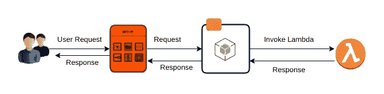
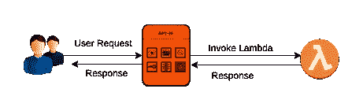

# 如何:通过 WSO2 API 管理器调用 lambda 函数

> 原文：<https://medium.com/hackernoon/how-to-invoke-lambda-functions-through-wso2-api-manager-5a04e8178803>

最近，AWS lambda 在云计算领域引起了不小的轰动。它从开发人员手中接过了管理基础设施的重担。现在你只需要担心你的代码，你可以把你的代码放到一组 lambda 函数中，然后你就可以开始了。与 AWS EC2 实例不同，AWS lambda 是一个事件驱动的系统，它只对应用程序运行的时间收费。因此，这是实现云后端的一种既经济又简单的方式。

在传统的 API 管理中，API 的调用是如何发生的，您有一个后端服务器，它监听任何传入的请求，API 管理层将向该后端服务器发送请求。然后，一旦后端服务器完成计算，它将发出一个响应，该响应将被 API 管理层接收，并在必要的处理后提供给客户。然而，在 AWS lambda 的情况下，没有后端服务器监听传入的请求，它是一个基于事件的系统。那么我们如何从 WSO2 API 管理器中调用 lambda 函数呢？在下面的小节中，我将解释两种可以用来从 WSO2 API 管理器调用 AWS lambda 函数的方法。

首先，我们需要创建一个 AWS 帐户，创建必要的 lambda 函数，并获得调用这些函数的凭证。要完成这些初步步骤，请遵循 AWS lambda 上的[入门指南](https://docs.aws.amazon.com/lambda/latest/dg/getting-started.html)。

完成初步设置后，通过 API Manager 调用 lambda 函数的第一个方法是运行一个简单的 nodejs 应用程序来调用 lambda 函数。您可以传递配置参数，如地区、访问密钥 id、密钥等。连同有效负载一起发送到 nodejs 应用程序。然后 nodejs 应用程序将使用“aws-sdk”库调用 lambda 函数并提供响应。请参见下面的流程图。



在这种方法中，不需要对 API 管理器进行任何更改。与传统的 API 管理一样，API 管理器将请求路由到 nodejs 端点，然后 nodejs 将调用 lambda 函数并发回响应。请参考[1]中可用于调用 aws-lambda 函数的 nodejs 应用程序的示例实现。部署 nodejs 应用程序后，您可以将想要向其发送数据的资源的 url 作为 API 的端点放入 nodejs 应用程序中。

如果您的大多数服务都运行在 AWS 上，并且您不介意获得一个新的 EC2 实例来运行 nodejs 应用程序，那么这个方法适合您。因为它更容易实现和管理，因为没有对 API 管理层进行任何配置更改。然而，话虽如此，这并不适合所有人。您可能不愿意为了运行 nodejs 应用程序来调用 lambda 函数而支付额外的费用来购买 EC2 实例。

因为 WSO2 产品是高度可定制的，所以我们仍然有适合您的解决方案。您可以做的是，我们可以使用 WSO2 API 管理器中的类中介来调用 lambda 函数，而不是使用单独的 nodejs 实例来调用 lambda 函数。我不会在本文中详细讨论如何编写类中介，因为这不在本文的范围之内。然而，我将尝试在另一篇文章中讨论这个主题。无论如何，在这种情况下，我们可以在 API 管理器的序列中使用自定义中介，并从配置中禁用端点。我特别提到从配置中禁用端点，因为默认情况下，API Manager 不允许您在没有指定生产和沙盒端点的情况下使用 swagger UI 发布 API。你可以做的是在 UI 中给出一些虚拟 URL，然后在 synapse 配置中注释掉它们。此外，为了得到响应，您必须在序列的末尾放置一个响应中介，否则它不会返回响应。请参见下图，了解该场景中架构的直观概述。



API Manager uses Class Mediator to invoke aws-lambda using aws-sdk

在编写这个定制中介时，您必须记住的一点是，您必须将 aws-sdk java 库和依赖项的匹配版本打包到最终的包中。否则，您可能会遇到 aws-sdk 试图使用 WSO2 产品包中不兼容的依赖版本的问题。打包完成后，您可以将 osgi 包放到产品包的 dropins 文件夹中，这样它就可以正常工作了。请参考[2]中可用于从 WSO2 API 管理器调用 lambda 函数的类中介器的示例实现。通过这个类中介调用 lambda 函数的 API 的示例 API 定义如下所示。请注意，类属性中使用的值都是虚拟值。

```
<?xml version="1.0" encoding="UTF-8"?>
<api ae jp" href="http://ws.apache.org/ns/synapse" rel="noopener ugc nofollow" target="_blank">http://ws.apache.org/ns/synapse"
     name="admin--test"
     context="/test/v1.0.0"
     version="v1.0.0"
     version-type="context">
 <resource methods="POST" url-mapping="/test" faultSequence="fault">
      <inSequence>
         <property name="api.ut.backendRequestTime"
                   expression="get-property('SYSTEM_TIME')"/>                                <class name="org.wso2.awsmediator.AWSClassMediator">
             <property name="region" value="region"/>
             <property name="functionName" value="function_name"/>
             <property name="accessKey" value="accesskey-value" />
             <property name="secretKey" value="secret-key" />
             <property name="maxConnections" value="1200"/>
         </class>
         <respond/>
      </inSequence>
      <outSequence>
         <class name="org.wso2.carbon.apimgt.gateway.handlers.analytics.APIMgtResponseHandler"/>
         <send/>
      </outSequence>
 </resource>
   <handlers>
      <handler class="org.wso2.carbon.apimgt.gateway.handlers.common.APIMgtLatencyStatsHandler"/>
      <handler class="org.wso2.carbon.apimgt.gateway.handlers.security.CORSRequestHandler">
         <property name="apiImplementationType" value="ENDPOINT"/>
      </handler>
      <handler class="org.wso2.carbon.apimgt.gateway.handlers.security.APIAuthenticationHandler"/>
      <handler class="org.wso2.carbon.apimgt.gateway.handlers.throttling.ThrottleHandler"/>
      <handler class="org.wso2.carbon.apimgt.gateway.handlers.analytics.APIMgtUsageHandler"/>
      <handler class="org.wso2.carbon.apimgt.gateway.handlers.analytics.APIMgtGoogleAnalyticsTrackingHandler">
         <property name="configKey" value="gov:/apimgt/statistics/ga-config.xml"/>
      </handler>
      <handler class="org.wso2.carbon.apimgt.gateway.handlers.ext.APIManagerExtensionHandler"/>
   </handlers>
</api>
```

我希望这篇文章有助于理解如何使用 lambda 函数作为 WSO2 API 管理器中 API 的后端。如果有任何问题，或者在试用时遇到任何问题，请在评论区发表。我会尽快回答所有的问题。如果你认为这篇文章是有帮助的，别忘了为它鼓掌，那会让其他人更容易找到它:)。

[1][https://github.com/hashanbn/nodejs_lambda](https://github.com/hashanbn/nodejs_lambda)

[2][https://github.com/hashanbn/AWSLambdaClassMediatorWSO2](https://github.com/hashanbn/AWSLambdaClassMediatorWSO2)