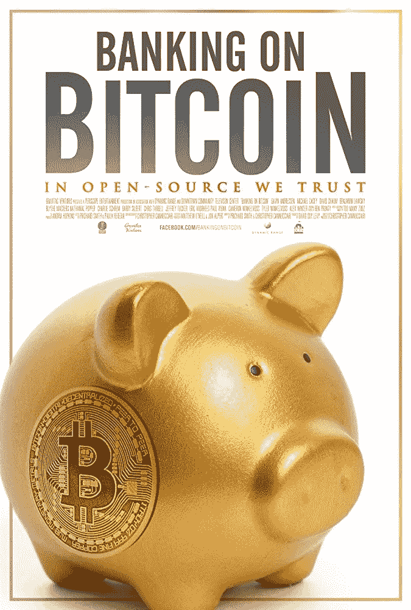
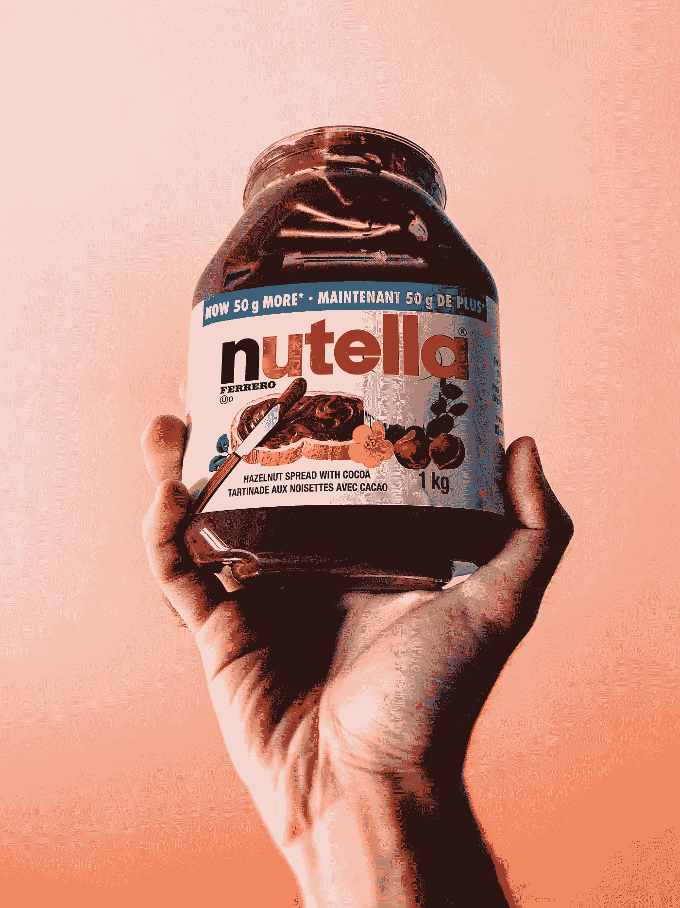

# 零经验如何进入区块链技术博客

> 原文：<https://medium.com/hackernoon/how-to-jump-into-tech-blogging-for-blockchain-with-zero-experience-7e757448595d>

我是一名训练有素的医生，对于一名医生来说，在没有任何先验知识的情况下跳入区块链的世界是很不寻常的。为了他的工作，我和我的合作伙伴穿越了世界，所以现在我在硅谷，白天为一家初创公司写科技博客。

# 快速掌握技能——创业之路

**提示#1:熟读基础知识:**你不需要去学校就能获得非常深入的区块链知识，除非你从第一天开始就打算做一名初创企业的开发人员。在我第一天工作的前一天，我在谷歌上搜索了区块链，花了大约两三个小时学习一些技术方面的东西，比如什么是智能合约，什么是以太坊。[维基百科](https://en.wikipedia.org/wiki/Blockchain)和 YouTube 是我了解事物的最好朋友。

Image Credit: [IMDb](http://www.imdb.com/title/tt5033790/)

在我搬到阳光明媚的加州之前，我已经对理解加密货币背后的热潮有点兴趣了。我推荐 2016 年网飞纪录片**[**银行业对比特币**](http://www.imdb.com/title/tt5033790/)**来一个快速肮脏的比特币历史。这部纪录片出色地描述了华尔街的加密交易所在加密货币发展的早期阶段面临的监管不确定性。****

****我在谷歌上搜索了纪录片中提到的人/公司，以便更好地了解正在发生的事情。比如 2014 年被黑的臭名昭著的日本交易所 [Mt. Gox](https://en.wikipedia.org/wiki/Mt._Gox) 。****

********

****Photo by [Bethany Legg](https://unsplash.com/photos/75nbwHfDsnY?utm_source=unsplash&utm_medium=referral&utm_content=creditCopyText) on [Unsplash](https://unsplash.com/search/photos/startup?utm_source=unsplash&utm_medium=referral&utm_content=creditCopyText)****

******提示#2:了解你的公司在做什么/游戏计划是什么:**理想情况下，这应该在你开始工作之前就已经完成了。有时候，创业公司不一定有所有的答案。你能做的最好的事情是找出游戏计划，这样你就能相应地阅读相关的东西。在我工作的第一周，我阅读了关于博客写作、SEO 和优化 Twitter & Reddit 增长的文章。****

****在某种程度上，区块链有点像医学，因为有“专科”(例如，心脏病学、普通外科、家庭医学)。我的公司专注于构建一个去中心化的物联网平台。还有其他公司专注于收集关于 bounty 和 ico 的信息，甚至将 AI 或数据与区块链合并。不要把你的公司和一个与该领域无关的竞争对手相提并论。****

********

****Photo by [Giulia Bertelli](https://unsplash.com/photos/y7rGTFyOzxc?utm_source=unsplash&utm_medium=referral&utm_content=creditCopyText) on [Unsplash](https://unsplash.com/search/photos/read?utm_source=unsplash&utm_medium=referral&utm_content=creditCopyText)****

******小贴士#3:积极倾听/阅读:**人们在工作中谈论什么？Twitter 上今天最大的新闻是什么(例如另一家公司被黑)？Reddit 上有哪些热门话题？把这些写下来，在你的空闲时间开始研究这些话题。在我们团队的一次谈话中，我订阅了 CB insights 等一系列时事通讯。这听起来像是信息超载，但这就是如何在一开始就建立一个坚实的基础。作为一个博客作者，我必须把我的读者放在心上。没有好的研究，我就写不出人们会感兴趣的东西。****

********

****Photo by [Giulia Bertelli](https://unsplash.com/photos/y7rGTFyOzxc?utm_source=unsplash&utm_medium=referral&utm_content=creditCopyText) on [Unsplash](https://unsplash.com/search/photos/read?utm_source=unsplash&utm_medium=referral&utm_content=creditCopyText)****

******秘诀 4:勇于尝试新事物**:我在业余时间涉足平面设计。这一直是我的一个爱好。当我为我的婚礼设计标识、请柬和背景时，我学会了最基本的 Photoshop 和 Illustrator 技能。这些技能中的大多数都随着时间的推移而变得尖锐，因为我会想出一个主意，并试图通过观看 YouTube 来学习如何实现这种效果(例如，让一些东西看起来像金箔)。老实说，一开始我很害怕使用[草图](https://www.sketchapp.com)，但是因为那是我们的平面设计师使用的，我别无选择，只能直接投入进去。我想说的是，你应该“走出你的舒适区”,在工作中学习新的东西！我现在几乎每天都在使用 Sketch，并且我自己完成了博客中需要的大部分图形设计，或者如果我时间不够的话，从无版权的资源中获取。****

********

****Photo by [Chris Liverani](https://unsplash.com/photos/2hpiy9XuXC4?utm_source=unsplash&utm_medium=referral&utm_content=creditCopyText) on [Unsplash](https://unsplash.com/search/photos/brand?utm_source=unsplash&utm_medium=referral&utm_content=creditCopyText)****

****技巧 5:坚持品牌:这不是你自己的公司。我认为许多千禧一代犯的错误是，他们可以在公司 Twitter/Reddit/Medium 上发布他们想要的任何内容。不幸的是，我见过一些不好的例子。保持专业的语气总是必要的。对你的读者要有礼貌。在内容创作上有一点点个性是很重要的，但是不要走极端。如果你的目标读者是男性技术人员，那么你需要花些时间学习流行博客上常用的语气和词汇。说他们的语言，你会吸引读者。****

****我给出的建议适用于任何技术领域。我见过的最好的骗子都投入了大量的工作和时间才达到今天的位置。我的一个朋友一个接一个地和他的初创团队开周日会议。没有什么轻松的一面之词。****

# ****努力而聪明地奔跑！****

****如果你喜欢你正在阅读的东西，给我一些掌声吧！👏也可以随意留下一些评论。✌️****