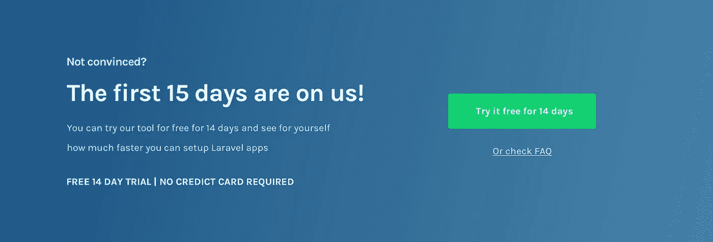

# 如何在您的登录页面上证明您的服务价格的合理性(通过正确解释服务)

> 原文：<https://medium.com/hackernoon/how-to-justify-the-price-of-your-service-on-your-landing-page-by-explaining-the-service-properly-cd4830440c23>

Before and After — Laravel Factory

在这篇文章中，我将展示 Laravel Factory 网站上的问题，这些问题无法使它正确地证明价格，因为这从开源[工具](https://hackernoon.com/tagged/tools)中节省了几个小时的工作，客户可以自己做这件事(直到现在一直是自己做)。

# 什么是拉勒维尔工厂？

[Laravel Factory](https://laravelfactory.com/) 是一款工具，可以让你用非常简单的过程在更短的时间内设置 Laravel 应用程序，每次设置可以节省大约 15-20 个小时。

# 该过程

这是 Laravel 工厂特有的，如果你想学习我的 5 步流程，将访问者转化为你可以应用到你的网站的客户，[这是我的 100%免费电子邮件课程](http://bit.ly/2xwP2fz)。

# 要记住的事情

*   这个产品主要是针对那些一个月要做好几次这类工作的机构或自由职业者，这让他们无法更好地利用时间。
*   这之前已经有几个注册用户了，人们对这个主题很感兴趣，因为它通过他的文章获得了大量的流量，但还没有客户。

每一个问题都是不同的，我会尽我所能让尽可能多的人知道这个问题。如果你想要适用于所有网站的东西，请查看我的 5 步电子邮件课程(100%免费)。

# 证明你的产品/服务价格合理的关键

这实际上是一件非常简单但不容易做到的事情。**证明你的产品/服务的价格是与他们得到的回报进行比较**(鉴于这是一种功利主义的选择，而不是纯粹的情感选择)。

关键是不断提醒他们你以那个价格提供给他们什么。它可以是以下任何一种(理想的组合):

*   节省更多时间
*   节省更多时间，更好地利用时间
*   无压力使用
*   以这个价格买到高质量或高数量的东西
*   将其与竞争对手的解决方案进行比较
*   比较他们自己做或雇佣别人做的价格/时间

**在本文的其余部分，我将向您展示 Laravel Factory 是如何做到这一点的**，祝您愉快！

# 问题及其解决方案(当前版本与建议版本)

# 标题

这是你的公司给潜在客户的第一印象，在一个注意力持续时间极低的世界里，你真的需要介绍你将要解决的问题的“大画面”，一小段描述解决方案可能是什么，最好是一张展示解决方案可能是什么样子的图片。

Old version

*   标题没有解释产品提供了什么，所以这是一个抓住人们注意力的浪费机会。这里没有管理预期是高跳出率的最大原因之一。
*   我不建议使用库存照片作为背景，因为它会分散注意力，并带走这一部分的可读性。在这种情况下，它也没有提供关于产品的任何上下文。
*   标题下面的段落很好，但它可以更具体一点，并在标题中使用相同的语言，以达到最佳效果。

New version

*   在这种情况下，我试图在解释产品功能的同时解释问题是什么。如果标题的长度可以和使用“厌倦了 X 问题？”是一种简单的方法。
*   标题更大，消除了理解产品的任何干扰，这使得理解页面下方的解释更容易。
*   我添加了一个统计数据来显示它可以节省多少时间，就像一种社会证明，即使没有证明也可以使用。

这一点非常重要，它让你更容易理解你正在解决的问题(因此解决方案也更容易理解)，同时也提醒他们这个问题有多痛苦，他们有多想解决这个问题(希望他们将你的产品/服务视为解决方案)。

很少看到登录页面在解释如何解决问题之前恰当地描述了他们正在解决的问题。

难怪潜在客户会很快提出异议，比如“我不明白它是如何工作的”或“我不知道它是否能解决我们的问题”… **这是避免这些问题的一个简单方法！**

**目前的网站并没有介绍它正在解决的问题**，但是你可以找到一个最简单的建议。

Improved version

*   请注意，这种方法只关注潜在客户已经遇到的棘手问题，并量化了它可以节省多少成本，从而帮助访问者在阅读越来越多的时候，将该产品视为他们问题的解决方案。

在介绍了你可以解决的问题之后，是时候展示你将如何解决这个问题，以及通过使用你的产品/服务来解决这个问题有什么好处。

Old version

*   对于如此重要的部分，使用水平布局很少是一个好的选择，因为你是垂直滚动的，这使得阅读不自然并且非常容易错过或忽略。
*   该网站实际上有一个很棒的视频来解释这一点，但它不在这个解释的旁边，而是在它的下面。

old version

*   这里有一个很棒的视频，展示了如何添加设置应用程序所需的东西，并真正展示了它有多快。
*   下面你可以从当前的网站上找到一个合并这两件事的建议。

New version

*   这是一种更自然的阅读和跟随步骤的方式。这种布局也可以让你在这些标题下有更多的文字来更好地解释。
*   请注意，书面解释现在是如何放在视频旁边的，以便人们理解视频是在解释同样的事情。
*   播放视频的按钮也有助于展示视频的内容，以及设置的速度。

# 显示可用的集成

向一个部分添加例子和/或统计数据来帮助支持你的解决方案有多好，这可能是另一个很好的简单调整，可以不断向你的网站添加非常规的社会证明方式。

在这些例子中，我确保人们知道该产品可以与他们最常用的工具集成，因此再次确认这可能是解决他们问题的一个好的既定解决方案。

Old version

*   除了标题不太清楚这部分是关于什么的以外，这里没有什么大问题。
*   另一个问题是，这一部分靠近页面的末尾，与它的工作原理无关。如果人们了解它是如何工作的，他们可能会对它能与什么东西一起工作有一些异议，下面的这一部分将有助于尽快回答这些问题。

New version

*   使用标题来解释它可以安装的主要东西，这样人们可以更容易地阅读这个列表。
*   在当前版本中，CTA 请求另一个工具的方式与其他列表太相似，这没有意义，因为它解释了不同的事情。在这种情况下，更加明显，因此至少人们看到负责服务的人关心获得建议和改进产品。

old version

*   **目前这不在登录页面**上，由于价格+承诺非常低，我们可以将其保留在登录页面上。
*   把免费试用作为一个计划是没有意义的，因为这不是一个真正的计划，它只是一个真实计划的实验版本，所以我把它从我的建议版本中删除了。
*   年度计划和月度计划的缺失使得人们不容易比较和了解他们之间可以节省多少钱。

Improved version

*   注意到我是如何更改计划名称的，所以很明显这是具有不同计费选项的相同计划。
*   为了帮助人们决定什么最适合他们，我添加了“自由职业者/机构的理想选择”。
*   我将这一点添加到登录页面，因为它几乎可以成为一个“卖点”，因为只需 15 美元，你就可以设置任意多的应用程序，每个设置可能需要 15-20 个小时，我花时间让访问者非常清楚这一点。

在努力解释你的产品/服务有多好之后，有些人会准备好转变，在你失去抓住他们的机会之前，给他们一个简单的方法，让潜在客户点击离开，永远不再回来…

Old version

*   因为这是抓住人们的最后一次机会，所以没有另一个 CTA 和增加人们注册的可能性是一个很小的机会。

New version

*   注意到我试图尽可能容易地做出尝试的决定，同时试图解释他们真的没有什么可失去的。
*   在此之后，从博客中获取一些帖子是有意义的，只是为了看看我们是否可以稍后捕捉到线索，以防它们更难转化。

____________________

# 想知道你也能做到吗？👇

这篇文章深入探讨了我帮助 SaaS 初创公司提高转化率和收入的 5 步流程中的一步。[报名参加我的免费电子邮件课程](http://bit.ly/2xwP2fz)到**从很少的潜在客户变成一个网站！**

Click here to get my free course

____________________

# 📨需要帮助您转换吗？

我很乐意讨论你的问题，所以请在评论中告诉我你的现状、需求或目标👇或者…

# 关于我的服务的更多信息

[服务](http://www.cortes.design/#services)

证明书

[免费电子邮件课程](http://www.cortes.design/email-course)

**✉️邮箱:** pedro@cortes.design

**延伸阅读:**

 [## 如何做一个转化驱动的 SaaS 登陆页[2017 版]

### 人类的平均注意力持续时间最近下降到了 8 秒(比一条金鱼还少！)，还有几百个…

blog.prototypr.io](https://blog.prototypr.io/how-to-make-a-conversion-driven-saas-landing-page-2017-edition-9ad4434c9bc2)  [## 剖析一个伟大的登陆页面

### 如果你足够了解你的客户，并且你有一个好的产品来服务他们，那么你可以用…

blog.prototypr.io](https://blog.prototypr.io/anatomy-of-a-great-landing-page-5285a743d981)  [## 围绕异议设计登录页面！

### 在我的每一篇文章中，我都试图解释可以改进产品的通用技术…

blog.prototypr.io](https://blog.prototypr.io/design-landing-pages-around-objections-8cba617c2efd)  [## 最大的登录页面错误以及如何修复它们

### 作为一名专注于优化转化率的设计师/顾问，通过定期分析大量页面…

blog.prototypr.io](https://blog.prototypr.io/the-biggest-landing-page-mistakes-and-how-to-fix-them-c08302c7b1fd)  [## 分解转化驱动的 SaaS 登录页面(旨在获取更多销售线索)

### 在这篇文章中，我将向你展示我是如何设计一个概念页面来捕捉线索的，在这种情况下，它是…

hackernoon.com](https://hackernoon.com/breaking-down-a-conversion-driven-saas-landing-page-designed-to-capture-more-leads-584c569f9565)