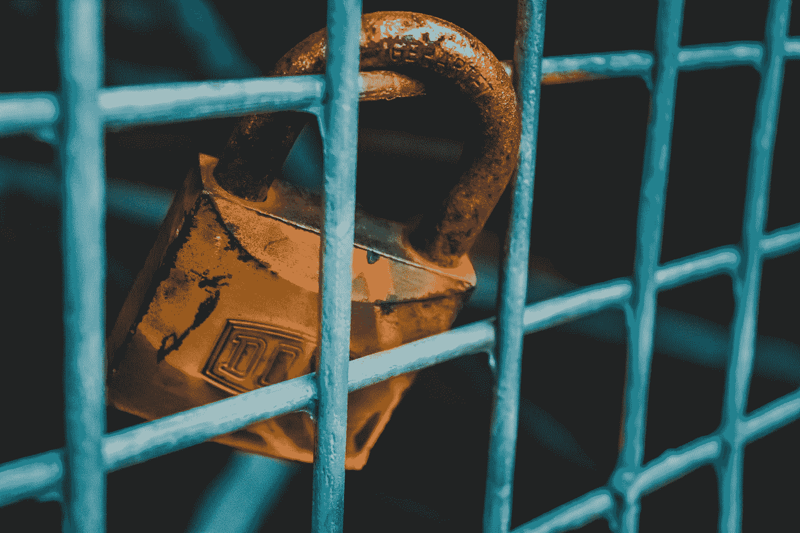
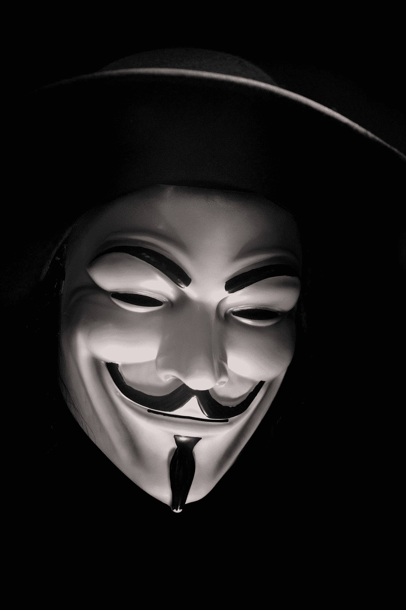
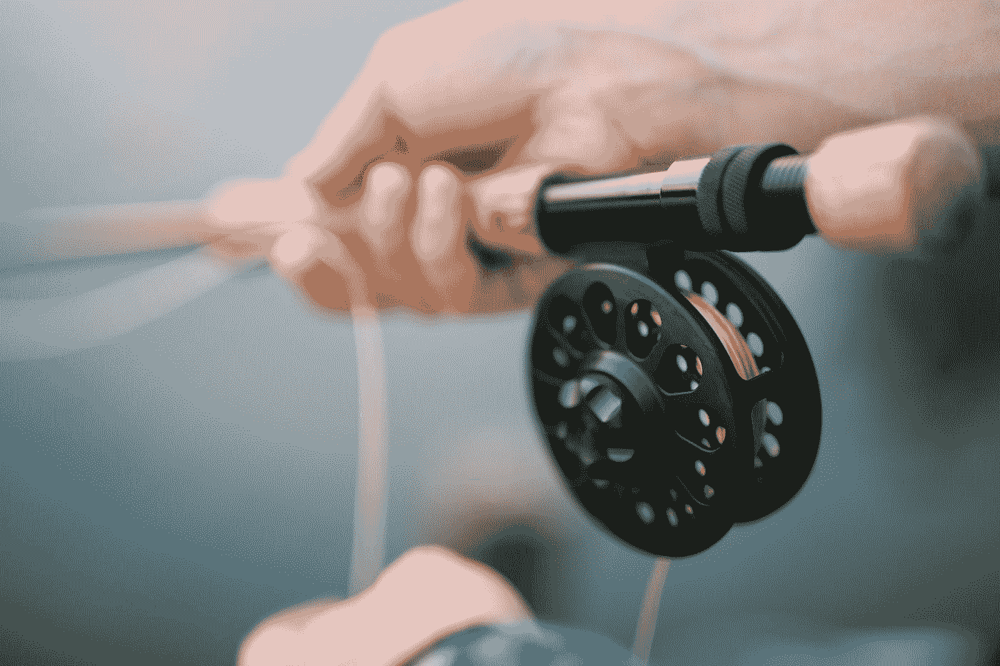

# 如何保证你的密码安全

> 原文：<https://medium.com/hackernoon/how-to-keep-your-crypto-safe-c3b0da06c19>

## 在数字世界中成为自己的银行。

Photo by [Christian Wiediger](https://unsplash.com/@christianw?utm_source=medium&utm_medium=referral) on [Unsplash](https://unsplash.com?utm_source=medium&utm_medium=referral)

这就是我们不能拥有美好事物的原因。

至少，这是我对那些呼吁在密码市场加强监管和权力集中的人所说的。

每当我看到有人抱怨丢失了他们的秘密钥匙，或者因为输错了钱包地址而损失了一大笔钱时，我都会想到同样的事情。有无数种方法可以让你在加密中失去金钱，就像有无数种方法可以在加密中赚钱一样。你不能鱼与熊掌兼得。如果你想要“月亮”一样的收益，那么你就不能拥有银行的安全和保障，当事情变得可怕时，银行会在你身后看着你，握着你的手。

**投资这个市场的风险不止于此。除了你可能失去自己的钱的所有方式之外，还有外部力量会很乐意从你这里拿走它。**

加密货币和区块链仍处于非常早期的发展阶段。我们已经看到了几起大型交易所和区块链协议遭到黑客攻击、数百万美元被盗的事件。例如，在最近 5 月中旬的 Verge 黑客攻击中，超过 170 万美元被盗。韩国交易所硬币圣杯最近被黑客攻击了 4000 万美元。别让我从 Mt. Gox 开始，那个黑客让市场进入了持续多年的熊市。除了更大规模的黑客攻击，通常针对蜜罐(蜜罐对黑客来说是一个非常有吸引力的目标，通常是任何集中的加密存储源，如交换钱包)。黑掉一个外汇钱包比黑掉一个人的私人钱包更有吸引力。

Watch out for these guys..Image by [Samuel Zeller](https://unsplash.com/@samuelzeller?utm_source=medium&utm_medium=referral) on [Unsplash](https://unsplash.com?utm_source=medium&utm_medium=referral)

代币销售和初始硬币发行也具有很强的针对性。骗子们很快就利用了创始人的优势，他们伪装成 Twitter 和 Youtube 上的名人，在官方的电报群中进行联络。为了出现在视频中，他们会在 BTC 要求付款，如果你碰巧上当，一旦他们有了钱，你就消失。我们在 mesmr Telegram 频道有 24/7 的社区支持，我们的 mod 每天都在努力禁止这些骗子。在这个市场上，你面临的骗局和危险是无止境的。

但还是那句话，鱼和熊掌不可兼得。这个市场给早期投资者带来改变人生的回报的原因和它的危险是一样的。

**缺乏中央权威。**

与其抱怨，我的解决方案是给你一个在这个空间保持安全的快速指南。我希望你喜欢它。

**在这个满是蝎子的沙漠里，你如何找到一片绿洲来储藏你的宝藏？**

Image by [Fabian Struwe](https://unsplash.com/@_fabian_?utm_source=medium&utm_medium=referral) on [Unsplash](https://unsplash.com?utm_source=medium&utm_medium=referral)

## 不要把你的资金留在交易所

许多交易所拥有庞大的用户群，这使它们成为对黑客极具吸引力的目标。交易所是“蜜罐”，就像我们之前提到的。黑客主要关注主要交易所，他们可以从中窃取巨额资金。我们已经看到大多数主要交易所被黑的案例；无辜用户的资金被盗。因此，把你的资金留在这些交易所是一件非常愚蠢的事情。

如果你是日内交易者，一天内交易量很大，那么试着留下一部分投资组合作为交换，用其他安全的钱包作为你的休息资金。

如果你是一个长期投资者，拿起官方钱包(或纳米账本),保护好你该死的袋子！没有理由留下你不打算在交易所积极交易的钱。

## 使用在线和离线钱包

如果你是一个小商人或加密空间的投资者，那么在线和离线钱包将是一个最好的负担得起的方式来存储你的硬币。你可以在他们各自的网站上下载任何加密货币的官方钱包。还有像 [Exodus](https://www.exodus.io/) 和[金恩](https://enjinwallet.io/)这样支持多种加密货币的多加密钱包。多硬币钱包在某种程度上仍然是一个蜜罐，但它们比交易所安全得多。

## **使用冷库**

如果你有一个价值几个比特币的庞大投资组合，那么使用在线和离线可能对你不利。因此，使用冷钱包将是最好的选择。你可以把资金存放在不同的硬盘上。你也可以使用硬件钱包，如 [Ledger Nano S.](https://www.amazon.in/Ledger-Nano-Cryptocurrency-Hardware-Wallet/dp/B01J66NF46?tag=googinhydr18418-21.)

永远不要买二手账本。也要避免总账经销商，除非他们值得信任。

我从亚马逊上买了我的账本，我的一些多疑的朋友可能会反对。很多人建议只从制造商那里直接购买，因为这是确保你的设备不会被篡改和重新密封的唯一方法——我个人相信从亚马逊账户购买，但如果你想更加安全，请查看他们的官方网站。

## **永远不要告诉任何人你的收入和利润**

随着加密货币价值的不断上升，犯罪活动也在以非常高的规模增加。黑客的另一个大目标是在过去几年中爆炸式增长的加密影响者网络。其中一些人喜欢思考他们的收获。大部分吹嘘自己收益的人都被黑客攻击过，或者被足以改变他们方式的黑客攻击吓到了。

不要在任何人面前透露你的收入和利润。一般来说，除非是在电子表格中，否则不要输入你的利润/收入。像骂人一样对待你的利润。

## **不要点击任何杂项邮件和链接**

许多黑客利用网络钓鱼技术从无辜的投资者那里窃取资金。我的一个朋友被黑掉了价值数千美元的 NEO，仅仅是因为从一个不知名的网站下载了内容。总是仔细检查网址，以确保你在正确的网站，它是安全的(在网址前寻找 https://，冒号前的“s”很重要)。永远不要把你的个人信息给任何人，Twitter 上没有人会把 100ETH 给别人，不要把你的钱包地址和电子邮件发给那些提供好得难以置信的优惠的人。

*如果某件事看起来异想天开，那就是真的，我向你保证。*

Don’t get caught by a phishing attempt!

## **使用独特的密码并保密**

每周都有新的交易所涌现，超过 1600 种加密资产在 CoinMarketCap 上市。很有可能，你需要不止一个交易账户来存取你想投资的所有东西。记得每次交流设置不同的密码，定期更换，这样被黑的几率会降低。你也可以使用像 LastPass 这样的工具来定期存储和打乱你的密码，但这是将你的数据托付给一个集中的权威机构——所以你可以随心所欲。

储存密码最安全的方法是打印出来，从电脑上删除，并锁好文件。当恶意软件攻击计算机时，通常首先搜索的是私钥。

加密市场仍然没有得到很好的监管，政府对它的控制也很少。这意味着，如果你因为一个不小心的错误而损失了钱，没有法院来保释你。如果你丢失了打印密码的文件，并且不记得你的密码，你就完蛋了。你对此无能为力，没有中央政府来保释你。那笔钱不见了。

你要对自己的钱负责。永远不要忘记在这个地方。

— — — — — — — —

## 在 Twitter 上关注我对市场和区块链的思考

 [## 礼萨·贾特斯(@礼萨费里)|推特

### Reza Jates 的最新推文(@RezaJafery)。strategy @ mes mrtv//Partner @ block chain warehouse//联合创始人…

www.twitter.com](https://www.twitter.com/rezajafery)